# AGENTS.md

Project knowledge base for AI coding agents.

## Project Overview

**pycubrid** is a Pure Python DB-API 2.0 (PEP 249) driver for the CUBRID relational database.
It communicates with CUBRID via the CAS wire protocol over TCP/IP, requiring no C extensions
or native CCI library.

- **Language**: Python 3.10+
- **Protocol**: CUBRID CAS binary protocol (version 7, since CUBRID 10.0.0)
- **License**: MIT
- **Version**: 0.5.0

## Architecture

```mermaid
graph TD
    root[pycubrid/ - Main package (9 modules)]
    init[__init__.py - Public API, PEP 249 globals, connect(), exports]
    exceptions[exceptions.py - Full PEP 249 exception hierarchy (10 classes)]
    types[types.py - PEP 249 type objects and constructors]
    constants[constants.py - CAS protocol constants]
    packet[packet.py - PacketReader/PacketWriter binary serialization]
    protocol[protocol.py - CAS protocol packets (18 packet classes)]
    connection[connection.py - PEP 249 Connection class]
    cursor[cursor.py - PEP 249 Cursor class]
    lob[lob.py - LOB support]
    typed[py.typed - PEP 561 marker]

    root --> init
    root --> exceptions
    root --> types
    root --> constants
    root --> packet
    root --> protocol
    root --> connection
    root --> cursor
    root --> lob
    root --> typed
```

### Module Responsibilities

| Module | Role |
|---|---|
| `__init__.py` | PEP 249 module globals (`apilevel`, `threadsafety`, `paramstyle`), `connect()`, re-exports |
| `exceptions.py` | `Warning`, `Error`, `InterfaceError`, `DatabaseError` + 6 subclasses |
| `types.py` | `DBAPIType` class, `STRING`/`BINARY`/`NUMBER`/`DATETIME`/`ROWID` type objects, constructors |
| `constants.py` | `CASFunctionCode` (41 funcs), `CUBRIDDataType` (27+ types), `CUBRIDStatementType`, protocol/data-size constants |
| `packet.py` | Low-level binary read/write with big-endian byte ordering |
| `protocol.py` | High-level CAS packet classes for each function code (18 packet types) |
| `connection.py` | `Connection` — TCP socket management, transactions, autocommit, LOB creation, schema info |
| `cursor.py` | `Cursor` — execute, executemany, fetch, callproc, description, iteration |
| `lob.py` | `Lob` class — LOB type, length, file locator, packed handle |

## Wire Protocol Summary

### Packet Format

```
[0:4]  DATA_LENGTH  (4 bytes, big-endian int)
[4:8]  CAS_INFO     (4 bytes)
[8:]   PAYLOAD      (variable length)
```

### Handshake Flow

1. **ClientInfoExchange**: Send `"CUBRK"` + client type + version (10 bytes, NO header)
2. **OpenDatabase**: Send db/user/password (628 bytes payload with header)
3. **PrepareAndExecute / Prepare+Execute → Fetch → CloseQuery → EndTran → CloseDatabase**

### Key Constants

- Magic string: `"CUBRK"`
- Client type: `CAS_CLIENT_JDBC = 3`
- Protocol version: `7` (since CUBRID 10.0.0)
- Byte order: Big-endian throughout

## Development

### Setup

```bash
git clone https://github.com/cubrid-labs/pycubrid.git
cd pycubrid
make install          # pip install -e ".[dev]"
```

### Key Commands

```bash
make test             # Offline tests with 95% coverage threshold
make lint             # ruff check + format
make format           # Auto-fix lint/format
make integration      # Docker → integration tests → cleanup
```

### Test Commands (manual)

```bash
# Offline (no DB needed)
pytest tests/ -v --ignore=tests/test_integration.py \
  --cov=pycubrid --cov-report=term-missing --cov-fail-under=95

# Integration (requires Docker)
docker compose up -d
export CUBRID_TEST_URL="cubrid://dba@localhost:33000/testdb"
pytest tests/test_integration.py -v
```

### Test Stats

- **471 offline tests + 41 integration tests**, **99.88% coverage** (1654 statements, 2 missed)
- Coverage threshold: 95% (CI-enforced)

## Code Conventions

### Style

- **Linter/Formatter**: Ruff
- **Line length**: 100 characters
- **Target Python**: 3.10+
- **Imports**: `from __future__ import annotations` in every module
- **Type hints**: Full typing; PEP 561 compliant (`py.typed`)
- **super()**: Always `super().__init__()`, never `super(ClassName, self)`

### Anti-Patterns (Never Do)

- No type suppression (`as any`, `@ts-ignore`, etc.)
- No f-string interpolation in SQL queries
- No `super(ClassName, self)` — use `super()` only
- No Python 2 constructs
- No empty `except` blocks

## Test Structure

```mermaid
graph TD
    tests[tests/]
    conftest[conftest.py - Shared fixtures]
    test_exceptions[test_exceptions.py - PEP 249 exception hierarchy]
    test_types[test_types.py - Type objects and constructors]
    test_constants[test_constants.py - Protocol constants]
    test_packet[test_packet.py - PacketReader/PacketWriter]
    test_protocol[test_protocol.py - CAS protocol packets]
    test_connection[test_connection.py - Connection class]
    test_cursor[test_cursor.py - Cursor class]
    test_lob[test_lob.py - LOB support]
    test_init[test_init.py - Module-level API tests]
    test_integration[test_integration.py - Live DB tests (requires Docker)]
    test_pep249[test_pep249.py - Full PEP 249 compliance]

    tests --> conftest
    tests --> test_exceptions
    tests --> test_types
    tests --> test_constants
    tests --> test_packet
    tests --> test_protocol
    tests --> test_connection
    tests --> test_cursor
    tests --> test_lob
    tests --> test_init
    tests --> test_integration
    tests --> test_pep249
```

## Documentation

```mermaid
graph TD
    docs[docs/]
    connection[CONNECTION.md - Connection strings, URL format, configuration]
    types[TYPES.md - Full type mapping, CUBRID-specific types]
    api[API_REFERENCE.md - Complete API documentation]
    protocol[PROTOCOL.md - CAS wire protocol reference]
    development[DEVELOPMENT.md - Dev setup, testing, Docker, coverage, CI/CD]
    examples[EXAMPLES.md - Practical usage examples with code]
    ko[README.ko.md - Korean translation]
    zh[README.zh.md - Chinese translation]
    hi[README.hi.md - Hindi translation]
    de[README.de.md - German translation]
    ru[README.ru.md - Russian translation]

    docs --> connection
    docs --> types
    docs --> api
    docs --> protocol
    docs --> development
    docs --> examples
    docs --> ko
    docs --> zh
    docs --> hi
    docs --> de
    docs --> ru
```



## Commit Convention

```
<type>: <description>

<body>

Ultraworked with [Sisyphus](https://github.com/code-yeongyu/oh-my-opencode)
Co-authored-by: Sisyphus <clio-agent@sisyphuslabs.ai>
```

Types: `feat`, `fix`, `docs`, `chore`, `ci`, `style`, `test`, `refactor`
