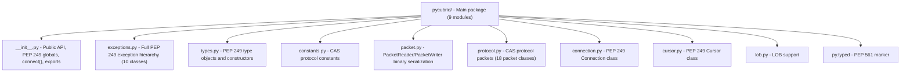
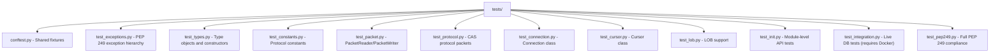
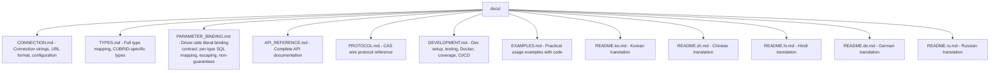

# AGENTS.md

Project knowledge base for AI coding agents.

## Project Overview

**pycubrid** is a Pure Python DB-API 2.0 (PEP 249) driver for the CUBRID relational database.
It communicates with CUBRID via the CAS wire protocol over TCP/IP, requiring no C extensions
or native CCI library.

- **Language**: Python 3.10+
- **Protocol**: CUBRID CAS binary protocol (version 8, since CUBRID 10.2+)
- **License**: MIT
- **Version**: 1.1.0

## Architecture


```mermaid
graph TD
    root["pycubrid/ - Main package (9 modules)"]
    init["__init__.py - Public API, PEP 249 globals, connect(), exports"]
    exceptions["exceptions.py - Full PEP 249 exception hierarchy (10 classes)"]
    types[types.py - PEP 249 type objects and constructors]
    constants[constants.py - CAS protocol constants]
    packet[packet.py - PacketReader/PacketWriter binary serialization]
    protocol["protocol.py - CAS protocol packets (18 packet classes)"]
    connection[connection.py - PEP 249 Connection class]
    cursor[cursor.py - PEP 249 Cursor class]
    lob[lob.py - LOB support]
    typed[py.typed - PEP 561 marker]

    root --> init
    root --> exceptions
    root --> types
    root --> constants
    root --> packet
    root --> protocol
    root --> connection
    root --> cursor
    root --> lob
    root --> typed
```

### Module Responsibilities

| Module | Role |
|---|---|
| `__init__.py` | PEP 249 module globals (`apilevel`, `threadsafety`, `paramstyle`), `connect()`, re-exports |
| `exceptions.py` | `Warning`, `Error`, `InterfaceError`, `DatabaseError` + 6 subclasses |
| `types.py` | `DBAPIType` class, `STRING`/`BINARY`/`NUMBER`/`DATETIME`/`ROWID` type objects, constructors |
| `constants.py` | `CASFunctionCode` (41 funcs), `CUBRIDDataType` (27+ types), `CUBRIDStatementType`, protocol/data-size constants |
| `packet.py` | Low-level binary read/write with big-endian byte ordering |
| `protocol.py` | High-level CAS packet classes for each function code (18 packet types) |
| `connection.py` | `Connection` — TCP socket management, transactions, autocommit, LOB creation, schema info |
| `cursor.py` | `Cursor` — execute, executemany, fetch, callproc, description, iteration |
| `lob.py` | `Lob` class — LOB type, length, file locator, packed handle |

## Wire Protocol Summary

### Packet Format

```
[0:4]  DATA_LENGTH  (4 bytes, big-endian int)
[4:8]  CAS_INFO     (4 bytes)
[8:]   PAYLOAD      (variable length)
```

### Handshake Flow

1. **ClientInfoExchange**: Send 10 bytes (NO header) — magic `"CUBRS"` when `ssl` is requested (STARTTLS) or `"CUBRK"` plaintext, plus client type + version. Broker replies a 4-byte int32: `0`=ok, `<0`=fail-fast (`OperationalError`), `>0`=redirect port (reconnect on the new port WITHOUT repeating the handshake).
2. **TLS upgrade (optional)**: If `ssl` was truthy, upgrade the live transport via `loop.start_tls()` (async) or `ssl.SSLContext.wrap_socket()` (sync) before `OPEN_DATABASE`.
3. **OpenDatabase**: Send db/user/password (628 bytes payload, no header — `PacketWriter(reserve_header=False)`)
4. **PrepareAndExecute / Prepare+Execute → Fetch → CloseQuery → EndTran → CloseDatabase**

### Key Constants

- Magic string: `"CUBRK"` (plaintext) or `"CUBRS"` (STARTTLS-requested)
- Client type: `CAS_CLIENT_JDBC = 3`
- Protocol version: `8` (since CUBRID 10.2)
- Byte order: Big-endian throughout
- Column nullability is transmitted as `is_non_null`: zero permits NULL,
  nonzero means NOT NULL. Normalize it to `is_nullable` / DB-API `null_ok`.
- Column metadata keeps first-byte collection flags (`0x60`) distinct from the
  scalar/element type; `0x80` marks a full second type byte, not a scalar-only column.
- FC9 schema metadata is condensed: type, scale, precision and name only, without
  SELECT constraint fields. Private #455 wire helpers are dormant; do not enable
  them in the public getters without atomic handle ownership/consumption in #456.

## Development

### Setup

```bash
git clone https://github.com/cubrid-lab/pycubrid.git
cd pycubrid
make install          # pip install -e ".[dev]"
```

### Key Commands

```bash
make test             # Offline tests with 95% coverage threshold
make lint             # ruff check + format
make format           # Auto-fix lint/format
make integration      # Docker → integration tests → cleanup
```

### Test Commands (manual)

```bash
# Offline (no DB needed)
pytest tests/ -v --ignore=tests/test_integration.py \
  --cov=pycubrid --cov-report=term-missing --cov-fail-under=95

# Integration (requires Docker)
docker compose up -d
export CUBRID_TEST_URL="cubrid://dba@localhost:33000/testdb"
pytest tests/test_integration.py -v
```

### Test Stats

- **471 offline tests + 41 integration tests**, **99.88% coverage** (1654 statements, 2 missed)
- Coverage threshold: 95% (CI-enforced)

## Code Conventions

### Style

- **Linter/Formatter**: Ruff
- **Line length**: 100 characters
- **Target Python**: 3.10+
- **Imports**: `from __future__ import annotations` in every module
- **Type hints**: Full typing; PEP 561 compliant (`py.typed`)
- **super()**: Always `super().__init__()`, never `super(ClassName, self)`

### Anti-Patterns (Never Do)

- No type suppression (`as any`, `@ts-ignore`, etc.)
- No f-string interpolation in SQL queries
- No `super(ClassName, self)` — use `super()` only
- No Python 2 constructs
- No empty `except` blocks

## Development Workflow (cubrid-lab org standard)

All non-trivial work across cubrid-lab repositories MUST follow this 4-phase cycle:

1. **Oracle Design Review** — Consult Oracle before implementation to validate architecture, API surface, and approach. Raise concerns early.
2. **Implementation** — Build the feature/fix with tests. Follow existing codebase patterns.
3. **Documentation Update** — Update ALL affected docs (README, CHANGELOG, ROADMAP, API docs, SUPPORT_MATRIX, PRD, etc.) in the same PR or as an immediate follow-up. Code without doc updates is incomplete.
4. **Oracle Post-Implementation Review** — Consult Oracle to review the completed work for correctness, edge cases, and consistency before merging.

Skipping any phase requires explicit justification. Trivial changes (typos, single-line fixes) may skip phases 1 and 4.

Maintainers coordinate Oracle/agent tooling, integration evidence, release
classification and the final review record. Outside contributors provide ordinary
motivation, code, tests and affected docs; internal Oracle/agent installation or
access is not a prerequisite for proposing a contribution.

## Agent PR scope and review guardrails

- Before editing, record one acceptance contract, affected files, explicit non-goals
  and the validation plan. Keep each PR to one independently reviewable change.
  Separate contributor guidance, CI configuration and new validator behavior.
- Triage AI findings against that contract, a supported-environment reproduction
  and impact. AI severity is not authority to add capabilities or widen the contract;
  obtain explicit maintainer direction or defer out-of-scope work to a separate issue.
- Batch accepted fixes locally and run relevant checks before publishing a review
  head. Deduplicate agent-initiated review requests by head SHA and review purpose.
- Default to two published AI review rounds total per scoped PR/task: the initial
  review and one corrective re-review. New commits do not reset this budget.
  Further rounds or scope expansion require explicit maintainer direction.
- If unresolved work needs another round at the limit, stop automatic revisions;
  keep the PR Draft and report incomplete work, blockers and a proposed split.
  Never merge with unresolved critical/security defects or failed required CI.
- Maintain one editable, agent-owned English status comment. Avoid bot mentions in
  routine updates, per-finding progress replies and repeated review requests.
  Preserve contributor history; revisit external PRs only after an author-updated head SHA.

## Release Process

Version is single-sourced from `pycubrid/__init__.py` → `__version__ = "x.y.z"`.
`pyproject.toml` derives it dynamically (`dynamic = ["version"]` + `version = {attr = "pycubrid.__version__"}`),
so there is only one place to bump.

Steps:
1. `make release VERSION=x.y.z` (bumps `__init__.py`, validates)
2. Add a dated changelog entry in `CHANGELOG.md` (`## [x.y.z] - YYYY-MM-DD`)
3. Commit: `release: vx.y.z — <summary>`
4. Open a PR and merge to `main`
5. Push the tag on the merged commit: `git tag vx.y.z <merged-sha> && git push origin vx.y.z`
6. The tag push triggers `.github/workflows/integration-full.yml`, which runs the **full
   5×4 Python × CUBRID compatibility matrix** on the release commit. PR CI only runs a
   reduced 2-cell matrix, so this tag run is the authoritative full-compatibility check.
7. The tag push also triggers `.github/workflows/create-release.yml`, which extracts the
   `## [x.y.z] - YYYY-MM-DD` section from `CHANGELOG.md` (fail-closed — no fallback)
   and creates the GitHub Release titled `vx.y.z` with that body, after verifying the
   tag is an ancestor of `origin/main`.
8. Publishing the GitHub Release triggers `.github/workflows/publish-pypi.yml`,
   which rebuilds, verifies (tag == version, dated CHANGELOG, tag on main, smoke tests,
   **and that a successful `integration-full.yml` run exists for the release commit** —
   PyPI publish is blocked until the full matrix passes), and publishes to PyPI via
   Trusted Publisher (OIDC).

Release notes are never hand-written: `CHANGELOG.md` is the single source of truth and
`scripts/extract_release_notes.py` renders the Release body. To re-create a release body,
re-run `create-release.yml` via `workflow_dispatch` with `update_existing: true`.

## CI Matrix

### Workflows

| File | Trigger | Purpose |
|---|---|---|
| `.github/workflows/ci.yml` | Push to main, PRs | Lint + offline tests (Py 3.10–3.14) + regular integration matrix |
| `.github/workflows/integration-full.yml` | Nightly (03:00 UTC), tag push, manual dispatch | Full Python × CUBRID compatibility matrix |
| `.github/workflows/publish-pypi.yml` | GitHub Release published | Build, verify, and publish to PyPI |

### Matrix Shape

- **Offline (every PR/push)**: Python 3.10, 3.11, 3.12, 3.13, 3.14
- **Integration (every PR/push)**: Python {3.10, 3.14} × CUBRID {10.2, 11.0, 11.2, 11.4} — 8 jobs
- **Integration full (nightly + tag push + dispatch)**: Python {3.10, 3.11, 3.12, 3.13, 3.14} × CUBRID {10.2, 11.0, 11.2, 11.4} — 20 jobs

## Test Structure


```mermaid
graph TD
    tests[tests/]
    conftest[conftest.py - Shared fixtures]
    test_exceptions[test_exceptions.py - PEP 249 exception hierarchy]
    test_types[test_types.py - Type objects and constructors]
    test_constants[test_constants.py - Protocol constants]
    test_packet[test_packet.py - PacketReader/PacketWriter]
    test_protocol[test_protocol.py - CAS protocol packets]
    test_connection[test_connection.py - Connection class]
    test_cursor[test_cursor.py - Cursor class]
    test_lob[test_lob.py - LOB support]
    test_init[test_init.py - Module-level API tests]
    test_integration["test_integration.py - Live DB tests (requires Docker)"]
    test_pep249[test_pep249.py - Full PEP 249 compliance]

    tests --> conftest
    tests --> test_exceptions
    tests --> test_types
    tests --> test_constants
    tests --> test_packet
    tests --> test_protocol
    tests --> test_connection
    tests --> test_cursor
    tests --> test_lob
    tests --> test_init
    tests --> test_integration
    tests --> test_pep249
```

## Documentation


```mermaid
graph TD
    docs[docs/]
    connection[CONNECTION.md - Connection strings, URL format, configuration]
    types[TYPES.md - Full type mapping, CUBRID-specific types]
    binding["PARAMETER_BINDING.md - Driver-side literal binding contract: per-type SQL mapping, escaping, non-guarantees"]
    api[API_REFERENCE.md - Complete API documentation]
    protocol[PROTOCOL.md - CAS wire protocol reference]
    development[DEVELOPMENT.md - Dev setup, testing, Docker, coverage, CI/CD]
    examples[EXAMPLES.md - Practical usage examples with code]
    ko[README.ko.md - Korean translation]
    zh[README.zh.md - Chinese translation]
    hi[README.hi.md - Hindi translation]
    de[README.de.md - German translation]
    ru[README.ru.md - Russian translation]

    docs --> connection
    docs --> types
    docs --> binding
    docs --> api
    docs --> protocol
    docs --> development
    docs --> examples
    docs --> ko
    docs --> zh
    docs --> hi
    docs --> de
    docs --> ru
```

## Issue Labeling (cubrid-lab org standard)

Write GitHub issues, PRs and comments in English; localized documentation remains
welcome, and no specific translation tool is required.

Maintainers or triagers assign exactly one
`priority: <value>` label and exactly one `size: <value>` label for each new issue,
alongside a type label (`bug`/`enhancement`/`documentation`/`chore`/`ci`/…) and an
`area:` label when applicable. These must be GitHub labels, not just text in the
issue title or body. Reporters describe urgency and effort without needing label
permissions. Maintainer-created issues receive these labels at creation; permissionless
reports receive them during initial maintainer triage.

Use the following exact names, with **one space after the colon**:

- Priority: `priority: critical`, `priority: high`, `priority: medium`, `priority: low`.
- Size: `size: XS`, `size: S`, `size: M`, `size: L`, `size: XL`.

Do not introduce variants such as `priority:high`, `priority-high`, `P1`, or
`size:S`. Reuse the repository's canonical labels; if a required label is missing,
maintainers create it with the exact name above before filing or triaging the issue. This policy governs
new issue creation, not bulk renaming or relabeling existing issues unless
explicitly requested.

Priority reflects urgency and impact; size estimates implementation effort and
helps contributors pick appropriately scoped work.

| Label | Meaning | Rough guide |
|-------|---------|-------------|
| `size: XS` | Trivial change | < ~10 lines; single-file typo/config/one-liner |
| `size: S` | Small change | One file or one focused function; a single test or doc page |
| `size: M` | Medium change | A few files; a new test module, a bug fix with tests, a CI job |
| `size: L` | Large change | Cross-cutting change across many files; multi-artifact (e.g. demo GIF + video + docs) |
| `size: XL` | Very large | Consider splitting into smaller issues before starting |

Rules:

1. **Size reflects effort, not importance** — a one-line fix for a critical bug is still `size: XS`.
2. **Maintainers assign both `priority:` and `size:` at creation/initial triage.** If scope or impact
   is uncertain, use a provisional estimate, explain the uncertainty in the body,
   and add `status: needs triage` (or the repo's equivalent). Refine the estimates
   during triage rather than omitting either required label.
3. **`good first issue` should be `size: XS` or `size: S`.** If a good-first-issue grows
   past `size: S`, re-scope it or drop the `good first issue` label.
4. **`size: XL` is a signal to split**, not a green light to start a sprawling change.

### Good first issue lifecycle

- Unclaimed: `good first issue`.
- A PR is opened for it: remove `good first issue`, add `status: in progress`.
- PR merged: the issue closes.
- PR closed without merging: first check that no other open PR still addresses the issue. Only if none remains, remove `status: in progress` and restore `good first issue`; otherwise keep it in progress.
- Keep 3–5 genuinely unclaimed good first issues per repository; a good first issue should have a small blast radius and an existing pattern or reference PR to follow, not just a small diff.

## Documentation definition of done

Any change that affects public behavior, compatibility, installation, configuration, APIs, supported versions, error handling, or SQL behavior MUST update the matching documentation in the **same PR**. At minimum keep in sync: `CHANGELOG.md`, the relevant files under `docs/` (e.g. `PARAMETER_BINDING.md`), and the `RELEASE_POLICY.md` behavior/release classification.

If no documentation change is needed, provide a populated standalone physical source line
beginning `Docs: not needed -`, or obtain the existing maintainer `docs-not-needed`
label exception. Empty reasons, `<reason>`, quotes, comments and fenced examples
are rejected by docs-sync. The line may be adjacent to ordinary prose without its
own paragraph. This exception applies only to the docs gate.

Contributors may request translation help in the PR body with missing language(s)
and a reason. Only explicit maintainer approval through `translations-deferred`
authorizes deferral; maintainers own the recorded follow-up. Korean synchronization
remains required and other community translations remain advisory. Keep executed
commands/results, checks not run with reasons, and optional AI review feedback distinct.

Do not mark work complete until code, tests, and documentation are consistent.

## Commit Convention

Preserve actual contributor authorship and existing credits. The following tool
attribution applies to commits actually produced with that tool; it is not a
required footer for outside contributors' commits.

```
<type>: <description>

<body>

Ultraworked with [Sisyphus](https://github.com/code-yeongyu/oh-my-opencode)
Co-authored-by: Sisyphus <clio-agent@sisyphuslabs.ai>
```

Types: `feat`, `fix`, `docs`, `chore`, `ci`, `style`, `test`, `refactor`

## Project Context — Performance Loop System

> This repo is the **primary optimization target** of the Performance Loop.
> Board: [CUBRID Ecosystem Roadmap](https://github.com/orgs/cubrid-lab/projects/2)

### Role

pycubrid's 4.5-6× performance gap vs PyMySQL is the biggest measurable improvement opportunity.
The hero metric is **reducing this gap with documented before/after numbers**.

### Related Issues

| Issue | Phase | Priority |
|-------|-------|----------|
| #19 cProfile/line_profiler hot path analysis | R2 | Must-Have |
| #20 Optimize serialization path (protocol.py/packet.py) | R2 | Must-Have |
| #21 Optimize cursor fetch performance | R2 | Must-Have |
| #22 Second optimization cycle (connection reuse, batch) | R3 | Must-Have |
| #14 Performance investigation template | R2 | Must-Have |
| #15 Add lightweight perf microbenchmarks | R2 | Must-Have |
| #16 Expose optional driver-level timing hooks | R2 | Nice-to-Have |

### Decision Gate (Week 8)

If combined improvements from #20 + #21 achieve < +10%, pivot narrative
from "major speedup" to "public regression-prevention loop with verified targeted gains."

### Current Performance Gap (baseline)

| Operation | CUBRID/MySQL Ratio | Notes |
|-----------|-------------------|-------|
| insert | 6.0× | Heaviest gap |
| select_by_pk | 4.5× | |
| full_scan | 5.5× | |
| update | 4.9× | |
| delete | 5.1× | |
