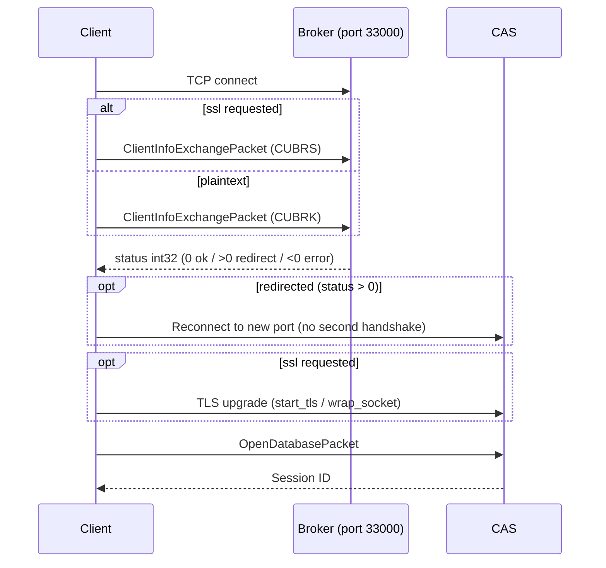
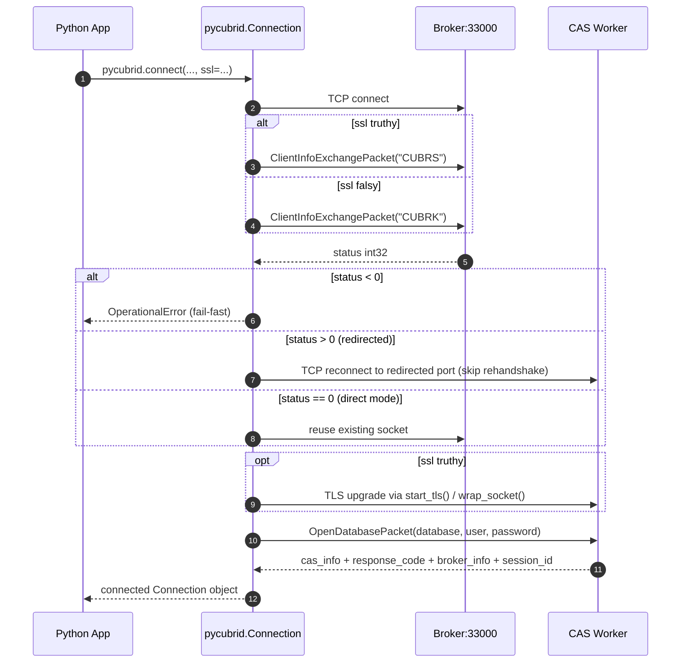

# Connection Guide

This guide covers how to install pycubrid, connect to a CUBRID database, and understand the connection lifecycle.

---

## Table of Contents

- [Prerequisites](#prerequisites)
- [Installation](#installation)
- [Connection Function](#connection-function)
- [Connection Examples](#connection-examples)
  - [SSL/TLS](#ssltls)
- [Context Manager Protocol](#context-manager-protocol)
- [Autocommit Mode](#autocommit-mode)
- [Connection Methods](#connection-methods)
- [Broker Handshake](#broker-handshake)
- [Server Version Detection](#server-version-detection)
- [Troubleshooting](#troubleshooting)
- [Docker Quick Start](#docker-quick-start)
- [SQLAlchemy Integration](#sqlalchemy-integration)

---

## Prerequisites

| Requirement   | Version    |
|---------------|------------|
| Python        | 3.10+      |
| CUBRID Server | 10.2–11.4  |

No C compiler or native libraries required — pycubrid is pure Python.

!!! tip
    For local development, start with `host="localhost"`, `port=33000`, `user="dba"`, and empty password unless your environment is hardened.

---

## Installation

### From PyPI

```bash
pip install pycubrid
```

### From Source

```bash
git clone https://github.com/cubrid-lab/pycubrid.git
cd pycubrid
pip install -e ".[dev]"
```

---

## Connection Function

```python
def connect(
    host: str = "localhost",
    port: int = 33000,
    database: str = "",
    user: str = "dba",
    password: str = "",
    decode_collections: bool = False,
    json_deserializer: Any = None,
    ssl: bool | ssl_module.SSLContext | None = None,
    charset: str = "utf-8",
    **kwargs: Any,
) -> Connection
```

### Parameters

| Parameter | Type | Default | Description |
|---|---|---|---|
| `host` | `str` | `"localhost"` | CUBRID server hostname or IP address |
| `port` | `int` | `33000` | CUBRID broker port |
| `database` | `str` | `""` | Database name *(required)* |
| `user` | `str` | `"dba"` | Database username |
| `password` | `str` | `""` | Database password |
| `decode_collections` | `bool` | `False` | Decode SET/MULTISET/SEQUENCE columns into Python collections |
| `json_deserializer` | `Any` | `None` | Callable used to decode JSON columns on fetch; when unset JSON is returned as `str` |
| `charset` | `str` | `"utf-8"` | Python codec (or CUBRID `utf8`/`euckr`/`iso88591`) for SQL text, credentials, character values, names and error text; set it to the database charset. See [Character Encoding](#character-encoding) |
| `ssl` | `bool \| ssl_module.SSLContext \| None` | `None` | Opt-in TLS for sync broker connections |

### Keyword Arguments

| Kwarg | Type | Default | Description |
|---|---|---|---|
| `connect_timeout` | `float` | `None` | Socket connection timeout in seconds |
| `read_timeout` | `float` | `None` | Socket read timeout in seconds |
| `fetch_size` | `int` | `100` | Server-side fetch batch size |
| `enable_timing` | `bool \| None` | `None` | Enable driver timing stats, or fall back to `PYCUBRID_ENABLE_TIMING` |
| `no_backslash_escapes` | `bool \| None` | `None` (auto) | Probe each new physical session's string-escape mode; explicit `True`/`False` skips detection and remains pinned across recovery |
| `autocommit` | `bool` | `False` | Enable immediate commit per statement |

### Unknown Options

Any keyword outside the two tables above is **not** a supported connection
option. pycubrid ignores it, but reports it through the
`pycubrid.UnknownConnectionOptionWarning` category so that a typo is not
swallowed silently:

```python
import pycubrid

pycubrid.connect(host="localhost", database="demodb", read_timout=30)
# UnknownConnectionOptionWarning: Unknown connection option ignored by pycubrid:
# 'read_timout' (did you mean 'read_timeout'?). Supported options: autocommit,
# connect_timeout, database, decode_collections, enable_timing, fetch_size,
# host, json_deserializer, no_backslash_escapes, password, port, read_timeout,
# ssl, user.
```

The warning is emitted before any socket work, so a mis-spelled option is
reported even when the connection itself then fails. It applies equally to
`pycubrid.connect()`, `pycubrid.aio.connect()`, and direct `Connection(...)` /
`AsyncConnection(...)` construction.

A warning — rather than a `TypeError` — is the default because wrapper layers
(connection pools, ORM dialects) legitimately forward extra keywords, and
rejecting them outright would break those callers. Use the standard `warnings`
machinery to pick the strictness you want:

```python
import warnings
import pycubrid

# Strict: turn an unknown option into an error.
warnings.simplefilter("error", pycubrid.UnknownConnectionOptionWarning)

# Lenient: silence it entirely (e.g. inside a wrapper that forwards kwargs).
warnings.simplefilter("ignore", pycubrid.UnknownConnectionOptionWarning)
```

### Common Connection Profiles

| Profile | host | port | user | password | autocommit | Use case |
|---|---|---:|---|---|---|---|
| Local default | `localhost` | `33000` | `dba` | `""` | `False` | Development and smoke tests |
| Remote app | `db.example.com` | `33000` | `app_user` | required | `False` | Production service workloads |
| Script mode | any | any | any | any | `True` | One-off migration/maintenance scripts |

### Return Value

Returns a `Connection` object implementing PEP 249.

---

## Connection Examples

### Basic Connection

```python
import pycubrid

conn = pycubrid.connect(
    host="localhost",
    port=33000,
    database="testdb",
    user="dba",
)

cur = conn.cursor()
cur.execute("SELECT 1 + 1")
print(cur.fetchone())  # (2,)

cur.close()
conn.close()
```

!!! warning
    The `database` argument is required in real environments. Empty database names can fail at `OpenDatabasePacket` stage depending on server configuration.

### With Password

```python
conn = pycubrid.connect(
    host="localhost",
    port=33000,
    database="demodb",
    user="dba",
    password="mypassword",
)
```

### Custom Port and Timeout

```python
conn = pycubrid.connect(
    host="db-server.internal",
    port=33100,
    database="production",
    user="app_user",
    password="secret",
    connect_timeout=10.0,  # 10-second timeout
)
```

!!! note
    If you run behind firewalls or load balancers, set `connect_timeout` explicitly and monitor for broker redirection failures.

### SSL/TLS

```python
import pycubrid

conn = pycubrid.connect(
    host="db.example.com",
    port=33000,
    database="production",
    user="app_user",
    password="secret",
    ssl=True,
)
```

- `ssl=True` creates a verified default `ssl.SSLContext` using system trust roots.
- When `ssl=True`, pycubrid sets `SSLContext.minimum_version = ssl.TLSVersion.TLSv1_2` on the default context for both sync and async connections.
- `ssl=your_ssl_context` uses your custom context directly, which is useful for self-signed or private CA certificates.
- `ssl=None` or `ssl=False` disables TLS and preserves the previous plaintext behavior.

Both `pycubrid.connect()` and `pycubrid.aio.connect()` accept the same `ssl` values:

- `ssl=True` for the default verified context with a TLS 1.2 minimum.
- `ssl=False` or `ssl=None` for plaintext.
- `ssl=your_ssl_context` for a custom `ssl.SSLContext`.

Async TLS uses CUBRID's STARTTLS-style upgrade: the connection opens in plaintext, sends the
`CUBRS` handshake magic to negotiate TLS with the broker, then upgrades the live transport via
`asyncio.AbstractEventLoop.start_tls()` (bounded by `ssl_handshake_timeout`) **before** the
`OPEN_DATABASE` exchange. Async shutdown awaits `writer.wait_closed()` so TLS sessions close
cleanly. The sync driver performs the equivalent flow with `ssl.SSLContext.wrap_socket()`.

`connect_timeout` bounds only the TCP connect. The broker handshake, the TLS handshake and
`OPEN_DATABASE` are bounded by `read_timeout` on both drivers; when `read_timeout` is unset the
async TLS handshake still gives up after 10 seconds (`ssl_handshake_timeout`), while the sync
driver waits without a limit. A broker that stalls or resets the connection during the TLS
handshake raises `OperationalError` within that bound
([#513](https://github.com/cubrid-lab/pycubrid/issues/513)).

!!! note "Python 3.10 async TLS preflight probe"
    Python 3.10's `asyncio.loop.start_tls()` has a known CPython bug (fixed in 3.13/3.14)
    that causes it to hang indefinitely on **certificate verification** failures instead of
    raising. As of [pycubrid#156](https://github.com/cubrid-lab/pycubrid/issues/156), the
    async driver runs an automatic preflight `ssl.SSLContext.wrap_socket()` probe on Python
    3.10 immediately before `loop.start_tls()`, using the same `SSLContext` and
    `server_hostname=host`. Verification failures now raise `OperationalError` (chained from
    `ssl.SSLError`) within the connect timeout, matching the 3.11+ behavior. The probe is a
    no-op on Python 3.11+ and adds one extra TCP round-trip per connect on 3.10 only. Other
    TLS error paths (peer unresponsive, timeout) remain bounded by `ssl_handshake_timeout`.
    The issue does not affect the sync driver.

```python
import pycubrid.aio

conn = await pycubrid.aio.connect(
    host="db.example.com",
    port=33000,
    database="production",
    user="app_user",
    password="secret",
    ssl=True,
)
```

!!! note
    CUBRID broker TLS must be enabled on the server side (`SSL=ON` in `cubrid_broker.conf`) before TLS connections can succeed.

### Async Health Checks

Async connections expose the same lightweight native health check as sync connections:

```python
import pycubrid.aio

conn = await pycubrid.aio.connect(database="testdb")

alive = await conn.ping(reconnect=False)
if not alive:
    await conn.ping(reconnect=True)
```

- `await conn.ping(reconnect=False)` issues a native `CHECK_CAS` round-trip on an open socket without reconnecting. `CAS_INFO[0]=0` means OUT_TRAN after a transaction boundary, not a released session; it does not change this behavior. A closed socket or failed check returns `False`, which makes this suitable for SQLAlchemy's `pool_pre_ping`.
- `await conn.ping(reconnect=True)` probes the existing socket first and attempts one reconnect when already disconnected, after a `CHECK_CAS` transport/protocol error, or when `CHECK_CAS` returns a negative code indicating a broken CAS-to-DB link. Failed recovery returns `False`; `reconnect=False` reports the negative response as `False` without reconnecting and closes that broken session.
- A healthy same-session ping does not re-probe escape mode. On a new physical session, an automatic mode is re-probed before use; an explicit `no_backslash_escapes=True` or `False` remains pinned. Probe failure retires the replacement and makes ping return `False`, without guessing an escape mode or replaying SQL.
- The healthy-session check uses the same native `CHECK_CAS` function code (`FC=32`) as sync `Connection.ping()` and executes no SQL; recovery may run a read-only escape-mode probe.

---

## Context Manager Protocol

pycubrid connections support the `with` statement for automatic resource management:

```python
import pycubrid

with pycubrid.connect(
    host="localhost",
    port=33000,
    database="testdb",
    user="dba",
) as conn:
    cur = conn.cursor()
    cur.execute("INSERT INTO users (name) VALUES (?)", ("Alice",))
    # Connection commits automatically on success
# Connection is closed automatically after exiting the block
```

### Behavior

| Scenario          | Action                                  |
|-------------------|-----------------------------------------|
| No exception      | `conn.commit()` then `conn.close()`     |
| Exception raised  | `conn.rollback()` then `conn.close()`   |

The `__enter__` method returns the connection itself. The `__exit__` method:

1. Commits the transaction if no exception occurred
2. Rolls back the transaction if an exception was raised
3. Always closes the connection

### Manual Transaction Control

If you need explicit control, manage transactions directly:

```python
conn = pycubrid.connect(host="localhost", port=33000, database="testdb", user="dba")
try:
    cur = conn.cursor()
    cur.execute("INSERT INTO cookbook_logs (msg) VALUES (?)", ("event",))
    conn.commit()
except Exception:
    conn.rollback()
    raise
finally:
    conn.close()
```

---

## Autocommit Mode

The `autocommit` property controls whether each statement is committed automatically.

```python
# Check current mode
print(conn.autocommit)  # False (driver default)

# Disable autocommit for transaction grouping
conn.autocommit = False

# Re-enable autocommit
conn.autocommit = True
```

### Details

| Property | Description |
|---|---|
| Default value | `False` |
| Getter | Returns current autocommit state |
| Setter (`= True`) | Sends `SetDbParameterPacket` + `CommitPacket` to server |
| Setter (`= False`) | Sends `SetDbParameterPacket` + `CommitPacket` to server |

> **Note**: When using pycubrid with SQLAlchemy (`cubrid+pycubrid://`), the dialect sets
> `autocommit = False` on each new connection so SQLAlchemy can manage transactions properly.
>
> pycubrid's `Connection` defaults to `autocommit=False` for explicit transaction control
> and sends this value as the per-statement ``auto_commit`` flag on every
> ``PrepareAndExecute`` packet, so the broker's own ``CUBRID_AUTO_COMMIT`` setting is
> effectively overridden by what the driver reports. Pass ``autocommit=True`` to ``connect()``
> (or set ``connection.autocommit = True`` after connecting) to enable.

### CAS recycled at a transaction boundary

`CAS_INFO[0]=0` denotes OUT_TRAN, not a released CAS worker. Normal commit,
rollback, and autocommit requests keep the same socket and CAS session, so
session variables and `SET TRANSACTION ISOLATION LEVEL` survive them (#468).

The CAS may still close the socket right after such a reply: when its memory
exceeds `APPL_SERVER_MAX_SIZE` it restarts at the next `END_TRAN`, `cubrid broker
reset` recycles idle workers, and with `KEEP_CONNECTION=AUTO` an idle worker is
handed to a waiting client (CHANGE CLIENT) when more clients than
`MAX_NUM_APPL_SERVER` are connected. Therefore, when the last reply was OUT_TRAN,
sync and async connections send one native `CHECK_CAS` before the next request,
as the CUBRID JDBC driver does (#485):

- The CAS answers: the same session is kept and the request is sent. This costs
  one extra round trip per request issued out of transaction, including every
  statement in autocommit mode (an autocommit INSERT also probes before its
  last-insert-id lookup).
- The probe fails: the connection is replaced **once for that request**. The
  escape mode is re-probed (unless pinned) and an explicitly set `autocommit` is
  restored, then the request is sent for the first time on the new session. No
  SQL is replayed; the CAS reported no open transaction, so no uncommitted work
  is lost. Requests that depend on the lost session are not sent there: a
  `CLOSE_REQ` for one of its handles is skipped; a FETCH of its unread rows, a
  last-insert-id lookup, or a LOB read/write on a LOB obtained from it raises
  `OperationalError`; and `pycubrid.compat.native` prepared statements are
  rejected as belonging to an earlier session. If the CAS is recycled right
  after an autocommit INSERT, that INSERT is committed but its `lastrowid` is
  `None`; a WARNING is logged. Because the replacement setup itself ends out of
  transaction, it is verified with one more `CHECK_CAS` before the request.
  Cursors run this check *before* rendering parameters, so parameterized SQL is
  bound for the session it is sent on. SQL already rendered for a session that
  was then replaced is never sent: it fails with the retryable
  `OperationalError` ("... parameter binding; retry operation") and the new
  session stays open for the retry.
- The replacement fails: `OperationalError` is raised and the connection is
  left disconnected (not closed); `ping(reconnect=True)` reconnects it, or open
  a new connection.

Only driver-owned state is restored. A real reconnect resets session state set
through SQL: session variables, `SET TRANSACTION ISOLATION LEVEL`, lock timeouts
and other server session state belong to the lost CAS session and are not
carried over. Layers that apply such settings with SQL must keep re-applying
them on a new physical session (for example sqlalchemy-cubrid's isolation-level
re-apply, sqlalchemy-cubrid#527).

`commit()` and `rollback()` first verify an out-of-transaction CAS, then send
`CLOSE_REQ` for every query handle still held by an unclosed cursor before
`END_TRAN`, so a long-lived session does not accumulate server handles. Rows
that were already received stay readable; an unfinished result still raises
`InterfaceError` at its next required FETCH. In autocommit mode no `END_TRAN` is
sent, so unclosed cursors still accumulate server handles until `commit()`,
`rollback()` or `close()`: close cursors (or use them as context managers).

### Session-state restoration after explicit ping recovery

pycubrid never replays an arbitrary SQL request after a transport failure. If a connection is already
disconnected, a `CHECK_CAS` probe raises a transport/protocol error, or the
probe returns a negative response (broken CAS-to-DB link), explicit
`ping(reconnect=True)` can attempt one new connection. With `reconnect=False`,
the negative response returns `False` without reconnecting and closes that
broken session, in both drivers; later calls raise `InterfaceError` until
`connect()` or `ping(reconnect=True)`. The caller must
decide whether interrupted SQL is safe to retry.

Automatic `no_backslash_escapes` detection runs again on the replacement
physical session before state restoration; an explicitly selected mode remains
unchanged. If this probe fails, the session is retired and `ping()` returns
`False`. No interrupted SQL is replayed. Sync and async parameterized SQL bound
before a session replacement, including one made by that request's own
`CHECK_CAS`, is rejected before send because its generation changed; the caller
decides whether to retry. A healthy same-session ping does not
probe. This does not claim a dynamic per-session setting toggle or verified
heterogeneous failover.

After successful recovery, including the automatic reconnect above, and when
`connect()` reopens a connection after `close()` (sync and async alike, #520),
pycubrid restores the session-level setting the caller has **explicitly** set:

| Setting | Restored after successful ping recovery? |
|---|---|
| ``autocommit`` (set via ``connect(autocommit=True)``, ``connection.autocommit = ...``, or ``await conn.set_autocommit(...)``) | Yes — the same value is re-emitted via ``SetDbParameterPacket`` |
| ``autocommit`` left at the connect-time default | No — the broker default is used |

Settings the caller has never touched are intentionally **not**
re-emitted on the new connection to avoid spurious round-trips. If the restore
itself fails, the connection is torn down and the underlying transport
error is preserved via PEP 3134 ``__cause__`` so callers can diagnose
the failure.

---

## Connection Methods

| Method                              | Return Type   | Description                                     |
|-------------------------------------|---------------|-------------------------------------------------|
| `cursor()`                          | `Cursor`      | Create a new cursor for executing SQL            |
| `commit()`                          | `None`        | Commit the current transaction                   |
| `rollback()`                        | `None`        | Roll back the current transaction                |
| `close()`                           | `None`        | Close the connection and free resources           |
| `get_server_version()`              | `str`         | Return the CUBRID server version string          |
| `get_last_insert_id()`              | `str \| None` | Return the cached broker identity, or `None`   |
| `create_lob(lob_type)`              | `Lob`         | Create a new LOB object (CLOB=24, BLOB=23)       |
| `get_schema_info(schema_type, ...)` | `GetSchemaPacket` | Query schema metadata from the server |
| `fetch_schema_info(packet)` | `list[tuple]` | Eagerly read rows and release the original schema handle |
| `close_schema_info(packet)` | `None` | Abandon an owned result; repeat close is a no-op |

`get_last_insert_id()` reads the identity captured by a cursor after INSERT without
another network request. Successful values remain strings; unavailable values are
`None` rather than the previous ambiguous `""`. Use `value is None` to detect
unavailability and guard `int(value)` accordingly. The cursor's `lastrowid` remains
an independent `int | None` snapshot.

Commit/rollback and SELECT preserve the cached observation. A new INSERT attempt,
nonempty batch, or physical connection discard/reconnect clears it; failed, empty,
or malformed identity retrieval leaves it `None`. The broker may retain an earlier
identity after a non-auto-increment INSERT, so a reported ID does not prove the
latest statement generated it or that a row exists after rollback. Sync and async
connections follow the same contract. A normal transaction boundary retains the
same connection and cache. An explicit `ping(reconnect=True)` recovery after an
actual connection failure clears the connection cache; the earlier cursor's
`lastrowid` snapshot still remains available.

The cache only refreshes for cursor operations with an INSERT server response.
Unlike the previous live broker query, it does not observe `CALL`, stored-procedure
INSERTs, or out-of-band SQL. Return the procedure's identity explicitly or query it
using the procedure's server-side contract. An empty batch clears the cursor's
`lastrowid` while retaining the connection cache; a failed prior-query close before
a nonempty batch starts preserves both previous identity values.

### LOB Creation

```python
# Create a CLOB (Character Large Object)
clob = conn.create_lob(24)  # 24 = CLOB
clob.write(b"Large text content...")

# Create a BLOB (Binary Large Object)
blob = conn.create_lob(23)  # 23 = BLOB
blob.write(b"\x89PNG\r\n...")
```

> **Tip**: `Lob.write()` accepts `bytes` only. For ordinary CLOB inserts, prefer direct SQL
> parameter binding with `str`; for BLOB inserts, pass `bytes` directly. See [Examples](EXAMPLES.md)
> for details.

### Schema Information

```python
# Get schema information (schema_type constants from CUBRID docs)
packet = conn.get_schema_info(1, "my_table", 0)  # Exact CLASS filter
try:
    print(conn.fetch_schema_info(packet))
finally:
    conn.close_schema_info(packet)
```

Schema packets belong to the original connection/session; fetch before a
transaction boundary (including cursor work and version lookup when autocommit
is enabled) or explicitly abandon them. Async uses the same methods with
`await`. See [API Reference](API_REFERENCE.md)
for the second filter, four-field columns and cleanup/error contract.

---

## Broker Handshake

When `pycubrid.connect()` is called, the following protocol handshake occurs:





!!! danger
    If broker redirection returns a CAS port not reachable from your client network, connection succeeds at step 1 but fails before session establishment.

### Step-by-Step

1. **TCP Connect** — Open a socket to the broker (default port 33000).
2. **Client Info Exchange** — Send a 10-byte handshake: magic string `b"CUBRS"` when `ssl` is
   requested (STARTTLS) or `b"CUBRK"` for plaintext, plus client type `CLIENT_JDBC=3` and
   protocol-version bytes.
3. **Broker Status** — The broker responds with a 4-byte big-endian signed integer:
    - `status < 0` — fail-fast: driver raises `OperationalError`
    - `status > 0` — redirect: close socket, reconnect to the new CAS port on the same host,
      **without** repeating the handshake (mirrors the official JDBC `BrokerHandler` behavior)
    - `status == 0` — direct mode: reuse the existing socket
4. **TLS Upgrade (optional)** — If `ssl` was truthy, upgrade the live transport to TLS *before*
   any `OPEN_DATABASE` bytes are written. Async uses
   `asyncio.AbstractEventLoop.start_tls(..., ssl_handshake_timeout=...)`; sync uses
   `ssl.SSLContext.wrap_socket()`. Failed handshakes abort the transport rather than leaking it.
5. **Open Database** — Send database name, username, and password via `OpenDatabasePacket`.
6. **Session Established** — Server returns a session ID; the connection is ready.

---

## Server Version Detection

```python
conn = pycubrid.connect(host="localhost", port=33000, database="testdb", user="dba")
version = conn.get_server_version()
print(version)  # e.g., "11.2.0.0374"
conn.close()
```

The `get_server_version()` method sends a `GetEngineVersionPacket` to the server and returns the version as a string.

---

## Troubleshooting

### Common Connection Errors

#### `ConnectionRefusedError` on port 33000

The CUBRID broker is not running or not listening on the expected port.

1. Verify the broker is running:
   ```bash
   cubrid broker status
   ```
2. Check the broker port in `cubrid_broker.conf` (default: 33000)
3. If using Docker:
   ```bash
   docker compose up -d
   docker compose logs cubrid
   ```

#### `Authentication failed`

CUBRID's default `dba` user has no password. If you set one, ensure it matches:

```python
# If dba has no password
conn = pycubrid.connect(host="localhost", port=33000, database="testdb", user="dba")

# If dba has a password
conn = pycubrid.connect(host="localhost", port=33000, database="testdb", user="dba", password="mypassword")
```

#### `TimeoutError` or `socket.timeout`

The server did not respond within the timeout period:

```python
# Increase timeout
conn = pycubrid.connect(
    host="slow-server.example.com",
    port=33000,
    database="testdb",
    user="dba",
    connect_timeout=30.0,
)
```

#### `OperationalError: Connection is closed`

The connection was closed by the server (session timeout, network interruption, or broker restart). Create a new connection:

```python
conn = pycubrid.connect(host="localhost", port=33000, database="testdb", user="dba")
```

---

## Docker Quick Start

For local development, use the provided `docker-compose.yml`:

```bash
# Start CUBRID 11.2 (default)
docker compose up -d

# Start a specific version
CUBRID_VERSION=11.4 docker compose up -d

# Verify it's running
docker compose ps

# Connect with pycubrid
python3 -c "
import pycubrid
with pycubrid.connect(host='localhost', port=33000, database='testdb', user='dba') as conn:
    cur = conn.cursor()
    cur.execute('SELECT 1 + 1')
    print(cur.fetchone())
"

# Stop and clean up
docker compose down -v
```

---

## SQLAlchemy Integration

pycubrid works as a driver for [sqlalchemy-cubrid](https://github.com/cubrid-lab/sqlalchemy-cubrid):

```bash
pip install "sqlalchemy-cubrid[pycubrid]"
```

```python
from sqlalchemy import create_engine, text

engine = create_engine("cubrid+pycubrid://dba@localhost:33000/testdb")

with engine.connect() as conn:
    result = conn.execute(text("SELECT 1"))
    print(result.scalar())
```

SQLAlchemy features — ORM, Core, Alembic migrations, schema reflection — are accessible through the pycubrid driver when used with sqlalchemy-cubrid.

---

## Connection Pooling

pycubrid does not include a built-in connection pool. Each `pycubrid.connect()` call creates a new TCP connection to the CUBRID broker.

For connection pooling, use one of:

- **SQLAlchemy's built-in pool** (recommended):
  ```python
  from sqlalchemy import create_engine
  engine = create_engine(
      "cubrid+pycubrid://dba@localhost:33000/testdb",
      pool_size=5,
      pool_pre_ping=True,
  )
  ```

- **External pooling libraries** (e.g., `sqlalchemy.pool`, `DBUtils`)

See [Troubleshooting](TROUBLESHOOTING.md) for pool tuning guidance.

---

## Character Encoding

The `charset` connection option (default `"utf-8"`) selects the Python codec
for the text pycubrid exchanges with the broker. Set it to the charset the
database was created with (#86):

```python
import pycubrid
import pycubrid.aio

conn = pycubrid.connect(database="kodb", charset="euckr")
aconn = await pycubrid.aio.connect(database="kodb", charset="euckr")
```

**Accepted values.** Any Python codec name, plus the CUBRID spellings `utf8`,
`euckr` and `iso88591` (`ksc5601` works through Python's own EUC-KR alias), and
a CUBRID locale as given to `createdb`, such as `"ko_KR.euckr"`, whose part
after the dot is used. `None` means the default `"utf-8"`. The name is
normalized to the Python codec name (`"euckr"` becomes `"euc_kr"`). The option
is validated before any socket work:

- a non-string raises `TypeError`;
- an unknown codec, CUBRID's `binary` charset (it has no text codec) and any
  codec that is not ASCII-transparent raise `ValueError`. Rejected codecs
  include UTF-16/32, UTF-7, `utf-8-sig`, Shift_JIS, Big5, GBK, GB18030, CP949,
  Johab and the ISO-2022 family: SQL quoting and escaping run on `str` before
  encoding, so a codec that can emit an ASCII byte such as `'` or `\` inside a
  multibyte character is unsafe;
- a `database`, `user` or `password` that the codec cannot encode raises
  `DataError`.

The codec is kept for the life of the connection, including the reconnect done
by `ping(reconnect=True)` and the CHECK_CAS recovery.

**What uses the connection charset:**

| Direction | Text | Behavior |
|---|---|---|
| Sent | SQL text, including parameters rendered into it (JSON parameters too); `executemany` batch SQL; schema-info arguments; `compat.native` prepared SQL and string bindings | Encoded before any byte of the request is sent. An unencodable character raises `DataError` naming the codec and character position (the text itself is not echoed); nothing of that request is sent and the session stays usable. With `euc_kr`, Hangul syllables outside KS X 1001 (such as 똠 or 뷁) are unencodable: Python would send them as 8-byte makeup sequences that CUBRID stores as separate jamo. On read, the Hangul filler U+3164 and following jamo decode as separate characters, as CUBRID stores them. |
| Sent | `OPEN_DATABASE` database, user and password | Encoded, then cut to the 32-byte field on a character boundary. |
| Received | `CHAR`, `VARCHAR`, `STRING`, `NCHAR`, `NCHAR VARYING` and `ENUM` values, collection elements (`decode_collections=True`) | Strict decode. Undecodable bytes raise `DataError` (for example `column value is not valid euc_kr (invalid byte at offset 0)`); the session stays usable. |
| Received | Column, table and alias names; column default values | Strict decode; `DataError` (`column metadata is not valid ...`). Ordinary cursors keep the session and release the server handle; `get_schema_info()` and the `compat.native` prepared cursor still retire the session, as for any unparsable reply there. |
| Received | Server error messages, including per-statement batch errors | Decoded with `errors="replace"`, so the native error always surfaces. |
| Received | LOB file locators (`file_locator`; the server path embeds the table name) | Decoded with `errors="replace"`: informational only, the packed handle is what goes back to the server. |

**What does not use it:** fetched `JSON` values are always UTF-8 (the broker
sends JSON as UTF-8 whatever the database charset), although a JSON parameter
is SQL text and is encoded with the connection codec, so an emoji in JSON
raises `DataError` on insert under `euckr`. `NUMERIC` text, timezone names and
the server version string are protocol text and stay UTF-8, and
`pycubrid.Binary(str)` always encodes as UTF-8. LOB
contents are raw bytes: `Lob.read()` on a `CLOB` returns the bytes in the
column charset (EUC-KR bytes in an EUC-KR database), which the application
decodes itself.

**No negotiation on the wire.** The CAS protocol carries no client charset and
the broker does no conversion: the server interprets the bytes it receives in
the database charset, and the broker sends each value in its own column's
charset. Consequences:

- A default (`utf-8`) client on an EUC-KR database cannot read EUC-KR text: it
  raises `DataError` instead of returning wrong characters, and before #86 its
  writes silently stored mojibake. Connect with `charset="euckr"`.
- A column declared `CHARSET utf8` inside an EUC-KR database arrives as UTF-8
  and raises `DataError` under `charset="euckr"`. Convert it in SQL, for example
  `SELECT CAST(u AS VARCHAR(10) CHARSET euckr) FROM t`, or read `hex(u)`.
- Only one codec applies per connection.

!!! note
    In an EUC-KR database, CUBRID's lexer accepts non-ASCII identifiers only when
    quoted (`[표]` or `"표"`), and `CHAR(n)` pads with the full-width space
    U+3000. Both are server behaviors, not driver ones.

!!! note "JDBC difference"
    The CUBRID JDBC driver exposes a `charSet` connection-URL property for the
    same purpose. pycubrid additionally refuses codecs that are not
    ASCII-transparent and always treats `JSON` as UTF-8.

---

*See also: [Type System](TYPES.md) · [API Reference](API_REFERENCE.md) · [Examples](EXAMPLES.md)*
