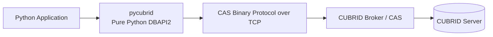
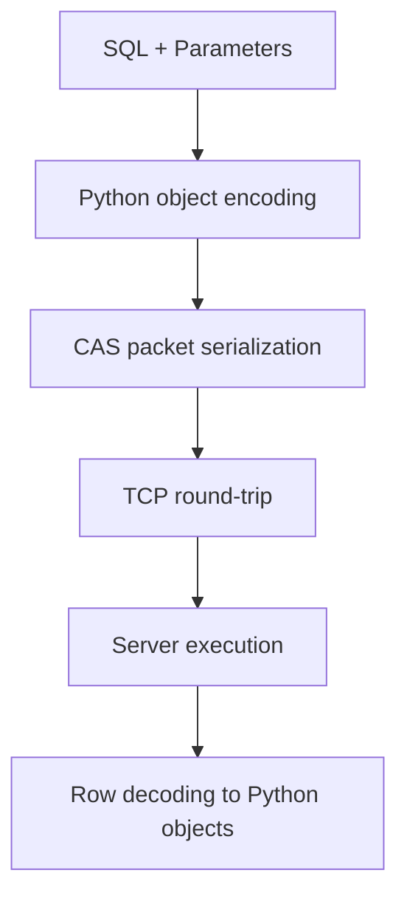
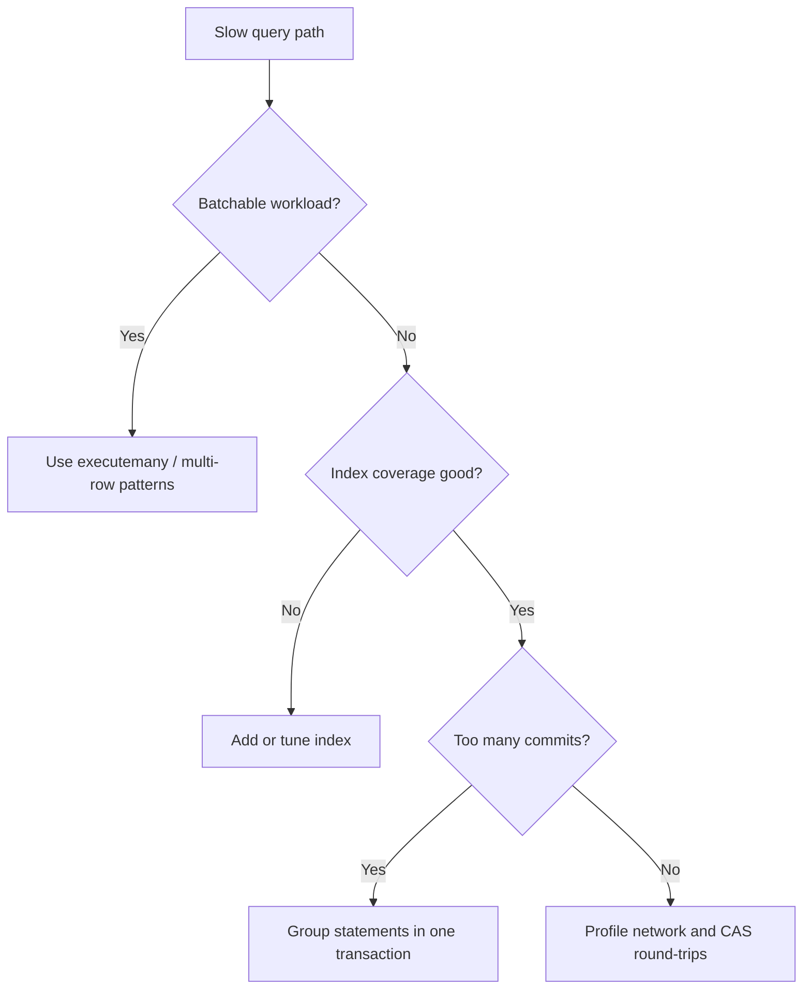

# Performance Guide

This guide summarizes benchmark behavior for `pycubrid` and shows practical tuning steps.

---

## Table of Contents

- [Overview](#overview)
- [Benchmark Results](#benchmark-results)
- [Performance Characteristics](#performance-characteristics)
- [Optimization Tips](#optimization-tips)
- [Performance Investigation](#performance-investigation)
- [Running Benchmarks](#running-benchmarks)

---

## Overview

`pycubrid` is a pure Python DBAPI2 driver that talks to CUBRID over the CAS binary protocol.





---

## Benchmark Results

Source: [cubrid-benchmark](https://github.com/cubrid-labs/cubrid-benchmark)

Environment: Intel Core i5-9400F @ 2.90GHz, 6 cores, Linux x86_64, Docker containers.

Workload: Python `pycubrid` vs `PyMySQL`, 10000 rows x 5 rounds.

| Scenario | CUBRID (pycubrid) | MySQL (PyMySQL) | Ratio (CUBRID/MySQL) |
|---|---:|---:|---:|
| insert_sequential | 10.47s | 1.74s | 6.0x |
| select_by_pk | 15.99s | 3.52s | 4.5x |
| select_full_scan | 10.31s | 1.86s | 5.5x |
| update_indexed | 10.70s | 2.19s | 4.9x |
| delete_sequential | 10.75s | 2.10s | 5.1x |

---

## Performance Characteristics

- `pycubrid` is pure Python, so packet encode/decode and row conversion run in the interpreter.
- `PyMySQL` can benefit from optional C acceleration in parts of the stack, which reduces CPU overhead.
- CAS uses a binary protocol with explicit packet framing and parsing; this adds per-request work.
- Small, chatty queries amplify Python-level and round-trip overhead.
- Throughput improves when calls are batched and transaction boundaries are controlled.

---

## Optimization Tips

- Use explicit transactions for write bursts instead of per-statement commits.
- Batch inserts and updates with `executemany()` where possible.
- Reuse long-lived connections to avoid repeated handshake cost.
- Select only required columns and avoid unnecessary full scans.
- Keep hot predicates indexed and validate plans in CUBRID.



---

## Performance Investigation

Use this workflow when [cubrid-benchmark](https://github.com/cubrid-labs/cubrid-benchmark)
detects a measurable gap or regression. The goal is to reproduce, profile, fix, and verify —
without hardcoding thresholds that age badly.

### When to Investigate

- A benchmark run shows a ratio increase vs the baseline recorded in this document.
- A CI run flags a deviation from the previous run's numbers.
- You are about to submit a change to the hot path (protocol.py, packet.py, cursor.py).

### Workflow

```mermaid
flowchart TD
    Detect[cubrid-benchmark detects gap] --> Issue[File a Performance issue\nusing the issue template]
    Issue --> Profile[Run profiling scripts\nto isolate the hot path]
    Profile --> Optimize[Apply targeted fix\n(see Optimization Tips)]
    Optimize --> Verify[Re-run profiling scripts\nand cubrid-benchmark]
    Verify --> Close[Attach results to issue\nand close]
```

1. **File an issue** — use the
   [Performance Investigation template](../.github/ISSUE_TEMPLATE/performance.yml).
   Paste the benchmark output and link the CI run that triggered this.

2. **Profile the affected operation** — pick the script that matches the slow operation:

   | Operation | Script |
   |-----------|--------|
   | Connection handshake | `scripts/profile_connect.py` |
   | INSERT / SELECT / UPDATE / DELETE | `scripts/profile_execute.py` |
   | Row fetching (fetchone/fetchall/fetchmany) | `scripts/profile_fetch.py` |

3. **Optimise** — guided by cProfile's cumulative time, focus changes on the top frames.
   Keep patches targeted; avoid speculative refactors.

4. **Verify** — re-run the profiling script and the full benchmark suite.
   Attach before/after numbers to the issue.

### Running the Profiling Scripts

All scripts require a live CUBRID instance. Defaults target `localhost:33000/demodb` with
user `dba`.

#### Connection handshake

```bash
# 100 connect/close cycles (default):
python scripts/profile_connect.py

# Custom target, 50 iterations, save .prof:
python scripts/profile_connect.py \
    --host myhost --port 33000 --database testdb \
    --user dba --password secret \
    --iterations 50 --output connect.prof
```

#### Statement execution

```bash
# All DML operations, 100 iterations each (default):
python scripts/profile_execute.py

# INSERT only, 200 iterations:
python scripts/profile_execute.py --operation insert --iterations 200

# Save .prof for snakeviz:
python scripts/profile_execute.py --output exec.prof
```

#### Result fetching

```bash
# 1000 rows, 50 fetch iterations (default):
python scripts/profile_fetch.py

# 5000 rows, 20 iterations, fetchmany batch size 100:
python scripts/profile_fetch.py --rows 5000 --iterations 20 --fetch-size 100

# Save .prof for snakeviz:
python scripts/profile_fetch.py --output fetch.prof
```

#### Visualising .prof files with snakeviz

```bash
pip install snakeviz
snakeviz profile_output.prof
```

snakeviz opens an interactive flame graph in the browser, making it easy to drill into
nested call stacks.

---

## Running Benchmarks

1. Clone the benchmark suite: `git clone https://github.com/cubrid-labs/cubrid-benchmark`.
2. Start benchmark containers and databases as documented in that repository.
3. Run the Python benchmark scenario (`pycubrid` vs `PyMySQL`) with the provided runner.
4. Execute multiple rounds (the published run used 10000 rows x 5 rounds).
5. Export and compare result artifacts (JSON/markdown tables) for trend analysis.

For exact commands and benchmark harness details, use the benchmark repo README and scripts.
