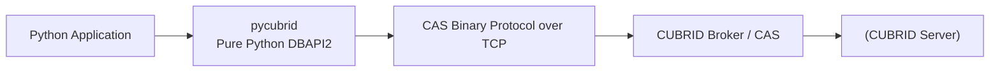
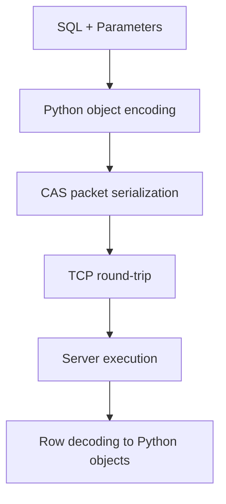
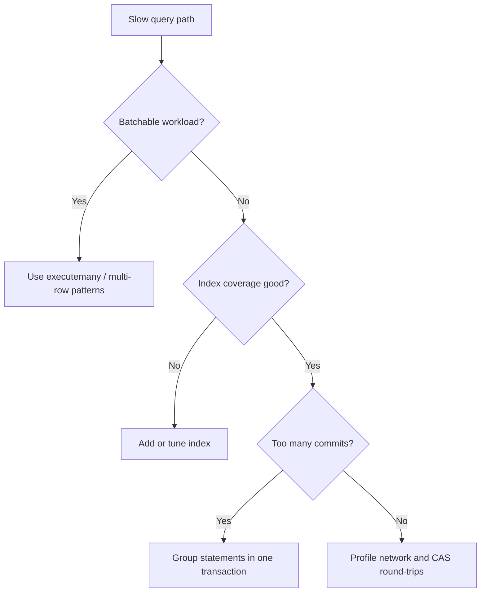
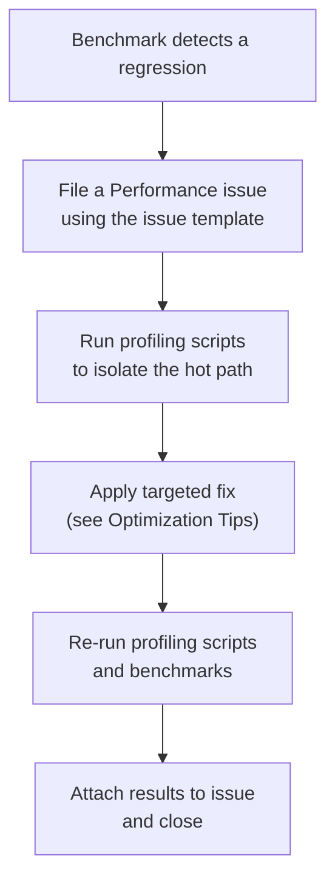

# Performance Guide

This guide covers the performance of `pycubrid` running on CUBRID: how to measure it, what is
measured for the current release, and how to profile and tune it.

It does not compare CUBRID with other database engines. A comparison across engines mixes
server-engine differences with driver overhead, so it cannot tell you how fast the driver is.

---

## Table of Contents

- [Performance Overview](#performance-overview)
- [Benchmark Methodology](#benchmark-methodology)
- [Current Release Baseline](#current-release-baseline)
- [Performance Regression](#performance-regression)
- [Sync and Async Characteristics](#sync-and-async-characteristics)
- [Batch Processing](#batch-processing)
- [Fetch and Memory Performance](#fetch-and-memory-performance)
- [Profiling and Optimization](#profiling-and-optimization)
- [Known Limitations](#known-limitations)
- [Reproduction Guide](#reproduction-guide)

---

## Performance Overview

`pycubrid` is a pure Python DBAPI2 driver that talks to CUBRID over the CAS binary protocol.


```mermaid
flowchart LR
    App[Python Application] --> Driver[pycubrid\nPure Python DBAPI2]
    Driver --> CAS[CAS Binary Protocol over TCP]
    CAS --> Broker[CUBRID Broker / CAS]
    Broker --> Server["(CUBRID Server)"]
```


```mermaid
flowchart TD
    Q[SQL + Parameters] --> Encode[Python object encoding]
    Encode --> Packet[CAS packet serialization]
    Packet --> Net[TCP round-trip]
    Net --> Exec[Server execution]
    Exec --> Decode[Row decoding to Python objects]
```

- `pycubrid` is pure Python, so packet encode/decode and row conversion run in the interpreter.
- CAS uses a binary protocol with explicit packet framing and parsing; this adds per-request work.
- Small, chatty queries amplify Python-level and round-trip overhead.
- Throughput improves when calls are batched and transaction boundaries are controlled.

Driver performance is tracked against two references, both on the same CUBRID server:

- **Release to release** — the current `pycubrid` release against an earlier release.
- **Driver overhead** — `pycubrid` against the official `CUBRIDdb` driver.

---

## Benchmark Methodology

A benchmark result is only useful when the driver is the one thing that changes.

- **Same server.** Run every driver or release under test against the same CUBRID server, on
  the same host, with the same schema and data. Do not compare results across database
  engines.
- **Same transaction mode.** Set `autocommit` explicitly on every connection under test. Drivers
  have different defaults, and a commit per statement changes the result.
- **Record the environment.** CPU, OS, Python version, CUBRID version, `pycubrid` version and
  `fetch_size`.
- **Repeat.** Run several rounds and report the median and spread, not a single run.

Tools in this repository:

| Tool | What it measures | Needs a server |
|---|---|---|
| `tests/test_benchmarks.py` | Connect, single-row CRUD, 100-row insert/select and prepared reuse (pytest-benchmark) | Yes |
| `tests/test_bench_fetch_parsing.py` | FETCH reply parsing of synthetic 2000-row replies | No |
| `scripts/bench_regression.py` | Median change between two pytest-benchmark JSON files | No |
| `scripts/profile_*.py` | cProfile of connect, execute and fetch | Yes |

Larger workloads and the harness for comparing drivers live in
[cubrid-benchmark](https://github.com/cubrid-lab/cubrid-benchmark).

---

## Current Release Baseline

No benchmark numbers are published for the current release yet. The baseline is tracked in
[#797](https://github.com/cubrid-lab/pycubrid/issues/797).

| Measurement | Status |
|---|---|
| Current release against 1.10.0 | **Not measured** — [#797](https://github.com/cubrid-lab/pycubrid/issues/797) |
| `pycubrid` against `CUBRIDdb` on the same server | **Not measured** — [#797](https://github.com/cubrid-lab/pycubrid/issues/797) |
| Sync against async | **Not measured** — [#797](https://github.com/cubrid-lab/pycubrid/issues/797) |
| `executemany()` batch throughput | **Not measured** — [#797](https://github.com/cubrid-lab/pycubrid/issues/797) |
| Fetch throughput and peak memory by `fetch_size` | **Not measured** — [#797](https://github.com/cubrid-lab/pycubrid/issues/797) |

### Historical Results (2026-03, pycubrid 0.5.0)

The earliest published `pycubrid` measurements are kept, unchanged, in the
[`baseline-multilang` experiment](https://github.com/cubrid-lab/cubrid-benchmark/tree/main/experiments/baseline-multilang)
of `cubrid-benchmark` (run `2026-03-16_initial`: `pycubrid` 0.5.0, CPython 3.10.12,
CUBRID 11.2 in Docker).

They are **historical** and are not a baseline for the current release. Known limitations:

- They predate the cursor memory-bounding fix
  ([#203](https://github.com/cubrid-lab/pycubrid/issues/203),
  [PR #207](https://github.com/cubrid-lab/pycubrid/pull/207), released in 1.6.0). Before that
  fix, `Cursor` and `AsyncCursor` kept the whole result set in their row buffer, so fetch
  numbers from that period do not reflect current behaviour.
- They predate the fetch fix released in 0.6.0 (commit `bb687dc`). In 0.5.0, `fetchall()`
  returned only the first fetch batch, so SELECT scenarios that read more than one batch did
  not read the whole result.
- That experiment compares two database engines. This guide does not reproduce it, for the
  reason given at the top of the page.

---

## Performance Regression

The weekly **Bug Hunt** workflow (`.github/workflows/bug-hunt.yml`, job `perf-trend`) runs
`tests/test_benchmarks.py` against CUBRID 11.4 and compares the medians with the previous run
using `scripts/bench_regression.py`. It is a trend report: it does not set a fail threshold and
does not gate pull requests or releases.

A release-to-release comparison is **not measured** yet — see
[#797](https://github.com/cubrid-lab/pycubrid/issues/797).

Investigate when:

- The trend report shows a median increase over the previous run.
- A CI run flags a deviation from the previous run's numbers.
- You are about to submit a change to the hot path (protocol.py, packet.py, cursor.py).

### Comparing Two Runs

```bash
# Run the live microbenchmarks on the old and the new code:
pytest tests/test_benchmarks.py --benchmark-enable --benchmark-json=before.json
pytest tests/test_benchmarks.py --benchmark-enable --benchmark-json=after.json

# Report the median change per benchmark (add --fail-threshold PCT to fail on a regression):
python scripts/bench_regression.py --baseline before.json --current after.json
```

### Fetch Reply Parsing (Offline)

`tests/test_bench_fetch_parsing.py` times FC8 FETCH reply parsing with no
server (#559). It covers 2000-row synthetic replies for scalar, text, mixed
(with NULLs) and collection workloads, built with the fuzz seed builders, and
checks every parse against their exact expected rows. Without
`--benchmark-enable` each workload is parsed once as a correctness test, so
required CI has no timing threshold.

```bash
# Time it (30 rounds after 3 warmup rounds), with peak allocation in extra_info:
pytest tests/test_bench_fetch_parsing.py --benchmark-enable \
    --benchmark-json=fetch-parse.json

# Compare two runs:
python scripts/bench_regression.py --baseline before.json --current after.json
```

---

## Sync and Async Characteristics

- `pycubrid.connect()` returns a blocking `Connection`; `pycubrid.aio.connect()` returns an
  `AsyncConnection` that awaits network I/O instead of blocking.
- Both build and parse the same CAS packets, so the per-request encode/decode work is the same.
- An `AsyncConnection` serialises its requests with an `asyncio.Lock`: one connection runs one
  request at a time. Async helps when many connections or other I/O run concurrently on one
  event loop, not when a single connection runs one query after another.
- Async timings from the [timing hooks](#timing--profiling-hooks) include event-loop scheduling
  latency.

Relative sync and async throughput is **not measured** for the current release — see
[#797](https://github.com/cubrid-lab/pycubrid/issues/797).

---

## Batch Processing

`executemany()` on a sync or async cursor uses a batch path when the statement starts with
`INSERT`, `UPDATE`, `DELETE` or `MERGE`:

1. The driver renders every parameter set into a complete SQL string on the client (see
   [Parameter Binding](PARAMETER_BINDING.md)).
2. It sends all the strings in a single `BatchExecutePacket`, so the whole batch takes one
   round trip instead of one per row.
3. `rowcount` is the sum of the affected rows.

Other statements, such as `SELECT`, fall back to calling `execute()` once per parameter set.
`executemany_batch(sql_list)` sends a list of SQL strings you have already rendered in the same
single request.

Practical advice:

- Group a write burst in one explicit transaction instead of committing per statement.
- Split very large parameter sequences into chunks; see
  [Known Limitations](#known-limitations) for why.

Batch throughput is **not measured** for the current release — see
[#797](https://github.com/cubrid-lab/pycubrid/issues/797).

---

## Fetch and Memory Performance

`fetch_size` sets how many rows the driver asks the CAS broker for in each fetch round trip.
It defaults to `100`. Set it per connection with `pycubrid.connect(..., fetch_size=N)` or per
cursor with `cursor.fetch_size = N` (an integer of at least 1).
`fetch_size` is not `arraysize`: `arraysize` is only the default row count of `fetchmany()`.

Since 1.6.0 ([#203](https://github.com/cubrid-lab/pycubrid/issues/203)), each fetch replaces
the cursor's row buffer instead of adding to it, so the buffer holds at most one fetch batch:

- `fetchone()`, `fetchmany()` and iteration keep memory bounded by `fetch_size`.
- `fetchall()` builds one list with every remaining row, so its memory grows with the result
  set. It releases the internal buffer when it finishes.
- A larger `fetch_size` means fewer round trips and more memory per batch; a smaller one means
  the reverse.

Fetch throughput and peak memory for different `fetch_size` values are **not measured** for the
current release — see [#797](https://github.com/cubrid-lab/pycubrid/issues/797).

### Profiling Fetch

`scripts/profile_fetch.py` profiles `fetchone`, `fetchmany` and `fetchall` against a live
server.

```bash
# 1000 rows, 50 fetch iterations (default):
python scripts/profile_fetch.py

# 5000 rows, 20 iterations, fetchmany batch size 100:
python scripts/profile_fetch.py --rows 5000 --iterations 20 --fetch-size 100

# Save .prof for snakeviz:
python scripts/profile_fetch.py --output fetch.prof
```

---

## Profiling and Optimization

### Optimization Tips

- Use explicit transactions for write bursts instead of per-statement commits.
- Batch inserts and updates with `executemany()` where possible.
- Reuse long-lived connections to avoid repeated handshake cost.
- Select only required columns and avoid unnecessary full scans.
- Keep hot predicates indexed and validate plans in CUBRID.


```mermaid
flowchart TD
    Start[Slow query path] --> Batching{Batchable workload?}
    Batching -->|Yes| ExecMany[Use executemany / multi-row patterns]
    Batching -->|No| Index{Index coverage good?}
    Index -->|No| AddIdx[Add or tune index]
    Index -->|Yes| Txn{Too many commits?}
    Txn -->|Yes| GroupTxn[Group statements in one transaction]
    Txn -->|No| Net[Profile network and CAS round-trips]
```

### Performance Investigation

Use this workflow when a benchmark detects a measurable regression. The goal is to reproduce,
profile, fix, and verify — without hardcoding thresholds that age badly.


```mermaid
flowchart TD
    Detect[Benchmark detects a regression] --> Issue[File a Performance issue\nusing the issue template]
    Issue --> Profile[Run profiling scripts\nto isolate the hot path]
    Profile --> Optimize["Apply targeted fix\n(see Optimization Tips)"]
    Optimize --> Verify[Re-run profiling scripts\nand benchmarks]
    Verify --> Close[Attach results to issue\nand close]
```

1. **File an issue** — use the
   [Performance Investigation template](../.github/ISSUE_TEMPLATE/performance.yml).
   Paste the benchmark output and link the CI run that triggered this.

2. **Profile the affected operation** — pick the script that matches the slow operation:

   | Operation | Script |
   |-----------|--------|
   | Connection handshake | `scripts/profile_connect.py` |
   | INSERT / SELECT / UPDATE / DELETE | `scripts/profile_execute.py` |
   | Row fetching (fetchone/fetchall/fetchmany) | `scripts/profile_fetch.py` |

3. **Optimise** — guided by cProfile's cumulative time, focus changes on the top frames.
   Keep patches targeted; avoid speculative refactors.

4. **Verify** — re-run the profiling script and the benchmarks.
   Attach before/after numbers to the issue.

### Running the Profiling Scripts

All scripts require a live CUBRID instance. Defaults target `localhost:33000/demodb` with
user `dba`. For `scripts/profile_fetch.py`, see [Profiling Fetch](#profiling-fetch).

#### Connection handshake

```bash
# 100 connect/close cycles (default):
python scripts/profile_connect.py

# Custom target, 50 iterations, save .prof:
python scripts/profile_connect.py \
    --host myhost --port 33000 --database testdb \
    --user dba --password secret \
    --iterations 50 --output connect.prof
```

#### Statement execution

```bash
# All DML operations, 100 iterations each (default):
python scripts/profile_execute.py

# INSERT only, 200 iterations:
python scripts/profile_execute.py --operation insert --iterations 200

# Save .prof for snakeviz:
python scripts/profile_execute.py --output exec.prof
```

#### Visualising .prof files with snakeviz

```bash
pip install snakeviz
snakeviz profile_output.prof
```

snakeviz opens an interactive flame graph in the browser, making it easy to drill into
nested call stacks.

### Timing & Profiling Hooks

For lightweight in-process diagnosis you can opt into the driver's built-in timing
instrumentation instead of running the cProfile-based scripts above. Hooks are **off by
default** — when disabled the timing module is never imported and the hot path runs
unchanged.

#### When to use which

| Use case | Tool |
|---|---|
| "Where is wall-clock time going across `connect` / `execute` / `fetch` / `close` in my application?" | `enable_timing=True` (this section) |
| "Which Python frames inside `cursor.execute` are hot?" | `scripts/profile_execute.py` (cProfile) |
| "Did this change make the driver slower than the previous run?" | [Performance Regression](#performance-regression) |

#### Enabling

Pass the `enable_timing=True` keyword to `pycubrid.connect()`:

```python
import pycubrid

conn = pycubrid.connect(
    host="localhost", port=33000, database="testdb", user="dba",
    enable_timing=True,
)
```

Or set the environment variable so timing is enabled for every connection in a process —
useful in benchmark harnesses and CI jobs:

```bash
export PYCUBRID_ENABLE_TIMING=1   # also accepts true / yes (case-insensitive)
python my_workload.py
```

The explicit keyword always wins over the environment variable. Async connections support
the same keyword on `pycubrid.aio.connect()`.

#### Reading the stats

```python
cur = conn.cursor()
cur.executemany(
    "INSERT INTO bench (n) VALUES (?)",
    [(i,) for i in range(1000)],
)
cur.execute("SELECT n FROM bench")
cur.fetchall()

stats = conn.timing_stats
print(stats)
# TimingStats(connect=1 calls, 12.345ms total, 12.345ms avg,
#             execute=2 calls, 18.700ms total, 9.350ms avg,
#             fetch=1 calls, 4.200ms total, 4.200ms avg,
#             close=0 calls)

# Programmatic access (nanoseconds, ints):
exec_avg_ms = stats.execute_total_ns / stats.execute_count / 1_000_000
print(f"average execute: {exec_avg_ms:.3f} ms")

# Reset between phases
stats.reset()
```

`Connection.timing_stats` is `None` when timing is disabled, so guard accordingly:

```python
if conn.timing_stats is not None:
    print(conn.timing_stats)
```

#### Categories and granularity

| Category | What it covers |
|---|---|
| `connect` | TCP socket setup + CAS broker handshake + database open. Recorded even on failure. |
| `execute` | `Cursor.execute()` and `executemany()` — wraps prepare-and-execute round-trip. |
| `fetch` | `fetchone()` / `fetchmany()` / `fetchall()` combined. |
| `close` | `Connection.close()` — `CloseDatabasePacket` round-trip + socket teardown. |

All cursors created from a connection report into the same `TimingStats`. Stats are
**per-connection**, cumulative since the last `reset()`.

#### Overhead and thread-safety

- **Disabled** — the timing module is not imported; per-call cost is a single attribute
  read (`self._timing is None`).
- **Enabled** — two `time.perf_counter_ns()` calls plus a lock-protected accumulator
  update per hook (~hundreds of nanoseconds).
- The `threading.Lock` inside `TimingStats` lets a monitoring thread safely read counters
  while a worker thread drives the connection. The connection itself remains
  `threadsafety = 1` (one connection per thread).

#### Timing limitations

- Async timings include event-loop scheduling latency; treat them as client-side
  end-to-end latency, not pure server time.
- Counters are cumulative only — there is no per-statement history. If you need
  per-statement breakdowns, run the cProfile-based scripts in
  [Performance Investigation](#performance-investigation).
- `ping()` and `commit()` / `rollback()` are not currently timed.

---

## Known Limitations

- **Pure Python.** Packet encode/decode and row conversion run in the interpreter; there is no
  C extension.
- **`executemany()` holds the whole batch in memory.** The batch path renders every parameter
  set into a SQL string before sending, then serialises all of them into one request. Client
  memory grows with the number and size of the parameter sets; split very large sequences into
  chunks.
- **`fetchall()` materialises the result.** Use `fetchone()`, `fetchmany()` or iteration for
  large result sets.
- **Async timing includes the event loop.** See
  [Sync and Async Characteristics](#sync-and-async-characteristics).
- **No current-release numbers.** The baseline is tracked in
  [#797](https://github.com/cubrid-lab/pycubrid/issues/797); the published 2026-03 numbers are
  [historical](#historical-results-2026-03-pycubrid-050).

---

## Reproduction Guide

1. Start a CUBRID server. The repository's `docker compose up -d` starts one on
   `localhost:33000` with database `testdb` (see [Development](DEVELOPMENT.md)).
2. Run the microbenchmarks on each version you compare, on the same host and server, and save
   the JSON output.
3. Compare the runs with `scripts/bench_regression.py`.
4. For larger workloads, or to compare `pycubrid` with `CUBRIDdb` on the same server, use the
   [cubrid-benchmark](https://github.com/cubrid-lab/cubrid-benchmark) harness. Set
   `autocommit` explicitly for every driver.
5. Report the result in a [Performance issue](../.github/ISSUE_TEMPLATE/performance.yml) with
   the environment listed under [Benchmark Methodology](#benchmark-methodology).

```bash
docker compose up -d
export CUBRID_TEST_URL="cubrid://dba@localhost:33000/testdb"
pytest tests/test_benchmarks.py --benchmark-enable --benchmark-json=current.json
python scripts/bench_regression.py --baseline baseline.json --current current.json
```
