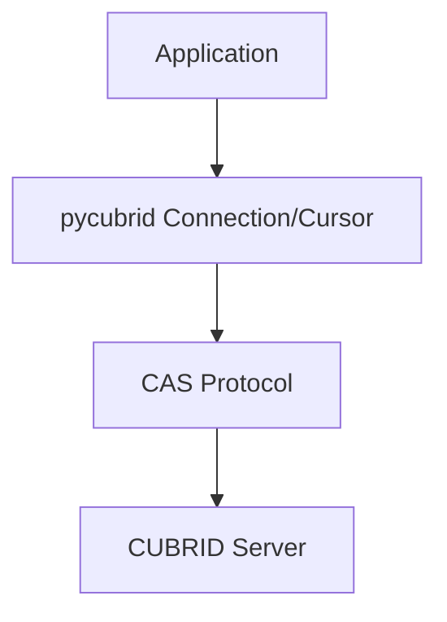

# pycubrid

> 🌐 Community translation of [README.md](https://github.com/cubrid-lab/pycubrid/blob/main/README.md) — English is canonical; this translation may lag behind the original. The `translation-sync` CI check flags drift, and maintainers open resync PRs.

**Чистый Python-драйвер DB-API 2.0 для базы данных CUBRID** — без C-расширений, без компиляции, реализует интерфейс PEP 249 (DB-API 2.0).

[🇰🇷 한국어](README.ko.md) · [🇺🇸 English](../README.md) · [🇨🇳 中文](README.zh.md) · [🇮🇳 हिन्दी](README.hi.md) · [🇩🇪 Deutsch](README.de.md) · [🇷🇺 Русский](README.ru.md)

<!-- BADGES:START -->
[](https://pypi.org/project/pycubrid)
[](https://www.python.org)
[](https://github.com/cubrid-lab/pycubrid/actions/workflows/ci.yml)
[](https://github.com/cubrid-lab/pycubrid/actions/workflows/integration-full.yml)
[](https://codecov.io/gh/cubrid-lab/pycubrid)
[](https://github.com/cubrid-lab/pycubrid/blob/main/LICENSE)
[](https://github.com/cubrid-lab/pycubrid)
[](https://cubrid-lab.github.io/pycubrid/)
<!-- BADGES:END -->

---

> **Статус: Stable (1.x).** Публичный API следует [semantic versioning](../RELEASE_POLICY.md): минорные релизы добавляют обратно совместимые функции, патч-релизы содержат только исправления ошибок; ломающие изменения отложены до следующего мажорного релиза (2.0+) и контролируются автоматическим CI-джобом `compat-check` против [`api-baseline.json`](../api-baseline.json). Активная разработка продолжается — полный контракт см. в [`RELEASE_POLICY.md`](../RELEASE_POLICY.md).

## Почему pycubrid?

CUBRID — это высокопроизводительная реляционная база данных с открытым исходным
кодом, широко используемая в корейском государственном секторе и корпоративных
приложениях. Существующий драйвер на основе C-расширения (`CUBRIDdb`) имел
зависимости сборки и проблемы совместимости с платформами.

**pycubrid** решает эти проблемы:

- **Чистая реализация на Python** — без зависимостей от C-сборки, установка только через `pip install`
- **Реализует PEP 249 (DB-API 2.0)** — стандартная иерархия исключений, объекты типов и интерфейс курсора
- **Офлайн-регрессионные тесты** с **минимальным покрытием 95 % при полном запуске coverage** — см. [измеренное покрытие](https://codecov.io/gh/cubrid-lab/pycubrid) и [политику выполнения CI](CI_POLICY.md); обычные PR-smoke-тесты не измеряют покрытие
- **TLS/SSL для синхронных и асинхронных подключений** — опционально `ssl=True` (проверенный контекст, минимум TLS 1.2) или пользовательский `ssl.SSLContext` в `connect()` и `pycubrid.aio.connect()`.
- **Нативная поддержка asyncio** — async/await API через `pycubrid.aio` для приложений с высокой конкурентностью
- **Типизированный пакет PEP 561** — маркер `py.typed` для современных IDE и инструментов статического анализа
- **Прямая реализация протокола CUBRID CAS** — без дополнительного промежуточного ПО
- **Поддержка LOB (CLOB/BLOB)** — работа с большими текстовыми и бинарными данными

## Требования

- Python 3.10+
- Сервер базы данных CUBRID 10.2+

## Установка

```bash
pip install pycubrid
```

## Быстрый старт

### Базовое подключение

```python
import pycubrid

conn = pycubrid.connect(
    host="localhost",
    port=33000,
    database="testdb",
    user="dba",
    password="",
)

cur = conn.cursor()
cur.execute("SELECT 1 + 1")
print(cur.fetchone())  # (2,)

cur.close()
conn.close()
```

### Контекстный менеджер

```python
import pycubrid

with pycubrid.connect(host="localhost", port=33000, database="testdb", user="dba") as conn:
    with conn.cursor() as cur:
        cur.execute("CREATE TABLE IF NOT EXISTS users (id INT AUTO_INCREMENT PRIMARY KEY, name VARCHAR(100))")
        cur.execute("INSERT INTO users (name) VALUES (?)", ("Alice",))
        conn.commit()

        cur.execute("SELECT * FROM users")
        for row in cur:
            print(row)
```

### Async

```python
import asyncio
import pycubrid.aio

async def main():
    conn = await pycubrid.aio.connect(
        host="localhost", port=33000, database="testdb", user="dba"
    )
    cur = conn.cursor()
    await cur.execute("SELECT 1 + 1")
    print(await cur.fetchone())  # (2,)
    await cur.close()
    await conn.close()

asyncio.run(main())
```

### Практические примеры

В тестовой базе данных выполните подготовку, три примера и очистку **по порядку в одном сеансе Python**. Измените параметры подключения для своего сервера. Выделенная таблица не должна уже существовать: подготовка завершится ошибкой, не используя и не удаляя существующую таблицу. Ручной режим фиксации и начальная фиксация DDL ограничивают последующий откат операциями DML.

#### Подготовка

```python
import pycubrid

conn = pycubrid.connect(host="localhost", port=33000, database="testdb", user="dba")
conn.autocommit = False
cur = conn.cursor()
cur.execute("CREATE TABLE pycubrid_quickstart_327 (id INT PRIMARY KEY, name VARCHAR(100))")
conn.commit()
```

#### Базовые операции CRUD

```python
cur.execute("INSERT INTO pycubrid_quickstart_327 (id, name) VALUES (?, ?)", (1, "Alice"))
cur.execute("SELECT name FROM pycubrid_quickstart_327 WHERE id = ?", (1,))
print(cur.fetchone())  # ('Alice',)
cur.execute("UPDATE pycubrid_quickstart_327 SET name = ? WHERE id = ?", ("Alicia", 1))
cur.execute("SELECT name FROM pycubrid_quickstart_327 WHERE id = ?", (1,))
print(cur.fetchone())  # ('Alicia',)
cur.execute("DELETE FROM pycubrid_quickstart_327 WHERE id = ?", (1,))
conn.commit()
```

#### Транзакции: фиксация и откат

```python
cur.execute("INSERT INTO pycubrid_quickstart_327 (id, name) VALUES (?, ?)", (2, "Bob"))
conn.commit()
cur.execute("UPDATE pycubrid_quickstart_327 SET name = ? WHERE id = ?", ("Temporary", 2))
conn.rollback()
cur.execute("SELECT name FROM pycubrid_quickstart_327 WHERE id = ?", (2,))
print(cur.fetchone())  # ('Bob',)
conn.rollback()
```

#### Обработка ошибок

```python
from pycubrid.exceptions import ProgrammingError

try:
    cur.execute("SELECT missing_column FROM pycubrid_quickstart_327 WHERE id = ?", (2,))
except ProgrammingError as exc:
    conn.rollback()
    print(f"Query failed: {exc}")
```

#### Очистка

После успешной подготовки выполните очистку, даже если пример завершится ошибкой; она удаляет только созданную выше таблицу. Другие примеры: [EXAMPLES.md](EXAMPLES.md).

```python
conn.rollback()
cur.execute("DROP TABLE pycubrid_quickstart_327")
conn.commit()
cur.close()
conn.close()
```

## Соответствие PEP 249

| Атрибут | Значение |
|---|---|
| `apilevel` | `"2.0"` |
| `threadsafety` | `1` (соединения нельзя разделять между потоками) |
| `paramstyle` | `"qmark"` (позиционные параметры `?`) |

- Полная стандартная иерархия исключений: `Warning`, `Error`, `InterfaceError`, `DatabaseError`, `OperationalError`, `IntegrityError`, `InternalError`, `ProgrammingError`, `NotSupportedError`
- Стандартные объекты типов: `STRING`, `BINARY`, `NUMBER`, `DATETIME`, `ROWID`
- Стандартные конструкторы: `Date()`, `Time()`, `Timestamp()`, `Binary()`, `DateFromTicks()`, `TimeFromTicks()`, `TimestampFromTicks()`

## Возможности

- **Чистый Python** — без C-расширений, без компиляции, работает везде, где запускается Python
- **Полная DB-API 2.0** — `connect()`, `Cursor`, `fetchone/many/all`, `executemany`, `callproc`
- **Параметризованные запросы** — `cursor.execute(sql, params)` с привязкой параметров на стороне драйвера (плейсхолдеры `?` экранируются и подставляются локально)
- **Пакетные операции** — `executemany()` и `executemany_batch()` для массовых вставок
- **Поддержка LOB** — `create_lob()`, чтение и запись столбцов CLOB и BLOB
- **Интроспекция схемы** — `get_schema_info()` для таблиц, столбцов, индексов и ограничений
- **Управление автокоммитом** — свойство `connection.autocommit` для управления транзакциями
- **Определение версии сервера** — `connection.get_server_version()` возвращает строку версии (например, `"11.2.0.0378"`)
- **Итератор курсора** — можно проходить результаты `for row in cursor`
- **Контекстные менеджеры** — конструкции `with` для соединений и курсоров
- **Async-поддержка** — `pycubrid.aio.connect()` с `AsyncConnection` и `AsyncCursor` для циклов событий asyncio

## Поддерживаемые версии CUBRID

Проект ориентирован на CUBRID 10.x и 11.x и валидируется в CI для следующих версий:

- 10.2
- 11.0
- 11.2
- 11.4

## Интеграция с SQLAlchemy

pycubrid работает как драйвер для [sqlalchemy-cubrid](https://github.com/cubrid-lab/sqlalchemy-cubrid) — диалекта SQLAlchemy 2.0 для CUBRID:

```bash
pip install "sqlalchemy-cubrid[pycubrid]"
```

```python
from sqlalchemy import create_engine, text

engine = create_engine("cubrid+pycubrid://dba@localhost:33000/testdb")

with engine.connect() as conn:
    result = conn.execute(text("SELECT 1"))
    print(result.scalar())
```

Возможности SQLAlchemy (ORM, Core, миграции Alembic, рефлексия схемы) доступны через драйвер pycubrid при использовании с sqlalchemy-cubrid.

## Документация

| Руководство | Описание |
|---|---|
| [Подключение](CONNECTION.md) | Строки подключения, формат URL, конфигурация |
| [Сопоставление типов](TYPES.md) | Полное сопоставление типов, специфичные для CUBRID типы, типы коллекций |
| [Справочник API](API_REFERENCE.md) | Полная документация API — модули, классы, функции |
| [Протокол](PROTOCOL.md) | Справочник по CAS wire protocol |
| [Разработка](DEVELOPMENT.md) | Среда разработки, тестирование, Docker, покрытие, CI/CD |
| [Примеры](EXAMPLES.md) | Практические примеры использования с кодом |
| [Устранение неполадок](TROUBLESHOOTING.md) | Ошибки подключения, проблемы запросов, работа с LOB, отладка |

## Совместимость

| | Python 3.10 | Python 3.11 | Python 3.12 | Python 3.13 | Python 3.14 |
|---|:---:|:---:|:---:|:---:|:---:|
| **Оффлайн-тесты** | ✅ | ✅ | ✅ | ✅ | ✅ |
| **CUBRID 11.4** | ✅ | -- | -- | -- | ✅ |
| **CUBRID 11.2** | ✅ | -- | -- | -- | ✅ |
| **CUBRID 11.0** | ✅ | -- | -- | -- | ✅ |
| **CUBRID 10.2** | ✅ | -- | -- | -- | ✅ |

CI запускает указанную выше матрицу при каждом PR/push (Python 3.10 + 3.14 как опорные версии × все версии CUBRID).
Полная матрица **4 × 4** Python × CUBRID выполняется по явному запуску через `workflow_dispatch` и при каждом релизе.

## Архитектура

```mermaid
graph TD
    root[pycubrid/]
    init["__init__.py - Public API connect(), types, exceptions, __version__"]
    connection[connection.py - Connection class connect/commit/rollback/cursor/LOB]
    cursor[cursor.py - Cursor class execute/fetch/executemany/callproc/iterator]
    types[types.py - DB-API 2.0 type objects and constructors]
    exceptions[exceptions.py - PEP 249 exception hierarchy]
    constants[constants.py - CAS function codes, data types, protocol constants]
    protocol["protocol.py - CAS wire protocol packet classes (20 packet types)"]
    packet[packet.py - Low-level packet reader/writer]
    lob[lob.py - LOB support]
    typed[py.typed - PEP 561 marker]

    root --> init
    root --> connection
    root --> cursor
    root --> types
    root --> exceptions
    root --> constants
    root --> protocol
    root --> packet
    root --> lob
    root --> typed
    root --> aio
    aio["aio/ - AsyncConnection, AsyncCursor, async connect()"]
```





## FAQ

### Как подключиться к CUBRID из Python?

```python
import pycubrid
conn = pycubrid.connect(host="localhost", port=33000, database="testdb", user="dba")
```

### Как установить pycubrid?

`pip install pycubrid` — без C-расширений и инструментов сборки.

### Какой стиль параметров использует pycubrid?

Стиль вопросительного знака (`qmark`): `cursor.execute("SELECT * FROM users WHERE id = ?", (1,))`

### Работает ли pycubrid с SQLAlchemy?

Да. Установите `pip install "sqlalchemy-cubrid[pycubrid]"` и используйте URL подключения `cubrid+pycubrid://dba@localhost:33000/testdb`.

### Какие версии Python поддерживаются?

Python 3.10, 3.11, 3.12, 3.13 и 3.14.

### Поддерживает ли pycubrid LOB (CLOB/BLOB)?

Да. Можно вставлять строки/байты напрямую в столбцы CLOB/BLOB. При чтении столбцы LOB возвращают данные, доступные через курсор.

### Является ли pycubrid потокобезопасным?

У pycubrid `threadsafety = 1`, то есть соединения нельзя разделять между потоками. Создавайте отдельное соединение для каждого потока.

### Какие версии CUBRID поддерживаются?

Версии CUBRID 10.2, 11.0, 11.2 и 11.4 тестируются в CI.

### Поддерживает ли pycubrid async/await?

Да. Используйте `pycubrid.aio.connect()` для нативной поддержки asyncio. Поверхность async API похожа на sync API: `await conn.ping(reconnect=...)` выполняет тот же нативный health-check `CHECK_CAS`, что и sync `Connection.ping()`, `create_lob()` по-прежнему остаётся только sync-методом, а изменение автокоммита выполняется через `await conn.set_autocommit(...)`, а не через setter свойства.


## Связанные проекты

- [sqlalchemy-cubrid](https://github.com/cubrid-lab/sqlalchemy-cubrid) — диалект SQLAlchemy 2.0 для CUBRID
- [cubrid-cookbook-python](https://github.com/cubrid-lab/cubrid-cookbook-python) — готовые к продакшену примеры Python для CUBRID


## Дорожная карта

См. [`ROADMAP.md`](../ROADMAP.md), чтобы узнать о направлении проекта и следующих этапах.

Для обзора по всей экосистеме см. [CUBRID Labs Ecosystem Roadmap](https://github.com/cubrid-lab/.github/blob/main/ROADMAP.md).

## Участие в проекте

См. [CONTRIBUTING.md](../CONTRIBUTING.md) с рекомендациями и [docs/DEVELOPMENT.md](DEVELOPMENT.md) с настройкой среды разработки.

## Безопасность

Сообщайте об уязвимостях конфиденциально через GitHub private vulnerability reporting (запасной вариант — электронная почта) — см. [SECURITY.md](../SECURITY.md). Не создавайте публичные issues по вопросам безопасности.

## Лицензия

MIT — см. [LICENSE](../LICENSE).
