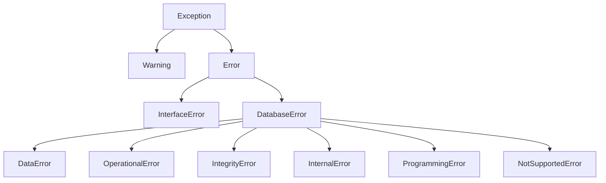

# API 참조 (한국어)

> 🌐 [API_REFERENCE.md](https://github.com/cubrid-lab/pycubrid/blob/main/docs/API_REFERENCE.md)의 번역입니다. 영어 원문이 표준이며, 페이지 번역은 경고 수준의 동기화 규칙을 따릅니다.

CUBRID용 순수 Python DB-API 2.0 드라이버 pycubrid의 완전한 API 문서.

---

## 목차

- [모듈 수준 속성](#모듈-수준-속성)
- [모듈 수준 생성자](#모듈-수준-생성자)
  - [`pycubrid.connect()`](#pycubridconnect)
  - [`decode_collections`](#decode_collections)
  - [`json_deserializer`](#json-컬럼)
- [비동기 모듈 생성자](#비동기-모듈-생성자)
  - [`pycubrid.aio.connect()`](#pycubridaioconnect)
- [Connection 클래스](#connection-클래스)
  - [생성자](#connection-생성자)
  - [메서드](#connection-메서드)
    - [`ping()`](#pingreconnecttrue)
  - [속성](#connection-속성)
  - [컨텍스트 매니저](#connection-컨텍스트-매니저)
- [Cursor 클래스](#cursor-클래스)
  - [생성자](#cursor-생성자)
  - [메서드](#cursor-메서드)
    - [`nextset()`](#nextset)
  - [속성](#cursor-속성)
  - [이터레이터 프로토콜](#이터레이터-프로토콜)
  - [컨텍스트 매니저](#cursor-컨텍스트-매니저)
- [AsyncConnection 클래스](#asyncconnection-클래스)
- [AsyncCursor 클래스](#asynccursor-클래스)
- [Lob 클래스](#lob-클래스)
  - [팩토리 메서드](#lob-팩토리-메서드)
  - [메서드](#lob-메서드)
  - [속성](#lob-속성)
- [TimingStats 클래스](#timingstats-클래스)
- [예외 계층](#예외-계층)
  - [Warning](#warning)
  - [Error](#error)
  - [InterfaceError](#interfaceerror)
  - [DatabaseError](#databaseerror)
  - [DataError](#dataerror)
  - [OperationalError](#operationalerror)
  - [IntegrityError](#integrityerror)
  - [InternalError](#internalerror)
  - [ProgrammingError](#programmingerror)
  - [NotSupportedError](#notsupportederror)
- [타입 객체](#타입-객체)
- [타입 생성자](#타입-생성자)

---

## 모듈 수준 속성

PEP 249가 요구하는 속성들이 모듈 수준에 정의되어 있습니다.

| 속성          | 값        | 설명 |
|----------------|-----------|------|
| `apilevel`     | `"2.0"`   | DB-API 사양 버전 |
| `threadsafety` | `1`       | 스레드는 모듈을 공유할 수 있으나 연결은 공유 불가 |
| `paramstyle`   | `"qmark"` | 물음표 파라미터 방식: `WHERE name = ?` |
| `__version__`  | `"1.3.0"` | 패키지 버전 문자열 |

```python
import pycubrid

print(pycubrid.apilevel)      # "2.0"
print(pycubrid.threadsafety)  # 1
print(pycubrid.paramstyle)    # "qmark"
print(pycubrid.__version__)   # "1.3.0"
```

---

## 모듈 수준 생성자

### `pycubrid.connect()`

```python
def connect(
    host: str = "localhost",
    port: int = 33000,
    database: str = "",
    user: str = "dba",
    password: str = "",
    decode_collections: bool = False,
    json_deserializer: Any = None,
    ssl: bool | ssl_module.SSLContext | None = None,
    **kwargs: Any,
) -> Connection
```

새 데이터베이스 연결을 만듭니다.

**파라미터:**

| 파라미터 | 타입 | 기본값 | 설명 |
|---|---|---|---|
| `host` | `str` | `"localhost"` | CUBRID 서버 호스트명 또는 IP 주소 |
| `port` | `int` | `33000` | CUBRID 브로커 포트 |
| `database` | `str` | `""` | 데이터베이스 이름 |
| `user` | `str` | `"dba"` | 데이터베이스 사용자 |
| `password` | `str` | `""` | 데이터베이스 비밀번호 |
| `decode_collections` | `bool` | `False` | SET/MULTISET/SEQUENCE 컬럼을 Python 컬렉션으로 디코딩 |
| `json_deserializer` | `Any` | `None` | fetch 시 JSON 컬럼을 디코딩하는 콜러블. 미설정 시 JSON은 `str`로 반환 |
| `ssl` | `bool \| ssl_module.SSLContext \| None` | `None` | 동기·비동기 브로커 연결의 옵트인 TLS. `True`면 TLS 1.2 최소의 기본 검증 컨텍스트 사용. 연결은 CUBRID의 STARTTLS 방식 업그레이드를 사용 — 평문 `CUBRS` 핸드셰이크 후 `OPEN_DATABASE` 전에 TLS 업그레이드. [연결 가이드](CONNECTION.md#ssltls) 참고. |
| `**kwargs` | `Any` | — | `connect_timeout`, `read_timeout`, `fetch_size`, `enable_timing`, `no_backslash_escapes`, `autocommit` 등 추가 파라미터 |

#### `decode_collections`

`False`(기본값)이면 컬렉션 컬럼이 하위 호환을 위해 raw CAS 와이어 `bytes`로 반환됩니다. `True`이면 pycubrid가 지원되는 `SET`, `MULTISET`, `SEQUENCE` 페이로드를 Python 컨테이너로 디코딩합니다.

#### JSON 컬럼

`json_deserializer`가 fetch 시 JSON 컬럼 디코딩을 제어합니다:

| 설정 | 결과 |
|---|---|
| `None` (기본) | JSON 컬럼을 `str`로 반환 |
| `callable` | raw JSON 문자열을 콜러블에 전달하고 그 결과 반환 |

**반환:** 새 `Connection` 인스턴스.

**발생:** 연결을 수립할 수 없으면 `OperationalError`.

```python
import pycubrid

# 최소 연결
conn = pycubrid.connect(database="testdb")

# 타임아웃 포함 전체 연결
conn = pycubrid.connect(
    host="192.168.1.100",
    port=33000,
    database="production",
    user="app_user",
    password="secret",
    connect_timeout=5.0,
)
```

---

## 비동기 모듈 생성자

### `pycubrid.aio.connect()`

```python
async def connect(
    host: str = "localhost",
    port: int = 33000,
    database: str = "",
    user: str = "dba",
    password: str = "",
    decode_collections: bool = False,
    json_deserializer: Any = None,
    ssl: bool | ssl_module.SSLContext | None = None,
    **kwargs: Any,
) -> AsyncConnection
```

비동기 연결을 만들고 엽니다.

- 연결된 `AsyncConnection`을 반환합니다.
- `pycubrid.connect()`와 동일한 컬렉션/JSON 디코딩 kwargs를 받습니다.
- `autocommit=True`를 지원하며, 연결 수립 후 자동 적용됩니다. `AsyncConnection` 자체도 이제 `autocommit`을 (키워드 전용 생성자 인자로) 직접 받으므로, 이 팩토리를 거치지 않고 생성해도 플래그가 조용히 사라지지 않습니다.
- 동기 API와 유사한 비동기 서피스를 제공합니다 — `await conn.ping(reconnect=...)` 포함. `create_lob()`은 동기 전용으로 유지되며, 오토커밋 변경은 속성 세터 대신 `await conn.set_autocommit(...)`으로 합니다.
- `pycubrid.connect()`와 동일한 `ssl` 파라미터를 받습니다: `True`, `False`/`None`, 또는 커스텀 `SSLContext`. `True`면 기본 검증 컨텍스트가 TLS 1.2 최소를 강제합니다. 비동기 TLS는 CUBRID의 STARTTLS 방식 업그레이드를 사용 — `CUBRS` 핸드셰이크를 평문으로 보낸 뒤, `OPEN_DATABASE` 전에 `asyncio.AbstractEventLoop.start_tls()`(`ssl_handshake_timeout`으로 제한)로 전송을 업그레이드합니다. 전체 내용과 Python 3.10 `start_tls()` 인증서 검증 주의점([#156](https://github.com/cubrid-lab/pycubrid/issues/156))은 [연결 가이드](CONNECTION.md#ssltls)를 참고하세요.

```python
import asyncio
import pycubrid.aio

async def main() -> None:
    conn = await pycubrid.aio.connect(database="testdb")
    cur = conn.cursor()
    await cur.execute("SELECT 1")
    print(await cur.fetchone())
    await cur.close()
    await conn.close()

asyncio.run(main())
```

---

## Connection 클래스

`pycubrid.connection.Connection`

CAS 브로커 프로토콜을 통한 CUBRID 데이터베이스 연결 하나를 나타냅니다.

### Connection 생성자

```python
class Connection:
    def __init__(
        self,
        host: str,
        port: int,
        database: str,
        user: str,
        password: str,
        autocommit: bool = False,
        **kwargs: Any,
    ) -> None
```

> **참고:** `Connection`을 직접 생성하지 마세요. `pycubrid.connect()`를 사용하세요.

**선택된 `**kwargs`:**

| 이름 | 타입 | 기본값 | 설명 |
|---|---|---|---|
| `enable_timing` | `bool \| None` | `None` | `connect`, `execute`, `fetch`, `close` 연산에 대한 드라이버 수준 타이밍 계측 옵트인. `None`이면 `PYCUBRID_ENABLE_TIMING` 환경 변수로 폴백(참값: `1`, `true`, `yes`, 대소문자 무시). 비활성 시 타이밍 모듈을 임포트하지 않고 `connection.timing_stats`는 `None`(오버헤드 0). [타이밍·프로파일링 훅](PERFORMANCE.md#타이밍--프로파일링-훅) 참고. |
| `ssl` | `bool \| ssl.SSLContext \| None` | `None` | 동기·비동기 연결이 공유하는 TLS 설정. `True`면 `minimum_version = TLSv1_2`인 기본 검증 컨텍스트 사용. [연결 가이드](CONNECTION.md) 참고. |
| `read_timeout` | `float \| None` | `None` | 소켓 읽기 타임아웃(초). |
| `fetch_size` | `int` | `100` | 서버 측 fetch 배치 크기. |
| `json_deserializer` | `Callable[[str], Any] \| None` | `None` | 옵트인 JSON 컬럼 디코더. |
| `decode_collections` | `bool` | `False` | SET/MULTISET/SEQUENCE 컬럼을 Python 컬렉션으로 디코딩. |

### Connection 메서드

#### `connect()`

```python
def connect(self) -> None
```

브로커 핸드셰이크와 함께 TCP CAS 세션을 수립하고 데이터베이스를 엽니다. 생성자가 자동 호출합니다. 이미 연결된 인스턴스에서 호출하면 no-op입니다.

**발생:** 네트워크 실패 시 `OperationalError`.

---

#### `close()`

```python
def close(self) -> None
```

연결과 추적 중인 모든 커서를 닫습니다. 서버로 `CloseDatabasePacket`을 보냅니다. 이미 닫힌 연결에서 호출하면 no-op입니다. `close()` 이후 다른 메서드 호출은 `InterfaceError`를 발생시킵니다.

```python
conn = pycubrid.connect(database="testdb")
# ... 작업 ...
conn.close()  # 연결과 모든 커서가 닫힘
```

---

#### `commit()`

```python
def commit(self) -> None
```

현재 트랜잭션을 커밋합니다. 서버로 `CommitPacket`을 보냅니다.

**발생:** 연결이 닫혔으면 `InterfaceError`.

---

#### `rollback()`

```python
def rollback(self) -> None
```

현재 트랜잭션을 롤백합니다. 서버로 `RollbackPacket`을 보냅니다.

**발생:** 연결이 닫혔으면 `InterfaceError`.

---

#### `cursor()`

```python
def cursor(self) -> Cursor
```

이 연결에 바인딩된 새 `Cursor`를 만들어 반환합니다. 커서는 연결이 추적하며 연결이 닫힐 때 함께 닫힙니다.

**반환:** 새 `Cursor` 인스턴스.

**발생:** 연결이 닫혔으면 `InterfaceError`.

```python
conn = pycubrid.connect(database="testdb")
cur = conn.cursor()
cur.execute("SELECT 1 + 1")
print(cur.fetchone())  # (2,)
cur.close()
```

---

#### `get_server_version()`

```python
def get_server_version(self) -> str
```

서버 엔진 버전 문자열을 반환합니다 (예: `"11.2.0.0378"`).

```python
conn = pycubrid.connect(database="testdb")
print(conn.get_server_version())  # "11.2.0.0378"
```

---

#### `get_last_insert_id()`

```python
def get_last_insert_id(self) -> str
```

INSERT 문이 생성한 마지막 auto-increment 값을 문자열로 반환합니다.

```python
cur.execute("INSERT INTO users (name) VALUES ('alice')")
conn.commit()
print(conn.get_last_insert_id())  # "1"
```

---

#### `ping(reconnect=True)`

```python
def ping(self, reconnect: bool = True) -> bool
```

SQL 실행 없이 가벼운 `CHECK_CAS` 헬스 체크를 수행합니다.

- CAS 연결이 살아 있으면 `True` 반환.
- `reconnect=True`이면 `False`를 반환하기 전에 재연결을 시도합니다.

```python
if not conn.ping():
    raise RuntimeError("database connection is unavailable")
```

---

#### `create_lob(lob_type)`

```python
def create_lob(self, lob_type: int) -> Lob
```

서버에 새 LOB(Large Object)를 만듭니다.

**파라미터:**

| 파라미터   | 타입  | 설명 |
|------------|-------|------|
| `lob_type` | `int` | LOB 타입 코드: BLOB은 `23`, CLOB은 `24` |

**반환:** 새 `Lob` 인스턴스.

```python
from pycubrid.constants import CUBRIDDataType

lob = conn.create_lob(CUBRIDDataType.CLOB)  # 24
lob.write(b"Hello, CUBRID!")
```

> **중요:** `Lob` 객체는 쿼리 파라미터로 전달할 수 없습니다. CLOB/BLOB 컬럼에는 문자열/바이트를 직접 삽입하세요. 자세한 내용은 [TYPES.md](TYPES.md) 참고.

---

#### `get_schema_info(schema_type, table_name, pattern_match_flag)`

```python
def get_schema_info(
    self,
    schema_type: int,
    table_name: str = "",
    pattern_match_flag: int = 1,
) -> GetSchemaPacket
```

서버에서 스키마 정보를 조회합니다.

**파라미터:**

| 파라미터            | 타입  | 기본값 | 설명 |
|----------------------|-------|---------|------|
| `schema_type`        | `int` | —       | 스키마 타입 코드 (`CCISchemaType` 참고) |
| `table_name`         | `str` | `""`    | 테이블 이름 필터 |
| `pattern_match_flag` | `int` | `1`     | 패턴 매치 플래그 |

**반환:** `query_handle`와 `tuple_count` 속성을 가진 `GetSchemaPacket`.

```python
from pycubrid.constants import CCISchemaType

packet = conn.get_schema_info(CCISchemaType.CLASS)
print(f"Found {packet.tuple_count} tables")
```

**사용 가능한 `CCISchemaType` 값:**

| 코드 | 이름              | 설명 |
|------|-------------------|------|
| 1    | `CLASS`           | 테이블 |
| 2    | `VCLASS`          | 뷰 |
| 4    | `ATTRIBUTE`       | 컬럼 |
| 11   | `CONSTRAINT`      | 제약조건 |
| 16   | `PRIMARY_KEY`     | 기본 키 |
| 17   | `IMPORTED_KEYS`   | 외래 키 (가져온) |
| 18   | `EXPORTED_KEYS`   | 외래 키 (내보낸) |

---

### Connection 속성

#### `autocommit`

```python
@property
def autocommit(self) -> bool

@autocommit.setter
def autocommit(self, value: bool) -> None
```

자동 커밋 모드를 조회하거나 설정합니다. 활성화되면 각 문장이 즉시 커밋됩니다. 이 속성을 설정하면 서버에서 트랜잭션 상태를 플러시하기 위해 `SetDbParameterPacket`과 `CommitPacket`을 보냅니다.

```python
conn = pycubrid.connect(database="testdb")
print(conn.autocommit)  # False

conn.autocommit = True
# 이제 문장이 자동 커밋됨
```

---

#### `timing_stats`

```python
@property
def timing_stats(self) -> TimingStats | None
```

연결이 `enable_timing=True`(또는 `PYCUBRID_ENABLE_TIMING` 설정)로 열렸을 때 연결별 [`TimingStats`](#timingstats-클래스) 누산기를 반환합니다. 타이밍이 비활성화되면 `None`을 반환합니다 — 이 경우 타이밍 모듈은 임포트되지 않으며 핫 경로에 오버헤드가 없습니다.

```python
import pycubrid

conn = pycubrid.connect(database="testdb", enable_timing=True)
cur = conn.cursor()
cur.execute("SELECT 1")
cur.fetchall()

stats = conn.timing_stats
assert stats is not None
print(stats)
# TimingStats(connect=1 calls, 12.345ms total, 12.345ms avg,
#             execute=1 calls, 0.987ms total, 0.987ms avg,
#             fetch=1 calls, 0.123ms total, 0.123ms avg,
#             close=0 calls)

print(stats.execute_count, stats.execute_total_ns)  # 1 987000

stats.reset()  # 모든 카운터 초기화
```

전체 가이드는 [타이밍·프로파일링 훅](PERFORMANCE.md#타이밍--프로파일링-훅)을 참고하세요.

---

### Connection 컨텍스트 매니저

`Connection`은 컨텍스트 매니저 프로토콜(`__enter__` / `__exit__`)을 구현합니다.

- 성공적 종료 시: `commit()` 후 `close()` 호출.
- 예외 시: `rollback()` 후 `close()` 호출.

```python
with pycubrid.connect(database="testdb") as conn:
    cur = conn.cursor()
    cur.execute("INSERT INTO users (name) VALUES ('bob')")
    # 종료 시 자동 커밋

# 여기서 conn은 닫혀 있음
```

---

## Cursor 클래스

`pycubrid.cursor.Cursor`

SQL 문 실행과 결과 조회를 위한 데이터베이스 커서를 나타냅니다.

### Cursor 생성자

```python
class Cursor:
    def __init__(self, connection: Connection) -> None
```

> **참고:** `Cursor`를 직접 생성하지 마세요. `connection.cursor()`를 사용하세요.

### Cursor 메서드

#### `execute(operation, parameters)`

```python
def execute(
    self,
    operation: str,
    parameters: Sequence[Any] | None = None,
) -> Cursor
```

SQL 문을 준비하고 실행합니다.

**파라미터:**

| 파라미터     | 타입 | 설명 |
|--------------|------|------|
| `operation`  | `str` | 선택적 `?` 플레이스홀더가 있는 SQL 문 |
| `parameters` | `Sequence` 또는 `None` | 바인딩할 비문자열 위치 파라미터 값 |

**반환:** 커서 자신 (체이닝용).

**발생:**
- 커서가 닫혔으면 `InterfaceError`
- SQL 오류나 파라미터 불일치 시 `ProgrammingError`

```python
# 단순 쿼리
cur.execute("SELECT * FROM users")

# 파라미터화 쿼리 (qmark 방식)
cur.execute("SELECT * FROM users WHERE age > ?", [21])

# 파라미터와 함께 INSERT
cur.execute("INSERT INTO users (name, age) VALUES (?, ?)", ["alice", 30])
```

> **중요:** `dict` 같은 매핑은 파라미터 바인딩에 지원되지 않습니다. 매핑을 전달하면 `ProgrammingError("parameters must be a sequence")`가 발생합니다.

**지원 파라미터 타입:**

| Python 타입          | SQL 리터럴 |
|----------------------|-------------|
| `None`               | `NULL` |
| `bool`               | `1` / `0` |
| `str`                | `'escaped'` |
| `bytes`              | `X'hex'` |
| `int`, `float`       | 숫자 리터럴 |
| `Decimal`            | 숫자 리터럴 |
| `datetime.date`      | `DATE'YYYY-MM-DD'` |
| `datetime.time`      | `TIME'HH:MM:SS'` |
| `datetime.datetime`  | `DATETIME'YYYY-MM-DD HH:MM:SS.mmm'` |

---

#### `executemany(operation, seq_of_parameters)`

```python
def executemany(
    self,
    operation: str,
    seq_of_parameters: Sequence[Sequence[Any]],
) -> Cursor
```

같은 SQL 문을 서로 다른 파라미터 세트로 반복 실행합니다. 각 원소는 비문자열 시퀀스여야 합니다. 비-SELECT 문의 경우 `rowcount`는 영향받은 행의 누적 합계로 설정됩니다.

```python
data = [("alice", 30), ("bob", 25), ("carol", 28)]
cur.executemany("INSERT INTO users (name, age) VALUES (?, ?)", data)
print(cur.rowcount)  # 3
```

---

#### `nextset()`

```python
def nextset(self) -> None
```

DB-API 호환 메서드. pycubrid는 이 인터페이스로 여러 서버 결과 집합을 노출하지 않으므로, `nextset()`은 커서가 열려 있는지 확인한 후 항상 `None`을 반환합니다.

```python
assert cur.nextset() is None
```

---

#### `executemany_batch(sql_list, auto_commit)`

```python
def executemany_batch(
    self,
    sql_list: list[str],
    auto_commit: bool | None = None,
) -> list[tuple[int, int]]
```

여러 개의 **서로 다른** SQL 문을 서버로 단일 배치 요청으로 실행합니다. SQL 문이 제각각일 때 `execute()`를 루프로 호출하는 것보다 효율적입니다.

**파라미터:**

| 파라미터     | 타입 | 설명 |
|---------------|------|------|
| `sql_list`    | `list[str]` | 완전한 SQL 문의 리스트 |
| `auto_commit` | `bool` 또는 `None` | 이 배치의 자동 커밋 오버라이드 (기본: 연결 설정) |

**반환:** `(statement_type, result_count)` 튜플의 리스트.

```python
results = cur.executemany_batch([
    "CREATE TABLE t1 (id INT AUTO_INCREMENT PRIMARY KEY, val VARCHAR(50))",
    "INSERT INTO t1 (val) VALUES ('hello')",
    "INSERT INTO t1 (val) VALUES ('world')",
])
# results: [(4, 0), (20, 1), (20, 1)]
# statement_type 4 = CREATE_CLASS, 20 = INSERT
```

> **참고:** `executemany_batch`는 pycubrid 확장이며 PEP 249의 일부가 아닙니다.

---

#### `fetchone()`

```python
def fetchone(self) -> tuple[Any, ...] | None
```

쿼리 결과 집합의 다음 행을 가져옵니다. 더 이상 행이 없으면 `None`을 반환합니다. 로컬 버퍼가 소진되면 서버에서 자동으로 더 가져옵니다 (fetch당 100행).

```python
cur.execute("SELECT name, age FROM users")
row = cur.fetchone()
if row:
    name, age = row
```

> **투명한 재연결에 관한 참고**: CUBRID 브로커가 반복 도중 CAS 워커를 회수하고(``KEEP_CONNECTION=AUTO``) pycubrid가 투명하게 재연결한 경우, 커서에 이미 버퍼된 행은 계속 접근 가능합니다. 버퍼가 소진되면 이후의 ``fetchone``/``fetchmany``/``fetchall`` 호출은 서버 측 커서 핸들이 더 이상 유효하지 않으므로 ``result set lost due to broker reconnect mid-fetch`` 메시지와 함께 :class:`OperationalError`를 발생시킵니다. 계속하려면 쿼리를 다시 실행하세요. ``execute()``와 ``close()``는 무효화 플래그를 리셋합니다.

---

#### `fetchmany(size)`

```python
def fetchmany(self, size: int | None = None) -> list[tuple[Any, ...]]
```

다음 `size`행을 가져옵니다. `size`가 지정되지 않으면 `cursor.arraysize`가 기본값입니다.

```python
cur.execute("SELECT * FROM users")
batch = cur.fetchmany(10)  # 최대 10행
```

---

#### `fetchall()`

```python
def fetchall(self) -> list[tuple[Any, ...]]
```

쿼리 결과의 남은 행 전체를 가져옵니다. 남은 행이 없으면 빈 리스트를 반환합니다.

```python
cur.execute("SELECT * FROM users")
all_rows = cur.fetchall()
for row in all_rows:
    print(row)
```

---

#### `callproc(procname, parameters)`

```python
def callproc(
    self,
    procname: str,
    parameters: Sequence[Any] = (),
) -> Sequence[Any]
```

저장 프로시저를 호출합니다. `CALL procname(?, ?, ...)` 문을 구성해 실행합니다.

**반환:** 원본 `parameters` 시퀀스 (PEP 249에 따라).

```python
cur.callproc("my_procedure", [1, "hello"])
```

---

#### `setinputsizes(sizes)`

```python
def setinputsizes(self, sizes: Any) -> None
```

DB-API no-op. 호환성을 위해 받아들입니다.

---

#### `setoutputsize(size, column)`

```python
def setoutputsize(self, size: int, column: int | None = None) -> None
```

DB-API no-op. 호환성을 위해 받아들입니다.

---

#### `close()`

```python
def close(self) -> None
```

커서를 닫고 활성 쿼리 핸들을 해제합니다. 이미 닫힌 커서에서 호출하면 no-op입니다.

---

### Cursor 속성

#### `description`

```python
@property
def description(self) -> tuple[DescriptionItem, ...] | None
```

마지막으로 실행된 문의 결과 집합 메타데이터를 반환합니다. 쿼리가 실행되지 않았거나 마지막 문이 행을 반환하지 않았으면 `None`입니다.

각 항목은 7-튜플입니다:

```python
(name, type_code, display_size, internal_size, precision, scale, null_ok)
#  str    int        None           None          int       int    bool
```

| 인덱스 | 필드            | 타입   | 설명 |
|-------|----------------|--------|------|
| 0     | `name`         | `str`  | 컬럼 이름 |
| 1     | `type_code`    | `int`  | CUBRID 데이터 타입 코드 (`CUBRIDDataType` 참고) |
| 2     | `display_size` | `None` | 사용 안 함 |
| 3     | `internal_size`| `None` | 사용 안 함 |
| 4     | `precision`    | `int`  | 컬럼 정밀도 |
| 5     | `scale`        | `int`  | 컬럼 스케일 |
| 6     | `null_ok`      | `bool` | 컬럼의 NULL 허용 여부 |

```python
cur.execute("SELECT name, age FROM users")
for col in cur.description:
    print(f"{col[0]}: type={col[1]}, precision={col[4]}, nullable={col[6]}")
```

---

#### `rowcount`

```python
@property
def rowcount(self) -> int
```

마지막 `execute()` 호출이 영향받은 행 수. SELECT 문이거나 실행된 문이 없으면 `-1`을 반환합니다.

---

#### `lastrowid`

```python
@property
def lastrowid(self) -> int | None
```

INSERT 문이 생성한 마지막 auto-increment 식별자. INSERT가 실행되지 않았거나 테이블에 auto-increment 컬럼이 없으면 `None`입니다.

```python
cur.execute("INSERT INTO users (name) VALUES ('alice')")
print(cur.lastrowid)  # 예: 1
```

---

#### `arraysize`

```python
@property
def arraysize(self) -> int

@arraysize.setter
def arraysize(self, value: int) -> None
```

`fetchmany()`의 기본 행 수. 기본값은 `1`입니다.

**발생:** 1 미만 값으로 설정하면 `ProgrammingError`.

---

### 이터레이터 프로토콜

`Cursor`는 이터레이터 프로토콜을 구현해 결과 행을 직접 반복할 수 있습니다:

```python
cur.execute("SELECT name, age FROM users")
for name, age in cur:
    print(f"{name} is {age} years old")
```

내부적으로 `fetchone()`을 호출합니다. 행이 없으면 `StopIteration`을 발생시킵니다.

---

### Cursor 컨텍스트 매니저

```python
with conn.cursor() as cur:
    cur.execute("SELECT 1")
    print(cur.fetchone())
# cur는 자동으로 닫힘
```

---

## AsyncConnection 클래스

`pycubrid.aio.connection.AsyncConnection`

`asyncio`에서 사용하는 `Connection`의 비동기 대응물 — 메서드 하나하나의 완전한 동일성이 아니라 유사한 서피스를 제공합니다.

### 선택된 메서드

| 메서드 | 시그니처 | 비고 |
|---|---|---|
| `cursor()` | `def cursor(self) -> AsyncCursor` | 비동기 커서를 즉시 반환. **await하지 마세요** |
| `commit()` | `async def commit(self) -> None` | 현재 트랜잭션 커밋 |
| `rollback()` | `async def rollback(self) -> None` | 현재 트랜잭션 롤백 |
| `close()` | `async def close(self) -> None` | 연결과 추적 중인 커서 종료 |
| `ping()` | `async def ping(self, reconnect: bool = True) -> bool` | 네이티브 `CHECK_CAS` 헬스 체크 (선택적 재연결) |
| `get_server_version()` | `async def get_server_version(self) -> str` | 엔진 버전 조회 |
| `get_last_insert_id()` | `async def get_last_insert_id(self) -> str` | 마지막 AUTO_INCREMENT 값 조회 |
| `get_schema_info()` | `async def get_schema_info(...) -> GetSchemaPacket` | 파싱된 패킷 객체 반환 |
| `set_autocommit()` | `async def set_autocommit(self, value: bool) -> None` | `SetDbParameterPacket`과 `CommitPacket` 전송 |

`AsyncConnection`은 동기 `Connection.ping()`과 동등한 비동기 `ping()`을 노출합니다. `create_lob()`은 동기 전용으로 유지됩니다.
같은 `AsyncConnection`의 동시 awaiter는 연결별 `asyncio.Lock`으로 직렬화되므로 공유 사용이 안전하지만, 요청은 여전히 한 번에 하나씩 실행됩니다.

`AsyncConnection.__init__`은 키워드 전용 `autocommit: bool = False` 인자를 받으며, `await conn.connect()`가 처음 완료될 때 자동 적용됩니다 — `await conn.set_autocommit(True)`과 같은 효과이지만, `pycubrid.aio.connect()` 팩토리를 거치지 않고 `AsyncConnection`을 직접 생성할 때도 사용할 수 있습니다.

```python
async with await pycubrid.aio.connect(database="testdb") as conn:
    cur = conn.cursor()
    await cur.execute("INSERT INTO logs (msg) VALUES (?)", ["ok"])
    await conn.set_autocommit(True)
    await cur.close()
```

### `set_autocommit(value)`

`AsyncConnection.autocommit`은 읽기 전용입니다. 변경하려면 `await conn.set_autocommit(True)`을 사용하세요.
동기 세터처럼 `SetDbParameterPacket`과 `CommitPacket` 둘 다 보냅니다.

### `ping(reconnect=True)`

```python
async def ping(self, reconnect: bool = True) -> bool
```

SQL 실행 없이 가벼운 네이티브 `CHECK_CAS` 헬스 체크를 수행합니다.

- CAS 연결이 살아 있으면 `True` 반환.
- 소켓이 열려 있으면 브로커의 트랜잭션 상태(`CAS_INFO`)와 무관하게 항상 네이티브 `CHECK_CAS` 왕복을 수행합니다.
- `reconnect=False`이면 `CAS_INFO=INACTIVE`에서 평소 발동하는 암시적 브로커 핸드오프 재연결을 억제합니다. 소켓이 닫혔거나 `CHECK_CAS` 자체가 실패할 때만 `False`를 반환합니다.
- `reconnect=True`이면 소켓/프로토콜 실패 시 `False` 반환 전에 종료 + 재연결을 시도합니다.

```python
if not await conn.ping(reconnect=False):
    await conn.ping(reconnect=True)
```

---

## AsyncCursor 클래스

`pycubrid.aio.cursor.AsyncCursor`

`Cursor`의 비동기 대응물.

### 선택된 메서드

| 메서드 | 시그니처 | 비고 |
|---|---|---|
| `execute()` | `async def execute(self, operation: str, parameters: Sequence[Any] \| None = None) -> AsyncCursor` | 시퀀스 전용 파라미터 바인딩, 동기 커서와 동일 규칙 |
| `executemany()` | `async def executemany(self, operation: str, seq_of_parameters: Sequence[Sequence[Any]]) -> AsyncCursor` | 비-SELECT 문용 배치 경로 |
| `fetchone()` | `async def fetchone(self) -> tuple[Any, ...] \| None` | 한 행 또는 `None` 반환 |
| `fetchmany()` | `async def fetchmany(self, size: int \| None = None) -> list[tuple[Any, ...]]` | 기본적으로 `arraysize` 사용 |
| `fetchall()` | `async def fetchall(self) -> list[tuple[Any, ...]]` | 남은 행 반환 |
| `nextset()` | `async def nextset(self) -> None` | DB-API 호환 메서드. 항상 `None` 반환 |
| `close()` | `async def close(self) -> None` | 활성 쿼리 핸들 해제 |

```python
cur = conn.cursor()          # await 불가
await cur.execute("SELECT * FROM users WHERE age > ?", [21])
rows = await cur.fetchall()
assert await cur.nextset() is None
```

---

## Lob 클래스

`pycubrid.lob.Lob`

CUBRID 대형 객체(BLOB 또는 CLOB)를 나타냅니다.

### Lob 팩토리 메서드

#### `Lob.create(connection, lob_type)`

```python
@classmethod
def create(cls, connection: Connection, lob_type: int) -> Lob
```

서버에 새 LOB 객체를 만듭니다. `connection.create_lob()`을 사용하는 것을 권장합니다.

**파라미터:**

| 파라미터     | 타입         | 설명 |
|--------------|--------------|------|
| `connection` | `Connection` | 활성 데이터베이스 연결 |
| `lob_type`   | `int`        | `CUBRIDDataType.BLOB` (23) 또는 `CUBRIDDataType.CLOB` (24) |

**발생:** `lob_type`이 BLOB이나 CLOB이 아니면 `ValueError`.

---

### Lob 메서드

#### `write(data, offset)`

```python
def write(self, data: bytes, offset: int = 0) -> int
```

`offset`부터 LOB에 바이트를 씁니다.

**반환:** 쓴 바이트 수.

---

#### `read(length, offset)`

```python
def read(self, length: int, offset: int = 0) -> bytes
```

`offset`부터 LOB에서 최대 `length`바이트를 읽습니다.

**반환:** 읽은 바이트.

---

### Lob 속성

#### `lob_handle`

```python
@property
def lob_handle(self) -> bytes
```

서버 통신에 사용되는 raw LOB 핸들 바이트.

---

#### `lob_type`

```python
@property
def lob_type(self) -> int
```

LOB 타입 코드 (`23` = BLOB, `24` = CLOB).

---

### LOB 사용 참고

**LOB 컬럼은 fetch 시 `Lob` 객체가 아니라 dict를 반환합니다**:

```python
cur.execute("SELECT clob_col FROM my_table")
row = cur.fetchone()
lob_info = row[0]
# {'lob_type': 24, 'lob_length': 1234, 'file_locator': '...', 'packed_lob_handle': b'...'}
```

**LOB 데이터를 삽입하려면** 문자열/바이트를 직접 전달하세요:

```python
cur.execute("INSERT INTO my_table (clob_col) VALUES (?)", ["large text content"])
```

---

## TimingStats 클래스

`pycubrid.timing.TimingStats` — `pycubrid.TimingStats`로도 재내보내기됩니다.

선택적 드라이버 수준 타이밍 계측의 연결별 누산기. 연결이 `enable_timing=True`(또는 `PYCUBRID_ENABLE_TIMING` 설정)로 열릴 때 자동 생성되며 [`Connection.timing_stats`](#timing_stats)으로 노출됩니다.

> **언제 사용하나:** cProfile이나 외부 프로파일러 없이, 실제 시간이 어디로 가는지(connect vs execute vs fetch vs close) 빠르게 프로세스 내 진단할 때. 깊은 핫 경로 분석은 [성능 조사](PERFORMANCE.md#성능-조사)의 독립형 프로파일링 스크립트를 권장합니다.

### 카운터

모든 카운터는 일반 `int` 속성입니다. 지속 시간은 `time.perf_counter_ns()`로 캡처한 나노초입니다. 갱신은 내부 `threading.Lock`으로 직렬화되어, 연결을 구동하는 스레드가 아닌 다른 스레드에서 읽어도 안전합니다.

| 속성 | 타입 | 설명 |
|---|---|---|
| `connect_count` / `connect_total_ns` | `int` | `Connection.connect()` 호출 총 횟수와 누적 경과 시간. 실패 시에도 기록됨. |
| `execute_count` / `execute_total_ns` | `int` | `Cursor.execute()`와 `executemany()` 호출과 누적 경과 시간. |
| `fetch_count`   / `fetch_total_ns`   | `int` | `fetchone()` / `fetchmany()` / `fetchall()` 호출 합계와 누적 경과 시간. |
| `close_count`   / `close_total_ns`   | `int` | `Connection.close()` 호출과 누적 경과 시간. |

### 메서드

#### `reset()`

```python
def reset(self) -> None
```

모든 카운터를 원자적으로 0으로 리셋합니다. 워밍업 단계 이후 특정 코드 구간을 측정할 때 유용합니다.

#### `__repr__()`

사람이 읽을 수 있는 요약을 반환합니다. 예:

```
TimingStats(connect=1 calls, 12.345ms total, 12.345ms avg,
            execute=10 calls, 4.200ms total, 0.420ms avg,
            fetch=10 calls, 1.500ms total, 0.150ms avg,
            close=0 calls)
```

### 비동기 동등성

`pycubrid.aio.AsyncConnection`도 동일한 `enable_timing` 키워드를 받고 동일한 의미의 `timing_stats` 속성을 노출합니다. 비동기 지속 시간에는 이벤트 루프 스케줄링 지연이 포함됩니다 — 순수 서버 시간이 아니라 종단 간 클라이언트 측 지연 시간으로 다루세요.

---

## 예외 계층

pycubrid는 PEP 249 예외 계층 전체를 구현합니다:



모든 예외는 `msg`(str)와 `code`(int) 속성을 가집니다. `DatabaseError`와 그 하위 클래스는 추가로 `errno`(int | None)와 `sqlstate`(str | None)를 가집니다.

---

### Warning

```python
class Warning(Exception):
    def __init__(self, msg: str = "", code: int = 0) -> None
```

중요한 경고에 사용됩니다 (예: 삽입 중 데이터 절단).

---

### Error

```python
class Error(Exception):
    def __init__(self, msg: str = "", code: int = 0) -> None
```

모든 pycubrid 오류의 기본 클래스.

---

### InterfaceError

```python
class InterfaceError(Error)
```

데이터베이스 인터페이스 관련 오류에 사용됩니다 — 닫힌 연결/커서에서 메서드 호출, 잘못된 인자 등.

---

### DatabaseError

```python
class DatabaseError(Error):
    def __init__(
        self,
        msg: str = "",
        code: int = 0,
        errno: int | None = None,
        sqlstate: str | None = None,
    ) -> None
```

데이터베이스 측 오류의 기본 클래스. 서버가 보고한 오류 상세를 위한 `errno`와 `sqlstate`를 포함합니다.

---

### DataError

```python
class DataError(DatabaseError)
```

데이터 처리 문제에 사용됩니다 (0으로 나누기, 숫자 오버플로 등).

---

### OperationalError

```python
class OperationalError(DatabaseError)
```

데이터베이스 연산 오류에 사용됩니다 (예기치 않은 연결 해제, 메모리 오류, 트랜잭션 실패, 연결 유실).

---

### IntegrityError

```python
class IntegrityError(DatabaseError)
```

관계형 무결성이 영향받을 때 사용됩니다 (외래 키 위반, 중복 키, 제약조건 위반).

---

### InternalError

```python
class InternalError(DatabaseError)
```

내부 데이터베이스 오류에 사용됩니다 (잘못된 커서 상태, 동기화되지 않은 트랜잭션).

---

### ProgrammingError

```python
class ProgrammingError(DatabaseError)
```

프로그래밍 오류에 사용됩니다 (SQL 구문 오류, 테이블 없음, 파라미터 수 불일치, 지원되지 않는 파라미터 타입).

---

### NotSupportedError

```python
class NotSupportedError(DatabaseError)
```

지원되지 않는 메서드나 API가 호출될 때 사용됩니다.

---

### 오류 분류

pycubrid는 오류 메시지를 기반으로 서버 오류를 자동 분류합니다:

| 오류 메시지 키워드 | 발생하는 예외 |
|---------------------------|-----------------|
| `unique`, `duplicate`, `foreign key`, `constraint violation` | `IntegrityError` |
| `syntax`, `unknown class`, `does not exist`, `not found` | `ProgrammingError` |
| 그 외 전부 | `DatabaseError` |

---

## 타입 객체

`cursor.description` 타입 코드와 비교하기 위한 PEP 249 타입 객체:

| 타입 객체    | 설명          | 매칭되는 CUBRID 타입 |
|-------------|---------------|----------------------|
| `STRING`    | 문자열 타입   | `CHAR`, `STRING`, `NCHAR`, `VARNCHAR`, `ENUM`, `CLOB`, `JSON` |
| `BINARY`    | 바이너리 타입 | `BIT`, `VARBIT`, `BLOB` |
| `NUMBER`    | 숫자 타입     | `SHORT`, `INT`, `BIGINT`, `FLOAT`, `DOUBLE`, `NUMERIC`, `MONETARY` |
| `DATETIME`  | 날짜/시간 타입 | `DATE`, `TIME`, `DATETIME`, `TIMESTAMP` |
| `ROWID`     | 행 ID 타입    | `OBJECT` |

```python
import pycubrid

cur.execute("SELECT name FROM users")
type_code = cur.description[0][1]

if type_code == pycubrid.STRING:
    print("It's a string column")
```

---

## 타입 생성자

PEP 249 생성자 함수:

| 생성자              | 반환 타입            | 설명 |
|---------------------|----------------------|------|
| `Date(y, m, d)`     | `datetime.date`      | 날짜 생성 |
| `Time(h, m, s)`     | `datetime.time`      | 시간 생성 |
| `Timestamp(y,m,d,h,m,s)` | `datetime.datetime` | 타임스탬프 생성 |
| `DateFromTicks(t)`  | `datetime.date`      | Unix ticks로부터 날짜 |
| `TimeFromTicks(t)`  | `datetime.time`      | Unix ticks로부터 시간 |
| `TimestampFromTicks(t)` | `datetime.datetime` | Unix ticks로부터 타임스탬프 |
| `Binary(s)`         | `bytes`              | bytes로부터 바이너리 문자열 |

```python
import pycubrid

d = pycubrid.Date(2025, 1, 15)
t = pycubrid.Time(14, 30, 0)
ts = pycubrid.Timestamp(2025, 1, 15, 14, 30, 0)
b = pycubrid.Binary(b"\x00\x01\x02")
```
