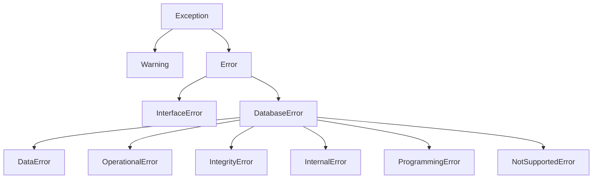

# API 참조 (한국어)

> 🌐 [API_REFERENCE.md](https://github.com/cubrid-lab/pycubrid/blob/main/docs/API_REFERENCE.md)의 번역입니다. 영어 원문이 표준이며, 페이지 번역은 경고 수준의 동기화 규칙을 따릅니다.

CUBRID용 순수 Python DB-API 2.0 드라이버 pycubrid의 완전한 API 문서.

---

## 목차

- [모듈 수준 속성](#모듈-수준-속성)
- [모듈 수준 생성자](#모듈-수준-생성자)
  - [`pycubrid.connect()`](#pycubridconnect)
  - [`decode_collections`](#decode_collections)
  - [`json_deserializer`](#json-컬럼)
  - [`charset`](#charset)
- [비동기 모듈 생성자](#비동기-모듈-생성자)
  - [`pycubrid.aio.connect()`](#pycubridaioconnect)
- [명시적 네이티브 호환 기능](#명시적-네이티브-호환-기능)
- [Connection 클래스](#connection-클래스)
  - [생성자](#connection-생성자)
  - [메서드](#connection-메서드)
    - [`ping()`](#pingreconnecttrue)
  - [속성](#connection-속성)
  - [컨텍스트 매니저](#connection-컨텍스트-매니저)
- [Cursor 클래스](#cursor-클래스)
  - [생성자](#cursor-생성자)
  - [메서드](#cursor-메서드)
    - [`nextset()`](#nextset)
  - [속성](#cursor-속성)
  - [이터레이터 프로토콜](#이터레이터-프로토콜)
  - [컨텍스트 매니저](#cursor-컨텍스트-매니저)
- [AsyncConnection 클래스](#asyncconnection-클래스)
- [AsyncCursor 클래스](#asynccursor-클래스)
- [Lob 클래스](#lob-클래스)
  - [팩토리 메서드](#lob-팩토리-메서드)
  - [메서드](#lob-메서드)
  - [속성](#lob-속성)
- [TimingStats 클래스](#timingstats-클래스)
- [예외 계층](#예외-계층)
  - [Warning](#warning)
  - [Error](#error)
  - [InterfaceError](#interfaceerror)
  - [DatabaseError](#databaseerror)
  - [DataError](#dataerror)
  - [OperationalError](#operationalerror)
  - [IntegrityError](#integrityerror)
  - [InternalError](#internalerror)
  - [ProgrammingError](#programmingerror)
  - [NotSupportedError](#notsupportederror)
- [타입 객체](#타입-객체)
- [타입 생성자](#타입-생성자)
  - [타입 지정 컬렉션 파라미터](#타입-지정-컬렉션-파라미터)

---

## 모듈 수준 속성

PEP 249가 요구하는 속성들이 모듈 수준에 정의되어 있습니다.

| 속성          | 값        | 설명 |
|----------------|-----------|------|
| `apilevel`     | `"2.0"`   | DB-API 사양 버전 |
| `threadsafety` | `1`       | 스레드는 모듈을 공유할 수 있으나 연결은 공유 불가 |
| `paramstyle`   | `"qmark"` | 물음표 파라미터 방식: `WHERE name = ?` |
| `__version__`  | `"1.8.0"` | 패키지 버전 문자열 |

```python
import pycubrid

print(pycubrid.apilevel)      # "2.0"
print(pycubrid.threadsafety)  # 1
print(pycubrid.paramstyle)    # "qmark"
print(pycubrid.__version__)   # "1.8.0"
```

---

## 모듈 수준 생성자

### `pycubrid.connect()`

```python
def connect(
    host: str = "localhost",
    port: int = 33000,
    database: str = "",
    user: str = "dba",
    password: str = "",
    decode_collections: bool = False,
    json_deserializer: Any = None,
    ssl: bool | ssl_module.SSLContext | None = None,
    charset: str = "utf-8",
    **kwargs: Any,
) -> Connection
```

새 데이터베이스 연결을 만듭니다.

**파라미터:**

| 파라미터 | 타입 | 기본값 | 설명 |
|---|---|---|---|
| `host` | `str` | `"localhost"` | CUBRID 서버 호스트명 또는 IP 주소 |
| `port` | `int` | `33000` | CUBRID 브로커 포트 |
| `database` | `str` | `""` | 데이터베이스 이름 |
| `user` | `str` | `"dba"` | 데이터베이스 사용자 |
| `password` | `str` | `""` | 데이터베이스 비밀번호 |
| `decode_collections` | `bool` | `False` | SET/MULTISET/SEQUENCE 컬럼을 Python 컬렉션으로 디코딩 |
| `json_deserializer` | `Any` | `None` | fetch 시 JSON 컬럼을 디코딩하는 콜러블. 미설정 시 JSON은 `str`로 반환 |
| `charset` | `str` | `"utf-8"` | SQL 텍스트, 자격 증명, 문자 값, 이름, 오류 텍스트의 코덱. [`charset`](#charset) 참고 |
| `ssl` | `bool \| ssl_module.SSLContext \| None` | `None` | 동기·비동기 브로커 연결의 옵트인 TLS. `True`면 TLS 1.2 최소의 기본 검증 컨텍스트 사용. 연결은 CUBRID의 STARTTLS 방식 업그레이드를 사용 — 평문 `CUBRS` 핸드셰이크 후 `OPEN_DATABASE` 전에 TLS 업그레이드. [연결 가이드](CONNECTION.md#ssltls) 참고. |
| `**kwargs` | `Any` | — | `connect_timeout`, `read_timeout`, `fetch_size`, `enable_timing`, `no_backslash_escapes`, `autocommit` 등 추가 파라미터 |

#### `decode_collections`

`False`(기본값)이면 컬렉션 컬럼이 하위 호환을 위해 raw CAS 와이어 `bytes`로 반환됩니다. `True`이면 pycubrid가 지원되는 `SET`, `MULTISET`, `SEQUENCE` 페이로드를 Python 컨테이너로 디코딩합니다.

#### JSON 컬럼

`json_deserializer`가 fetch 시 JSON 컬럼 디코딩을 제어합니다:

| 설정 | 결과 |
|---|---|
| `None` (기본) | JSON 컬럼을 `str`로 반환 |
| `callable` | raw JSON 문자열을 콜러블에 전달하고 그 결과 반환 |

#### `charset`

`charset`(기본값 `"utf-8"`)은 SQL 텍스트(렌더링된 파라미터 포함), 배치·스키마 정보
인자, `OPEN_DATABASE` 자격 증명, 문자 값(`CHAR`, `VARCHAR`, `STRING`, `NCHAR`,
`NCHAR VARYING`, `ENUM`, 컬렉션 요소), 컬럼·테이블 이름, 기본값, 서버 오류 텍스트에
사용하는 Python 코덱입니다. 데이터베이스 문자셋으로 설정하세요. 예를 들어
`ko_KR.euckr`로 만든 데이터베이스에는 `charset="euckr"`를 사용합니다(#86).

- Python 코덱 이름, CUBRID 이름 `utf8`, `euckr`, `iso88591`, 그리고 `"ko_KR.euckr"` 같은
  CUBRID 로케일(점 뒤 부분 사용)을 받으며 Python 코덱 이름(`"euc_kr"`)으로 정규화합니다.
  `None`은 기본값을 뜻합니다. 소켓 작업 전에 검증합니다: 문자열이 아니면
  `TypeError`, 알 수 없는 코덱·CUBRID `binary`·ASCII 투명하지 않은 코덱(UTF-16/32,
  UTF-7, Shift_JIS, Big5, GBK, GB18030, CP949, ISO-2022 등)은 `ValueError`, 코덱으로
  인코딩할 수 없는 자격 증명은 `DataError`입니다.
- 인코딩할 수 없는 텍스트는 모든 경로(일반·`compat.native` 커서, `get_schema_info()`)에서
  해당 요청의 어떤 바이트도 보내기 전에 `DataError`를 발생시키며 세션은 계속 사용할 수
  있습니다. `euc_kr`에서는 KS X 1001 밖의 한글 음절(예: 똠, 뷁)도 인코딩할 수 없는 것으로
  취급합니다(Python은 이를 8바이트 조합 시퀀스로 인코딩함).
- 디코딩할 수 없는 바이트는 코덱 이름을 담은 `DataError`를 발생시킵니다. 일반 커서는
  세션을 유지합니다. `get_schema_info()`는 해석할 수 없는 FC9 응답을 받으면 연결을
  폐기하고, 명시적 prepared API(`pycubrid.compat.native`)는 세션을 폐기하고
  `OperationalError`를 발생시킵니다. 오류 텍스트와 LOB 파일 로케이터는
  `errors="replace"`로 디코딩합니다.
- 가져온 `JSON` 값은 UTF-8이지만 JSON 파라미터는 SQL 텍스트이므로 연결 코덱으로
  인코딩됩니다(`euckr`에서 JSON 안의 이모지는 삽입 시 `DataError`). `NUMERIC`, 타임존 이름,
  버전 문자열, LOB 내용은 영향을 받지 않으며(`CLOB` 바이트는 컬럼 문자셋),
  `pycubrid.Binary(str)`는 항상 UTF-8로 인코딩합니다.
- 브로커는 변환하지 않으므로 EUC-KR 데이터베이스의 `CHARSET utf8` 컬럼은
  `charset="euckr"`에서 `DataError`를 발생시킵니다. SQL에서
  `CAST(col AS VARCHAR(n) CHARSET euckr)`로 변환하세요.

전체 계약은 [문자 인코딩](CONNECTION.md#문자-인코딩)을 참고하세요.

**반환:** 새 `Connection` 인스턴스.

**발생:** 연결을 수립할 수 없으면 `OperationalError`.

```python
import pycubrid

# 최소 연결
conn = pycubrid.connect(database="testdb")

# 타임아웃 포함 전체 연결
conn = pycubrid.connect(
    host="192.168.1.100",
    port=33000,
    database="production",
    user="app_user",
    password="secret",
    connect_timeout=5.0,
)
```

---

<a id="명시적-네이티브-호환-기능"></a>

## 명시적 네이티브 호환 기능

옵트인 `pycubrid.compat.native`는 순수 Python 동기 전송 위에 INT32,
문자열, SQL NULL과 [SET/MULTISET/SEQUENCE 컬렉션 값](#컬렉션-바인딩-set-imports-bind_set)만
지원하는 **동기 prepared 커서**를 제공합니다. 문자열은 연결
문자셋을 사용합니다.
기존 `pycubrid.connect()`와 `pycubrid.aio`의 `execute()`는 그대로 FC41을
사용합니다. `pycubrid.compat.cubriddb` 래퍼는 아직 연결 생성·종료만
지원하며 래퍼 커서, DB-API 전역 값, 스레드 공유 보장 또는 네이티브 C
확장과의 완전한 동등성은 제공하지 않습니다.

`native.connect(url, user="public", passwd="", *, charset="utf-8")`는 `native.connection`을
반환합니다. 래퍼의 `cubriddb.Connect/connect/connection(*args, **kwargs)`는
`cubriddb.Connection(dsn="", user="public", password="", charset="utf8")`을
반환합니다. 래퍼의 `.connection`은 단일 전송을 소유하는 바로 그 네이티브
형태의 객체입니다. 팩터리의 위치 인자 최대 세 개는 대응하는
dsn/user/password 키워드를 덮어씁니다. 두 표면은 서버에 적용되는
autocommit이 켜진 상태로 시작하며 기존 드라이버의 dba/수동 커밋
기본값은 바꾸지 않습니다.

마지막 콜론이 포함된 `CUBRID:host:port:database:user:password:` 형식을
사용합니다. DSN 안의 계정보다 Python 인자가 우선하며 생략 시에도
`public`/빈 비밀번호 기본값이 사용됩니다. 래퍼의 `charset`(기본값 `"utf8"`)은
드라이버의 [`charset`](#charset) 옵션으로 전달되므로 `"euckr"` 같은 CUBRID 이름을
쓸 수 있고, 잘못된 코덱은 연결 전에 실패합니다. 기본 CUBRID 백엔드만 허용하며,
다른 백엔드, HA/TLS URL 옵션과 초과 인자는 연결 전에 거부하며 오류에 계정 정보가 담긴 DSN
원문을 노출하지 않습니다.

네이티브 연결은 `cursor()`, `set()`, `commit()`, `rollback()`, `close()`를 제공합니다.
커서는 `prepare(sql)`, 1부터 시작하는 `bind_param(index, value,
bind_type=0)`, `bind_set(index, s)`, `execute(option=0, max_col_size=0) -> int`, 튜플만 반환하는
`fetch_row(how=0)`, `close()`를 지원합니다. 기본값이 아닌 플래그와 다른
Python 값 형식은 실행 전 거부합니다. 브로커가 현재 세션의 statement
pooling을 알리지 않거나 비활성화한 경우 FC2 전에 거부합니다. 핸들은
물리 CAS 세션에 묶이며 재접속 뒤 자동 재실행하지 않습니다. `commit()`은
HOLDABLE SELECT 결과를 유지하고 `rollback()`은 버퍼에 든 행까지
무효화합니다. 연결은 기본적으로 autocommit이 켜져 있으며 효과적인
`set_autocommit()`은 별도 #467 작업입니다. 브로커가 반환한 prepared
오류는 DB-API 예외 종류·코드·errno·SQLSTATE를 유지하지만 SQL이나
값이 포함될 수 있는 오류 문구는 가립니다. 고정된 공식 네이티브 확장은
`bind_param(None)`에서 `SystemError`를 내지만 이 제한된 구현은 SQL NULL을
명시적으로 바인딩합니다. 이는 네이티브 NULL 동등성 주장이 아닌 안전한
차이입니다. 이는 범용 DB-API 커서나
비동기 prepared API가 아닙니다. 자세한 범위는
[typed CAS 설계](../PREPARED_BINDING_DESIGN.md)와
[호환성 가이드](../UPSTREAM_COMPATIBILITY.md#selected-additive-contract-438)를
참고하세요.

### 컬렉션 바인딩 (`set`, `imports`, `bind_set`)

#440부터 네이티브 기능은 공식 이름으로 SET, MULTISET, SEQUENCE 파라미터 값을
바인딩합니다. `conn.set()`(또는 `native.set(conn)`)은 빈 `native.set`을 반환하고,
`s.imports(data, type, /, *, kind=SET)`가 값을 정하며, `cur.bind_set(index, s)`가
그 값을 1부터 시작하는 파라미터에 바인딩합니다. `execute()` 전에는 아무것도 보내지
않으며 set은 서버 자원을 갖지 않습니다.

- `data`는 `tuple`이어야 합니다(그 밖의 값은 공식 드라이버처럼 `InterfaceError`).
  원소는 `str`, NULL 원소를 뜻하는 `None`, 또는 `type`이 INT일 때 부호 있는 64비트
  범위의 `int`입니다(범위 밖은 `DataError`). `int`와 숫자 문자열 원소는 모두
  텍스트로 보내므로 섞어 쓸 수 있습니다.
  다른 원소 타입(`bool`, `float`, `bytes`, 중첩 컨테이너), NUL이 든 문자열, 인코딩할
  수 없는 문자열은 `ProgrammingError` 또는 `DataError`를 내고, set은 이전 값을
  유지합니다. `str` 하위 클래스는 먼저 일반 텍스트로 복사합니다.
- `type`은 CHAR(`1`), STRING/VARCHAR(`2`), NUMERIC(`7`), INT(`8`), DATE(`13`) 같은
  CCI 원소 타입 코드입니다. 예를 들어 `pycubrid.constants`의
  `CUBRIDDataType.NUMERIC`을 씁니다. 공식 드라이버처럼 어떤 코드든 받으며 import의
  표시일 뿐입니다. 공식 드라이버가 비트 문자열로 변환하는 BIT(`5`)와 VARBIT(`6`)은
  `NotSupportedError`를, `int`가 아닌 코드는 `InterfaceError`를 냅니다.
- 공식 드라이버처럼 모든 원소는 `type`과 관계없이 STRING(`2`) 원소로 보내며, 서버가
  컬럼의 원소 타입으로 변환합니다. `int` 원소는 10진 텍스트로 보내므로
  `imports((1, 2), INT)`는 공식 `imports(('1', '2'), INT)`와 같은 바이트를 보냅니다.
  컬럼이 담을 수 없는 값은 `execute()` 때 서버에서 실패하며 prepared 핸들은 계속
  쓸 수 있습니다. 원소가 문자열이므로 원소 타입이 없는 `SET` 컬럼에는 문자열로
  저장됩니다.
- `kind`는 SET(`16`, 기본값), MULTISET(`17`), SEQUENCE(`18`)입니다. 기본값은 공식
  바이트를 그대로 보내므로 MULTISET이나 SEQUENCE 컬럼에도 SET 의미가 적용되어
  중복이 사라지고 순서가 유지되지 않습니다. 중복을 유지하려면 `kind=MULTISET`,
  순서와 중복을 유지하려면 `kind=SEQUENCE`를 넘깁니다. CUBRID 10.2와 11.4
  브로커는 MULTISET 바인드 종류를 거부하므로(오류 -454) `kind=MULTISET`은
  SEQUENCE로 보내며, 서버는 이를 MULTISET 컬럼에 중복과 함께 저장합니다.
- `imports()`는 값을 교체합니다. `bind_set()`은 그 시점의 값을 바인딩하므로 이후의
  `imports()`는 앞선 바인딩을 바꾸지 않습니다. 한 번도 import하지 않은 set은
  공식 드라이버처럼 SQL NULL을 바인딩하며, `bind_param(index, None)`도 SQL NULL을
  바인딩합니다.
- `bind_set()`은 `native.set`이 아닌 값에 `InterfaceError`를, 잘못된 인덱스나 다른
  문자셋으로 import한 set에 `ProgrammingError`를 냅니다. 이전 세션·닫힌 커서
  규칙은 `bind_param()`과 같습니다.

공식 드라이버와 의도적으로 다른 점은 각각 라이브 차등 비교 주장
(`tests/fixtures/official_differential_claims.json`의 `bind-*`)으로 고정되어
있습니다. `None`이 NULL 원소이고 텍스트 `'NULL'`은 문자열로 남습니다(공식은
`'NULL'`을 NULL 원소로 바꿈). 빈 문자열과 Python `int` 원소를 허용합니다(공식은
`InterfaceError`). NUL이 든 원소는 `ProgrammingError`를 냅니다(공식은 조용히
잘라냄). `kind`는 pycubrid 확장입니다(공식은 항상 SET으로 바인딩). 오류 클래스는
#439 prepared 커서를 따릅니다. `float`/`bytes` 원소와 잘못된 `bind_set` 인덱스는
`ProgrammingError`(공식 `InterfaceError`), 연결이 아닌 값을 받은 `native.set()`은
`InterfaceError`(공식 `TypeError`), 서버 오류 -494는 드라이버 전체 매핑에 따라
`ProgrammingError`(공식 `IntegrityError`)입니다.

공식 모듈과 마찬가지로 `from pycubrid.compat.native import *`는 `set` 이름을
`native.set`에 바인딩하므로 그 네임스페이스에서 내장 `set`을 가립니다.
래퍼의 `execute(query, args, set_type)`와 `executemany()` 컬렉션 형태는 제공하지
않으며, 일반 `pycubrid` 커서는 계속 타입 지정 `pycubrid.types.Set`/`Multiset`/
`Sequence` 리터럴 파라미터(#567)를 사용합니다.

```python
from pycubrid.compat import native
from pycubrid.constants import CUBRIDDataType

conn = native.connect("CUBRID:localhost:33000:testdb:::", "dba", "")
try:
    cur = conn.cursor()
    try:
        cur.prepare("INSERT INTO t (tags, scores) VALUES (?, ?)")
        tags = conn.set()
        tags.imports(("a", "b"), CUBRIDDataType.STRING)  # SET(VARCHAR)
        scores = conn.set()
        scores.imports((3, 1, 3), CUBRIDDataType.INT, kind=CUBRIDDataType.MULTISET)
        cur.bind_set(1, tags)
        cur.bind_set(2, scores)
        cur.execute()
    finally:
        cur.close()
finally:
    conn.close()
```

---

## 비동기 모듈 생성자

### `pycubrid.aio.connect()`

```python
async def connect(
    host: str = "localhost",
    port: int = 33000,
    database: str = "",
    user: str = "dba",
    password: str = "",
    decode_collections: bool = False,
    json_deserializer: Any = None,
    ssl: bool | ssl_module.SSLContext | None = None,
    charset: str = "utf-8",
    **kwargs: Any,
) -> AsyncConnection
```

비동기 연결을 만들고 엽니다.

- 연결된 `AsyncConnection`을 반환합니다.
- `pycubrid.connect()`와 동일한 컬렉션/JSON 디코딩 kwargs와 `charset` 옵션을 받습니다.
- `autocommit=True`를 지원하며, 연결 수립 후 자동 적용됩니다. `AsyncConnection` 자체도 이제 `autocommit`을 (키워드 전용 생성자 인자로) 직접 받으므로, 이 팩토리를 거치지 않고 생성해도 플래그가 조용히 사라지지 않습니다.
- 동기 API와 유사한 비동기 서피스를 제공합니다 — `await conn.ping(reconnect=...)` 포함. `create_lob()`은 동기 전용으로 유지되며, 오토커밋 변경은 속성 세터 대신 `await conn.set_autocommit(...)`으로 합니다.
- `pycubrid.connect()`와 동일한 `ssl` 파라미터를 받습니다: `True`, `False`/`None`, 또는 커스텀 `SSLContext`. `True`면 기본 검증 컨텍스트가 TLS 1.2 최소를 강제합니다. 비동기 TLS는 CUBRID의 STARTTLS 방식 업그레이드를 사용 — `CUBRS` 핸드셰이크를 평문으로 보낸 뒤, `OPEN_DATABASE` 전에 `asyncio.AbstractEventLoop.start_tls()`(`ssl_handshake_timeout`으로 제한)로 전송을 업그레이드합니다. 전체 내용과 Python 3.10 `start_tls()` 인증서 검증 주의점([#156](https://github.com/cubrid-lab/pycubrid/issues/156))은 [연결 가이드](CONNECTION.md#ssltls)를 참고하세요.

```python
import asyncio
import pycubrid.aio

async def main() -> None:
    conn = await pycubrid.aio.connect(database="testdb")
    cur = conn.cursor()
    await cur.execute("SELECT 1")
    print(await cur.fetchone())
    await cur.close()
    await conn.close()

asyncio.run(main())
```

---

## Connection 클래스

`pycubrid.connection.Connection`

CAS 브로커 프로토콜을 통한 CUBRID 데이터베이스 연결 하나를 나타냅니다.

### Connection 생성자

```python
class Connection:
    def __init__(
        self,
        host: str,
        port: int,
        database: str,
        user: str,
        password: str,
        autocommit: bool = False,
        **kwargs: Any,
    ) -> None
```

> **참고:** `Connection`을 직접 생성하지 마세요. `pycubrid.connect()`를 사용하세요.

**선택된 `**kwargs`:**

| 이름 | 타입 | 기본값 | 설명 |
|---|---|---|---|
| `enable_timing` | `bool \| None` | `None` | `connect`, `execute`, `fetch`, `close` 연산에 대한 드라이버 수준 타이밍 계측 옵트인. `None`이면 `PYCUBRID_ENABLE_TIMING` 환경 변수로 폴백(참값: `1`, `true`, `yes`, 대소문자 무시). 비활성 시 타이밍 모듈을 임포트하지 않고 `connection.timing_stats`는 `None`(오버헤드 0). [타이밍·프로파일링 훅](PERFORMANCE.md#타이밍--프로파일링-훅) 참고. |
| `ssl` | `bool \| ssl.SSLContext \| None` | `None` | 동기·비동기 연결이 공유하는 TLS 설정. `True`면 `minimum_version = TLSv1_2`인 기본 검증 컨텍스트 사용. [연결 가이드](CONNECTION.md) 참고. |
| `read_timeout` | `float \| None` | `None` | 소켓 읽기 타임아웃(초). |
| `fetch_size` | `int` | `100` | 서버 측 fetch 배치 크기. |
| `json_deserializer` | `Callable[[str], Any] \| None` | `None` | 옵트인 JSON 컬럼 디코더. |
| `charset` | `str` | `"utf-8"` | 연결 코덱. [`charset`](#charset) 참고. 재연결 후에도 유지. |
| `decode_collections` | `bool` | `False` | SET/MULTISET/SEQUENCE 컬럼을 Python 컬렉션으로 디코딩. |

### Connection 메서드

#### `connect()`

```python
def connect(self) -> None
```

브로커 핸드셰이크와 함께 TCP CAS 세션을 수립하고 데이터베이스를 엽니다. 생성자가 자동 호출합니다. 이미 연결된 인스턴스에서 호출하면 no-op입니다.

**발생:** 네트워크 실패 시 `OperationalError`.

---

#### `close()`

```python
def close(self) -> None
```

연결과 추적 중인 모든 커서를 닫습니다. 서버로 `CloseDatabasePacket`을 보냅니다. 이미 닫힌 연결에서 호출하면 no-op입니다. `close()` 이후 다른 메서드 호출은 `InterfaceError`를 발생시킵니다.

```python
conn = pycubrid.connect(database="testdb")
# ... 작업 ...
conn.close()  # 연결과 모든 커서가 닫힘
```

---

#### `commit()`

```python
def commit(self) -> None
```

현재 트랜잭션을 커밋합니다. 닫히지 않은 커서가 가진 쿼리 핸들에 `CLOSE_REQ`를
보낸 뒤 서버로 `CommitPacket`을 보냅니다(#485). 이미 받은 행은 계속 읽을 수
있습니다. autocommit 모드에서는 `END_TRAN`을 보내지 않으므로 커서를 닫아 서버
핸들을 해제하세요. statement pooling 브로커에서는 이 해제가 별도의 `CLOSE_REQ` 없이
다음 문장에 실려 가며, `close()` 없이 수거된 커서도 같은 방식으로 해제됩니다
([지연 닫기](PROTOCOL.md), #488). 이전 트랜잭션 밖 응답 뒤 CAS가 세션을 재활용했다면 요청 전에
[트랜잭션 경계에서 CAS가 재활용되는 경우](CONNECTION.md)에
설명한 검증된 재접속이 먼저 수행됩니다.

**발생:** 연결이 닫혔으면 `InterfaceError`.

---

#### `rollback()`

```python
def rollback(self) -> None
```

현재 트랜잭션을 롤백합니다. 닫히지 않은 커서가 가진 쿼리 핸들에 `CLOSE_REQ`를
보낸 뒤 서버로 `RollbackPacket`을 보냅니다(#485).

**발생:** 연결이 닫혔으면 `InterfaceError`.

---

#### `cursor()`

```python
def cursor(self) -> Cursor
```

이 연결에 바인딩된 새 `Cursor`를 만들어 반환합니다. 커서는 연결이 추적하며 연결이 닫힐 때 함께 닫힙니다.

**반환:** 새 `Cursor` 인스턴스.

**발생:** 연결이 닫혔으면 `InterfaceError`.

```python
conn = pycubrid.connect(database="testdb")
cur = conn.cursor()
cur.execute("SELECT 1 + 1")
print(cur.fetchone())  # (2,)
cur.close()
```

---

#### `get_server_version()`

```python
def get_server_version(self) -> str
```

서버 엔진 버전 문자열을 반환합니다 (예: `"11.2.0.0378"`).

```python
conn = pycubrid.connect(database="testdb")
print(conn.get_server_version())  # "11.2.0.0378"
```

---

#### `get_last_insert_id()`

```python
def get_last_insert_id(self) -> str | None
```

가장 최근 INSERT 이후 브로커가 보고한 식별자를 캐시에서 문자열로 반환하며,
값이 없으면 `None`을 반환합니다. 별도 네트워크 요청은 없습니다. 해당 커서의
`lastrowid`는 독립적인 `int | None` 스냅샷입니다. 다른 커서의 INSERT가 연결 캐시를
갱신해도 이전 커서의 스냅샷은 바뀌지 않습니다.

commit/rollback 및 INSERT가 아닌 문장은 관측한 값을 유지합니다. 새 INSERT 시도
(실패 포함), 비어 있지 않은 `executemany_batch()`, 물리 연결 폐기/재접속 시 캐시가
초기화됩니다. 식별자 조회 실패, 빈 응답 또는 잘못된 응답이면 `None`이 유지됩니다.
빈 배치는 기존 값을 유지합니다.

정상적인 트랜잭션 종료 후에는 같은 물리 연결과 캐시가 유지됩니다. 실제 연결
실패 뒤 명시적인 `ping(reconnect=True)` 복구나 트랜잭션 밖 `CHECK_CAS` 실패 후의
자동 재접속(#485)이 성공하면 연결 캐시는 초기화되지만(autocommit INSERT 직후
CAS가 재활용되면 INSERT는 커밋되지만 `lastrowid`는 `None`이고 WARNING 로그가
남습니다. 자동 재접속이 실패하면 연결은 닫히지 않고 끊긴 상태가 되며
`ping(reconnect=True)`로 다시 연결합니다),
이전 커서의 `lastrowid` 스냅샷은 물리 연결 변경 후에도 유지됩니다.

이 값은 서버 응답이 INSERT로 분류한 커서 작업의 스냅샷이며, 이전의 실시간 브로커
상태 조회를 대체합니다. `CALL`, 저장 프로시저 내부 INSERT 또는 커서 밖의 SQL은
캐시를 갱신하지 않습니다. 프로시저가 삽입한 행의 ID는 프로시저에서 명시적으로
반환하거나 해당 프로시저의 서버 측 규약에 따라 직접 조회하세요.

AUTO_INCREMENT 컬럼이 없는 테이블의 INSERT에도 브로커가 이전 식별자를 보고할 수
있으므로 반환값은 현재 문장이 식별자를 생성했다는 증거가 아닙니다. rollback 이후
값이 유지되는 것도 해당 행이 존재한다는 뜻은 아닙니다.

```python
cur.execute("INSERT INTO users (name) VALUES ('alice')")
conn.commit()
print(conn.get_last_insert_id())  # "1"
```

마이그레이션: 이전의 값 없음 결과 `""`를 검사하던 `value == ""`는
`value is None`으로 바꾸고, 정수 변환 전에 확인합니다. 정상 값의 문자열 타입과
커서의 `int | None` 타입은 유지됩니다. 비동기 메서드에도 같은 규칙이 적용됩니다.

```python
value = conn.get_last_insert_id()
new_id = int(value) if value is not None else None
```

빈 배치는 커서의 `lastrowid`를 `None`으로 초기화하지만 연결 캐시는 유지합니다.
비어 있지 않은 배치를 시작하기 전에 기존 쿼리 종료가 실패하면 두 식별자 값은
그대로 유지되며 예외가 전달됩니다.

---

#### `ping(reconnect=True)`

```python
def ping(self, reconnect: bool = True) -> bool
```

정상 세션에서는 SQL 없이 가벼운 `CHECK_CAS` 헬스 체크를 수행합니다.
자동 모드의 재연결 중에는 애플리케이션 SQL을 받기 전에 읽기 전용
이스케이프 모드 탐색 SELECT를 실행할 수 있습니다.

- CAS 연결이 살아 있으면 `True`를 반환합니다. `CAS_INFO[0]=0`은 연결 해제가
  아니라 OUT_TRAN을 뜻하며 이 값만으로 재접속하지 않습니다. OUT_TRAN 응답 뒤의
  일반 요청 앞에는 자동 `CHECK_CAS`가 붙고, 실패할 때만 재접속합니다(#485).
  정상적인 `ping()`도 이 검사로 인정됩니다.
- `reconnect=False`이면 열린 소켓을 검사하되 재접속하지 않으며, 연결이 끊겼거나
  검사에 실패하면 `False`를 반환합니다.
- `reconnect=True`이면 기존 소켓을 먼저 검사하고, 연결이 끊겼거나 검사 도중
  전송/프로토콜 오류가 발생했거나 `CHECK_CAS`가 음수 코드로 CAS–DB 링크 장애를
  보고하면 재접속을 한 번 시도합니다. `reconnect=False`는 음수 응답을
  `False`로 보고하고 재접속하지 않으며, 비동기 드라이버처럼 그 손상된 세션을
  닫습니다(이후 호출은 `InterfaceError`). 복구 후에는 명시적으로 설정한
  autocommit만 복원합니다. 중단된 SQL은 자동 재실행하지 않으므로 재시도
  안전성은 호출자가 판단해야 합니다.
  자동 `no_backslash_escapes` 모드는 새 물리 세션에서 사용 전에 다시 감지하며,
  명시적 `True`/`False`는 유지됩니다. 정상적인 동일 세션 ping은 감지하지
  않습니다. 감지 실패 시 대체 세션을 폐기하고 `False`를 반환하며, 모드를
  추측하거나 SQL을 재실행하지 않습니다.

```python
if not conn.ping():
    raise RuntimeError("database connection is unavailable")
```

---

#### `create_lob(lob_type)`

```python
def create_lob(self, lob_type: int) -> Lob
```

서버에 새 LOB(Large Object)를 만듭니다.

**파라미터:**

| 파라미터   | 타입  | 설명 |
|------------|-------|------|
| `lob_type` | `int` | LOB 타입 코드: BLOB은 `23`, CLOB은 `24` |

**반환:** 새 `Lob` 인스턴스.

```python
from pycubrid.constants import CUBRIDDataType

lob = conn.create_lob(CUBRIDDataType.CLOB)  # 24
lob.write(b"Hello, CUBRID!")
```

> **중요:** `Lob` 객체는 쿼리 파라미터로 전달할 수 없습니다. CLOB/BLOB 컬럼에는 문자열/바이트를 직접 삽입하세요. 자세한 내용은 [TYPES.md](TYPES.md) 참고.

---

#### `get_schema_info(schema_type, table_name="", pattern_match_flag=1, *, arg2=None)`

```python
def get_schema_info(
    self,
    schema_type: int,
    table_name: str = "",
    pattern_match_flag: int = 1,
    *,
    arg2: str | None = None,
) -> GetSchemaPacket
```

현재 연결·CAS 세션이 소유하는 스키마 결과를 생성합니다.
`fetch_schema_info()`로 소비하거나 `close_schema_info()`로 명시적으로 폐기하세요.

**파라미터:**

| 파라미터            | 타입  | 기본값 | 설명 |
|----------------------|-------|---------|------|
| `schema_type`        | `int` | —       | 스키마 타입 코드 (`CCISchemaType` 참고) |
| `table_name`         | `str` | `""`    | 테이블 이름 필터 |
| `pattern_match_flag` | `int` | `1`     | 패턴 매치 플래그 |
| `arg2` | `str \| None` | `None` | 키워드 전용 두 번째 이름/패턴 (예: ATTRIBUTE 필터) |

**반환:** `query_handle`, `tuple_count`, `columns`를 가진 원래 `GetSchemaPacket`.
축약 컬럼에는 `column_type`, `scale`, `precision`, `name`만 있으며 FC9에는
SELECT의 NULL 허용·기본값·제약 메타데이터가 없습니다. NULL(`None`)과 빈 문자열은
서로 다른 와이어 인자입니다. 모든 ATTRIBUTE 이름을 조회하려면 플래그 `2`와
`arg2="%"`를 사용하세요. NULL은 전체 속성 조회의 약식 표현이 아닙니다.

```python
from pycubrid.constants import CCISchemaType

packet = conn.get_schema_info(CCISchemaType.CLASS, "my_table", 0)
try:
    rows = conn.fetch_schema_info(packet)
finally:
    conn.close_schema_info(packet)  # 정상 소비 후에도 안전합니다.
print(rows)
```

**사용 가능한 `CCISchemaType` 값:**

| 코드 | 이름              | 설명 |
|------|-------------------|------|
| 1    | `CLASS`           | 테이블과 뷰 |
| 2    | `VCLASS`          | 뷰 |
| 4    | `ATTRIBUTE`       | 컬럼 |
| 11   | `CONSTRAINT`      | 인덱스 계열 항목 |
| 16   | `PRIMARY_KEY`     | 기본 키 |
| 17   | `IMPORTED_KEYS`   | 외래 키 (가져온) |
| 18   | `EXPORTED_KEYS`   | 외래 키 (내보낸) |

소유한 객체를 사용하는 실제 서버 매트릭스(#457)는 CUBRID 10.2.18과 11.4.6에서
이 일곱 타입을 sync·async 경로로 검증합니다. 정확한 이름/패턴 필터, 빈 결과,
복합 키, 여러 FETCH에 걸친 ATTRIBUTE 행을 포함합니다. 다른 `CCISchemaType`
값이나 네이티브 드라이버와의 동등성을 이 매트릭스가 인증하지는 않습니다.

행은 `packet.columns`의 이름을 기준으로 해석하세요. CLASS에는 일반 테이블
(`TYPE=2`)뿐 아니라 뷰(`TYPE=1`)도 포함될 수 있습니다. PRIMARY_KEY 행은 속성 이름
순서로 올 수 있으므로 복합 키의 선언 순서는 `KEY_SEQ`를 사용하세요. CONSTRAINT는
인덱스 계열을 반환하며 모든 기본/외래 키를 포함하지 않습니다. 해당 관계에는 전용
키 타입을 사용하세요. 페이지/키 필드도 신뢰할 수 있는 인덱스 통계가 아닙니다.
owner 접두사가 있는 이름과 브로커 인코딩된 ATTRIBUTE DOMAIN 정수는 그대로
유지됩니다. 이름이 항상 접두사 없거나 DOMAIN이 스칼라 타입 상수와 같다고
가정하지 마세요.

#### `fetch_schema_info(packet)`와 `close_schema_info(packet)`

`fetch_schema_info(packet) -> list[tuple[Any, ...]]`는 광고된 행 전체를 읽고
원래 핸들을 닫습니다. 0행도 닫으며, 조기 EOF·개수 불일치·정리 실패 시 부분
목록을 성공으로 반환하지 않습니다. `close_schema_info(packet) -> None`는 명시적
폐기이며 같은 소유자의 종료된 패킷은 반복해서 닫아도 no-op입니다. 다른 연결의
패킷·소유되지 않은 패킷·종료된 결과의 fetch는 I/O 전에 `InterfaceError`입니다.
공개 패킷 필드를 변경해도 실제 추적 중인 핸들·메타데이터는 바뀌지 않습니다.

commit/rollback은 활성 스키마 핸들을 먼저 닫고 소유권을 종료합니다. 유효한
autocommit이 적용되는 커서 문장도 SQL을 보내기 전에 같은 정리를 수행합니다.
연결의 autocommit이 꺼져 있어도 `executemany_batch(..., auto_commit=True)`에
같은 규칙이 적용됩니다. 연결의 autocommit이 켜져 있으면
`get_server_version()`도 자동 커밋 버전 조회 전에 소유한 스키마 핸들을 닫습니다.
종료된 패킷의 fetch는 추가 RPC 전에 로컬에서
`InterfaceError`를 발생시킵니다. 물리 연결
폐기/재접속 및 연결 종료도 소유권을 종료하며 다른 CAS 세션에서 재실행하지
않습니다. FETCH/CLOSE는 자동 재접속·암묵적 커밋을 하지 않습니다. 스키마 생성·
종료 실패는 불확실한 세션을 폐기합니다. FETCH와 정리가 모두 실패하면 원래
예외를 유지하고 정리 오류를 로그에 기록합니다. 비동기 메서드는 `await`하며
fetch/정리 동안 연결 락을 유지합니다. 스키마 I/O 도중 취소하면 세션을 폐기하고
취소를 다시 발생시키지만, 락 대기 중 취소는 다른 태스크의 세션을 폐기하지 않습니다.
비동기 스키마 FETCH 도중 `KeyboardInterrupt` 또는 `SystemExit`가 발생해도
응답이 남아 있을 수 있는 스트림에 CLOSE를 보내지 않고 불확실한 세션을 폐기합니다.

---

### Connection 속성

#### `autocommit`

```python
@property
def autocommit(self) -> bool

@autocommit.setter
def autocommit(self, value: bool) -> None
```

자동 커밋 모드를 조회하거나 설정합니다. 활성화되면 각 문장이 즉시 커밋됩니다. 이 속성을 설정하면 서버에서 트랜잭션 상태를 플러시하기 위해 `SetDbParameterPacket`과 `CommitPacket`을 보냅니다. 두 요청은 하나의 CAS 세션에 적용됩니다. 그 사이 CAS가 재활용되면 대체 세션에 새 값을 먼저 복원한 뒤 그 세션으로 `COMMIT`을 보냅니다(호출당 재접속은 최대 한 번). `COMMIT`이 실패하면 연결을 닫고 이전 값을 유지하며 원인을 연결한 `OperationalError`를 발생시킵니다(#551).

```python
conn = pycubrid.connect(database="testdb")
print(conn.autocommit)  # False

conn.autocommit = True
# 이제 문장이 자동 커밋됨
```

---

#### `timing_stats`

```python
@property
def timing_stats(self) -> TimingStats | None
```

연결이 `enable_timing=True`(또는 `PYCUBRID_ENABLE_TIMING` 설정)로 열렸을 때 연결별 [`TimingStats`](#timingstats-클래스) 누산기를 반환합니다. 타이밍이 비활성화되면 `None`을 반환합니다 — 이 경우 타이밍 모듈은 임포트되지 않으며 핫 경로에 오버헤드가 없습니다.

```python
import pycubrid

conn = pycubrid.connect(database="testdb", enable_timing=True)
cur = conn.cursor()
cur.execute("SELECT 1")
cur.fetchall()

stats = conn.timing_stats
assert stats is not None
print(stats)
# TimingStats(connect=1 calls, 12.345ms total, 12.345ms avg,
#             execute=1 calls, 0.987ms total, 0.987ms avg,
#             fetch=1 calls, 0.123ms total, 0.123ms avg,
#             close=0 calls)

print(stats.execute_count, stats.execute_total_ns)  # 1 987000

stats.reset()  # 모든 카운터 초기화
```

전체 가이드는 [타이밍·프로파일링 훅](PERFORMANCE.md#타이밍--프로파일링-훅)을 참고하세요.

---

### Connection 컨텍스트 매니저

`Connection`은 컨텍스트 매니저 프로토콜(`__enter__` / `__exit__`)을 구현합니다.

- 성공적 종료 시: `commit()` 후 `close()` 호출.
- 예외 시: `rollback()` 후 `close()` 호출.

```python
with pycubrid.connect(database="testdb") as conn:
    cur = conn.cursor()
    cur.execute("INSERT INTO users (name) VALUES ('bob')")
    # 종료 시 자동 커밋

# 여기서 conn은 닫혀 있음
```

---

## Cursor 클래스

`pycubrid.cursor.Cursor`

SQL 문 실행과 결과 조회를 위한 데이터베이스 커서를 나타냅니다.

### Cursor 생성자

```python
class Cursor:
    def __init__(self, connection: Connection) -> None
```

> **참고:** `Cursor`를 직접 생성하지 마세요. `connection.cursor()`를 사용하세요.

### Cursor 메서드

#### `execute(operation, parameters)`

```python
def execute(
    self,
    operation: str,
    parameters: Sequence[Any] | None = None,
) -> Cursor
```

SQL 문을 준비하고 실행합니다.

**파라미터:**

| 파라미터     | 타입 | 설명 |
|--------------|------|------|
| `operation`  | `str` | 선택적 `?` 플레이스홀더가 있는 SQL 문 |
| `parameters` | `Sequence` 또는 `None` | 바인딩할 비문자열 위치 파라미터 값 |

**반환:** 커서 자신 (체이닝용).

이전 쿼리 핸들을 닫은 뒤 `execute()`는 파라미터를 바인딩하거나 새 문장을 보내기
전에 결과 상태를 초기화하며, 버퍼에 남은 행과 보관 중인 FETCH 페이지 오류도
버립니다. 바인딩이나 요청이 실패하면 `description`은 `None`, `rowcount`는 `-1`,
`lastrowid`는 `None`이 되고, fetch 메서드는
`InterfaceError("No result set available")`를 발생시킵니다. 이후 `execute()`가
성공하면 커서를 다시 사용할 수 있습니다. 이전 핸들을 닫는 데 실패하면
`execute()`는 버퍼에 남은 결과와 페이지 오류를 유지하지만, 연결 무효화나 재접속
처리가 핸들을 해제할 수 있습니다. 새 요청의 응답을 디코딩할 수 없더라도 그 응답이
새 쿼리 핸들을 열었다면 정리를 위해 계속 추적합니다. 이 동작은 `Cursor`와
`AsyncCursor`에 모두 적용됩니다.

**발생:**
- 커서가 닫혔으면 `InterfaceError`
- SQL 오류나 파라미터 불일치 시 `ProgrammingError`

```python
# 단순 쿼리
cur.execute("SELECT * FROM users")

# 파라미터화 쿼리 (qmark 방식)
cur.execute("SELECT * FROM users WHERE age > ?", [21])

# 파라미터와 함께 INSERT
cur.execute("INSERT INTO users (name, age) VALUES (?, ?)", ["alice", 30])
```

> **중요:** `dict` 같은 매핑은 파라미터 바인딩에 지원되지 않습니다. 매핑을 전달하면 `ProgrammingError("parameters must be a sequence")`가 발생합니다.

**지원 파라미터 타입:**

| Python 타입          | SQL 리터럴 |
|----------------------|-------------|
| `None`               | `NULL` |
| `bool`               | `1` / `0` |
| `str`                | `'escaped'` |
| `bytes`              | `X'hex'` |
| `int`, `float`       | 숫자 리터럴 |
| `Decimal`            | 숫자 리터럴 |
| `datetime.date`      | `DATE'YYYY-MM-DD'` |
| `datetime.time`      | `TIME'HH:MM:SS'` |
| `datetime.datetime`  | `DATETIME'YYYY-MM-DD HH:MM:SS.mmm'` |
| `Set` / `Multiset` / `Sequence` | `SET{...}` / `MULTISET{...}` / `SEQUENCE{...}` |

---

#### `executemany(operation, seq_of_parameters)`

```python
def executemany(
    self,
    operation: str,
    seq_of_parameters: Sequence[Sequence[Any]],
) -> Cursor
```

같은 SQL 문을 서로 다른 파라미터 세트로 반복 실행합니다. 각 원소는 비문자열 시퀀스여야 합니다. 비-SELECT 문의 경우 `rowcount`는 영향받은 행의 누적 합계로 설정됩니다.

빈 파라미터 목록으로 `executemany(operation, [])`를 호출하면 SQL을 실행하지 않고
이전 쿼리 핸들을 닫은 뒤 커서를 `description=None`, `rowcount=0`, `lastrowid=None`으로
초기화합니다. 이전 행을 가져올 수 없으며 커서 자체를 반환합니다. 활성 쿼리 핸들이
없으면 요청을 보내지 않습니다. 이전 핸들 닫기가 실패하면 예외가 전파되고 핸들을
계속 추적합니다. 비동기 커서에도 같은 계약이 적용됩니다.

```python
data = [("alice", 30), ("bob", 25), ("carol", 28)]
cur.executemany("INSERT INTO users (name, age) VALUES (?, ?)", data)
print(cur.rowcount)  # 3
```

---

#### `nextset()`

```python
def nextset(self) -> None
```

DB-API 호환 메서드. pycubrid는 이 인터페이스로 여러 서버 결과 집합을 노출하지 않으므로, `nextset()`은 커서가 열려 있는지 확인한 후 항상 `None`을 반환합니다.

```python
assert cur.nextset() is None
```

---

#### `executemany_batch(sql_list, auto_commit)`

```python
def executemany_batch(
    self,
    sql_list: list[str],
    auto_commit: bool | None = None,
) -> list[tuple[int, int]]
```

여러 개의 **서로 다른** SQL 문을 서버로 단일 배치 요청으로 실행합니다. SQL 문이 제각각일 때 `execute()`를 루프로 호출하는 것보다 효율적입니다.

**파라미터:**

| 파라미터     | 타입 | 설명 |
|---------------|------|------|
| `sql_list`    | `list[str]` | 완전한 SQL 문의 리스트 |
| `auto_commit` | `bool` 또는 `None` | 이 배치의 자동 커밋 오버라이드 (기본: 연결 설정) |

**반환:** `(statement_type, result_count)` 튜플의 리스트.

```python
results = cur.executemany_batch([
    "CREATE TABLE t1 (id INT AUTO_INCREMENT PRIMARY KEY, val VARCHAR(50))",
    "INSERT INTO t1 (val) VALUES ('hello')",
    "INSERT INTO t1 (val) VALUES ('world')",
])
# results: [(4, 0), (20, 1), (20, 1)]
# statement_type 4 = CREATE_CLASS, 20 = INSERT
```

> **참고:** `executemany_batch`는 pycubrid 확장이며 PEP 249의 일부가 아닙니다. 이전 쿼리 핸들을 닫은 뒤 배치 요청 전에 커서 결과 상태를 초기화합니다. 전송 또는 응답 파싱 오류를 포함한 배치 실패 시 `description=None`, `rowcount=-1`, `lastrowid=None`이며 이전 행을 가져올 수 없습니다. 문별 오류는 해당 데이터베이스 예외를 발생시키며 일부 성공 결과로 최종 행 수를 설정하지 않습니다. 이전 핸들 닫기가 실패하면 배치를 전송하지 않고 핸들을 계속 추적합니다. `executemany_batch`에 직접 넘긴 SQL은 호출자가 렌더링한 것이므로 세대 검사를 하지 않으며, 자동 재접속(#485) 뒤에도 그대로 새 세션으로 보냅니다. 바인딩 뒤 세션이 바뀌었을 때 거부되는 것은 `execute()`/`executemany()`가 파라미터로 렌더링한 SQL뿐입니다.

---

#### `fetchone()`

```python
def fetchone(self) -> tuple[Any, ...] | None
```

쿼리 결과 집합의 다음 행을 가져옵니다. 더 이상 행이 없으면 `None`을 반환합니다. 로컬 버퍼가 소진되면 서버에서 자동으로 더 가져옵니다 (fetch당 100행).

```python
cur.execute("SELECT name, age FROM users")
row = cur.fetchone()
if row:
    name, age = row
```

> **명시적 연결 복구에 관한 참고**: 정상적인 `CAS_INFO[0]=0` 응답은 세션을
> 교체하거나 커서를 무효화하지 않습니다. 일부 행만 버퍼에 있는 상태에서 실제
> 연결 실패 후 `ping(reconnect=True)` 복구가 성공하면 버퍼의 행은 계속 읽을 수
> 있습니다. 버퍼가 소진된 뒤 `fetchone()`/`fetchmany()`/`fetchall()`은 기존 서버
> 핸들이 유효하지 않아 `result set lost due to broker reconnect mid-fetch`
> 메시지의 `OperationalError`를 발생시킵니다. 쿼리는 자동 재실행되지 않으므로
> 명시적으로 다시 실행해야 합니다. `execute()`와 `close()`는 무효화 플래그를
> 초기화합니다.

> **트랜잭션 경계 이후 fetch:** `commit()`과 `rollback()`은 쿼리 핸들을
> 무효화하지만 이미 로컬 버퍼로 받은 행은 유지합니다. 캐시된 행은 읽을 수
> 있으며, 전체 행을 받은 결과나 소진된 결과는 정상 EOF 동작을 유지합니다.
> 미완료 결과가 무효화된 핸들로 추가 서버 FETCH를 요구하면 동기·비동기
> `fetchone()`/`fetchmany()`/`fetchall()`은 조용히 EOF를 반환하는 대신
> `InterfaceError`를 발생시킵니다. 이 경계를 넘는 `fetchmany()`·`fetchall()`은
> 일부 행 리스트를 성공 결과로 반환하지 않지만, 오류 전에 로컬 행을 이미
> 소비했을 수 있습니다. 계속하려면 새 쿼리를 명시적으로 실행하세요. SELECT의
> 투명 재실행이나 holdable 결과를 보장하지 않으며, 재연결 무효화의 별도
> `OperationalError`는 유지합니다.

> **이후 fetch 페이지의 데이터 오류 (#507):** FETCH 페이지에 pycubrid가 표현할 수
> 없는 값(연결 charset으로 유효하지 않은 텍스트 #492, 해석할 수 없는 타임존 #413,
> 0 날짜 #512)이 들어 있으면, 그 페이지에 도달한 `fetchone()`, `fetchmany()`,
> `fetchall()` 호출(또는 반복 단계)이 `DataError`를 발생시킵니다. 잘못된 값보다
> 앞선 행을 포함해 페이지 전체가 반환되지 않습니다. 그 호출이 이미 모은 행은
> 사라지지 않고, 다음 fetch 호출이 서버에 요청하지 않고 반환합니다. 따라서 오류
> 뒤의 `fetchmany()`나 `fetchall()`은 그 행들을 반환합니다(요청한 수보다 적을 수
> 있음). 그 뒤로는 `execute()` 또는 `close()` 전까지 모든 fetch가 페이지를 다시
> 요청하지 않고 같은 `DataError`를 다시 발생시키며, 실패한 페이지와 그 이후의 행은
> 반환되지 않습니다. 연결은 계속 사용할 수 있고 커서는 서버 핸들을 유지합니다.
> 동기·비동기 커서의 동작은 같습니다. 해당 값 이후를 읽으려면 SQL에서 값을
> 변환([0 날짜 또는 날짜시간 값](TROUBLESHOOTING.md#0-날짜-또는-날짜시간-값) 참고)한
> 뒤 다시 실행하세요.

---

#### `fetchmany(size)`

```python
def fetchmany(self, size: int | None = None) -> list[tuple[Any, ...]]
```

다음 `size`행을 가져옵니다. `size`가 지정되지 않으면 `cursor.arraysize`가 기본값입니다.

```python
cur.execute("SELECT * FROM users")
batch = cur.fetchmany(10)  # 최대 10행
```

---

#### `fetchall()`

```python
def fetchall(self) -> list[tuple[Any, ...]]
```

쿼리 결과의 남은 행 전체를 가져옵니다. 남은 행이 없으면 빈 리스트를 반환합니다.

```python
cur.execute("SELECT * FROM users")
all_rows = cur.fetchall()
for row in all_rows:
    print(row)
```

---

#### `callproc(procname, parameters)`

```python
def callproc(
    self,
    procname: str,
    parameters: Sequence[Any] = (),
) -> Sequence[Any]
```

저장 프로시저를 호출합니다. `CALL procname(?, ?, ...)` 문을 구성해 실행합니다.

**반환:** 원본 `parameters` 시퀀스 (PEP 249에 따라).

저장 함수의 반환값은 결과 집합의 한 행입니다. `fetchone()`으로 가져옵니다.
`execute("CALL ...")`(예: `CALL find_user('dba') ON CLASS db_user` 같은 메서드
호출 포함)와 `EVALUATE`도 같습니다. 각 값은 와이어에서 자신의 타입을 함께 전달하며
해당 타입의 컬럼 값처럼 디코딩됩니다(`INT`는 `int`, `VARCHAR`는 `str`,
`DATETIME`은 `datetime`, 객체는 `"OID:@page|slot|volume"` 문자열, SQL `NULL`은
`None`). #542 이전에는 이 값들이 원시 `bytes`로 반환되었습니다. 브로커가 이 컬럼의
타입을 알려주지 않으므로 `description`의 컬럼 타입은 `NULL`(`0`)입니다.

```python
cur.callproc("my_procedure", [1, "hello"])
cur.callproc("my_function")
(value,) = cur.fetchone()
```

---

#### `setinputsizes(sizes)`

```python
def setinputsizes(self, sizes: Any) -> None
```

DB-API no-op. 호환성을 위해 받아들입니다.

---

#### `setoutputsize(size, column)`

```python
def setoutputsize(self, size: int, column: int | None = None) -> None
```

DB-API no-op. 호환성을 위해 받아들입니다.

---

#### `close()`

```python
def close(self) -> None
```

커서를 닫고 활성 쿼리 핸들을 해제합니다. 이미 닫힌 커서에서 호출하면 no-op입니다.

---

### Cursor 속성

#### `description`

```python
@property
def description(self) -> tuple[DescriptionItem, ...] | None
```

마지막으로 실행된 문의 결과 집합 메타데이터를 반환합니다. 쿼리가 실행되지 않았거나 마지막 문이 행을 반환하지 않았으면 `None`입니다.

각 항목은 7-튜플입니다:

```python
(name, type_code, display_size, internal_size, precision, scale, null_ok)
#  str    int        None           None          int       int    bool
```

| 인덱스 | 필드            | 타입   | 설명 |
|-------|----------------|--------|------|
| 0     | `name`         | `str`  | 컬럼 이름 |
| 1     | `type_code`    | `int`  | CUBRID 데이터 타입 코드 (`CUBRIDDataType` 참고) |
| 2     | `display_size` | `None` | 사용 안 함 |
| 3     | `internal_size`| `None` | 사용 안 함 |
| 4     | `precision`    | `int`  | 컬럼 정밀도 |
| 5     | `scale`        | `int`  | 컬럼 스케일 |
| 6     | `null_ok`      | `bool` | 컬럼의 NULL 허용 여부 |

`null_ok`는 브로커가 NULL 허용을 보고하면 `True`, NOT NULL과 기본키 컬럼이면
`False`입니다. CAS는 반대 의미의 `is_non_null` 플래그를 전송하며, pycubrid는
동기·비동기 커서에서 이를 PEP 249 의미로 변환합니다. 크기 필드는 계속 `None`,
컬렉션 타입 코드는 계속 16/17/18이며, 이 교정으로 CUBRIDdb 호환 프로필을 선택하지 않습니다.

```python
cur.execute("SELECT name, age FROM users")
for col in cur.description:
    print(f"{col[0]}: type={col[1]}, precision={col[4]}, nullable={col[6]}")
```

---

#### `rowcount`

```python
@property
def rowcount(self) -> int
```

마지막 `execute()` 호출이 영향받은 행 수. SELECT 문이거나 실행된 문이 없으면 `-1`을 반환합니다.

---

#### `lastrowid`

```python
@property
def lastrowid(self) -> int | None
```

INSERT 문이 생성한 마지막 auto-increment 식별자. INSERT가 실행되지 않았거나 테이블에 auto-increment 컬럼이 없으면 `None`입니다.

```python
cur.execute("INSERT INTO users (name) VALUES ('alice')")
print(cur.lastrowid)  # 예: 1
```

---

#### `arraysize`

```python
@property
def arraysize(self) -> int

@arraysize.setter
def arraysize(self, value: int) -> None
```

`fetchmany()`의 기본 행 수. 기본값은 `1`입니다.

값은 양의 정수여야 합니다. 불리언과 실수는 허용하지 않습니다.
`AsyncCursor.arraysize`에도 같은 검증을 적용합니다.

**발생:** 양의 정수가 아닌 값으로 설정하면 `ProgrammingError`.
잘못된 값을 대입해도 이전 값은 변경되지 않습니다.

---

### 이터레이터 프로토콜

`Cursor`는 이터레이터 프로토콜을 구현해 결과 행을 직접 반복할 수 있습니다:

```python
cur.execute("SELECT name, age FROM users")
for name, age in cur:
    print(f"{name} is {age} years old")
```

내부적으로 `fetchone()`을 호출합니다. 행이 없으면 `StopIteration`을 발생시킵니다.

---

### Cursor 컨텍스트 매니저

```python
with conn.cursor() as cur:
    cur.execute("SELECT 1")
    print(cur.fetchone())
# cur는 자동으로 닫힘
```

---

## AsyncConnection 클래스

`pycubrid.aio.connection.AsyncConnection`

`asyncio`에서 사용하는 `Connection`의 비동기 대응물 — 메서드 하나하나의 완전한 동일성이 아니라 유사한 서피스를 제공합니다.

### 선택된 메서드

| 메서드 | 시그니처 | 비고 |
|---|---|---|
| `cursor()` | `def cursor(self) -> AsyncCursor` | 비동기 커서를 즉시 반환. **await하지 마세요** |
| `commit()` | `async def commit(self) -> None` | 현재 트랜잭션 커밋 |
| `rollback()` | `async def rollback(self) -> None` | 현재 트랜잭션 롤백 |
| `close()` | `async def close(self) -> None` | 연결과 추적 중인 커서 종료 |
| `ping()` | `async def ping(self, reconnect: bool = True) -> bool` | 네이티브 `CHECK_CAS` 헬스 체크 (선택적 재연결) |
| `get_server_version()` | `async def get_server_version(self) -> str` | 엔진 버전 조회 |
| `get_last_insert_id()` | `async def get_last_insert_id(self) -> str \| None` | 캐시된 브로커 식별자 문자열 또는 `None` 반환 |
| `get_schema_info()` | `async def get_schema_info(...) -> GetSchemaPacket` | 파싱된 패킷 객체 반환 |
| `fetch_schema_info()` | `async def fetch_schema_info(packet) -> list[tuple[Any, ...]]` | 전체 행을 읽고 원래 핸들 정리 |
| `close_schema_info()` | `async def close_schema_info(packet) -> None` | 명시적·멱등 폐기 |
| `set_autocommit()` | `async def set_autocommit(self, value: bool) -> None` | `SetDbParameterPacket`과 `CommitPacket` 전송 |

`AsyncConnection`은 동기 `Connection.ping()`과 동등한 비동기 `ping()`을 노출합니다. `create_lob()`은 동기 전용으로 유지됩니다.
같은 `AsyncConnection`의 동시 awaiter는 연결별 `asyncio.Lock`으로 직렬화되므로 공유 사용이 안전하지만, 요청은 여전히 한 번에 하나씩 실행됩니다.

`await conn.connect()`가 세션을 열고 설정(백슬래시 이스케이프 probe, autocommit)하는 동안 — `ping(reconnect=True)`와
`close()` 후 `connect()`의 재연결도 포함 — 같은 연결에 대한 다른 task의 작업은 설정이 끝날 때까지 대기합니다.
설정이 실패하면 세션은 폐기되고 대기 중인 각 task는 자신만의 예외를 발생시킵니다(#554). pycubrid 오류는 같은
클래스(하위 클래스의 생성자가 다르면 가장 가까운 `pycubrid.exceptions` 클래스)와 같은 `code`, `errno`,
`sqlstate`를 가진 새 인스턴스로(원래 예외는 `__cause__`), 그 밖의 오류는 그 오류를 명시한 `OperationalError`
(`connection setup failed in another task: TimeoutError()`)로, 취소된 설정은 `OperationalError`로 발생합니다.
즉 `connect()`를 실행하는 task를 취소해도 그 task만 취소됩니다. 대기 중인 task 자체가 취소되면 여전히
`asyncio.CancelledError`가 발생합니다. 요청 내부의 CHECK_CAS 복구(#485)는 대신 연결 lock 아래에서 실행되며,
그 실패는 복구를 일으킨 요청에서 발생하고, 이후 요청은 연결이 닫힌 상태(`InterfaceError`)를 봅니다.

`AsyncConnection.__init__`은 키워드 전용 `autocommit: bool = False` 인자를 받으며, `await conn.connect()`가 처음 완료될 때 자동 적용됩니다 — `await conn.set_autocommit(True)`과 같은 효과이지만, `pycubrid.aio.connect()` 팩토리를 거치지 않고 `AsyncConnection`을 직접 생성할 때도 사용할 수 있습니다.

```python
async with await pycubrid.aio.connect(database="testdb") as conn:
    cur = conn.cursor()
    await cur.execute("INSERT INTO logs (msg) VALUES (?)", ["ok"])
    await conn.set_autocommit(True)
    await cur.close()
```

### `set_autocommit(value)`

`AsyncConnection.autocommit`은 읽기 전용입니다. 변경하려면 `await conn.set_autocommit(True)`을 사용하세요.
동기 세터처럼 `SetDbParameterPacket`과 `CommitPacket`을 하나의 CAS 세션에서 보내며, CAS 재활용 및 실패 시 동작도 같습니다(#551).

### `ping(reconnect=True)`

```python
async def ping(self, reconnect: bool = True) -> bool
```

정상 세션에서는 SQL 없이 가벼운 네이티브 `CHECK_CAS` 헬스 체크를
수행합니다. 재연결 중에는 읽기 전용 이스케이프 모드 탐색 SELECT를
실행할 수 있습니다.

- CAS 연결이 살아 있으면 `True` 반환.
- 소켓이 열려 있으면 네이티브 `CHECK_CAS` 왕복을 수행합니다. `CAS_INFO[0]=0`은
  트랜잭션 종료 후의 OUT_TRAN 상태이지 연결 해제가 아닙니다. OUT_TRAN 응답 뒤의
  일반 요청 앞에는 자동 `CHECK_CAS`가 붙고, 실패할 때만 재접속합니다(#485).
- `reconnect=False`이면 재접속하지 않으며 연결이 끊겼거나 검사에 실패하면
  `False`를 반환합니다.
- `reconnect=True`이면 기존 소켓을 먼저 검사하고, 연결이 끊겼거나 전송/프로토콜
  오류가 발생했거나 `CHECK_CAS`가 음수 코드로 CAS–DB 링크 장애를 보고하면
  재접속을 한 번 시도합니다. `reconnect=False`는 음수 응답을 `False`로 보고하고
  재접속하지 않으며, 동기 드라이버처럼 그 손상된 세션을 닫습니다(이후 호출은
  `InterfaceError`). 명시적으로 설정한 autocommit만 복원하며 임의의
  SQL을 자동 재실행하지 않습니다.
  자동 `no_backslash_escapes` 모드는 새 물리 세션마다 감지하지만 정상적인
  동일 세션 검사에서는 감지하지 않습니다. 명시적 `True`/`False`는 유지됩니다.
  감지 실패 시 대체 세션을 폐기하고 `False`를 반환합니다. 이전 세션 세대에서
  바인딩한 비동기 파라미터 SQL은 전송 전에 거부하며, 자동 재바인딩·재실행
  대신 호출자가 재시도 여부를 결정합니다.

```python
if not await conn.ping(reconnect=False):
    await conn.ping(reconnect=True)
```

---

## AsyncCursor 클래스

`pycubrid.aio.cursor.AsyncCursor`

`Cursor`의 비동기 대응물.

### 선택된 메서드

| 메서드 | 시그니처 | 비고 |
|---|---|---|
| `execute()` | `async def execute(self, operation: str, parameters: Sequence[Any] \| None = None) -> AsyncCursor` | 시퀀스 전용 파라미터 바인딩, 동기 커서와 동일 규칙 |
| `executemany()` | `async def executemany(self, operation: str, seq_of_parameters: Sequence[Sequence[Any]]) -> AsyncCursor` | 비-SELECT 문용 배치 경로 |
| `fetchone()` | `async def fetchone(self) -> tuple[Any, ...] \| None` | 한 행 또는 `None` 반환 |
| `fetchmany()` | `async def fetchmany(self, size: int \| None = None) -> list[tuple[Any, ...]]` | 기본적으로 `arraysize` 사용 |
| `fetchall()` | `async def fetchall(self) -> list[tuple[Any, ...]]` | 남은 행 반환 |
| `nextset()` | `async def nextset(self) -> None` | DB-API 호환 메서드. 항상 `None` 반환 |
| `close()` | `async def close(self) -> None` | 활성 쿼리 핸들 해제 |

```python
cur = conn.cursor()          # await 불가
await cur.execute("SELECT * FROM users WHERE age > ?", [21])
rows = await cur.fetchall()
assert await cur.nextset() is None
```

---

## Lob 클래스

`pycubrid.lob.Lob`

CUBRID 대형 객체(BLOB 또는 CLOB)를 나타냅니다.

### Lob 팩토리 메서드

#### `Lob.create(connection, lob_type)`

```python
@classmethod
def create(cls, connection: Connection, lob_type: int) -> Lob
```

서버에 새 LOB 객체를 만듭니다. `connection.create_lob()`을 사용하는 것을 권장합니다.

**파라미터:**

| 파라미터     | 타입         | 설명 |
|--------------|--------------|------|
| `connection` | `Connection` | 활성 데이터베이스 연결 |
| `lob_type`   | `int`        | `CUBRIDDataType.BLOB` (23) 또는 `CUBRIDDataType.CLOB` (24) |

**발생:** `lob_type`이 BLOB이나 CLOB이 아니면 `ValueError`.

---

### Lob 메서드

#### `write(data, offset)`

```python
def write(self, data: bytes, offset: int = 0) -> int
```

`offset`부터 LOB에 바이트를 씁니다.

`offset`은 음수가 아닌 Python `int`여야 합니다. `type(offset) is not int`이면
거부되므로, `bool`(`int`의 서브클래스)과 `float`, `str` 등 다른 타입은 열린
LOB 검사 이후 연결 확인이나 패킷 전송 전에 `InterfaceError`를 발생시킵니다.

빈 `bytes` 값은 기존 열린 LOB·offset 타입/범위·연결 상태 검사를 거친 뒤 브로커
요청 없이 `0`을 반환합니다. 이 로컬 반환 전에 기존 와이어 인자 검증도
유지합니다. LOB의 바이트와 핸들은 바뀌지 않으며, 비어 있지 않은 쓰기는
서버 ACK 검사를 유지합니다. 새로운 offset/데이터 타입 정책이나 비동기
LOB 지원을 추가하지 않습니다.

부호 있는 64비트 패킹 오류는 실제 연결의 비어 있지 않은 쓰기 경로와 동일하게
직렬화 오류를 원인으로 하는 `DataError`를 발생시킵니다.

**반환:** 쓴 바이트 수.

---

#### `read(length, offset)`

```python
def read(self, length: int, offset: int = 0) -> bytes
```

`offset`부터 LOB에서 최대 `length`바이트를 읽습니다.

`length`와 `offset`은 음수가 아닌 Python `int`여야 합니다. `bool`과 `float`,
`str` 등 다른 타입은 연결 확인이나 패킷 전송 전에 `InterfaceError`를
발생시킵니다.

**반환:** 읽은 바이트.

---

### Lob 속성

#### `lob_handle`

```python
@property
def lob_handle(self) -> bytes
```

서버 통신에 사용되는 raw LOB 핸들 바이트.

---

#### `lob_type`

```python
@property
def lob_type(self) -> int
```

LOB 타입 코드 (`23` = BLOB, `24` = CLOB).

---

### LOB 사용 참고

**LOB 컬럼은 fetch 시 `Lob` 객체가 아니라 dict를 반환합니다**:

```python
cur.execute("SELECT clob_col FROM my_table")
row = cur.fetchone()
lob_info = row[0]
# {'lob_type': 24, 'lob_length': 1234, 'file_locator': '...', 'packed_lob_handle': b'...'}
```

**LOB 데이터를 삽입하려면** 문자열/바이트를 직접 전달하세요:

```python
cur.execute("INSERT INTO my_table (clob_col) VALUES (?)", ["large text content"])
```

---

## TimingStats 클래스

`pycubrid.timing.TimingStats` — `pycubrid.TimingStats`로도 재내보내기됩니다.

선택적 드라이버 수준 타이밍 계측의 연결별 누산기. 연결이 `enable_timing=True`(또는 `PYCUBRID_ENABLE_TIMING` 설정)로 열릴 때 자동 생성되며 [`Connection.timing_stats`](#timing_stats)으로 노출됩니다.

> **언제 사용하나:** cProfile이나 외부 프로파일러 없이, 실제 시간이 어디로 가는지(connect vs execute vs fetch vs close) 빠르게 프로세스 내 진단할 때. 깊은 핫 경로 분석은 [성능 조사](PERFORMANCE.md#성능-조사)의 독립형 프로파일링 스크립트를 권장합니다.

### 카운터

모든 카운터는 일반 `int` 속성입니다. 지속 시간은 `time.perf_counter_ns()`로 캡처한 나노초입니다. 갱신은 내부 `threading.Lock`으로 직렬화되어, 연결을 구동하는 스레드가 아닌 다른 스레드에서 읽어도 안전합니다.

| 속성 | 타입 | 설명 |
|---|---|---|
| `connect_count` / `connect_total_ns` | `int` | `Connection.connect()` 호출 총 횟수와 누적 경과 시간. 실패 시에도 기록됨. |
| `execute_count` / `execute_total_ns` | `int` | `Cursor.execute()`와 `executemany()` 호출과 누적 경과 시간. |
| `fetch_count`   / `fetch_total_ns`   | `int` | `fetchone()` / `fetchmany()` / `fetchall()` 호출 합계와 누적 경과 시간. |
| `close_count`   / `close_total_ns`   | `int` | `Connection.close()` 호출과 누적 경과 시간. |

### 메서드

#### `reset()`

```python
def reset(self) -> None
```

모든 카운터를 원자적으로 0으로 리셋합니다. 워밍업 단계 이후 특정 코드 구간을 측정할 때 유용합니다.

#### `__repr__()`

사람이 읽을 수 있는 요약을 반환합니다. 예:

```
TimingStats(connect=1 calls, 12.345ms total, 12.345ms avg,
            execute=10 calls, 4.200ms total, 0.420ms avg,
            fetch=10 calls, 1.500ms total, 0.150ms avg,
            close=0 calls)
```

### 비동기 동등성

`pycubrid.aio.AsyncConnection`도 동일한 `enable_timing` 키워드를 받고 동일한 의미의 `timing_stats` 속성을 노출합니다. 비동기 지속 시간에는 이벤트 루프 스케줄링 지연이 포함됩니다 — 순수 서버 시간이 아니라 종단 간 클라이언트 측 지연 시간으로 다루세요.

---

## 예외 계층

pycubrid는 PEP 249 예외 계층 전체를 구현합니다:


```mermaid
graph TD
    exception[Exception]
    warning[Warning]
    error[Error]
    interface[InterfaceError]
    database[DatabaseError]
    data[DataError]
    operational[OperationalError]
    integrity[IntegrityError]
    internal[InternalError]
    programming[ProgrammingError]
    notsupported[NotSupportedError]

    exception --> warning
    exception --> error
    error --> interface
    error --> database
    database --> data
    database --> operational
    database --> integrity
    database --> internal
    database --> programming
    database --> notsupported
```

모든 예외는 `msg`(str)와 `code`(int) 속성을 가집니다. `DatabaseError`와 그 하위 클래스는 추가로 `errno`(int | None)와 `sqlstate`(str | None)를 가집니다.

---

### Warning

```python
class Warning(Exception):
    def __init__(self, msg: str = "", code: int = 0) -> None
```

중요한 경고에 사용됩니다 (예: 삽입 중 데이터 절단).

---

### Error

```python
class Error(Exception):
    def __init__(self, msg: str = "", code: int = 0) -> None
```

모든 pycubrid 오류의 기본 클래스.

---

### InterfaceError

```python
class InterfaceError(Error)
```

데이터베이스 인터페이스 관련 오류에 사용됩니다 — 닫힌 연결/커서에서 메서드 호출, 잘못된 인자 등.

---

### DatabaseError

```python
class DatabaseError(Error):
    def __init__(
        self,
        msg: str = "",
        code: int = 0,
        errno: int | None = None,
        sqlstate: str | None = None,
    ) -> None
```

데이터베이스 측 오류의 기본 클래스. 서버가 보고한 오류 상세를 위한 `errno`와 `sqlstate`를 포함합니다.

---

### DataError

```python
class DataError(DatabaseError)
```

데이터 처리 문제에 사용됩니다 (0으로 나누기, 숫자 오버플로 등).
조회한 문자 값(`CHAR`, `VARCHAR`, `NCHAR`, `ENUM`)이나 컬럼 이름이 연결
[`charset`](#charset)으로 유효하지 않을 때(`JSON` 값은 UTF-8 기준), 서버로 보낼 텍스트를
그 코덱으로 인코딩할 수 없을 때(해당 요청은 전혀 전송되지 않음)도 발생하며, `TIMESTAMPTZ`/`TIMESTAMPLTZ`/`DATETIMETZ`/`DATETIMELTZ` 값의 리전을
클라이언트의 IANA 타임존 데이터베이스로 해석할 수 없거나(`tzdata` 설치 필요) 오프셋이
±24시간을 벗어날 때도 발생합니다(#413). 응답은 모두 읽었으므로 일반 커서에서는 연결을
계속 사용할 수 있으며, 이후 fetch 페이지에서 발생한 경우 그 페이지 전에 모은 행은
먼저 반환됩니다([`fetchone()`](#fetchone)의 *이후 fetch 페이지의 데이터 오류* 참고,
#507). `get_schema_info()`는 해석할 수 없는 FC9 응답을 받으면 연결을
폐기합니다. 명시적 prepared API(`pycubrid.compat.native`)는 대신 `OperationalError`를
발생시키고 세션을 폐기합니다.

---

### OperationalError

```python
class OperationalError(DatabaseError)
```

데이터베이스 연산 오류에 사용됩니다 (예기치 않은 연결 해제, 메모리 오류, 트랜잭션 실패, 연결 유실).

---

### IntegrityError

```python
class IntegrityError(DatabaseError)
```

관계형 무결성이 영향받을 때 사용됩니다 (외래 키 위반, 중복 키, 제약조건 위반). 참조하는 외래 키 때문에 거부된 `DELETE`, `UPDATE`, `TRUNCATE`도 포함합니다.

---

### InternalError

```python
class InternalError(DatabaseError)
```

내부 데이터베이스 오류에 사용됩니다 (잘못된 커서 상태, 동기화되지 않은 트랜잭션).

---

### ProgrammingError

```python
class ProgrammingError(DatabaseError)
```

프로그래밍 오류에 사용됩니다 (SQL 구문 오류, 테이블 없음, 파라미터 수 불일치, 지원되지 않는 파라미터 타입).

---

### NotSupportedError

```python
class NotSupportedError(DatabaseError)
```

지원되지 않는 메서드나 API가 호출될 때 사용됩니다.

---

### 오류 분류

pycubrid는 메시지 문구보다 숫자 오류 코드를 우선하여 서버 오류를 분류합니다.
네이티브 `-631` (`ER_NULL_CONSTRAINT_VIOLATION`), `-922` (`ER_FK_INVALID`, 부모가
없는 자식 행의 삽입 또는 수정), `-924` (`ER_FK_RESTRICT`, 참조되는 부모 행의 삭제
또는 수정), `-1284` (`ER_TRUNCATE_PK_REFERRED`, CUBRID 11.4에서 참조되는 부모
테이블의 TRUNCATE; 10.2는 `-924`를 반환)는 메시지 언어와 관계없이 SQLSTATE
`23000`의 `IntegrityError`를 발생시킵니다. 참조되는 기본 키의 삭제(`-923`,
`ER_FK_CANT_DROP_PK_REFERRED`)는 스키마 변경 거부이므로 `DatabaseError`로 유지합니다.
단일 문장과 배치의 개별 문장 오류는 원래 숫자 값을 `code`와 `errno`에 모두
보존합니다. 알 수 없는 코드는 제약조건 같은 메시지가 있어도 `DatabaseError`로
유지합니다.

네이티브 `-493` (`ER_PT_SYNTAX`)과 `-494` (`ER_PT_SEMANTIC`)는
`ProgrammingError` / `42000`을 사용하며 설명은 각각 구문 오류와 의미 오류입니다.
`-493`은 잘못된 SQL과 존재하지 않는 클래스 모두에서 반환될 수 있으므로 코드만으로
테이블 부재 SQLSTATE를 판단할 수 없습니다. `-671` (`ER_CSS_RECV_OR_SEND`)은
무결성 오류가 아닌 `OperationalError` / `08S01`입니다. SQLSTATE는 드라이버가
네이티브 의미를 변환한 값입니다. 배치도 단일 문장과 동일한 알려진 코드 SQLSTATE
조회 방식을 사용하며, 알 수 없는 코드는 기존 클래스 기본값을 유지합니다.

사용자는 `-493`만으로 또는 생성된 설명 문자열로 테이블 부재를 판단하면 안 됩니다.
관련 SQLAlchemy 리플렉션 수정은
[sqlalchemy-cubrid #454](https://github.com/cubrid-lab/sqlalchemy-cubrid/issues/454)에서 추적합니다.

네이티브 식별자는
[공식 CCI 오류 헤더](https://github.com/CUBRID/cubrid-cci/blob/7d1eb8f40f04089b8218d08e36e2c24a2de11b24/src/cci/base_error_code.h)에
정의돼 있습니다. 일반 DBMS 코드 `-1`의 프로토콜 오류 응답은 아래의 기존
메시지 기반 폴백을 유지하며, 배치의 개별 문장 오류는 코드로만 분류합니다:

| 오류 메시지 키워드 | 발생하는 예외 |
|---------------------------|-----------------|
| `unique`, `duplicate`, `foreign key`, `constraint violation` | `IntegrityError` |
| `syntax`, `unknown class`, `does not exist`, `not found` | `ProgrammingError` |
| 그 외 전부 | `DatabaseError` |

---

## 타입 객체

`cursor.description` 타입 코드와 비교하기 위한 PEP 249 타입 객체:

| 타입 객체    | 설명          | 매칭되는 CUBRID 타입 |
|-------------|---------------|----------------------|
| `STRING`    | 문자열 타입   | `CHAR`, `STRING`, `NCHAR`, `VARNCHAR`, `ENUM`, `CLOB`, `JSON` |
| `BINARY`    | 바이너리 타입 | `BIT`, `VARBIT`, `BLOB` |
| `NUMBER`    | 숫자 타입     | `SHORT`, `INT`, `BIGINT`, `FLOAT`, `DOUBLE`, `NUMERIC`, `MONETARY` |
| `DATETIME`  | 날짜/시간 타입 | `DATE`, `TIME`, `DATETIME`, `TIMESTAMP` |
| `ROWID`     | 행 ID 타입    | `OBJECT` |

```python
import pycubrid

cur.execute("SELECT name FROM users")
type_code = cur.description[0][1]

if type_code == pycubrid.STRING:
    print("It's a string column")
```

---

## 타입 생성자

PEP 249 생성자 함수:

| 생성자              | 반환 타입            | 설명 |
|---------------------|----------------------|------|
| `Date(y, m, d)`     | `datetime.date`      | 날짜 생성 |
| `Time(h, m, s)`     | `datetime.time`      | 시간 생성 |
| `Timestamp(y,m,d,h,m,s)` | `datetime.datetime` | 타임스탬프 생성 |
| `DateFromTicks(t)`  | `datetime.date`      | Unix ticks로부터 날짜 |
| `TimeFromTicks(t)`  | `datetime.time`      | Unix ticks로부터 시간 |
| `TimestampFromTicks(t)` | `datetime.datetime` | Unix ticks로부터 타임스탬프 |
| `Binary(s)`         | `bytes`              | bytes로부터 바이너리 문자열 |

```python
import pycubrid

d = pycubrid.Date(2025, 1, 15)
t = pycubrid.Time(14, 30, 0)
ts = pycubrid.Timestamp(2025, 1, 15, 14, 30, 0)
b = pycubrid.Binary(b"\x00\x01\x02")
```

### 타입 지정 컬렉션 파라미터

```python
class Set(elements: Iterable[Any] = ())
class Multiset(elements: Iterable[Any] = ())
class Sequence(elements: Iterable[Any] = ())
```

`pycubrid.types`에 정의되고 `pycubrid`에서 export됩니다(#567에서 추가). 각각 원소를 불변 `tuple`로 감싸며, 일반 동기/비동기 커서의 `execute()`/`executemany()`에서 타입이 지정된 CUBRID 컬렉션 리터럴 하나로 바인딩됩니다. 일반 `set`/`list`/`tuple` 파라미터는 계속 거부됩니다.

| 클래스 | 리터럴 | 서버 의미 |
|---|---|---|
| `Set` | `SET{...}` | 중복 제거, 순서 유지 안 함 |
| `Multiset` | `MULTISET{...}` | 중복 유지, 순서 유지 안 함 |
| `Sequence` | `SEQUENCE{...}` (`LIST{...}`와 같은 타입) | 중복과 순서 유지 |

| 멤버 | 설명 |
|---|---|
| `.elements` | 저장된 원소 `tuple` |
| `iter()`, `len()` | 원소 순회 / 개수 |
| `==`, `hash()` | 같은 클래스이면서 원소가 같을 때만 같음(세 타입 모두 순서를 구분) |

- 원소는 스칼라 파라미터 타입(`None`, `bool`, `int`, `float`, `Decimal`, `str`, `bytes`, `bytearray`, `date`, `time`, `datetime`)을 받으며 같은 보호된 렌더러로 렌더링됩니다. 중첩 컬렉션을 포함한 그 밖의 값은 `ProgrammingError`를 발생시킵니다.
- 단일 `str`/`bytes`/`bytearray` 인자는 `TypeError`, 하위 클래스 생성은 `TypeError`, 속성 설정은 `AttributeError`를 발생시킵니다.
- `dict` 인자는 세 클래스 모두에서 `TypeError`를 발생시킵니다(키만 조용히 쓰이고 값은 버려지기 때문). `Sequence`는 `set`/`frozenset` 인자에도 `TypeError`를 발생시킵니다(순회 순서가 보장되지 않기 때문). `Set`과 `Multiset`은 `set`/`frozenset`을 그대로 받습니다.
- 이 인스턴스들은 `copy.copy()`(항상 같은 객체를 반환), `copy.deepcopy()`(모든 원소가 그 자체로 불변이면 같은 객체를 반환하고, `bytearray`처럼 가변인 원소가 있으면 원소까지 독립적으로 복사한 별개의 객체를 반환)와 `pickle`(동등한 인스턴스로 왕복)에 안전합니다. 기존 인스턴스에서 `__init__`을 다시 호출해도 아무 효과가 없으며 변경할 수 없습니다.
- 조회한 컬렉션은 이 클래스로 반환되지 않습니다: `decode_collections=True`이면 여전히 `frozenset`(`SET`)과 `list`(`MULTISET`/`SEQUENCE`)입니다.
- `Sequence`는 `typing`/`collections.abc`에도 있는 이름입니다. `from pycubrid import *`는 (`Set`과 함께) 이 이름을 이 클래스들로 가립니다. 같은 모듈에서 둘 다 필요하다면 `from pycubrid.types import Sequence as CubridSequence`처럼 명시적으로 import하세요.

```python
from pycubrid import Multiset, Sequence, Set

cur.execute(
    "INSERT INTO t (tags, words, steps) VALUES (?, ?, ?)",
    (Set([1, 2, 3]), Multiset(["a", "a"]), Sequence([3, 1, 2])),
)
```

[파라미터 바인딩](PARAMETER_BINDING.md#타입-지정-컬렉션-파라미터)을 참고하세요.
