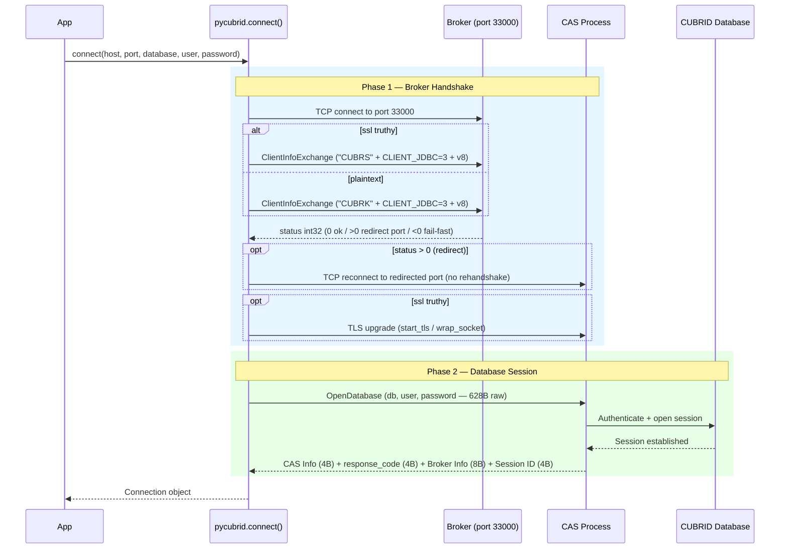
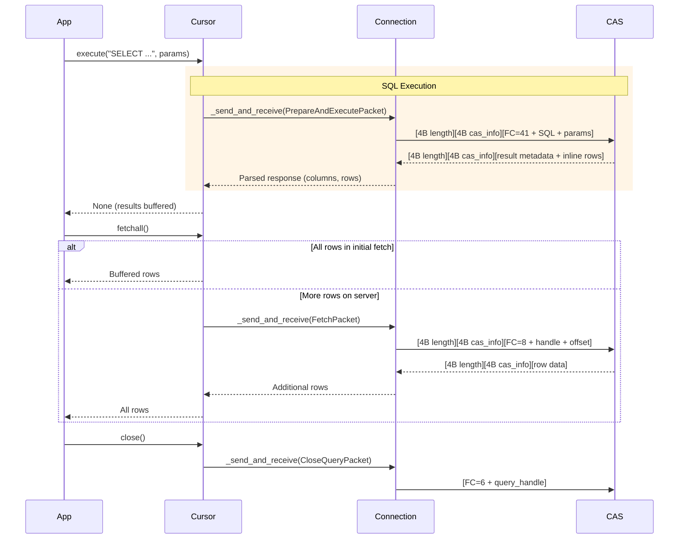
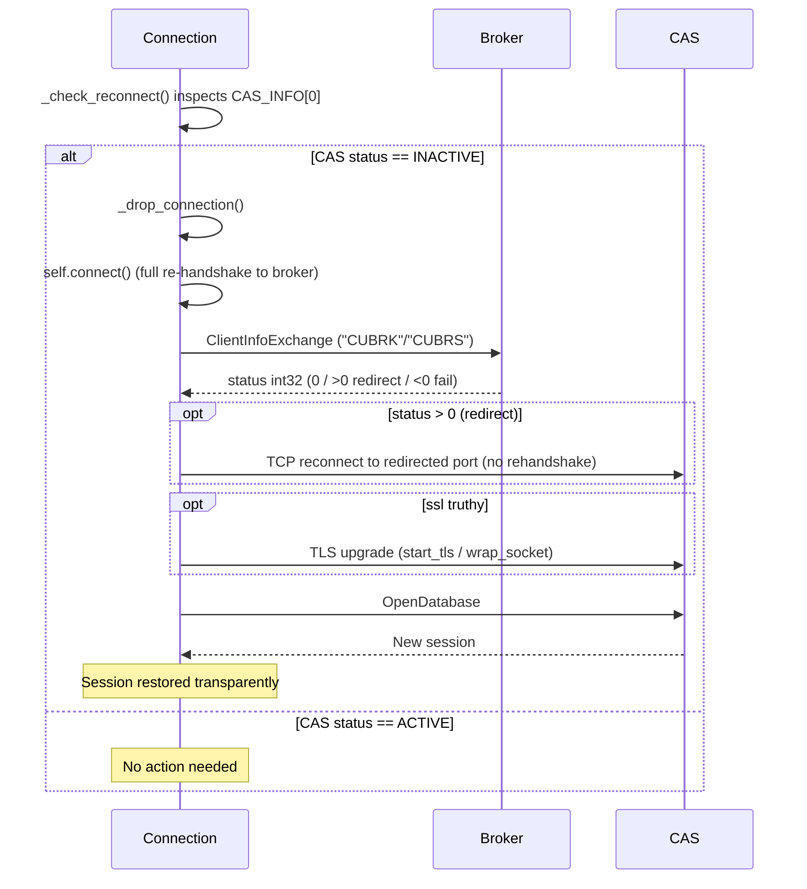
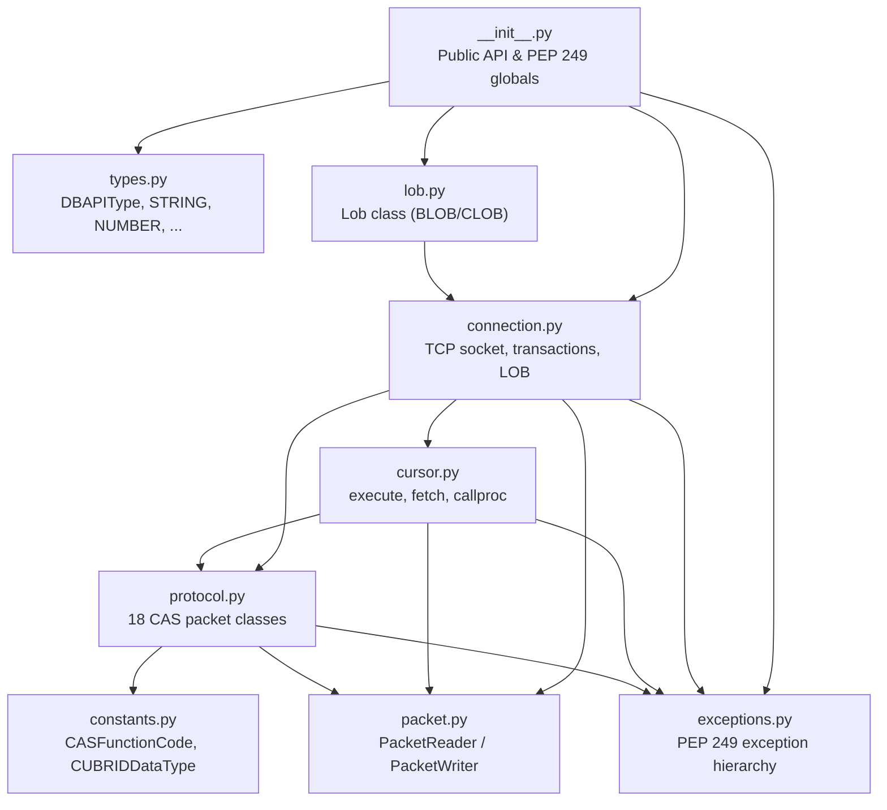
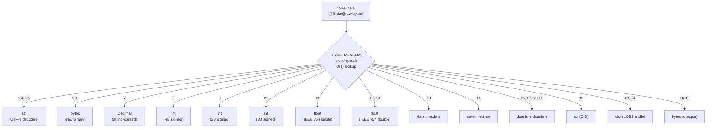

# 아키텍처 (한국어)

> 🌐 [ARCHITECTURE.md](https://github.com/cubrid-lab/pycubrid/blob/main/docs/ARCHITECTURE.md)의 번역입니다. 영어 원문이 표준이며, 페이지 번역은 경고 수준의 동기화 규칙을 따릅니다.

## 설계 목표

- **순수 Python**: 시스템 의존성 0 — C 확장이나 CCI 라이브러리가 필요 없고 Python이 돌아가는 어디서나 실행됩니다.
- **완전한 PEP 249 준수**: 최대 호환성을 위해 Python Database API Specification v2.0을 구현합니다.
- **CAS 바이너리 프로토콜 v8**: pycubrid가 사용하는 현재 CUBRID CAS 프로토콜 버전을 대상으로 합니다.
- **단일 연결 동기 모델**: 표준 애플리케이션 통합에 적합한 안정적인 블로킹 I/O 모델.
- **PEP 561 타입 지정**: 현대적 IDE 지원과 정적 분석을 위한 완전한 타입 힌트.

## 전체 흐름

### 1단계: 연결 핸드셰이크



### 2단계: 쿼리 수명 주기



## CAS 재연결



## 모듈 경계



- **`__init__.py` — 공개 API와 PEP 249 전역**: 패키지의 진입점. `connect` 함수, 예외 계층, DB-API 타입 객체를 노출합니다.
- **`connection.py` — TCP 소켓과 트랜잭션 관리**: CAS에 대한 물리적 TCP 연결을 관리하고, 트랜잭션(커밋/롤백)을 처리하며, LOB 연산의 소유자 역할을 합니다.
- **`cursor.py` — SQL 실행과 결과 조회**: `Cursor` 객체를 구현해 SQL 준비·실행·다양한 fetch 연산을 처리하고 결과 상태를 유지합니다.
- **`protocol.py` — CAS 패킷 클래스**: CUBRID CAS 함수 코드에 대응하는 18개 전문 패킷 클래스를 정의하고, 특정 요청·응답의 직렬화/역직렬화를 담당합니다.
- **`packet.py` — PacketReader / PacketWriter**: 와이어 형식 읽기·쓰기의 저수준 유틸리티를 제공하고 바이트 순서와 원시 타입 직렬화를 처리합니다.
- **`constants.py` — CAS 상수**: CAS 함수 코드, CUBRID 데이터 타입, 기타 프로토콜 수준 상수의 열거형을 담습니다.
- **`types.py` — DB-API 타입**: PEP 249가 요구하는 타입 객체를 정의하고 CUBRID 타입과 Python 타입 간 매핑을 관리합니다.
- **`exceptions.py` — PEP 249 예외**: DB-API 2.0 사양이 요구하는 표준 예외 계층을 구현합니다.
- **`lob.py` — LOB 관리**: 대형 객체 데이터(BLOB/CLOB)를 다루는 `Lob` 클래스를 구현해 청크 단위 읽기·쓰기 인터페이스를 제공합니다.

## 패킷 형식

```text
┌─────────────────┬──────────────┬─────────────────────────┐
│  Data Length     │  CAS Info    │  Payload                │
│  (4 bytes)       │  (4 bytes)   │  (variable length)      │
│  big-endian int  │  session     │  [FC byte][arguments…]  │
└─────────────────┴──────────────┴─────────────────────────┘
```

핸드셰이크 패킷(`ClientInfoExchange`)은 이 프레이밍을 사용하지 **않습니다**. 초기 브로커 협상을 위해 특화된 10바이트 고정 헤더를 사용합니다.

## 타입 디스패치



## 핵심 설계 결정

- **C 확장 대신 순수 Python**: 시스템 의존성 0은 Python이 있는 어디서나 드라이버가 돌아가게 하여 배포를 단순화하고 교차 컴파일 문제를 피합니다.
- **CAS 프로토콜 v8**: 드라이버는 JSON 인식 파싱 경로와 현대적 기능 지원을 포함한 현재 브로커 프로토콜을 대상으로 하며, 레거시 프로토콜 개정을 위한 호환 코드를 담지 않습니다.
- **드라이버 측 바인딩을 가진 `qmark` 파라미터 방식**: 파라미터는 `?` 플레이스홀더를 사용합니다. 드라이버가 최종 SQL을 CAS 브로커로 보내기 전에 값을 로컬에서 이스케이프·보간합니다(문자열·바이트·날짜·decimal·None→NULL의 타입 인식 이스케이프). 이것은 서버 측 prepared statement 바인딩이 아니며 — 브로커는 완전한 SQL 문자열을 받습니다. 이 설계는 PREPARE를 위한 프로토콜 왕복을 없애고 구현을 단순화하면서, 엄격한 타입 디스패치 이스케이프로 주입 안전성을 유지합니다.
- **dict 기반 타입 디스패치**: `_TYPE_READERS` 딕셔너리 활용은 O(1) 조회 성능을 제공해 반복 조건 검사 대비 고속 결과 파싱을 보장합니다.
- **불투명 컬렉션 타입**: SET, MULTISET, SEQUENCE 타입을 raw `bytes`로 반환하는 것은 표준 애플리케이션에서 드물게 쓰이는 기능을 위해 재귀 파싱의 성능 오버헤드와 복잡성을 피합니다.
- **JDBC 클라이언트로 식별**: 핸드셰이크 중 `CLIENT_JDBC=3`을 보내 CAS가 pycubrid를 공식 JDBC 드라이버와 같은 안정성과 기능 집합으로 다루게 합니다.

## 공개 API 경계

```python
# 모듈 수준 속성 (PEP 249)
apilevel = "2.0"
threadsafety = 1
paramstyle = "qmark"

# 생성자
connect(host, port, database, user, password, **kwargs) -> Connection

# 예외
Warning, Error, InterfaceError, DatabaseError, DataError,
OperationalError, IntegrityError, InternalError,
ProgrammingError, NotSupportedError

# 타입 객체
STRING, BINARY, NUMBER, DATETIME, ROWID

# 생성자들
Date, Time, Timestamp, DateFromTicks, TimeFromTicks, TimestampFromTicks, Binary

# 확장
Lob, get_error_description
```

## 이 패키지가 소유하는 것 / 소유하지 않는 것

- **소유**: CAS 와이어 프로토콜 구현, PEP 249 인터페이스, 타입 변환, 연결 수명 주기, LOB 지원.
- **소유하지 않음**: 커넥션 풀링(SQLAlchemy 사용), ORM(sqlalchemy-cubrid 사용), 스키마 마이그레이션(Alembic 사용), 쿼리 빌딩(SQLAlchemy Core 사용).

## 관련 문서

- [프로토콜 참조](PROTOCOL.md)
- [연결 가이드](CONNECTION.md)
- [타입 시스템](TYPES.md)
- [API 참조](API_REFERENCE.md)
- [지원 매트릭스](SUPPORT_MATRIX.md)

## CUBRID 서버 라이선스 관계

pycubrid는 CAS 와이어 프로토콜을 사용하는 독립적인 순수 Python 클라이언트 구현입니다. CUBRID 서버 소스를 포함하지 않고 서버 라이브러리를 링크하지 않으므로, 어떤 라이선스 체제에서도 서버의 파생물이 아닙니다.

CUBRID 서버 엔진은 Apache License 2.0으로, 공식 API/커넥터는 BSD로 배포됩니다(업스트림 `COPYING`, http://www.cubrid.org/cubrid). 이전의 GPL v2+ 체제는 더 이상 적용되지 않습니다 — 그 체제에서조차 TCP over 와이어 프로토콜 클라이언트는 영향을 받지 않았습니다. 어떤 카피레프트 의무도 이 코드베이스에 미치지 않습니다.

`cubrid/cubrid` Docker 이미지(10.2–11.4)는 라이브 서버에 대한 통합 테스트를 실행하기 위해서만 CI에서 사용되며, pycubrid와 함께 배포되지 않습니다.
