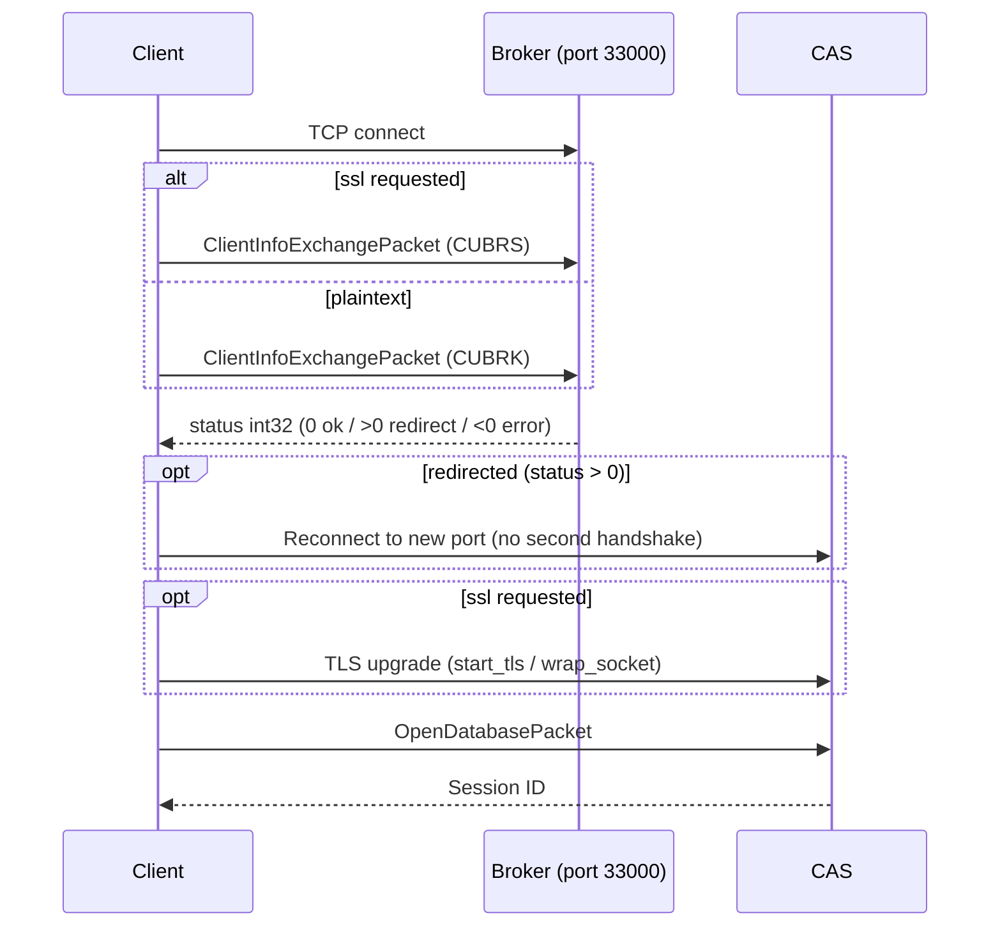
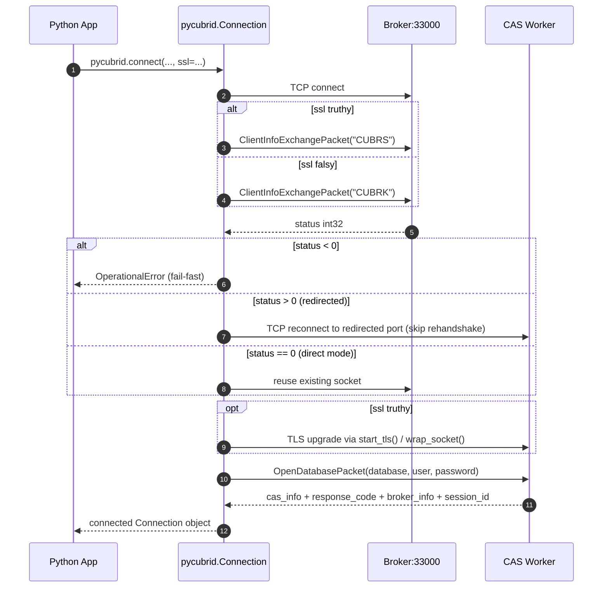

# 연결 가이드 (한국어)

> 🌐 [CONNECTION.md](https://github.com/cubrid-lab/pycubrid/blob/main/docs/CONNECTION.md)의 번역입니다. 영어 원문이 표준이며, 페이지 번역은 경고 수준의 동기화 규칙을 따릅니다.

pycubrid 설치, CUBRID 데이터베이스 연결, 연결 수명 주기의 이해를 다룹니다.

---

## 목차

- [사전 준비](#사전-준비)
- [설치](#설치)
- [연결 함수](#연결-함수)
- [연결 예제](#연결-예제)
  - [SSL/TLS](#ssltls)
- [컨텍스트 매니저 프로토콜](#컨텍스트-매니저-프로토콜)
- [오토커밋 모드](#오토커밋-모드)
- [연결 메서드](#연결-메서드)
- [브로커 핸드셰이크](#브로커-핸드셰이크)
- [서버 버전 확인](#서버-버전-확인)
- [문제 해결](#문제-해결)
- [Docker 퀵스타트](#docker-퀵스타트)
- [SQLAlchemy 연동](#sqlalchemy-연동)

---

## 사전 준비

| 요구사항      | 버전      |
|---------------|-----------|
| Python        | 3.10+     |
| CUBRID Server | 10.2–11.4 |

C 컴파일러나 네이티브 라이브러리가 필요 없습니다 — pycubrid는 순수 Python입니다.

!!! tip
    로컬 개발에서는 환경을 강화하지 않았다면 `host="localhost"`, `port=33000`, `user="dba"`, 빈 비밀번호로 시작하세요.

---

## 설치

### PyPI에서

```bash
pip install pycubrid
```

### 소스에서

```bash
git clone https://github.com/cubrid-lab/pycubrid.git
cd pycubrid
pip install -e ".[dev]"
```

---

## 연결 함수

```python
def connect(
    host: str = "localhost",
    port: int = 33000,
    database: str = "",
    user: str = "dba",
    password: str = "",
    decode_collections: bool = False,
    json_deserializer: Any = None,
    ssl: bool | ssl_module.SSLContext | None = None,
    **kwargs: Any,
) -> Connection
```

### 파라미터

| 파라미터 | 타입 | 기본값 | 설명 |
|---|---|---|---|
| `host` | `str` | `"localhost"` | CUBRID 서버 호스트명 또는 IP 주소 |
| `port` | `int` | `33000` | CUBRID 브로커 포트 |
| `database` | `str` | `""` | 데이터베이스 이름 *(필수)* |
| `user` | `str` | `"dba"` | 데이터베이스 사용자 이름 |
| `password` | `str` | `""` | 데이터베이스 비밀번호 |
| `decode_collections` | `bool` | `False` | SET/MULTISET/SEQUENCE 컬럼을 Python 컬렉션으로 디코딩 |
| `json_deserializer` | `Any` | `None` | 가져올 때 JSON 컬럼을 디코딩하는 콜러블. 미설정 시 JSON은 `str`로 반환 |
| `ssl` | `bool \| ssl_module.SSLContext \| None` | `None` | 동기 브로커 연결에 대한 옵트인 TLS |

### 키워드 인자

| Kwarg | 타입 | 기본값 | 설명 |
|---|---|---|---|
| `connect_timeout` | `float` | `None` | 소켓 연결 타임아웃(초) |
| `read_timeout` | `float` | `None` | 소켓 읽기 타임아웃(초) |
| `fetch_size` | `int` | `100` | 서버 측 가져오기 배치 크기 |
| `enable_timing` | `bool \| None` | `None` | 드라이버 타이밍 통계 활성화, 또는 `PYCUBRID_ENABLE_TIMING`으로 폴백 |
| `no_backslash_escapes` | `bool` | `False` | 백슬래시 이스케이프 없이 따옴표 doubling만으로 문자열 이스케이프 |
| `autocommit` | `bool` | `False` | 문장별 즉시 커밋 활성화 |

### 흔한 연결 프로파일

| 프로파일 | host | port | user | password | autocommit | 용도 |
|---|---|---:|---|---|---|---|
| 로컬 기본 | `localhost` | `33000` | `dba` | `""` | `False` | 개발·스모크 테스트 |
| 원격 앱 | `db.example.com` | `33000` | `app_user` | 필수 | `False` | 프로덕션 서비스 워크로드 |
| 스크립트 모드 | 아무거나 | 아무거나 | 아무거나 | 아무거나 | `True` | 일회성 마이그레이션/점검 스크립트 |

### 반환 값

PEP 249를 구현하는 `Connection` 객체를 반환합니다.

---

## 연결 예제

### 기본 연결

```python
import pycubrid

conn = pycubrid.connect(
    host="localhost",
    port=33000,
    database="testdb",
    user="dba",
)

cur = conn.cursor()
cur.execute("SELECT 1 + 1")
print(cur.fetchone())  # (2,)

cur.close()
conn.close()
```

!!! warning
    실제 환경에서는 `database` 인자가 필수입니다. 빈 데이터베이스 이름은 서버 설정에 따라 `OpenDatabasePacket` 단계에서 실패할 수 있습니다.

### 비밀번호 사용

```python
conn = pycubrid.connect(
    host="localhost",
    port=33000,
    database="demodb",
    user="dba",
    password="mypassword",
)
```

### 커스텀 포트와 타임아웃

```python
conn = pycubrid.connect(
    host="db-server.internal",
    port=33100,
    database="production",
    user="app_user",
    password="secret",
    connect_timeout=10.0,  # 10초 타임아웃
)
```

!!! note
    방화벽이나 로드밸런서 뒤에서 운영한다면 `connect_timeout`을 명시적으로 설정하고 브로커 리다이렉션 실패를 모니터링하세요.

### SSL/TLS

```python
import pycubrid

conn = pycubrid.connect(
    host="db.example.com",
    port=33000,
    database="production",
    user="app_user",
    password="secret",
    ssl=True,
)
```

- `ssl=True`는 시스템 신뢰 저장소를 사용하는 검증된 기본 `ssl.SSLContext`를 만듭니다.
- `ssl=True`일 때 pycubrid는 동기·비동기 연결 모두에서 기본 컨텍스트에 `SSLContext.minimum_version = ssl.TLSVersion.TLSv1_2`를 설정합니다.
- `ssl=your_ssl_context`는 커스텀 컨텍스트를 직접 사용합니다 — 자가 서명이나 사설 CA 인증서에 유용합니다.
- `ssl=None` 또는 `ssl=False`는 TLS를 끄고 기존 평문 동작을 유지합니다.

`pycubrid.connect()`와 `pycubrid.aio.connect()`는 같은 `ssl` 값을 받습니다:

- `ssl=True` — TLS 1.2 최소 버전의 검증된 기본 컨텍스트
- `ssl=False` 또는 `ssl=None` — 평문
- `ssl=your_ssl_context` — 커스텀 `ssl.SSLContext`

비동기 TLS는 CUBRID의 STARTTLS 방식 업그레이드를 사용합니다: 연결이 평문으로 열리고, 브로커와 TLS를 협상하기 위해 `CUBRS` 핸드셰이크 매직을 보낸 뒤, `OPEN_DATABASE` 교환 **이전에** `asyncio.AbstractEventLoop.start_tls()`(`ssl_handshake_timeout`으로 제한)로 라이브 전송을 업그레이드합니다. 비동기 종료 시 `writer.wait_closed()`를 기다려 TLS 세션이 깨끗이 닫힙니다. 동기 드라이버는 `ssl.SSLContext.wrap_socket()`으로 동등한 흐름을 수행합니다.

!!! note "Python 3.10 비동기 TLS 사전 점검 프로브"
    Python 3.10의 `asyncio.loop.start_tls()`에는 알려진 CPython 버그(3.13/3.14에서 수정)가 있어, **인증서 검증** 실패 시 예외를 던지는 대신 무한히 멈출 수 있습니다. [pycubrid#156](https://github.com/cubrid-lab/pycubrid/issues/156)부터 비동기 드라이버는 Python 3.10에서 `loop.start_tls()` 직전에 같은 `SSLContext`와 `server_hostname=host`로 `ssl.SSLContext.wrap_socket()` 사전 점검 프로브를 자동 실행합니다. 검증 실패는 이제 연결 타임아웃 내에 `OperationalError`(`ssl.SSLError`에서 체이닝)로 발생하며, 3.11+ 동작과 일치합니다. 프로브는 Python 3.11+에서는 no-op이고, 3.10에서만 연결당 TCP 왕복 한 번이 추가됩니다. 다른 TLS 오류 경로(응답 없음, 타임아웃)는 여전히 `ssl_handshake_timeout`으로 제한됩니다. 이 이슈는 동기 드라이버에 영향을 주지 않습니다.

```python
import pycubrid.aio

conn = await pycubrid.aio.connect(
    host="db.example.com",
    port=33000,
    database="production",
    user="app_user",
    password="secret",
    ssl=True,
)
```

!!! note
    TLS 연결이 성공하려면 서버 측에서 CUBRID 브로커 TLS가 활성화되어 있어야 합니다(`cubrid_broker.conf`의 `SSL=ON`).

### 비동기 헬스 체크

비동기 연결은 동기 연결과 동일한 가벼운 네이티브 헬스 체크를 노출합니다:

```python
import pycubrid.aio

conn = await pycubrid.aio.connect(database="testdb")

alive = await conn.ping(reconnect=False)
if not alive:
    await conn.ping(reconnect=True)
```

- `await conn.ping(reconnect=False)`는 소켓이 열려 있을 때 항상 네이티브 `CHECK_CAS` 왕복을 수행하되, 커밋 후 정상적인 `CAS_INFO=INACTIVE` 상태에서 발생하는 암시적 브로커 핸드오프 재연결은 억제합니다. 소켓이 닫혔거나 `CHECK_CAS` 자체가 실패할 때만 `False`를 반환합니다 — SQLAlchemy의 `pool_pre_ping`에 안전합니다.
- `await conn.ping(reconnect=True)`은 `False`를 반환하기 전에 소켓/프로토콜 실패 시 종료 + 재연결을 시도합니다.
- 비동기 구현은 동기 `Connection.ping()`과 같은 네이티브 `CHECK_CAS` 함수 코드(`FC=32`)를 사용하며 SQL을 실행하지 않습니다.

---

## 컨텍스트 매니저 프로토콜

pycubrid 연결은 자동 리소스 관리를 위해 `with` 문을 지원합니다:

```python
import pycubrid

with pycubrid.connect(
    host="localhost",
    port=33000,
    database="testdb",
    user="dba",
) as conn:
    cur = conn.cursor()
    cur.execute("INSERT INTO users (name) VALUES (?)", ("Alice",))
    # 성공 시 연결이 자동 커밋
# 블록을 벗어나면 연결이 자동으로 닫힘
```

### 동작

| 시나리오        | 동작                                   |
|-----------------|----------------------------------------|
| 예외 없음       | `conn.commit()` 후 `conn.close()`      |
| 예외 발생       | `conn.rollback()` 후 `conn.close()`    |

`__enter__` 메서드는 연결 자신을 반환합니다. `__exit__` 메서드는:

1. 예외가 없었으면 트랜잭션 커밋
2. 예외가 발생했으면 트랜잭션 롤백
3. 항상 연결 종료

### 수동 트랜잭션 제어

명시적 제어가 필요하면 트랜잭션을 직접 관리하세요:

```python
conn = pycubrid.connect(host="localhost", port=33000, database="testdb", user="dba")
try:
    cur = conn.cursor()
    cur.execute("INSERT INTO cookbook_logs (msg) VALUES (?)", ("event",))
    conn.commit()
except Exception:
    conn.rollback()
    raise
finally:
    conn.close()
```

---

## 오토커밋 모드

`autocommit` 속성은 각 문장을 자동 커밋할지 제어합니다.

```python
# 현재 모드 확인
print(conn.autocommit)  # False (드라이버 기본값)

# 트랜잭션 그루핑을 위해 오토커밋 끄기
conn.autocommit = False

# 오토커밋 다시 켜기
conn.autocommit = True
```

### 세부 사항

| 속성 | 설명 |
|---|---|
| 기본값 | `False` |
| 게터 | 현재 오토커밋 상태 반환 |
| 세터(`= True`) | 서버로 `SetDbParameterPacket` + `CommitPacket` 전송 |
| 세터(`= False`) | 서버로 `SetDbParameterPacket` + `CommitPacket` 전송 |

> **참고**: pycubrid를 SQLAlchemy(`cubrid+pycubrid://`)와 사용하면 방언이 새 연결마다 `autocommit = False`로 설정해 SQLAlchemy가 트랜잭션을 올바르게 관리하게 합니다.
>
> pycubrid의 `Connection`은 명시적 트랜잭션 제어를 위해 기본적으로 `autocommit=False`이며, 이 값을 매 `PrepareAndExecute` 패킷의 문장별 ``auto_commit`` 플래그로 보냅니다. 따라서 브로커 자체의 ``CUBRID_AUTO_COMMIT`` 설정은 사실상 드라이버가 보고하는 값으로 덮어씌워집니다. 활성화하려면 ``connect()``에 ``autocommit=True``를 전달하거나(또는 연결 후 ``connection.autocommit = True`` 설정) 하세요.

### 투명한 재연결 시 세션 상태 복원

CUBRID 브로커는 ``KEEP_CONNECTION=AUTO``(기본값)일 때 요청 사이에 CAS 워커를 닫을 수 있습니다. pycubrid는 JDBC의 ``UClientSideConnection.checkReconnect``를 따라, 브로커가 ``CAS_INFO_STATUS_INACTIVE``를 알리면 다음 요청에서 투명하게 재연결합니다.

이 재연결에서 PEP 249 의미론을 보존하기 위해, pycubrid는 호출자가 **명시적으로** 설정한 세션 수준 설정을 복원합니다:

| 설정 | 재연결 시 복원? |
|---|---|
| ``autocommit`` (``connection.autocommit = ...`` / ``await conn.set_autocommit(...)``로 설정) | 예 — 같은 값이 ``SetDbParameterPacket``으로 재전송됨 |
| 연결 시 기본값으로 남아있는 ``autocommit`` | 아니요 — 브로커 기본값 사용 |

호출자가 한 번도 건드리지 않은 설정은 불필요한 왕복을 막기 위해 재연결 시 의도적으로 **재전송하지 않습니다**. 복원 자체가 실패하면 연결이 해체되고 PEP 3134 ``__cause__``로 기저 전송 오류가 보존되어 호출자가 실패를 진단할 수 있습니다.

---

## 연결 메서드

| 메서드                              | 반환 타입     | 설명                                            |
|-------------------------------------|---------------|-------------------------------------------------|
| `cursor()`                          | `Cursor`      | SQL 실행을 위한 새 커서 생성                     |
| `commit()`                          | `None`        | 현재 트랜잭션 커밋                              |
| `rollback()`                        | `None`        | 현재 트랜잭션 롤백                              |
| `close()`                           | `None`        | 연결 종료 및 리소스 해제                          |
| `get_server_version()`              | `str`         | CUBRID 서버 버전 문자열 반환                      |
| `get_last_insert_id()`              | `str`         | 마지막 auto-increment ID 반환                     |
| `create_lob(lob_type)`              | `Lob`         | 새 LOB 객체 생성 (CLOB=24, BLOB=23)              |
| `get_schema_info(schema_type, ...)` | `GetSchemaPacket` | 서버에서 스키마 메타데이터 조회            |

### LOB 생성

```python
# CLOB (Character Large Object) 생성
clob = conn.create_lob(24)  # 24 = CLOB
clob.write(b"Large text content...")

# BLOB (Binary Large Object) 생성
blob = conn.create_lob(23)  # 23 = BLOB
blob.write(b"\x89PNG\r\n...")
```

> **팁**: `Lob.write()`는 `bytes`만 받습니다. 일반적인 CLOB 삽입에는 `str`로 직접 SQL 파라미터 바인딩을, BLOB 삽입에는 `bytes`를 직접 전달하는 것을 권장합니다. 자세한 내용은 [예제](EXAMPLES.md)를 참고하세요.

### 스키마 정보

```python
# 스키마 정보 조회 (schema_type 상수는 CUBRID 문서 참고)
packet = conn.get_schema_info(schema_type=1)  # 테이블
print(packet.tuple_count)
```

---

## 브로커 핸드셰이크

`pycubrid.connect()`가 호출되면 다음 프로토콜 핸드셰이크가 일어납니다:





!!! danger
    브로커 리다이렉션이 클라이언트 네트워크에서 도달할 수 없는 CAS 포트를 반환하면, 1단계에서는 연결이 성공하지만 세션 수립 전에 실패합니다.

### 단계별 설명

1. **TCP 연결** — 브로커(기본 포트 33000)로 소켓을 엽니다.
2. **클라이언트 정보 교환** — 10바이트 핸드셰이크 전송: `ssl`이 요청되면(STARTTLS) 매직 문자열 `b"CUBRS"`, 평문이면 `b"CUBRK"`, 그리고 클라이언트 타입 `CLIENT_JDBC=3`과 프로토콜 버전 바이트.
3. **브로커 상태** — 브로커가 4바이트 big-endian 부호 있는 정수로 응답:
    - `status < 0` — 즉시 실패: 드라이버가 `OperationalError` 발생
    - `status > 0` — 리다이렉트: 소켓을 닫고 같은 호스트의 새 CAS 포트로 재연결하되, 핸드셰이크는 **반복하지 않음**(공식 JDBC `BrokerHandler` 동작 미러링)
    - `status == 0` — 다이렉트 모드: 기존 소켓 재사용
4. **TLS 업그레이드 (선택)** — `ssl`이 참이면 어떤 `OPEN_DATABASE` 바이트도 쓰기 *전에* 라이브 전송을 TLS로 업그레이드합니다. 비동기는 `asyncio.AbstractEventLoop.start_tls(..., ssl_handshake_timeout=...)`, 동기는 `ssl.SSLContext.wrap_socket()` 사용. 실패한 핸드셰이크는 전송을 누수하지 않고 중단시킵니다.
5. **데이터베이스 열기** — `OpenDatabasePacket`으로 데이터베이스 이름·사용자 이름·비밀번호 전송.
6. **세션 수립** — 서버가 세션 ID를 반환하면 연결이 준비됩니다.

---

## 서버 버전 확인

```python
conn = pycubrid.connect(host="localhost", port=33000, database="testdb", user="dba")
version = conn.get_server_version()
print(version)  # 예: "11.2.0.0374"
conn.close()
```

`get_server_version()` 메서드는 서버에 `GetEngineVersionPacket`을 보내고 버전을 문자열로 반환합니다.

---

## 문제 해결

### 흔한 연결 오류

#### 포트 33000에서 `ConnectionRefusedError`

CUBRID 브로커가 실행 중이 아니거나 예상 포트에서 수신하지 않습니다.

1. 브로커 실행 확인:
   ```bash
   cubrid broker status
   ```
2. `cubrid_broker.conf`의 브로커 포트 확인 (기본: 33000)
3. Docker 사용 시:
   ```bash
   docker compose up -d
   docker compose logs cubrid
   ```

#### `Authentication failed`

CUBRID 기본 `dba` 사용자에게는 비밀번호가 없습니다. 설정했다면 일치해야 합니다:

```python
# dba에 비밀번호가 없으면
conn = pycubrid.connect(host="localhost", port=33000, database="testdb", user="dba")

# dba에 비밀번호가 있으면
conn = pycubrid.connect(host="localhost", port=33000, database="testdb", user="dba", password="mypassword")
```

#### `TimeoutError` 또는 `socket.timeout`

서버가 타임아웃 내에 응답하지 않았습니다:

```python
# 타임아웃 늘리기
conn = pycubrid.connect(
    host="slow-server.example.com",
    port=33000,
    database="testdb",
    user="dba",
    connect_timeout=30.0,
)
```

#### `OperationalError: Connection is closed`

서버가 연결을 닫았습니다(세션 타임아웃, 네트워크 중단, 브로커 재시작). 새 연결을 만드세요:

```python
conn = pycubrid.connect(host="localhost", port=33000, database="testdb", user="dba")
```

---

## Docker 퀵스타트

로컬 개발에는 제공되는 `docker-compose.yml`을 사용하세요:

```bash
# CUBRID 11.2 시작 (기본)
docker compose up -d

# 특정 버전 시작
CUBRID_VERSION=11.4 docker compose up -d

# 실행 확인
docker compose ps

# pycubrid로 연결
python3 -c "
import pycubrid
with pycubrid.connect(host='localhost', port=33000, database='testdb', user='dba') as conn:
    cur = conn.cursor()
    cur.execute('SELECT 1 + 1')
    print(cur.fetchone())
"

# 중지 및 정리
docker compose down -v
```

---

## SQLAlchemy 연동

pycubrid는 [sqlalchemy-cubrid](https://github.com/cubrid-lab/sqlalchemy-cubrid)의 드라이버로 동작합니다:

```bash
pip install "sqlalchemy-cubrid[pycubrid]"
```

```python
from sqlalchemy import create_engine, text

engine = create_engine("cubrid+pycubrid://dba@localhost:33000/testdb")

with engine.connect() as conn:
    result = conn.execute(text("SELECT 1"))
    print(result.scalar())
```

SQLAlchemy 기능 — ORM, Core, Alembic 마이그레이션, 스키마 리플렉션 — 은 sqlalchemy-cubrid와 함께 사용할 때 pycubrid 드라이버를 통해 접근할 수 있습니다.

---

## 커넥션 풀링

pycubrid에는 내장 커넥션 풀이 없습니다. `pycubrid.connect()` 호출마다 CUBRID 브로커로 새 TCP 연결을 만듭니다.

커넥션 풀링에는 다음 중 하나를 사용하세요:

- **SQLAlchemy 내장 풀** (권장):
  ```python
  from sqlalchemy import create_engine
  engine = create_engine(
      "cubrid+pycubrid://dba@localhost:33000/testdb",
      pool_size=5,
      pool_pre_ping=True,
  )
  ```

- **외부 풀링 라이브러리** (예: `sqlalchemy.pool`, `DBUtils`)

풀 튜닝 가이드는 [문제 해결](TROUBLESHOOTING.md)을 참고하세요.

---

## 문자 인코딩

pycubrid는 **UTF-8** 인코딩만 사용합니다. 이는 CUBRID의 내부 문자셋과 일치합니다 — 서버는 문자열 데이터를 UTF-8으로 저장하고 반환합니다.

`charset` 연결 파라미터는 없습니다. 와이어 프로토콜의 모든 문자열 인코딩/디코딩은 무조건 UTF-8을 사용합니다:

- Python `str` 값은 서버로 보내기 전에 UTF-8 바이트로 인코딩됩니다
- 서버의 바이트 응답은 UTF-8으로 디코딩되어 Python `str` 값이 됩니다

이것은 의도된 설계이며 모든 CUBRID 문자열 타입(`VARCHAR`, `CHAR`, `STRING`, `CLOB`)을 다룹니다. UTF-8이 아닌 데이터를 다루는 애플리케이션은 pycubrid에 값을 전달하기 전에 애플리케이션 계층에서 인코딩/디코딩하세요.

!!! note
    CUBRID의 기본 문자셋은 `utf8`입니다(데이터베이스 생성 시 설정). 모든 현대 CUBRID 설치는 UTF-8을 사용합니다. `iso88591` 문자셋으로 생성된 레거시 데이터베이스는 pycubrid가 항상 바이트를 UTF-8으로 디코딩하므로 ASCII가 아닌 데이터에서 문자가 깨질 수 있습니다.

---

*참고: [타입 시스템](TYPES.md) · [API 참조](API_REFERENCE.md) · [예제](EXAMPLES.md)*
