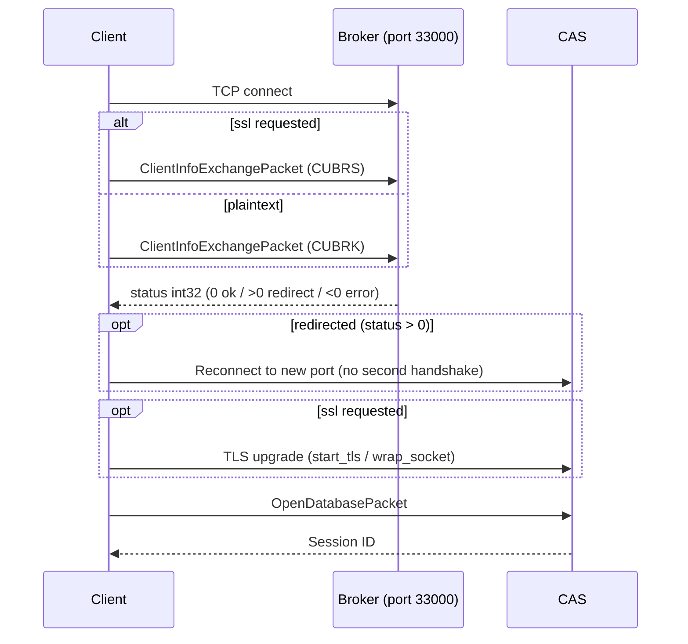
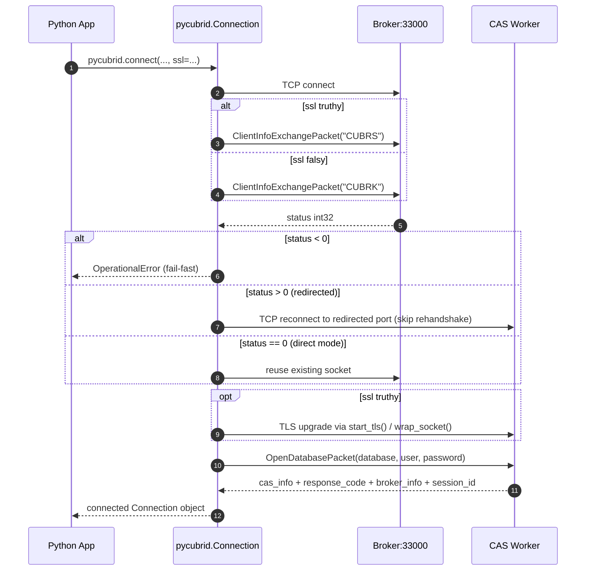

# 연결 가이드 (한국어)

> 🌐 [CONNECTION.md](https://github.com/cubrid-lab/pycubrid/blob/main/docs/CONNECTION.md)의 번역입니다. 영어 원문이 표준이며, 페이지 번역은 경고 수준의 동기화 규칙을 따릅니다.

pycubrid 설치, CUBRID 데이터베이스 연결, 연결 수명 주기의 이해를 다룹니다.

---

## 목차

- [사전 준비](#사전-준비)
- [설치](#설치)
- [연결 함수](#연결-함수)
- [연결 예제](#연결-예제)
  - [SSL/TLS](#ssltls)
- [컨텍스트 매니저 프로토콜](#컨텍스트-매니저-프로토콜)
- [오토커밋 모드](#오토커밋-모드)
- [연결 메서드](#연결-메서드)
- [브로커 핸드셰이크](#브로커-핸드셰이크)
- [서버 버전 확인](#서버-버전-확인)
- [문제 해결](#문제-해결)
- [Docker 퀵스타트](#docker-퀵스타트)
- [SQLAlchemy 연동](#sqlalchemy-연동)

---

## 사전 준비

| 요구사항      | 버전      |
|---------------|-----------|
| Python        | 3.10+     |
| CUBRID Server | 10.2–11.4 |

C 컴파일러나 네이티브 라이브러리가 필요 없습니다 — pycubrid는 순수 Python입니다.

!!! tip
    로컬 개발에서는 환경을 강화하지 않았다면 `host="localhost"`, `port=33000`, `user="dba"`, 빈 비밀번호로 시작하세요.

---

## 설치

### PyPI에서

```bash
pip install pycubrid
```

### 소스에서

```bash
git clone https://github.com/cubrid-lab/pycubrid.git
cd pycubrid
pip install -e ".[dev]"
```

---

## 연결 함수

```python
def connect(
    host: str = "localhost",
    port: int = 33000,
    database: str = "",
    user: str = "dba",
    password: str = "",
    decode_collections: bool = False,
    json_deserializer: Any = None,
    ssl: bool | ssl_module.SSLContext | None = None,
    charset: str = "utf-8",
    **kwargs: Any,
) -> Connection
```

### 파라미터

| 파라미터 | 타입 | 기본값 | 설명 |
|---|---|---|---|
| `host` | `str` | `"localhost"` | CUBRID 서버 호스트명 또는 IP 주소 |
| `port` | `int` | `33000` | CUBRID 브로커 포트 |
| `database` | `str` | `""` | 데이터베이스 이름 *(필수)* |
| `user` | `str` | `"dba"` | 데이터베이스 사용자 이름 |
| `password` | `str` | `""` | 데이터베이스 비밀번호 |
| `decode_collections` | `bool` | `False` | SET/MULTISET/SEQUENCE 컬럼을 Python 컬렉션으로 디코딩 |
| `json_deserializer` | `Any` | `None` | 가져올 때 JSON 컬럼을 디코딩하는 콜러블. 미설정 시 JSON은 `str`로 반환 |
| `charset` | `str` | `"utf-8"` | SQL 텍스트, 자격 증명, 문자 값, 이름, 오류 텍스트에 쓰는 Python 코덱(또는 CUBRID `utf8`/`euckr`/`iso88591`). 데이터베이스 문자셋으로 설정. [문자 인코딩](#문자-인코딩) 참고 |
| `ssl` | `bool \| ssl_module.SSLContext \| None` | `None` | 동기 브로커 연결에 대한 옵트인 TLS |

### 키워드 인자

| Kwarg | 타입 | 기본값 | 설명 |
|---|---|---|---|
| `connect_timeout` | `float` | `None` | 소켓 연결 타임아웃(초) |
| `read_timeout` | `float` | `None` | 소켓 읽기 타임아웃(초) |
| `fetch_size` | `int` | `100` | 서버 측 가져오기 배치 크기 |
| `enable_timing` | `bool \| None` | `None` | 드라이버 타이밍 통계 활성화, 또는 `PYCUBRID_ENABLE_TIMING`으로 폴백 |
| `no_backslash_escapes` | `bool \| None` | `None` (자동 감지) | 새 물리 세션마다 문자열 이스케이프 모드 감지; 명시적 `True`/`False`는 감지를 생략하고 복구 후에도 유지 |
| `autocommit` | `bool` | `False` | 문장별 즉시 커밋 활성화 |

### 흔한 연결 프로파일

| 프로파일 | host | port | user | password | autocommit | 용도 |
|---|---|---:|---|---|---|---|
| 로컬 기본 | `localhost` | `33000` | `dba` | `""` | `False` | 개발·스모크 테스트 |
| 원격 앱 | `db.example.com` | `33000` | `app_user` | 필수 | `False` | 프로덕션 서비스 워크로드 |
| 스크립트 모드 | 아무거나 | 아무거나 | 아무거나 | 아무거나 | `True` | 일회성 마이그레이션/점검 스크립트 |

### 반환 값

PEP 249를 구현하는 `Connection` 객체를 반환합니다.

---

## 연결 예제

### 기본 연결

```python
import pycubrid

conn = pycubrid.connect(
    host="localhost",
    port=33000,
    database="testdb",
    user="dba",
)

cur = conn.cursor()
cur.execute("SELECT 1 + 1")
print(cur.fetchone())  # (2,)

cur.close()
conn.close()
```

!!! warning
    실제 환경에서는 `database` 인자가 필수입니다. 빈 데이터베이스 이름은 서버 설정에 따라 `OpenDatabasePacket` 단계에서 실패할 수 있습니다.

### 비밀번호 사용

```python
conn = pycubrid.connect(
    host="localhost",
    port=33000,
    database="demodb",
    user="dba",
    password="mypassword",
)
```

### 커스텀 포트와 타임아웃

```python
conn = pycubrid.connect(
    host="db-server.internal",
    port=33100,
    database="production",
    user="app_user",
    password="secret",
    connect_timeout=10.0,  # 10초 타임아웃
)
```

!!! note
    방화벽이나 로드밸런서 뒤에서 운영한다면 `connect_timeout`을 명시적으로 설정하고 브로커 리다이렉션 실패를 모니터링하세요.

### SSL/TLS

```python
import pycubrid

conn = pycubrid.connect(
    host="db.example.com",
    port=33000,
    database="production",
    user="app_user",
    password="secret",
    ssl=True,
)
```

- `ssl=True`는 시스템 신뢰 저장소를 사용하는 검증된 기본 `ssl.SSLContext`를 만듭니다.
- `ssl=True`일 때 pycubrid는 동기·비동기 연결 모두에서 기본 컨텍스트에 `SSLContext.minimum_version = ssl.TLSVersion.TLSv1_2`를 설정합니다.
- `ssl=your_ssl_context`는 커스텀 컨텍스트를 직접 사용합니다 — 자가 서명이나 사설 CA 인증서에 유용합니다.
- `ssl=None` 또는 `ssl=False`는 TLS를 끄고 기존 평문 동작을 유지합니다.

`pycubrid.connect()`와 `pycubrid.aio.connect()`는 같은 `ssl` 값을 받습니다:

- `ssl=True` — TLS 1.2 최소 버전의 검증된 기본 컨텍스트
- `ssl=False` 또는 `ssl=None` — 평문
- `ssl=your_ssl_context` — 커스텀 `ssl.SSLContext`

비동기 TLS는 CUBRID의 STARTTLS 방식 업그레이드를 사용합니다: 연결이 평문으로 열리고, 브로커와 TLS를 협상하기 위해 `CUBRS` 핸드셰이크 매직을 보낸 뒤, `OPEN_DATABASE` 교환 **이전에** `asyncio.AbstractEventLoop.start_tls()`(`ssl_handshake_timeout`으로 제한)로 라이브 전송을 업그레이드합니다. 비동기 종료 시 `writer.wait_closed()`를 기다려 TLS 세션이 깨끗이 닫힙니다. 동기 드라이버는 `ssl.SSLContext.wrap_socket()`으로 동등한 흐름을 수행합니다.

`connect_timeout`은 TCP 연결만 제한합니다. 브로커 핸드셰이크, TLS 핸드셰이크, `OPEN_DATABASE`는 두 드라이버 모두 `read_timeout`으로 제한됩니다. `read_timeout`을 설정하지 않으면 비동기 TLS 핸드셰이크는 10초(`ssl_handshake_timeout`) 후 포기하고, 동기 드라이버는 제한 없이 기다립니다. TLS 핸드셰이크 도중 브로커가 멈추거나 연결을 리셋하면 그 제한 안에 `OperationalError`가 발생합니다([#513](https://github.com/cubrid-lab/pycubrid/issues/513)).

!!! note "Python 3.10 비동기 TLS 사전 점검 프로브"
    Python 3.10의 `asyncio.loop.start_tls()`에는 알려진 CPython 버그(3.13/3.14에서 수정)가 있어, **인증서 검증** 실패 시 예외를 던지는 대신 무한히 멈출 수 있습니다. [pycubrid#156](https://github.com/cubrid-lab/pycubrid/issues/156)부터 비동기 드라이버는 Python 3.10에서 `loop.start_tls()` 직전에 같은 `SSLContext`와 `server_hostname=host`로 `ssl.SSLContext.wrap_socket()` 사전 점검 프로브를 자동 실행합니다. 검증 실패는 이제 연결 타임아웃 내에 `OperationalError`(`ssl.SSLError`에서 체이닝)로 발생하며, 3.11+ 동작과 일치합니다. 프로브는 Python 3.11+에서는 no-op이고, 3.10에서만 연결당 TCP 왕복 한 번이 추가됩니다. 다른 TLS 오류 경로(응답 없음, 타임아웃)는 여전히 `ssl_handshake_timeout`으로 제한됩니다. 이 이슈는 동기 드라이버에 영향을 주지 않습니다.

```python
import pycubrid.aio

conn = await pycubrid.aio.connect(
    host="db.example.com",
    port=33000,
    database="production",
    user="app_user",
    password="secret",
    ssl=True,
)
```

!!! note
    TLS 연결이 성공하려면 서버 측에서 CUBRID 브로커 TLS가 활성화되어 있어야 합니다(`cubrid_broker.conf`의 `SSL=ON`).

### 비동기 헬스 체크

비동기 연결은 동기 연결과 동일한 가벼운 네이티브 헬스 체크를 노출합니다:

```python
import pycubrid.aio

conn = await pycubrid.aio.connect(database="testdb")

alive = await conn.ping(reconnect=False)
if not alive:
    await conn.ping(reconnect=True)
```

- `await conn.ping(reconnect=False)`는 열린 소켓에서 네이티브 `CHECK_CAS` 왕복을 수행하며 재접속하지 않습니다. `CAS_INFO[0]=0`은 트랜잭션 종료 후의 OUT_TRAN 상태이지 세션 해제가 아니므로 이 동작에 영향을 주지 않습니다. 소켓이 닫혔거나 검사에 실패하면 `False`를 반환하므로 SQLAlchemy의 `pool_pre_ping`에 적합합니다.
- `await conn.ping(reconnect=True)`는 기존 소켓을 먼저 검사하고, 이미 연결이 끊겼거나 `CHECK_CAS` 전송/프로토콜 오류가 발생했거나 음수 응답으로 CAS–DB 링크 장애가 확인되면 재접속을 한 번 시도합니다. 복구 실패는 `False`를 반환합니다. `reconnect=False`는 음수 응답에도 재접속하지 않고 그 손상된 세션을 닫은 뒤 `False`를 반환합니다.
- 정상적인 동일 세션 ping은 이스케이프 모드를 다시 감지하지 않습니다. 새 물리 세션에서는 자동 모드를 사용한 경우 사용 전에 다시 감지하며, 명시적 `no_backslash_escapes=True` 또는 `False`는 유지합니다. 감지 실패 시 대체 세션을 폐기하고 ping은 `False`를 반환하며, 모드를 추측하거나 SQL을 재실행하지 않습니다.
- 정상 세션의 비동기 검사는 동기 `Connection.ping()`과 같은 네이티브 `CHECK_CAS` 함수 코드(`FC=32`)를 사용하며 SQL을 실행하지 않습니다. 재연결 중에는 읽기 전용 이스케이프 모드 탐색 SELECT를 실행할 수 있습니다.

---

## 컨텍스트 매니저 프로토콜

pycubrid 연결은 자동 리소스 관리를 위해 `with` 문을 지원합니다:

```python
import pycubrid

with pycubrid.connect(
    host="localhost",
    port=33000,
    database="testdb",
    user="dba",
) as conn:
    cur = conn.cursor()
    cur.execute("INSERT INTO users (name) VALUES (?)", ("Alice",))
    # 성공 시 연결이 자동 커밋
# 블록을 벗어나면 연결이 자동으로 닫힘
```

### 동작

| 시나리오        | 동작                                   |
|-----------------|----------------------------------------|
| 예외 없음       | `conn.commit()` 후 `conn.close()`      |
| 예외 발생       | `conn.rollback()` 후 `conn.close()`    |

`__enter__` 메서드는 연결 자신을 반환합니다. `__exit__` 메서드는:

1. 예외가 없었으면 트랜잭션 커밋
2. 예외가 발생했으면 트랜잭션 롤백
3. 항상 연결 종료

### 수동 트랜잭션 제어

명시적 제어가 필요하면 트랜잭션을 직접 관리하세요:

```python
conn = pycubrid.connect(host="localhost", port=33000, database="testdb", user="dba")
try:
    cur = conn.cursor()
    cur.execute("INSERT INTO cookbook_logs (msg) VALUES (?)", ("event",))
    conn.commit()
except Exception:
    conn.rollback()
    raise
finally:
    conn.close()
```

---

## 오토커밋 모드

`autocommit` 속성은 각 문장을 자동 커밋할지 제어합니다.

```python
# 현재 모드 확인
print(conn.autocommit)  # False (드라이버 기본값)

# 트랜잭션 그루핑을 위해 오토커밋 끄기
conn.autocommit = False

# 오토커밋 다시 켜기
conn.autocommit = True
```

### 세부 사항

| 속성 | 설명 |
|---|---|
| 기본값 | `False` |
| 게터 | 현재 오토커밋 상태 반환 |
| 세터(`= True`) | 서버로 `SetDbParameterPacket` + `CommitPacket` 전송 |
| 세터(`= False`) | 서버로 `SetDbParameterPacket` + `CommitPacket` 전송 |
| 두 요청 사이에 CAS 재활용 | 대체 세션에 새 값을 먼저 복원한 뒤 `COMMIT` 전송, 호출당 재접속은 최대 한 번(#551) |
| `COMMIT` 실패 | 연결을 닫고 이전 값을 유지하며 `OperationalError` 발생 |

> **참고**: pycubrid를 SQLAlchemy(`cubrid+pycubrid://`)와 사용하면 방언이 새 연결마다 `autocommit = False`로 설정해 SQLAlchemy가 트랜잭션을 올바르게 관리하게 합니다.
>
> pycubrid의 `Connection`은 명시적 트랜잭션 제어를 위해 기본적으로 `autocommit=False`이며, 이 값을 매 `PrepareAndExecute` 패킷의 문장별 ``auto_commit`` 플래그로 보냅니다. 따라서 브로커 자체의 ``CUBRID_AUTO_COMMIT`` 설정은 사실상 드라이버가 보고하는 값으로 덮어씌워집니다. 활성화하려면 ``connect()``에 ``autocommit=True``를 전달하거나(또는 연결 후 ``connection.autocommit = True`` 설정) 하세요.

### 트랜잭션 경계에서 CAS가 재활용되는 경우

`CAS_INFO[0]=0`은 CAS 워커 해제가 아니라 트랜잭션 밖 상태인 OUT_TRAN을 뜻합니다. 정상적인 commit, rollback 및 autocommit 요청은 같은 소켓과 CAS 세션을 유지하므로 세션 변수와 `SET TRANSACTION ISOLATION LEVEL`도 유지됩니다(#468).

그래도 CAS는 이런 응답 직후 소켓을 닫을 수 있습니다. 메모리가 `APPL_SERVER_MAX_SIZE`를 넘으면 다음 `END_TRAN`에서 재시작하고, `cubrid broker reset`은 유휴 워커를 재활용하며, `KEEP_CONNECTION=AUTO`에서 `MAX_NUM_APPL_SERVER`보다 많은 클라이언트가 연결되면 유휴 워커를 대기 중인 클라이언트에게 넘깁니다(CHANGE CLIENT). 그래서 직전 응답이 OUT_TRAN이면 동기/비동기 연결 모두 CUBRID JDBC 드라이버처럼 다음 요청 전에 네이티브 `CHECK_CAS`를 한 번 보냅니다(#485).

- CAS가 응답하면 같은 세션을 유지하고 요청을 보냅니다. 트랜잭션 밖에서 보내는 요청마다, 즉 autocommit 모드의 모든 문장마다 왕복이 한 번 늘어납니다(autocommit INSERT는 last-insert-id 조회 전에도 검사합니다).
- 검사가 실패하면 **해당 요청에 대해 한 번만** 연결을 교체합니다. 고정하지 않은 이스케이프 모드를 다시 감지하고 명시적으로 설정한 `autocommit`을 복원한 뒤, 요청을 새 세션에서 처음으로 보냅니다. SQL은 재실행하지 않으며, CAS가 열린 트랜잭션이 없다고 보고했으므로 커밋되지 않은 작업을 잃지 않습니다. 잃어버린 세션에 의존하는 요청은 새 세션으로 보내지 않습니다. 그 세션 핸들에 대한 `CLOSE_REQ`는 건너뛰고, 아직 읽지 않은 행에 대한 FETCH, last-insert-id 조회, 그 세션에서 얻은 LOB의 읽기/쓰기는 `OperationalError`를 발생시키며, `pycubrid.compat.native` prepared 문은 이전 세션 소속으로 거부됩니다. autocommit INSERT 직후 CAS가 재활용되면 INSERT는 커밋되지만 `lastrowid`는 `None`이 되고 WARNING 로그가 남습니다. 교체 설정 자체도 트랜잭션 밖에서 끝나므로 요청 전에 `CHECK_CAS`로 한 번 더 확인합니다. 커서는 파라미터를 렌더링하기 *전에* 이 검사를 수행하므로 파라미터 SQL은 실제로 전송될 세션 기준으로 바인딩됩니다. 이미 렌더링된 뒤 세션이 교체된 SQL은 보내지 않고 재시도 가능한 `OperationalError`("... parameter binding; retry operation")로 실패시키며, 새 세션은 재시도를 위해 열린 채로 둡니다.
- 교체에 실패하면 `OperationalError`를 발생시키고 연결을 닫지 않은 채 끊긴 상태로 둡니다. `ping(reconnect=True)`로 다시 연결하거나 새 연결을 여세요.

복원하는 것은 드라이버가 소유한 상태뿐입니다. 실제 재접속은 SQL로 설정한 세션 상태를 초기화합니다. 세션 변수, `SET TRANSACTION ISOLATION LEVEL`, 잠금 타임아웃 등 서버 세션 상태는 잃어버린 CAS 세션에 속하므로 이어지지 않습니다. 이런 설정을 SQL로 적용하는 계층은 새 물리 세션마다 계속 다시 적용해야 합니다(예: sqlalchemy-cubrid의 격리 수준 재적용, sqlalchemy-cubrid#527).

`commit()`과 `rollback()`은 먼저 트랜잭션 밖 CAS를 확인한 뒤 `END_TRAN` 전에 닫히지 않은 커서가 가진 모든 쿼리 핸들에 `CLOSE_REQ`를 보내므로, 오래 유지되는 세션에 서버 핸들이 쌓이지 않습니다. 이미 받은 행은 계속 읽을 수 있고, 끝나지 않은 결과는 다음 FETCH가 필요할 때 여전히 `InterfaceError`를 발생시킵니다. autocommit 모드에서는 `END_TRAN`을 보내지 않으므로 닫히지 않은 커서의 서버 핸들은 `commit()`, `rollback()` 또는 `close()`까지 계속 쌓입니다. 커서를 닫거나 컨텍스트 매니저로 사용하세요.

### 명시적 ping 복구 후 세션 상태 복원

pycubrid는 전송 실패 후 임의의 SQL 요청을 자동 재실행하지 않습니다. 연결이 이미 끊겼거나 `CHECK_CAS` 검사 중 전송/프로토콜 오류가 발생했거나 음수 검사 응답으로 CAS–DB 링크 장애가 확인되면 명시적인 `ping(reconnect=True)`로 새 연결을 한 번 시도할 수 있습니다. `reconnect=False`는 음수 응답을 `False`로 보고하고 재접속하지 않으며, 동기·비동기 모두 그 손상된 세션을 닫으므로 이후 호출은 `connect()` 또는 `ping(reconnect=True)` 전까지 `InterfaceError`를 발생시킵니다. 중단된 SQL을 재시도해도 안전한지는 호출자가 판단해야 합니다.

자동 `no_backslash_escapes` 모드는 대체 물리 세션에서 상태 복원 전에 다시
감지하며, 명시적으로 고른 모드는 유지합니다. 감지 실패 시 세션을 폐기하고
`ping()`은 `False`를 반환합니다. 중단된 SQL은 재실행하지 않습니다. 동기/비동기
파라미터 SQL이 세션 교체(요청 자신의 `CHECK_CAS`가 일으킨 교체 포함) 전에
바인딩되었다면 세대가 바뀌었으므로 전송 전에 거부하며, 재시도 여부는 호출자가
결정해야 합니다. 정상적인 동일 세션 ping은 감지하지
않습니다. 세션 내 동적 설정 변경이나 이기종 페일오버 검증을 뜻하지 않습니다.

위의 자동 재접속을 포함해 복구가 성공하면, 그리고 `close()` 후 `connect()`로 연결을 다시 열면(동기·비동기 동일, #520) pycubrid는 호출자가 **명시적으로** 설정한 세션 수준 설정을 복원합니다:

| 설정 | ping 복구 성공 후 복원? |
|---|---|
| ``autocommit`` (``connect(autocommit=True)``, ``connection.autocommit = ...`` 또는 ``await conn.set_autocommit(...)``으로 설정) | 예 — 같은 값이 ``SetDbParameterPacket``으로 재전송됨 |
| 연결 시 기본값으로 남아있는 ``autocommit`` | 아니요 — 브로커 기본값 사용 |

호출자가 한 번도 건드리지 않은 설정은 불필요한 왕복을 막기 위해 새 연결에 의도적으로 **재전송하지 않습니다**. 복원 자체가 실패하면 연결이 해체되고 PEP 3134 ``__cause__``로 기저 전송 오류가 보존되어 호출자가 실패를 진단할 수 있습니다.

---

## 연결 메서드

| 메서드                              | 반환 타입     | 설명                                            |
|-------------------------------------|---------------|-------------------------------------------------|
| `cursor()`                          | `Cursor`      | SQL 실행을 위한 새 커서 생성                     |
| `commit()`                          | `None`        | 현재 트랜잭션 커밋                              |
| `rollback()`                        | `None`        | 현재 트랜잭션 롤백                              |
| `close()`                           | `None`        | 연결 종료 및 리소스 해제                          |
| `get_server_version()`              | `str`         | CUBRID 서버 버전 문자열 반환                      |
| `get_last_insert_id()`              | `str \| None` | 캐시된 브로커 식별자 또는 `None` 반환              |
| `create_lob(lob_type)`              | `Lob`         | 새 LOB 객체 생성 (CLOB=24, BLOB=23)              |
| `get_schema_info(schema_type, ...)` | `GetSchemaPacket` | 서버에서 스키마 메타데이터 조회            |
| `fetch_schema_info(packet)` | `list[tuple]` | 전체 행을 읽고 원래 스키마 핸들 해제 |
| `close_schema_info(packet)` | `None` | 소유한 결과 폐기; 반복 종료는 no-op |

`get_last_insert_id()`는 INSERT 이후 커서가 관측한 식별자를 추가 네트워크 요청 없이
반환합니다. 정상 값은 문자열을 유지하며, 값이 없으면 이전의 모호한 `""` 대신
`None`을 반환합니다. `value is None`으로 확인한 뒤 `int(value)`를 호출하세요.
커서의 `lastrowid`는 독립적인 `int | None` 스냅샷입니다.

commit/rollback 및 SELECT는 캐시된 관측값을 유지합니다. 새 INSERT 시도, 비어 있지
않은 배치, 물리 연결 폐기/재접속은 캐시를 초기화합니다. 조회 실패, 빈 응답 또는
잘못된 식별자는 `None`으로 남습니다. AUTO_INCREMENT가 없는 INSERT에도 브로커가
이전 식별자를 보고할 수 있으므로 현재 문장이 생성한 ID 또는 rollback 이후 행의
존재를 보장하는 값은 아닙니다. 동기/비동기 연결에 같은 규칙이 적용됩니다. 정상적인
트랜잭션 종료 후에는 같은 연결과 캐시가 유지됩니다. 실제 연결 실패 뒤 명시적인
`ping(reconnect=True)` 복구가 성공하면 연결 캐시는 초기화되지만 이전 커서의
`lastrowid` 스냅샷은 그대로 유지됩니다.

캐시는 서버 응답이 INSERT로 분류한 커서 작업에서만 갱신됩니다. 이전의 실시간
브로커 조회와 달리 `CALL`, 저장 프로시저 내부 INSERT 또는 커서 밖의 SQL은 관측하지
않습니다. 프로시저의 ID는 명시적으로 반환하거나 해당 프로시저의 서버 측 규약에
따라 직접 조회하세요. 빈 배치는 커서의 `lastrowid`만 초기화하고 연결 캐시는
유지합니다. 비어 있지 않은 배치 전에 기존 쿼리 종료가 실패하면 두 이전 식별자
값은 유지됩니다.

### LOB 생성

```python
# CLOB (Character Large Object) 생성
clob = conn.create_lob(24)  # 24 = CLOB
clob.write(b"Large text content...")

# BLOB (Binary Large Object) 생성
blob = conn.create_lob(23)  # 23 = BLOB
blob.write(b"\x89PNG\r\n...")
```

> **팁**: `Lob.write()`는 `bytes`만 받습니다. 일반적인 CLOB 삽입에는 `str`로 직접 SQL 파라미터 바인딩을, BLOB 삽입에는 `bytes`를 직접 전달하는 것을 권장합니다. 자세한 내용은 [예제](EXAMPLES.md)를 참고하세요.

### 스키마 정보

```python
# 스키마 정보 조회 (schema_type 상수는 CUBRID 문서 참고)
packet = conn.get_schema_info(1, "my_table", 0)  # 정확한 CLASS 필터
try:
    print(conn.fetch_schema_info(packet))
finally:
    conn.close_schema_info(packet)
```

스키마 패킷은 원래 연결·세션이 소유합니다. autocommit이 켜진 커서 작업과
버전 조회를 포함한 트랜잭션 경계 전에 fetch하거나
명시적으로 폐기하세요. 비동기는 같은 메서드에 `await`를 사용합니다.
두 번째 필터·네 필드 컬럼·정리/오류 계약은 [API 참조](API_REFERENCE.md)를 참고하세요.

---

## 브로커 핸드셰이크

`pycubrid.connect()`가 호출되면 다음 프로토콜 핸드셰이크가 일어납니다:


```mermaid
sequenceDiagram
  participant Client
  participant Broker as Broker (port 33000)
  participant CAS

  Client->>Broker: TCP connect
  alt ssl requested
    Client->>Broker: ClientInfoExchangePacket (CUBRS)
  else plaintext
    Client->>Broker: ClientInfoExchangePacket (CUBRK)
  end
  Broker-->>Client: status int32 (0 ok / >0 redirect / <0 error)
  opt redirected (status > 0)
    Client->>CAS: Reconnect to new port (no second handshake)
  end
  opt ssl requested
    Client->>CAS: TLS upgrade (start_tls / wrap_socket)
  end
  Client->>CAS: OpenDatabasePacket
  CAS-->>Client: Session ID
```


```mermaid
sequenceDiagram
  autonumber
  participant App as Python App
  participant Driver as pycubrid.Connection
  participant Broker as Broker:33000
  participant CAS as CAS Worker

  App->>Driver: pycubrid.connect(..., ssl=...)
  Driver->>Broker: TCP connect
  alt ssl truthy
    Driver->>Broker: ClientInfoExchangePacket("CUBRS")
  else ssl falsy
    Driver->>Broker: ClientInfoExchangePacket("CUBRK")
  end
  Broker-->>Driver: status int32
  alt status < 0
    Driver-->>App: OperationalError (fail-fast)
  else status > 0 (redirected)
    Driver->>CAS: TCP reconnect to redirected port (skip rehandshake)
  else status == 0 (direct mode)
    Driver->>Broker: reuse existing socket
  end
  opt ssl truthy
    Driver->>CAS: TLS upgrade via start_tls() / wrap_socket()
  end
  Driver->>CAS: OpenDatabasePacket(database, user, password)
  CAS-->>Driver: cas_info + response_code + broker_info + session_id
  Driver-->>App: connected Connection object
```

!!! danger
    브로커 리다이렉션이 클라이언트 네트워크에서 도달할 수 없는 CAS 포트를 반환하면, 1단계에서는 연결이 성공하지만 세션 수립 전에 실패합니다.

### 단계별 설명

1. **TCP 연결** — 브로커(기본 포트 33000)로 소켓을 엽니다.
2. **클라이언트 정보 교환** — 10바이트 핸드셰이크 전송: `ssl`이 요청되면(STARTTLS) 매직 문자열 `b"CUBRS"`, 평문이면 `b"CUBRK"`, 그리고 클라이언트 타입 `CLIENT_JDBC=3`과 프로토콜 버전 바이트.
3. **브로커 상태** — 브로커가 4바이트 big-endian 부호 있는 정수로 응답:
    - `status < 0` — 즉시 실패: 드라이버가 `OperationalError` 발생
    - `status > 0` — 리다이렉트: 소켓을 닫고 같은 호스트의 새 CAS 포트로 재연결하되, 핸드셰이크는 **반복하지 않음**(공식 JDBC `BrokerHandler` 동작 미러링)
    - `status == 0` — 다이렉트 모드: 기존 소켓 재사용
4. **TLS 업그레이드 (선택)** — `ssl`이 참이면 어떤 `OPEN_DATABASE` 바이트도 쓰기 *전에* 라이브 전송을 TLS로 업그레이드합니다. 비동기는 `asyncio.AbstractEventLoop.start_tls(..., ssl_handshake_timeout=...)`, 동기는 `ssl.SSLContext.wrap_socket()` 사용. 실패한 핸드셰이크는 전송을 누수하지 않고 중단시킵니다.
5. **데이터베이스 열기** — `OpenDatabasePacket`으로 데이터베이스 이름·사용자 이름·비밀번호 전송.
6. **세션 수립** — 서버가 세션 ID를 반환하면 연결이 준비됩니다.

---

## 서버 버전 확인

```python
conn = pycubrid.connect(host="localhost", port=33000, database="testdb", user="dba")
version = conn.get_server_version()
print(version)  # 예: "11.2.0.0374"
conn.close()
```

`get_server_version()` 메서드는 서버에 `GetEngineVersionPacket`을 보내고 버전을 문자열로 반환합니다.

---

## 문제 해결

### 흔한 연결 오류

#### 포트 33000에서 `ConnectionRefusedError`

CUBRID 브로커가 실행 중이 아니거나 예상 포트에서 수신하지 않습니다.

1. 브로커 실행 확인:
   ```bash
   cubrid broker status
   ```
2. `cubrid_broker.conf`의 브로커 포트 확인 (기본: 33000)
3. Docker 사용 시:
   ```bash
   docker compose up -d
   docker compose logs cubrid
   ```

#### `Authentication failed`

CUBRID 기본 `dba` 사용자에게는 비밀번호가 없습니다. 설정했다면 일치해야 합니다:

```python
# dba에 비밀번호가 없으면
conn = pycubrid.connect(host="localhost", port=33000, database="testdb", user="dba")

# dba에 비밀번호가 있으면
conn = pycubrid.connect(host="localhost", port=33000, database="testdb", user="dba", password="mypassword")
```

#### `TimeoutError` 또는 `socket.timeout`

서버가 타임아웃 내에 응답하지 않았습니다:

```python
# 타임아웃 늘리기
conn = pycubrid.connect(
    host="slow-server.example.com",
    port=33000,
    database="testdb",
    user="dba",
    connect_timeout=30.0,
)
```

#### `OperationalError: Connection is closed`

서버가 연결을 닫았습니다(세션 타임아웃, 네트워크 중단, 브로커 재시작). 새 연결을 만드세요:

```python
conn = pycubrid.connect(host="localhost", port=33000, database="testdb", user="dba")
```

---

## Docker 퀵스타트

로컬 개발에는 제공되는 `docker-compose.yml`을 사용하세요:

```bash
# CUBRID 11.2 시작 (기본)
docker compose up -d

# 특정 버전 시작
CUBRID_VERSION=11.4 docker compose up -d

# 실행 확인
docker compose ps

# pycubrid로 연결
python3 -c "
import pycubrid
with pycubrid.connect(host='localhost', port=33000, database='testdb', user='dba') as conn:
    cur = conn.cursor()
    cur.execute('SELECT 1 + 1')
    print(cur.fetchone())
"

# 중지 및 정리
docker compose down -v
```

---

## SQLAlchemy 연동

pycubrid는 [sqlalchemy-cubrid](https://github.com/cubrid-lab/sqlalchemy-cubrid)의 드라이버로 동작합니다:

```bash
pip install "sqlalchemy-cubrid[pycubrid]"
```

```python
from sqlalchemy import create_engine, text

engine = create_engine("cubrid+pycubrid://dba@localhost:33000/testdb")

with engine.connect() as conn:
    result = conn.execute(text("SELECT 1"))
    print(result.scalar())
```

SQLAlchemy 기능 — ORM, Core, Alembic 마이그레이션, 스키마 리플렉션 — 은 sqlalchemy-cubrid와 함께 사용할 때 pycubrid 드라이버를 통해 접근할 수 있습니다.

---

## 커넥션 풀링

pycubrid에는 내장 커넥션 풀이 없습니다. `pycubrid.connect()` 호출마다 CUBRID 브로커로 새 TCP 연결을 만듭니다.

커넥션 풀링에는 다음 중 하나를 사용하세요:

- **SQLAlchemy 내장 풀** (권장):
  ```python
  from sqlalchemy import create_engine
  engine = create_engine(
      "cubrid+pycubrid://dba@localhost:33000/testdb",
      pool_size=5,
      pool_pre_ping=True,
  )
  ```

- **외부 풀링 라이브러리** (예: `sqlalchemy.pool`, `DBUtils`)

풀 튜닝 가이드는 [문제 해결](TROUBLESHOOTING.md)을 참고하세요.

---

## 문자 인코딩

`charset` 연결 옵션(기본값 `"utf-8"`)은 pycubrid가 브로커와 주고받는 텍스트에 사용할 Python 코덱을 선택합니다. 데이터베이스를 생성할 때 사용한 문자셋으로 설정하세요(#86):

```python
import pycubrid
import pycubrid.aio

conn = pycubrid.connect(database="kodb", charset="euckr")
aconn = await pycubrid.aio.connect(database="kodb", charset="euckr")
```

**허용 값.** 모든 Python 코덱 이름과 CUBRID 표기 `utf8`, `euckr`, `iso88591`를 받습니다(`ksc5601`은 Python의 EUC-KR 별칭으로 동작). `createdb`에 쓰는 `"ko_KR.euckr"` 같은 CUBRID 로케일도 받으며 점 뒤 부분을 사용합니다. `None`은 기본값 `"utf-8"`입니다. 이름은 Python 코덱 이름으로 정규화됩니다(`"euckr"` → `"euc_kr"`). 옵션은 소켓 작업 전에 검증됩니다:

- 문자열이 아니면 `TypeError`;
- 알 수 없는 코덱, CUBRID `binary` 문자셋(텍스트 코덱 없음), ASCII 투명하지 않은 코덱은 `ValueError`. 거부되는 코덱: UTF-16/32, UTF-7, `utf-8-sig`, Shift_JIS, Big5, GBK, GB18030, CP949, Johab, ISO-2022 계열. SQL 인용·이스케이프는 인코딩 전에 `str`에서 수행되므로, 멀티바이트 문자 안에 `'`나 `\` 같은 ASCII 바이트를 만들 수 있는 코덱은 안전하지 않습니다;
- 코덱으로 인코딩할 수 없는 `database`, `user`, `password`는 `DataError`.

코덱은 `ping(reconnect=True)`와 CHECK_CAS 복구에 의한 재연결을 포함해 연결 수명 동안 유지됩니다.

**연결 문자셋을 사용하는 항목:**

| 방향 | 텍스트 | 동작 |
|---|---|---|
| 송신 | SQL 텍스트(렌더링된 파라미터와 JSON 파라미터 포함), `executemany` 배치 SQL, 스키마 정보 인자, `compat.native` prepared SQL과 문자열 바인딩 | 요청의 어떤 바이트도 보내기 전에 인코딩합니다. 인코딩할 수 없는 문자는 코덱과 문자 위치를 담은 `DataError`를 발생시키며(텍스트 자체는 출력하지 않음), 해당 요청은 전혀 전송되지 않고 세션은 계속 사용할 수 있습니다. `euc_kr`에서 KS X 1001 밖의 한글 음절(예: 똠, 뷁)은 인코딩할 수 없습니다. Python은 이를 8바이트 조합 시퀀스로 보내고 CUBRID는 개별 자모로 저장하기 때문입니다. 읽을 때 한글 채움 문자 U+3164와 뒤따르는 자모는 CUBRID가 저장한 대로 개별 문자로 디코딩됩니다. |
| 송신 | `OPEN_DATABASE`의 database, user, password | 인코딩한 뒤 32바이트 필드에 맞게 문자 경계에서 자릅니다. |
| 수신 | `CHAR`, `VARCHAR`, `STRING`, `NCHAR`, `NCHAR VARYING`, `ENUM` 값, 컬렉션 요소(`decode_collections=True`) | 엄격 디코딩. 디코딩할 수 없는 바이트는 `DataError`(예: `column value is not valid euc_kr (invalid byte at offset 0)`)이며 세션은 유지됩니다. |
| 수신 | 컬럼·테이블·별칭 이름, 컬럼 기본값 | 엄격 디코딩, `DataError`(`column metadata is not valid ...`). 일반 커서는 세션을 유지하고 서버 핸들을 해제합니다. `get_schema_info()`와 `compat.native` 준비 커서는 해석할 수 없는 응답과 마찬가지로 세션을 폐기합니다. |
| 수신 | 서버 오류 메시지(배치의 문장별 오류 포함) | `errors="replace"`로 디코딩하므로 원래 오류가 항상 드러납니다. |
| 수신 | LOB 파일 로케이터(`file_locator`, 서버 경로에 테이블 이름 포함) | `errors="replace"`로 디코딩합니다. 참고용이며 서버로 돌려보내는 것은 packed handle입니다. |

**사용하지 않는 항목:** 가져온 `JSON` 값은 항상 UTF-8입니다(브로커는 데이터베이스 문자셋과 무관하게 JSON을 UTF-8로 보냄). 단, JSON 파라미터는 SQL 텍스트이므로 연결 코덱으로 인코딩되어 `euckr`에서 JSON 안의 이모지는 삽입 시 `DataError`를 발생시킵니다. `NUMERIC` 텍스트, 타임존 이름, 서버 버전 문자열은 프로토콜 텍스트로 UTF-8을 유지하며, `pycubrid.Binary(str)`는 항상 UTF-8로 인코딩합니다. LOB 내용은 원시 바이트입니다: `CLOB`에 대한 `Lob.read()`는 컬럼 문자셋의 바이트(EUC-KR 데이터베이스에서는 EUC-KR 바이트)를 반환하며, 애플리케이션이 직접 디코딩합니다.

**와이어 상의 협상 없음.** CAS 프로토콜은 클라이언트 문자셋을 전달하지 않고 브로커는 변환하지 않습니다. 서버는 받은 바이트를 데이터베이스 문자셋으로 해석하고, 브로커는 각 값을 해당 컬럼의 문자셋으로 보냅니다. 결과:

- 기본(`utf-8`) 클라이언트는 EUC-KR 데이터베이스의 EUC-KR 텍스트를 읽을 수 없습니다. 잘못된 문자를 반환하는 대신 `DataError`를 발생시키며, #86 이전에는 쓰기 시 깨진 문자가 조용히 저장되었습니다. `charset="euckr"`로 연결하세요.
- EUC-KR 데이터베이스 안에서 `CHARSET utf8`로 선언한 컬럼은 UTF-8로 도착하므로 `charset="euckr"`에서는 `DataError`가 발생합니다. SQL에서 변환하세요. 예: `SELECT CAST(u AS VARCHAR(10) CHARSET euckr) FROM t`, 또는 `hex(u)`로 읽기.
- 연결당 하나의 코덱만 적용됩니다.

!!! note
    EUC-KR 데이터베이스에서 CUBRID 렉서는 비 ASCII 식별자를 인용했을 때만(`[표]` 또는 `"표"`) 받아들이며, `CHAR(n)`은 전각 공백 U+3000으로 채웁니다. 둘 다 드라이버가 아닌 서버 동작입니다.

!!! note "JDBC와의 차이"
    CUBRID JDBC 드라이버는 같은 목적의 `charSet` 연결 URL 속성을 제공합니다. pycubrid는 추가로 ASCII 투명하지 않은 코덱을 거부하고 `JSON`을 항상 UTF-8로 다룹니다.

---

*참고: [타입 시스템](TYPES.md) · [API 참조](API_REFERENCE.md) · [예제](EXAMPLES.md)*
