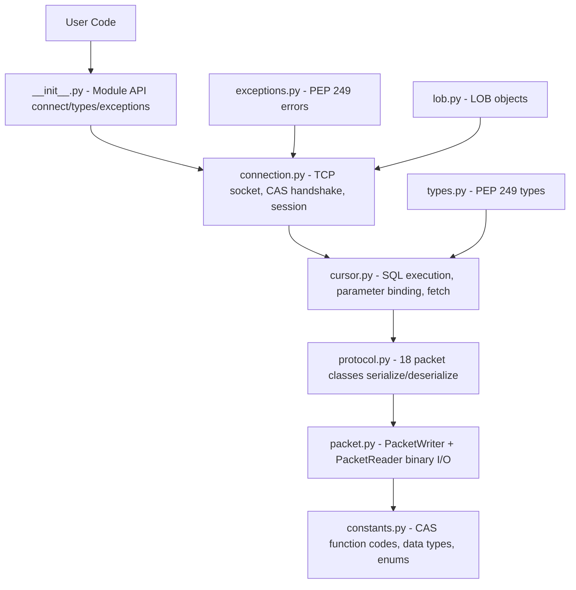

# 개발 가이드 (한국어)

> 🌐 [DEVELOPMENT.md](https://github.com/cubrid-lab/pycubrid/blob/main/docs/DEVELOPMENT.md)의 번역입니다. 영어 원문이 표준이며, 페이지 번역은 경고 수준의 동기화 규칙을 따릅니다.

pycubrid를 설정·테스트·기여하는 데 필요한 모든 것.

---

## 목차

- [사전 준비](#사전-준비)
- [설치](#설치)
- [프로젝트 구조](#프로젝트-구조)
- [테스트 실행](#테스트-실행)
  - [오프라인 테스트](#오프라인-테스트)
  - [통합 테스트](#통합-테스트)
  - [코드 커버리지](#코드-커버리지)
- [Docker 설정](#docker-설정)
- [코드 스타일](#코드-스타일)
- [Makefile 명령](#makefile-명령)
- [CI/CD](#cicd)
- [아키텍처 개요](#아키텍처-개요)
- [새 패킷 타입 추가](#새-패킷-타입-추가)
- [새 데이터 타입 추가](#새-데이터-타입-추가)
- [릴리스 절차](#릴리스-절차)

---

## 사전 준비

| 요구사항      | 버전    | 비고 |
|---------------|---------|------|
| Python        | 3.10+   | `X \| Y` 유니언 구문, `match` 문 사용 |
| Docker        | 최신    | 통합 테스트에만 필요 |
| CUBRID Server | 10.2–11.4 | Docker 또는 로컬 설치 |

---

## 설치

```bash
# 저장소 클론
git clone https://github.com/cubrid-lab/pycubrid.git
cd pycubrid

# dev 의존성과 함께 개발 모드로 설치
pip install -e ".[dev]"

# 또는 Makefile 사용
make install
```

### dev 의존성

| 패키지      | 용도 |
|-------------|------|
| `pytest`    | 테스트 프레임워크 |
| `pytest-cov`| 커버리지 리포트 |
| `ruff`      | 린터와 포매터 |

---

## 프로젝트 구조

```mermaid
graph TD
    root[pycubrid/]

    pkg["pycubrid/ - Main package (9 modules)"]
    tests[tests/ - Test suite]
    docs[docs/ - Documentation]
    pyproject[pyproject.toml - Package configuration]
    makefile[Makefile - Development commands]
    compose[docker-compose.yml - CUBRID container setup]
    changelog[CHANGELOG.md - Release history]
    contributing[CONTRIBUTING.md - Contribution guidelines]
    license[LICENSE - MIT license]
    readme[README.md - Project overview]

    root --> pkg
    root --> tests
    root --> docs
    root --> pyproject
    root --> makefile
    root --> compose
    root --> changelog
    root --> contributing
    root --> license
    root --> readme

    pkg --> init[__init__.py - Public API, PEP 249 module attributes]
    pkg --> connection["connection.py - Connection class (TCP, CAS handshake)"]
    pkg --> cursor["cursor.py - Cursor class (execute, fetch, iterate)"]
    pkg --> types[types.py - PEP 249 type objects and constructors]
    pkg --> exceptions[exceptions.py - Full PEP 249 exception hierarchy]
    pkg --> constants["constants.py - CAS protocol enums (41 function codes, 27+ types)"]
    pkg --> protocol["protocol.py - 18 packet classes (serialize/deserialize)"]
    pkg --> packet[packet.py - PacketWriter + PacketReader primitives]
    pkg --> lob["lob.py - LOB (BLOB/CLOB) support"]
    pkg --> typed[py.typed - PEP 561 marker]

    tests --> conftest["conftest.py - Shared fixtures (mock connection, mock socket)"]
    tests --> test_connection[test_connection.py - Connection lifecycle tests]
    tests --> test_cursor[test_cursor.py - Cursor operations tests]
    tests --> test_types[test_types.py - Type object tests]
    tests --> test_exceptions[test_exceptions.py - Exception hierarchy tests]
    tests --> test_constants[test_constants.py - Constants enumeration tests]
    tests --> test_protocol[test_protocol.py - Packet serialization/deserialization tests]
    tests --> test_packet[test_packet.py - PacketWriter/PacketReader tests]
    tests --> test_lob[test_lob.py - LOB tests]
    tests --> test_pep249[test_pep249.py - PEP 249 compliance tests]
    tests --> test_integration["test_integration.py - Live DB integration tests (requires Docker)"]
    tests --> test_suite[test_suite.py - Extended test suite]

    docs --> doc_connection[CONNECTION.md - Connection guide]
    docs --> doc_types[TYPES.md - Type system reference]
    docs --> doc_api[API_REFERENCE.md - Complete API documentation]
    docs --> doc_protocol[PROTOCOL.md - CAS protocol reference]
    docs --> doc_dev[DEVELOPMENT.md - This file]
    docs --> doc_examples[EXAMPLES.md - Usage examples]
```



---

## 테스트 실행

### 오프라인 테스트

대부분의 테스트는 **오프라인**입니다 — CUBRID 연결을 목킹하고 데이터베이스 없이 패킷 직렬화, 커서 로직, 타입 매핑, 예외 처리를 테스트합니다.

```bash
# 커버리지와 함께 모든 오프라인 테스트 실행
pytest tests/ -v --ignore=tests/test_integration.py \
  --cov=pycubrid --cov-report=term-missing --cov-fail-under=95

# 또는 Makefile 사용
make test
```

### 통합 테스트

통합 테스트는 실행 중인 CUBRID 인스턴스가 필요합니다. Docker 사용:

```bash
# CUBRID 시작
docker compose up -d

# 연결 URL 설정
export CUBRID_TEST_URL="cubrid://dba@localhost:33000/testdb"

# 통합 테스트 실행
pytest tests/test_integration.py -v

# 정리
docker compose down -v
```

#### 비동기 TLS 통합 테스트

`tests/test_aio_ssl_integration.py`는 `pycubrid.aio`의 비동기 TLS 커버리지를 추가합니다.
저장소의 기본 `docker-compose.yml`은 평문 브로커만 시작하므로, 별도의 TLS 활성 브로커를 가리키지 않는 한 이 테스트들은 건너뜁니다.

필요에 따라 일반 통합 변수에 이 TLS 오버라이드를 추가로 내보내세요:

```bash
export CUBRID_TLS_TEST_HOST=localhost
export CUBRID_TLS_TEST_PORT=33001
export CUBRID_TLS_TEST_DB=testdb
export CUBRID_TLS_TEST_USER=dba
export CUBRID_TLS_TEST_PASSWORD=

# 선택: ssl.SSLContext/load_verify_locations()용 사설 CA 번들.
export CUBRID_TLS_TEST_CA_FILE="$PWD/certs/ca.pem"

# 선택: 호스트명 불일치 커버리지용 대체 도달 가능 호스트/IP.
export CUBRID_TLS_TEST_MISMATCH_HOST=127.0.0.1

# test_aio_ssl_connect_default_context가 사설 CA를 쓰면,
# pytest 실행 전에 프로세스 기본 신뢰 저장소도 그 CA로 지정.
export SSL_CERT_FILE="$CUBRID_TLS_TEST_CA_FILE"
```

브로커 측 TLS가 이미 활성화되어 있어야 하고(`cubrid_broker.conf`의 `SSL=ON`) 브로커 인증서가 `CUBRID_TLS_TEST_HOST`와 일치해야 합니다. 그런 다음:

```bash
pytest tests/test_aio_ssl_integration.py -v
```

##### CI의 자동화된 TLS 커버리지

일상 개발에서 위 단계를 로컬로 실행할 필요는 없습니다 — `.github/workflows/integration-full.yml`에 다음을 수행하는 `integration-tls` 잡(Python {3.10, 3.14} × CUBRID 11.4)이 포함되어 있습니다:

1. CUBRID 11.4 컨테이너를 수동으로 시작 (컨테이너 기동 후 브로커 설정을 패치할 수 있도록).
2. 새 자가 서명 인증서를 생성하고(`CN=localhost`, `SAN=DNS:localhost`), `cas_ssl_cert.{crt,key}`로 컨테이너에 주입한 뒤 `BROKER1`의 `SSL=OFF` → `SSL=ON`으로 전환하고 브로커를 재시작해 새 인증서가 반영되게 함.
3. 생성된 CA 번들을 `CUBRID_TLS_TEST_CA_FILE`과 `SSL_CERT_FILE`로 Python 테스트 픽스처에 내보냄.
4. 실제 TLS 핸드셰이크로 브로커를 프로브하고, TLS가 실제로 서비스 중이 아니면 잡을 크게 실패시킴 — 조용한 스킵은 명시적으로 거부됨.
5. `CUBRID_TLS_TEST_*` 환경 변수를 자동 연결해 TLS 브로커에 대해 `tests/test_aio_ssl_integration.py`를 실행.

> **Python 3.10 참고**: 비동기 TLS 테스트 하나(`test_aio_ssl_handshake_failure`)는 알려진 CPython asyncio TLS 핸드셰이크 버그로 인해 Python 3.10에서 스킵하도록 버전이 고정되어 있습니다 — `asyncio.loop.start_tls()`가 3.10에서 인증서 검증 실패 시 멈춥니다 (3.13/3.14에서 수정). [#156](https://github.com/cubrid-lab/pycubrid/issues/156)으로 추적.

이 잡은 `integration-full`의 나머지와 같은 트리거(나이틀리, 태그 푸시, `workflow_dispatch`)로 실행됩니다.

### 코드 커버리지

현재 테스트 지표:

| 지표 | 값 |
|--------|-------|
| 오프라인 테스트 | 471 |
| 통합 테스트 | 41 |
| 문장 커버리지 | 99.88% |
| 문장 수 | 1,134 |
| 미커버 | 1 |
| CI 임계값 | 95% |

```bash
# HTML 커버리지 리포트 생성
pytest tests/ --ignore=tests/test_integration.py \
  --cov=pycubrid --cov-report=html

# 브라우저에서 열기
open htmlcov/index.html
```

---

## Docker 설정

### docker-compose.yml

```yaml
services:
  cubrid:
    image: cubrid/cubrid:11.2
    container_name: cubrid-test
    ports:
      - "33000:33000"
    environment:
      CUBRID_DB: testdb
```

### 명령

```bash
# 기본 CUBRID 11.2로 시작
docker compose up -d

# 특정 버전으로 시작
CUBRID_VERSION=11.4 docker compose up -d

# 컨테이너 상태 확인
docker compose ps

# 로그 보기
docker compose logs -f cubrid

# 중지 및 정리
docker compose down -v
```

### 연결 상세

| 파라미터 | 값 |
|-----------|-------|
| Host | `localhost` |
| Port | `33000` |
| Database | `testdb` |
| User | `dba` |
| Password | (비어 있음) |

---

## 코드 스타일

### Ruff 설정

```toml
[tool.ruff]
line-length = 100
target-version = "py310"
```

### 관례

- **임포트**: 모든 모듈에 `from __future__ import annotations`
- **타입 힌트**: 완전한 타이핑. PEP 561 준수 (`py.typed`)
- **super()**: 항상 `super().__init__()`, 절대 `super(ClassName, self)` 아님
- **행 길이**: 100자
- **독스트링**: 모든 공개 메서드와 클래스에 Google 스타일
- **네이밍**:
  - 클래스: `PascalCase` (예: `PacketWriter`, `ColumnMetaData`)
  - private 메서드: `_underscore_prefix` (예: `_parse_byte`, `_write_int`)
  - 상수: `UPPER_SNAKE_CASE` (예: `CAS_INFO`, `DATA_LENGTH`)

### 린팅

```bash
# 문제 확인
make lint

# 자동 수정
make format

# 또는 수동으로
ruff check pycubrid/ tests/
ruff format pycubrid/ tests/
```

### 안티패턴 (절대 금지)

- SQL 쿼리에 f-string 보간 금지 (SQL 인젝션 위험)
- `super(ClassName, self)` 금지 — `super()`만 사용
- Python 2 구조 금지
- 빈 `except` 블록 금지 (`close()` 같은 정리 경로는 예외)
- 타입 억제 금지 (설명 없는 `# type: ignore`)

---

## Makefile 명령

| 명령 | 설명 |
|---------|-------------|
| `make install` | 모든 의존성과 함께 개발 모드 설치 |
| `make test` | 커버리지와 함께 오프라인 테스트 실행 |
| `make lint` | ruff check + format 검사 실행 |
| `make format` | 린트와 포맷 문제 자동 수정 |
| `make integration` | Docker → 통합 테스트 → 정리 |
| `make clean` | 빌드 산출물 제거 |

---

## CI/CD

### GitHub Actions 워크플로

| 워크플로 | 트리거 | 설명 |
|----------|---------|-------------|
| `ci.yml` | main 푸시, PR | 린트 + 오프라인 테스트 (Python 3.10–3.13) + 통합 |
| `python-publish.yml` | GitHub Release | 빌드 후 PyPI 게시 |

### CI 매트릭스

- **오프라인**: Python 3.10, 3.11, 3.12, 3.13
- **통합**: Python {3.10, 3.12} × CUBRID {11.2, 11.4}

---

## 아키텍처 개요



### 데이터 흐름

1. **사용자**가 `cursor.execute("SELECT ...")` 호출
2. **Cursor**가 파라미터를 바인딩하고 `PrepareAndExecutePacket` 생성
3. **Connection**이 `_send_and_receive(packet)` 호출
4. **PacketWriter**가 프로토콜 헤더로 요청 직렬화
5. **Socket**이 CAS 서버로 바이트 전송
6. **Socket**이 응답 바이트 수신
7. **PacketReader**가 응답 역직렬화
8. **Packet**이 컬럼 메타데이터와 행 데이터 파싱
9. **Cursor**가 `fetchone()`/`fetchall()`을 위해 행 저장

---

## 새 패킷 타입 추가

새 CAS 함수를 추가하려면:

1. `constants.py`의 `CASFunctionCode`에 함수 코드 추가:

   ```python
   class CASFunctionCode(IntEnum):
       # ... 기존 코드들 ...
       MY_NEW_FUNCTION = 42
   ```

2. `protocol.py`에 패킷 클래스 생성:

   ```python
   class MyNewPacket:
       """Description (FC=42)."""

       def __init__(self, arg1: int) -> None:
           self.arg1 = arg1
           self.result: str = ""

       def write(self, cas_info: bytes) -> bytes:
           writer = PacketWriter()
           writer._write_byte(CASFunctionCode.MY_NEW_FUNCTION)
           writer.add_int(self.arg1)
           payload = writer.to_bytes()
           header = build_protocol_header(len(payload), cas_info)
           return header + payload

       def parse(self, data: bytes) -> None:
           reader = PacketReader(data)
           _ = reader._parse_bytes(DataSize.CAS_INFO)
           response_code = reader._parse_int()
           if response_code < 0:
               remaining = len(data) - 8
               _raise_error(reader, remaining)
           # 결과별 데이터 파싱
           self.result = reader._parse_null_terminated_string(response_code)
   ```

3. `tests/test_protocol.py`에 테스트 추가:

   ```python
   def test_my_new_packet_write():
       packet = MyNewPacket(arg1=42)
       data = packet.write(b"\x00\x00\x00\x00")
       assert len(data) > 8  # 헤더 + 페이로드
   ```

---

## 새 데이터 타입 추가

새 CUBRID 데이터 타입을 지원하려면:

1. `constants.py`의 `CUBRIDDataType`에 타입 코드 추가
2. `protocol.py`의 `_read_value()`에 리더 추가
3. `packet.py`의 `PacketWriter`에 라이터 추가 (필요 시)
4. 읽기와 쓰기 양쪽에 테스트 추가

---

## 릴리스 절차

1. `pyproject.toml`과 `pycubrid/__init__.py`에서 버전 갱신
2. `CHANGELOG.md`에 변경 이력 항목 추가
3. 커밋: `git commit -m "chore: bump version to X.Y.Z"`
4. 태그: `git tag vX.Y.Z`
5. 푸시: `git push origin main --tags`
6. GitHub 릴리스 생성: `gh release create vX.Y.Z`
7. PyPI 게시는 릴리스 워크플로에서 자동 트리거
