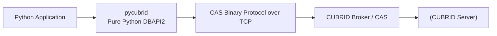
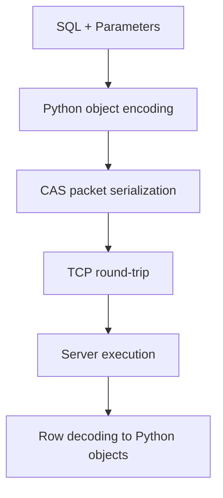
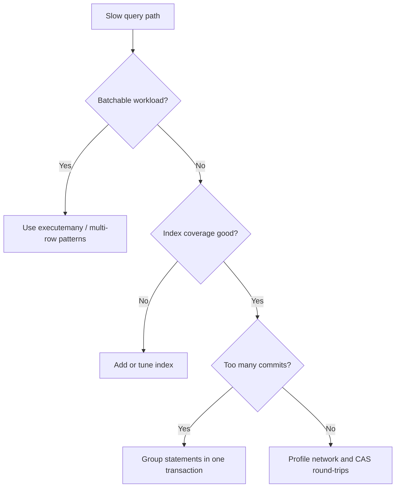
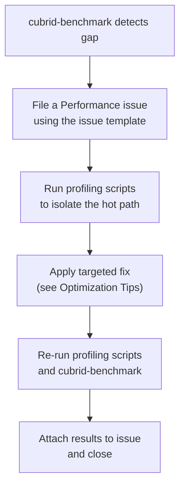

# 성능 가이드 (한국어)

> 🌐 [PERFORMANCE.md](https://github.com/cubrid-lab/pycubrid/blob/main/docs/PERFORMANCE.md)의 번역입니다. 영어 원문이 표준이며, 페이지 번역은 경고 수준의 동기화 규칙을 따릅니다.

이 가이드는 `pycubrid`의 벤치마크 동작을 요약하고 실용적인 튜닝 단계를 안내합니다.

---

## 목차

- [개요](#개요)
- [벤치마크 결과](#벤치마크-결과)
- [성능 특성](#성능-특성)
- [최적화 팁](#최적화-팁)
- [성능 조사](#성능-조사)
- [타이밍·프로파일링 훅](#타이밍--프로파일링-훅)
- [벤치마크 실행](#벤치마크-실행)

---

## 개요

`pycubrid`는 CAS 바이너리 프로토콜로 CUBRID와 통신하는 순수 Python DBAPI2 드라이버입니다.





---

## 벤치마크 결과

출처: [cubrid-benchmark](https://github.com/cubrid-lab/cubrid-benchmark)

환경: Intel Core i5-9400F @ 2.90GHz, 6코어, Linux x86_64, Docker 컨테이너.

워크로드: Python `pycubrid` vs `PyMySQL`, 10000행 × 5라운드.

| 시나리오 | CUBRID (pycubrid) | MySQL (PyMySQL) | 비율 (CUBRID/MySQL) |
|---|---:|---:|---:|
| insert_sequential | 10.47s | 1.74s | 6.0x |
| select_by_pk | 15.99s | 3.52s | 4.5x |
| select_full_scan | 10.31s | 1.86s | 5.5x |
| update_indexed | 10.70s | 2.19s | 4.9x |
| delete_sequential | 10.75s | 2.10s | 5.1x |

---

## 성능 특성

- `pycubrid`는 순수 Python이므로 패킷 인코딩/디코딩과 행 변환이 인터프리터에서 실행됩니다.
- `PyMySQL`은 스택 일부에서 선택적 C 가속의 이점을 받아 CPU 오버헤드가 줄어듭니다.
- CAS는 명시적 패킷 프레이밍과 파싱을 가진 바이너리 프로토콜을 사용합니다 — 요청별 작업이 추가됩니다.
- 작고 잦은 쿼리는 Python 수준 오버헤드와 왕복 오버헤드를 증폭시킵니다.
- 호출을 배치하고 트랜잭션 경계를 제어하면 처리량이 개선됩니다.

---

## 최적화 팁

- 쓰기 폭주 시 문장별 커밋 대신 명시적 트랜잭션을 사용하세요.
- 가능하면 `executemany()`로 삽입과 갱신을 배치하세요.
- 반복되는 핸드셰이크 비용을 피하기 위해 장수명 연결을 재사용하세요.
- 필요한 컬럼만 선택하고 불필요한 전체 스캔을 피하세요.
- 핫 조건자에 인덱스를 유지하고 CUBRID에서 실행 계획을 검증하세요.



---

## 성능 조사

[cubrid-benchmark](https://github.com/cubrid-lab/cubrid-benchmark)가 측정 가능한 격차나 회귀를 감지할 때 이 워크플로를 사용하세요. 목표는 재현·프로파일·수정·검증입니다 — 쉽게 낡는 하드코딩 임계값 없이.

### 조사 시점

- 벤치마크 실행이 이 문서에 기록된 기준선 대비 비율 증가를 보일 때.
- CI 실행이 이전 실행 수치와의 편차를 플래그할 때.
- 핫 경로(protocol.py, packet.py, cursor.py)에 변경을 제출하기 직전.

### 워크플로



1. **이슈 제출** — [성능 조사 템플릿](https://github.com/cubrid-lab/pycubrid/blob/main/.github/ISSUE_TEMPLATE/performance.yml)을 사용하세요. 벤치마크 출력을 붙여넣고 이를 촉발한 CI 실행을 링크하세요.

2. **영향받는 연산 프로파일링** — 느린 연산에 맞는 스크립트를 고르세요:

   | 연산 | 스크립트 |
   |-----------|--------|
   | 연결 핸드셰이크 | `scripts/profile_connect.py` |
   | INSERT / SELECT / UPDATE / DELETE | `scripts/profile_execute.py` |
   | 행 가져오기 (fetchone/fetchall/fetchmany) | `scripts/profile_fetch.py` |

3. **최적화** — cProfile의 누적 시간에 따라 상위 프레임에 변경을 집중하세요. 패치는 표적화되게; 투기적 리팩터링은 피하세요.

4. **검증** — 프로파일링 스크립트와 전체 벤치마크 스위트를 재실행하세요. 이슈에 이전/이후 수치를 첨부하세요.

### 프로파일링 스크립트 실행

모든 스크립트는 라이브 CUBRID 인스턴스가 필요합니다. 기본값은 사용자 `dba`로 `localhost:33000/demodb`를 대상으로 합니다.

#### 연결 핸드셰이크

```bash
# connect/close 100사이클 (기본):
python scripts/profile_connect.py

# 커스텀 대상, 50회 반복, .prof 저장:
python scripts/profile_connect.py \
    --host myhost --port 33000 --database testdb \
    --user dba --password secret \
    --iterations 50 --output connect.prof
```

#### 문장 실행

```bash
# 모든 DML 연산, 각 100회 반복 (기본):
python scripts/profile_execute.py

# INSERT만, 200회 반복:
python scripts/profile_execute.py --operation insert --iterations 200

# snakeviz용 .prof 저장:
python scripts/profile_execute.py --output exec.prof
```

#### 결과 가져오기

```bash
# 1000행, fetch 50회 반복 (기본):
python scripts/profile_fetch.py

# 5000행, 20회 반복, fetchmany 배치 크기 100:
python scripts/profile_fetch.py --rows 5000 --iterations 20 --fetch-size 100

# snakeviz용 .prof 저장:
python scripts/profile_fetch.py --output fetch.prof
```

#### snakeviz로 .prof 파일 시각화

```bash
pip install snakeviz
snakeviz profile_output.prof
```

snakeviz는 브라우저에서 인터랙티브 플레임 그래프를 열어 중첩 호출 스택을 파고들기 쉽게 합니다.

---

## 타이밍·프로파일링 훅

가벼운 프로세스 내 진단을 위해서는 위의 cProfile 기반 스크립트 대신 드라이버 내장 타이밍 계측을 옵트인할 수 있습니다. 훅은 **기본 꺼짐**입니다 — 비활성 시 타이밍 모듈을 임포트하지 않고 핫 경로가 그대로 실행됩니다.

### 무엇을 쓸지

| 사용 사례 | 도구 |
|---|---|
| "내 애플리케이션에서 `connect` / `execute` / `fetch` / `close`에 실제 시간이 얼마나 가나?" | `enable_timing=True` (이 섹션) |
| "`cursor.execute` 내부의 어느 Python 프레임이 뜨거운가?" | `scripts/profile_execute.py` (cProfile) |
| "제어된 워크로드에서 pycubrid와 PyMySQL 비교는?" | [cubrid-benchmark](https://github.com/cubrid-lab/cubrid-benchmark) |

### 활성화

`pycubrid.connect()`에 `enable_timing=True` 키워드를 전달하세요:

```python
import pycubrid

conn = pycubrid.connect(
    host="localhost", port=33000, database="testdb", user="dba",
    enable_timing=True,
)
```

또는 환경 변수를 설정해 프로세스의 모든 연결에 타이밍을 활성화하세요 — 벤치마크 하니스와 CI 잡에서 유용합니다:

```bash
export PYCUBRID_ENABLE_TIMING=1   # true / yes도 허용 (대소문자 무시)
python my_workload.py
```

명시적 키워드가 항상 환경 변수보다 우선합니다. 비동기 연결도 `pycubrid.aio.connect()`에서 같은 키워드를 지원합니다.

### 통계 읽기

```python
cur = conn.cursor()
cur.executemany(
    "INSERT INTO bench (n) VALUES (?)",
    [(i,) for i in range(1000)],
)
cur.execute("SELECT n FROM bench")
cur.fetchall()

stats = conn.timing_stats
print(stats)
# TimingStats(connect=1 calls, 12.345ms total, 12.345ms avg,
#             execute=2 calls, 18.700ms total, 9.350ms avg,
#             fetch=1 calls, 4.200ms total, 4.200ms avg,
#             close=0 calls)

# 프로그래밍 방식 접근 (나노초, int):
exec_avg_ms = stats.execute_total_ns / stats.execute_count / 1_000_000
print(f"average execute: {exec_avg_ms:.3f} ms")

# 단계 사이에 리셋
stats.reset()
```

타이밍이 비활성화되면 `Connection.timing_stats`는 `None`이므로 그에 맞게 방어하세요:

```python
if conn.timing_stats is not None:
    print(conn.timing_stats)
```

### 분류와 세분성

| 분류 | 다루는 것 |
|---|---|
| `connect` | TCP 소켓 설정 + CAS 브로커 핸드셰이크 + 데이터베이스 열기. 실패 시에도 기록됨. |
| `execute` | `Cursor.execute()`와 `executemany()` — prepare-and-execute 왕복을 포함. |
| `fetch` | `fetchone()` / `fetchmany()` / `fetchall()` 합산. |
| `close` | `Connection.close()` — `CloseDatabasePacket` 왕복 + 소켓 해체. |

연결에서 만들어진 모든 커서는 같은 `TimingStats`에 보고합니다. 통계는 **연결별**이며 마지막 `reset()` 이후 누적됩니다.

### 오버헤드와 스레드 안전성

- **비활성** — 타이밍 모듈이 임포트되지 않음. 호출당 비용은 속성 읽기 하나(`self._timing is None`).
- **활성** — 훅당 `time.perf_counter_ns()` 두 번 호출과 잠금 보호 누산기 갱신 (~수백 나노초).
- `TimingStats` 내부의 `threading.Lock` 덕분에 워커 스레드가 연결을 구동하는 동안 모니터링 스레드가 안전하게 카운터를 읽을 수 있습니다. 연결 자체는 여전히 `threadsafety = 1`입니다 (스레드당 연결 하나).

### 한계

- 비동기 타이밍에는 이벤트 루프 스케줄링 지연이 포함됩니다 — 순수 서버 시간이 아니라 클라이언트 측 종단 간 지연으로 다루세요.
- 카운터는 누적만 가능 — 문장별 이력이 없습니다. 문장별 세분화가 필요하면 [성능 조사](#성능-조사)의 cProfile 기반 스크립트를 실행하세요.
- `ping()`과 `commit()` / `rollback()`은 현재 타이밍에 포함되지 않습니다.

---

## 벤치마크 실행

1. 벤치마크 스위트 클론: `git clone https://github.com/cubrid-lab/cubrid-benchmark`
2. 그 저장소의 문서대로 벤치마크 컨테이너와 데이터베이스를 시작하세요.
3. 제공된 러너로 Python 벤치마크 시나리오(`pycubrid` vs `PyMySQL`)를 실행하세요.
4. 여러 라운드를 실행하세요 (공개된 실행은 10000행 × 5라운드 사용).
5. 추세 분석을 위해 결과 산출물(JSON/markdown 표)을 내보내고 비교하세요.

정확한 명령과 벤치마크 하니스 상세는 벤치마크 저장소의 README와 스크립트를 사용하세요.
