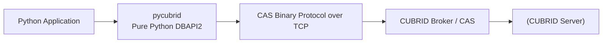
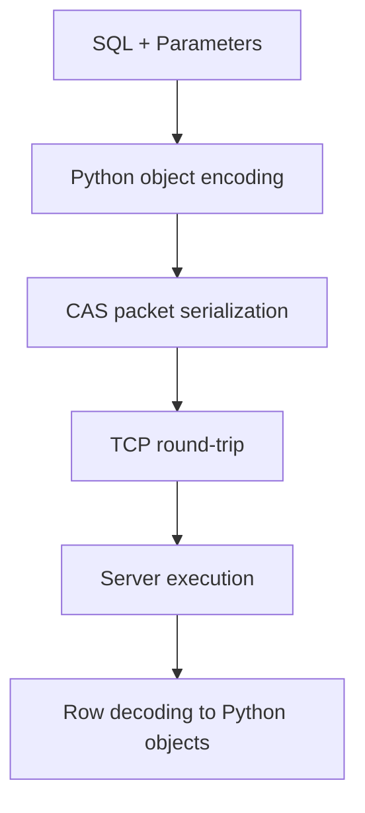
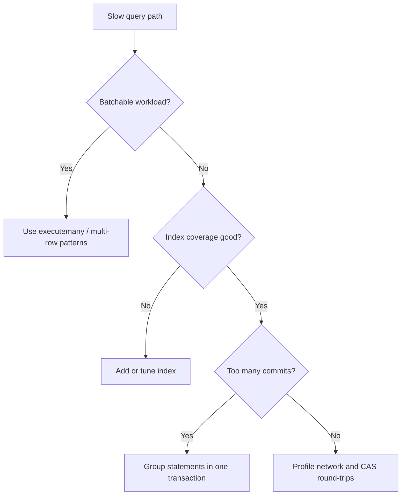
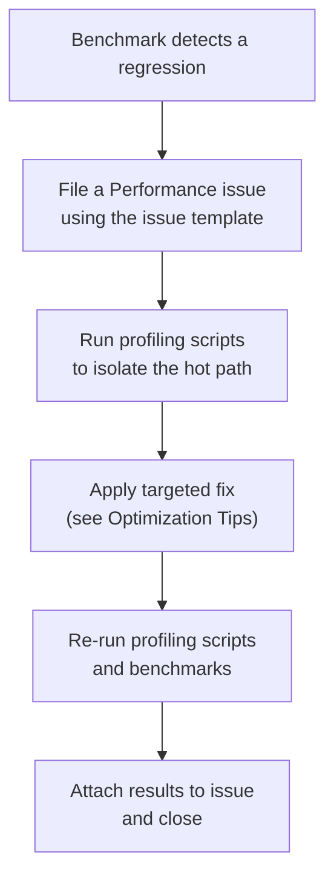

# 성능 가이드 (한국어)

> 🌐 [PERFORMANCE.md](https://github.com/cubrid-lab/pycubrid/blob/main/docs/PERFORMANCE.md)의 번역입니다. 영어 원문이 표준이며, CI가 영어 원문과의 구조 일치를 검사합니다.

이 가이드는 CUBRID에서 동작하는 `pycubrid`의 성능을 다룹니다. 성능을 측정하는 방법, 현재 릴리스에서 측정된 항목, 프로파일링과 튜닝 방법을 설명합니다.

이 가이드는 CUBRID를 다른 데이터베이스 엔진과 비교하지 않습니다. 엔진 간 비교는 서버 엔진의 차이와 드라이버 오버헤드가 섞여 있어 드라이버가 얼마나 빠른지 알려 주지 못합니다.

---

## 목차

- [성능 개요](#성능-개요)
- [벤치마크 방법론](#벤치마크-방법론)
- [현재 릴리스 기준선](#현재-릴리스-기준선)
- [성능 회귀](#성능-회귀)
- [동기와 비동기 특성](#동기와-비동기-특성)
- [배치 처리](#배치-처리)
- [Fetch와 메모리 성능](#fetch와-메모리-성능)
- [프로파일링과 최적화](#프로파일링과-최적화)
- [알려진 한계](#알려진-한계)
- [재현 가이드](#재현-가이드)

---

<a id="성능-개요"></a>

## 성능 개요

`pycubrid`는 CAS 바이너리 프로토콜로 CUBRID와 통신하는 순수 Python DBAPI2 드라이버입니다.


```mermaid
flowchart LR
    App[Python Application] --> Driver[pycubrid\nPure Python DBAPI2]
    Driver --> CAS[CAS Binary Protocol over TCP]
    CAS --> Broker[CUBRID Broker / CAS]
    Broker --> Server["(CUBRID Server)"]
```


```mermaid
flowchart TD
    Q[SQL + Parameters] --> Encode[Python object encoding]
    Encode --> Packet[CAS packet serialization]
    Packet --> Net[TCP round-trip]
    Net --> Exec[Server execution]
    Exec --> Decode[Row decoding to Python objects]
```

- `pycubrid`는 순수 Python이므로 패킷 인코딩/디코딩과 행 변환이 인터프리터에서 실행됩니다.
- CAS는 명시적 패킷 프레이밍과 파싱을 가진 바이너리 프로토콜을 사용합니다 — 요청별 작업이 추가됩니다.
- 작고 잦은 쿼리는 Python 수준 오버헤드와 왕복 오버헤드를 증폭시킵니다.
- 호출을 배치하고 트랜잭션 경계를 제어하면 처리량이 개선됩니다.

드라이버 성능은 같은 CUBRID 서버에서 두 가지 기준으로 추적합니다:

- **릴리스 간 비교** — 현재 `pycubrid` 릴리스와 이전 릴리스.
- **드라이버 오버헤드** — `pycubrid`와 공식 `CUBRIDdb` 드라이버.

---

<a id="벤치마크-방법론"></a>

## 벤치마크 방법론

벤치마크 결과는 드라이버만 바뀔 때에만 의미가 있습니다.

- **같은 서버.** 측정 대상 드라이버나 릴리스를 모두 같은 호스트, 같은 스키마와 데이터를 가진 같은 CUBRID 서버에서 실행하세요. 데이터베이스 엔진이 다른 결과끼리 비교하지 마세요.
- **같은 트랜잭션 모드.** 측정하는 모든 연결에서 `autocommit`을 명시적으로 설정하세요. 드라이버마다 기본값이 다르고, 문장마다 커밋하면 결과가 달라집니다.
- **환경 기록.** CPU, OS, Python 버전, CUBRID 버전, `pycubrid` 버전, `fetch_size`.
- **반복.** 한 번의 실행이 아니라 여러 라운드를 실행하고 중앙값과 분산을 보고하세요.

이 저장소의 도구:

| 도구 | 측정 대상 | 서버 필요 |
|---|---|---|
| `tests/test_benchmarks.py` | 연결, 단일 행 CRUD, 100행 삽입/조회, prepared 재사용 (pytest-benchmark) | 예 |
| `tests/test_bench_fetch_parsing.py` | 합성 2000행 응답의 FETCH 응답 파싱 | 아니요 |
| `scripts/bench_regression.py` | 두 pytest-benchmark JSON 파일 간 중앙값 변화 | 아니요 |
| `scripts/profile_*.py` | connect, execute, fetch의 cProfile | 예 |

더 큰 워크로드와 드라이버 비교용 하니스는 [cubrid-benchmark](https://github.com/cubrid-lab/cubrid-benchmark)에 있습니다.

---

<a id="현재-릴리스-기준선"></a>

## 현재 릴리스 기준선

현재 릴리스에 대해 공개된 벤치마크 수치는 아직 없습니다. 기준선은 [#797](https://github.com/cubrid-lab/pycubrid/issues/797)에서 추적합니다.

| 측정 항목 | 상태 |
|---|---|
| 현재 릴리스와 1.10.0 비교 | **측정되지 않음** — [#797](https://github.com/cubrid-lab/pycubrid/issues/797) |
| 같은 서버에서 `pycubrid`와 `CUBRIDdb` 비교 | **측정되지 않음** — [#797](https://github.com/cubrid-lab/pycubrid/issues/797) |
| 동기와 비동기 비교 | **측정되지 않음** — [#797](https://github.com/cubrid-lab/pycubrid/issues/797) |
| `executemany()` 배치 처리량 | **측정되지 않음** — [#797](https://github.com/cubrid-lab/pycubrid/issues/797) |
| `fetch_size`별 fetch 처리량과 최대 메모리 | **측정되지 않음** — [#797](https://github.com/cubrid-lab/pycubrid/issues/797) |

<a id="과거-결과-2026-03-pycubrid-050"></a>

### 과거 결과 (2026-03, pycubrid 0.5.0)

가장 처음 공개된 `pycubrid` 측정값은 `cubrid-benchmark`의 [`baseline-multilang` 실험](https://github.com/cubrid-lab/cubrid-benchmark/tree/main/experiments/baseline-multilang)에 수정 없이 보존되어 있습니다 (실행 `2026-03-16_initial`: `pycubrid` 0.5.0, CPython 3.10.12, Docker의 CUBRID 11.2).

이 수치는 **과거 결과**이며 현재 릴리스의 기준선이 아닙니다. 알려진 한계:

- 커서 메모리 제한 수정([#203](https://github.com/cubrid-lab/pycubrid/issues/203), [PR #207](https://github.com/cubrid-lab/pycubrid/pull/207), 1.6.0에서 릴리스) 이전에 측정되었습니다. 이 수정 전에는 `Cursor`와 `AsyncCursor`가 결과 집합 전체를 행 버퍼에 보관했으므로, 그 시기의 fetch 수치는 현재 동작을 반영하지 않습니다.
- 0.6.0에서 릴리스된 fetch 수정(커밋 `bb687dc`) 이전에 측정되었습니다. 0.5.0에서는 `fetchall()`이 첫 번째 fetch 배치만 반환했으므로, 배치 하나보다 많이 읽는 SELECT 시나리오는 결과 전체를 읽지 않았습니다.
- 그 실험은 두 데이터베이스 엔진을 비교합니다. 이 가이드는 페이지 첫머리에서 설명한 이유로 그 비교를 싣지 않습니다.

---

<a id="성능-회귀"></a>

## 성능 회귀

주간 **Bug Hunt** 워크플로(`.github/workflows/bug-hunt.yml`, 잡 `perf-trend`)는 CUBRID 11.4에서 `tests/test_benchmarks.py`를 실행하고 `scripts/bench_regression.py`로 이전 실행과 중앙값을 비교합니다. 이것은 추세 보고서입니다: 실패 임계값을 두지 않으며 풀 리퀘스트나 릴리스를 막지 않습니다.

릴리스 간 비교는 아직 **측정되지 않음** — [#797](https://github.com/cubrid-lab/pycubrid/issues/797) 참고.

다음과 같을 때 조사하세요:

- 추세 보고서가 이전 실행 대비 중앙값 증가를 보일 때.
- CI 실행이 이전 실행 수치와의 편차를 플래그할 때.
- 핫 경로(protocol.py, packet.py, cursor.py)에 변경을 제출하기 직전.

### 두 실행 비교

```bash
# 이전 코드와 새 코드에서 라이브 마이크로벤치마크 실행:
pytest tests/test_benchmarks.py --benchmark-enable --benchmark-json=before.json
pytest tests/test_benchmarks.py --benchmark-enable --benchmark-json=after.json

# 벤치마크별 중앙값 변화 보고 (회귀 시 실패하려면 --fail-threshold PCT 추가):
python scripts/bench_regression.py --baseline before.json --current after.json
```

### FETCH 응답 파싱 (오프라인)

`tests/test_bench_fetch_parsing.py`는 서버 없이 FC8 FETCH 응답 파싱 시간을
측정합니다(#559). 스칼라, 텍스트, 혼합(NULL 포함), 컬렉션 워크로드에 대해 fuzz
시드 빌더로 만든 2000행 합성 응답을 사용하고, 모든 파싱 결과를 빌더가 정한 정확한
기대 행과 비교합니다. `--benchmark-enable` 없이 실행하면 각 워크로드를 한 번만
파싱하는 정확성 테스트가 되므로, 필수 CI에는 시간 임계값이 없습니다.

```bash
# 시간 측정 (워밍업 3회 후 30라운드), 최대 할당량은 extra_info에 기록:
pytest tests/test_bench_fetch_parsing.py --benchmark-enable \
    --benchmark-json=fetch-parse.json

# 두 실행 비교:
python scripts/bench_regression.py --baseline before.json --current after.json
```

---

<a id="동기와-비동기-특성"></a>

## 동기와 비동기 특성

- `pycubrid.connect()`는 블로킹 `Connection`을, `pycubrid.aio.connect()`는 블로킹 대신 네트워크 I/O를 await하는 `AsyncConnection`을 반환합니다.
- 둘 다 같은 CAS 패킷을 만들고 파싱하므로 요청별 인코딩/디코딩 작업은 같습니다.
- `AsyncConnection`은 `asyncio.Lock`으로 요청을 직렬화합니다: 연결 하나는 한 번에 요청 하나를 실행합니다. 비동기는 하나의 이벤트 루프에서 여러 연결이나 다른 I/O가 동시에 실행될 때 도움이 되며, 연결 하나가 쿼리를 차례로 실행할 때는 도움이 되지 않습니다.
- [타이밍 훅](#타이밍--프로파일링-훅)의 비동기 타이밍에는 이벤트 루프 스케줄링 지연이 포함됩니다.

현재 릴리스의 동기와 비동기 상대 처리량은 **측정되지 않음** — [#797](https://github.com/cubrid-lab/pycubrid/issues/797) 참고.

---

<a id="배치-처리"></a>

## 배치 처리

동기 또는 비동기 커서의 `executemany()`는 문장이 `INSERT`, `UPDATE`, `DELETE`, `MERGE`로 시작하면 배치 경로를 사용합니다:

1. 드라이버가 모든 파라미터 세트를 클라이언트에서 완전한 SQL 문자열로 렌더링합니다 ([파라미터 바인딩](PARAMETER_BINDING.md) 참고).
2. 모든 문자열을 하나의 `BatchExecutePacket`으로 보내므로, 배치 전체가 행마다 왕복하는 대신 한 번의 왕복으로 끝납니다.
3. `rowcount`는 영향받은 행 수의 합입니다.

`SELECT` 같은 다른 문장은 파라미터 세트마다 `execute()`를 한 번씩 호출하는 방식으로 대체됩니다. `executemany_batch(sql_list)`는 이미 렌더링한 SQL 문자열 목록을 같은 단일 요청으로 보냅니다.

실용적인 조언:

- 쓰기 폭주는 문장마다 커밋하지 말고 하나의 명시적 트랜잭션으로 묶으세요.
- 매우 큰 파라미터 시퀀스는 나누어 보내세요. 이유는 [알려진 한계](#알려진-한계)를 참고하세요.

현재 릴리스의 배치 처리량은 **측정되지 않음** — [#797](https://github.com/cubrid-lab/pycubrid/issues/797) 참고.

---

<a id="fetch와-메모리-성능"></a>

## Fetch와 메모리 성능

`fetch_size`는 드라이버가 fetch 왕복마다 CAS 브로커에 요청하는 행 수입니다. 기본값은 `100`입니다. 연결별로 `pycubrid.connect(..., fetch_size=N)`, 커서별로 `cursor.fetch_size = N`(1 이상의 정수)으로 설정합니다.
`fetch_size`는 `arraysize`와 다릅니다: `arraysize`는 `fetchmany()`의 기본 행 수일 뿐입니다.

1.6.0([#203](https://github.com/cubrid-lab/pycubrid/issues/203))부터 각 fetch는 커서의 행 버퍼에 추가하지 않고 버퍼를 교체하므로, 버퍼에는 최대 한 fetch 배치만 남습니다:

- `fetchone()`, `fetchmany()`, 반복(iteration)은 메모리를 `fetch_size`로 제한합니다.
- `fetchall()`은 남은 모든 행으로 리스트 하나를 만들므로 메모리가 결과 집합 크기에 비례해 커집니다. 끝나면 내부 버퍼를 해제합니다.
- `fetch_size`가 크면 왕복이 줄고 배치당 메모리가 늘어나며, 작으면 그 반대입니다.

현재 릴리스에서 `fetch_size` 값별 fetch 처리량과 최대 메모리는 **측정되지 않음** — [#797](https://github.com/cubrid-lab/pycubrid/issues/797) 참고.

<a id="fetch-프로파일링"></a>

### Fetch 프로파일링

`scripts/profile_fetch.py`는 라이브 서버에서 `fetchone`, `fetchmany`, `fetchall`을 프로파일링합니다.

```bash
# 1000행, fetch 50회 반복 (기본):
python scripts/profile_fetch.py

# 5000행, 20회 반복, fetchmany 배치 크기 100:
python scripts/profile_fetch.py --rows 5000 --iterations 20 --fetch-size 100

# snakeviz용 .prof 저장:
python scripts/profile_fetch.py --output fetch.prof
```

---

<a id="프로파일링과-최적화"></a>

## 프로파일링과 최적화

### 최적화 팁

- 쓰기 폭주 시 문장별 커밋 대신 명시적 트랜잭션을 사용하세요.
- 가능하면 `executemany()`로 삽입과 갱신을 배치하세요.
- 반복되는 핸드셰이크 비용을 피하기 위해 장수명 연결을 재사용하세요.
- 필요한 컬럼만 선택하고 불필요한 전체 스캔을 피하세요.
- 핫 조건자에 인덱스를 유지하고 CUBRID에서 실행 계획을 검증하세요.


```mermaid
flowchart TD
    Start[Slow query path] --> Batching{Batchable workload?}
    Batching -->|Yes| ExecMany[Use executemany / multi-row patterns]
    Batching -->|No| Index{Index coverage good?}
    Index -->|No| AddIdx[Add or tune index]
    Index -->|Yes| Txn{Too many commits?}
    Txn -->|Yes| GroupTxn[Group statements in one transaction]
    Txn -->|No| Net[Profile network and CAS round-trips]
```

<a id="성능-조사"></a>

### 성능 조사

벤치마크가 측정 가능한 회귀를 감지할 때 이 워크플로를 사용하세요. 목표는 재현·프로파일·수정·검증입니다 — 쉽게 낡는 하드코딩 임계값 없이.


```mermaid
flowchart TD
    Detect[Benchmark detects a regression] --> Issue[File a Performance issue\nusing the issue template]
    Issue --> Profile[Run profiling scripts\nto isolate the hot path]
    Profile --> Optimize["Apply targeted fix\n(see Optimization Tips)"]
    Optimize --> Verify[Re-run profiling scripts\nand benchmarks]
    Verify --> Close[Attach results to issue\nand close]
```

1. **이슈 제출** — [성능 조사 템플릿](https://github.com/cubrid-lab/pycubrid/blob/main/.github/ISSUE_TEMPLATE/performance.yml)을 사용하세요. 벤치마크 출력을 붙여넣고 이를 촉발한 CI 실행을 링크하세요.

2. **영향받는 연산 프로파일링** — 느린 연산에 맞는 스크립트를 고르세요:

   | 연산 | 스크립트 |
   |-----------|--------|
   | 연결 핸드셰이크 | `scripts/profile_connect.py` |
   | INSERT / SELECT / UPDATE / DELETE | `scripts/profile_execute.py` |
   | 행 가져오기 (fetchone/fetchall/fetchmany) | `scripts/profile_fetch.py` |

3. **최적화** — cProfile의 누적 시간에 따라 상위 프레임에 변경을 집중하세요. 패치는 표적화되게; 투기적 리팩터링은 피하세요.

4. **검증** — 프로파일링 스크립트와 벤치마크를 재실행하세요. 이슈에 이전/이후 수치를 첨부하세요.

### 프로파일링 스크립트 실행

모든 스크립트는 라이브 CUBRID 인스턴스가 필요합니다. 기본값은 사용자 `dba`로 `localhost:33000/demodb`를 대상으로 합니다. `scripts/profile_fetch.py`는 [Fetch 프로파일링](#fetch-프로파일링)을 참고하세요.

#### 연결 핸드셰이크

```bash
# connect/close 100사이클 (기본):
python scripts/profile_connect.py

# 커스텀 대상, 50회 반복, .prof 저장:
python scripts/profile_connect.py \
    --host myhost --port 33000 --database testdb \
    --user dba --password secret \
    --iterations 50 --output connect.prof
```

#### 문장 실행

```bash
# 모든 DML 연산, 각 100회 반복 (기본):
python scripts/profile_execute.py

# INSERT만, 200회 반복:
python scripts/profile_execute.py --operation insert --iterations 200

# snakeviz용 .prof 저장:
python scripts/profile_execute.py --output exec.prof
```

#### snakeviz로 .prof 파일 시각화

```bash
pip install snakeviz
snakeviz profile_output.prof
```

snakeviz는 브라우저에서 인터랙티브 플레임 그래프를 열어 중첩 호출 스택을 파고들기 쉽게 합니다.

<a id="타이밍--프로파일링-훅"></a>

### 타이밍·프로파일링 훅

가벼운 프로세스 내 진단을 위해서는 위의 cProfile 기반 스크립트 대신 드라이버 내장 타이밍 계측을 옵트인할 수 있습니다. 훅은 **기본 꺼짐**입니다 — 비활성 시 타이밍 모듈을 임포트하지 않고 핫 경로가 그대로 실행됩니다.

#### 무엇을 쓸지

| 사용 사례 | 도구 |
|---|---|
| "내 애플리케이션에서 `connect` / `execute` / `fetch` / `close`에 실제 시간이 얼마나 가나?" | `enable_timing=True` (이 섹션) |
| "`cursor.execute` 내부의 어느 Python 프레임이 뜨거운가?" | `scripts/profile_execute.py` (cProfile) |
| "이 변경으로 드라이버가 이전 실행보다 느려졌나?" | [성능 회귀](#성능-회귀) |

#### 활성화

`pycubrid.connect()`에 `enable_timing=True` 키워드를 전달하세요:

```python
import pycubrid

conn = pycubrid.connect(
    host="localhost", port=33000, database="testdb", user="dba",
    enable_timing=True,
)
```

또는 환경 변수를 설정해 프로세스의 모든 연결에 타이밍을 활성화하세요 — 벤치마크 하니스와 CI 잡에서 유용합니다:

```bash
export PYCUBRID_ENABLE_TIMING=1   # true / yes도 허용 (대소문자 무시)
python my_workload.py
```

명시적 키워드가 항상 환경 변수보다 우선합니다. 비동기 연결도 `pycubrid.aio.connect()`에서 같은 키워드를 지원합니다.

#### 통계 읽기

```python
cur = conn.cursor()
cur.executemany(
    "INSERT INTO bench (n) VALUES (?)",
    [(i,) for i in range(1000)],
)
cur.execute("SELECT n FROM bench")
cur.fetchall()

stats = conn.timing_stats
print(stats)
# TimingStats(connect=1 calls, 12.345ms total, 12.345ms avg,
#             execute=2 calls, 18.700ms total, 9.350ms avg,
#             fetch=1 calls, 4.200ms total, 4.200ms avg,
#             close=0 calls)

# 프로그래밍 방식 접근 (나노초, int):
exec_avg_ms = stats.execute_total_ns / stats.execute_count / 1_000_000
print(f"average execute: {exec_avg_ms:.3f} ms")

# 단계 사이에 리셋
stats.reset()
```

타이밍이 비활성화되면 `Connection.timing_stats`는 `None`이므로 그에 맞게 방어하세요:

```python
if conn.timing_stats is not None:
    print(conn.timing_stats)
```

#### 분류와 세분성

| 분류 | 다루는 것 |
|---|---|
| `connect` | TCP 소켓 설정 + CAS 브로커 핸드셰이크 + 데이터베이스 열기. 실패 시에도 기록됨. |
| `execute` | `Cursor.execute()`와 `executemany()` — prepare-and-execute 왕복을 포함. |
| `fetch` | `fetchone()` / `fetchmany()` / `fetchall()` 합산. |
| `close` | `Connection.close()` — `CloseDatabasePacket` 왕복 + 소켓 해체. |

연결에서 만들어진 모든 커서는 같은 `TimingStats`에 보고합니다. 통계는 **연결별**이며 마지막 `reset()` 이후 누적됩니다.

#### 오버헤드와 스레드 안전성

- **비활성** — 타이밍 모듈이 임포트되지 않음. 호출당 비용은 속성 읽기 하나(`self._timing is None`).
- **활성** — 훅당 `time.perf_counter_ns()` 두 번 호출과 잠금 보호 누산기 갱신 (~수백 나노초).
- `TimingStats` 내부의 `threading.Lock` 덕분에 워커 스레드가 연결을 구동하는 동안 모니터링 스레드가 안전하게 카운터를 읽을 수 있습니다. 연결 자체는 여전히 `threadsafety = 1`입니다 (스레드당 연결 하나).

#### 타이밍 한계

- 비동기 타이밍에는 이벤트 루프 스케줄링 지연이 포함됩니다 — 순수 서버 시간이 아니라 클라이언트 측 종단 간 지연으로 다루세요.
- 카운터는 누적만 가능 — 문장별 이력이 없습니다. 문장별 세분화가 필요하면 [성능 조사](#성능-조사)의 cProfile 기반 스크립트를 실행하세요.
- `ping()`과 `commit()` / `rollback()`은 현재 타이밍에 포함되지 않습니다.

---

<a id="알려진-한계"></a>

## 알려진 한계

- **순수 Python.** 패킷 인코딩/디코딩과 행 변환이 인터프리터에서 실행되며, C 확장은 없습니다.
- **`executemany()`는 배치 전체를 메모리에 보관합니다.** 배치 경로는 보내기 전에 모든 파라미터 세트를 SQL 문자열로 렌더링한 뒤, 전부를 하나의 요청으로 직렬화합니다. 클라이언트 메모리는 파라미터 세트의 수와 크기에 비례해 늘어나므로, 매우 큰 시퀀스는 나누어 보내세요.
- **`fetchall()`은 결과를 모두 메모리에 올립니다.** 큰 결과 집합에는 `fetchone()`, `fetchmany()`, 반복을 사용하세요.
- **비동기 타이밍에는 이벤트 루프가 포함됩니다.** [동기와 비동기 특성](#동기와-비동기-특성)을 참고하세요.
- **현재 릴리스 수치 없음.** 기준선은 [#797](https://github.com/cubrid-lab/pycubrid/issues/797)에서 추적하며, 공개된 2026-03 수치는 [과거 결과](#과거-결과-2026-03-pycubrid-050)입니다.

---

<a id="재현-가이드"></a>

## 재현 가이드

1. CUBRID 서버를 시작하세요. 저장소의 `docker compose up -d`는 `localhost:33000`에 데이터베이스 `testdb`로 서버를 시작합니다 ([개발 가이드](DEVELOPMENT.md) 참고).
2. 비교하는 각 버전에서 같은 호스트와 서버로 마이크로벤치마크를 실행하고 JSON 출력을 저장하세요.
3. `scripts/bench_regression.py`로 실행 결과를 비교하세요.
4. 더 큰 워크로드나 같은 서버에서 `pycubrid`와 `CUBRIDdb`를 비교하려면 [cubrid-benchmark](https://github.com/cubrid-lab/cubrid-benchmark) 하니스를 사용하세요. 모든 드라이버에서 `autocommit`을 명시적으로 설정하세요.
5. [벤치마크 방법론](#벤치마크-방법론)에 나열된 환경과 함께 [성능 이슈](https://github.com/cubrid-lab/pycubrid/blob/main/.github/ISSUE_TEMPLATE/performance.yml)로 결과를 보고하세요.

```bash
docker compose up -d
export CUBRID_TEST_URL="cubrid://dba@localhost:33000/testdb"
pytest tests/test_benchmarks.py --benchmark-enable --benchmark-json=current.json
python scripts/bench_regression.py --baseline baseline.json --current current.json
```
