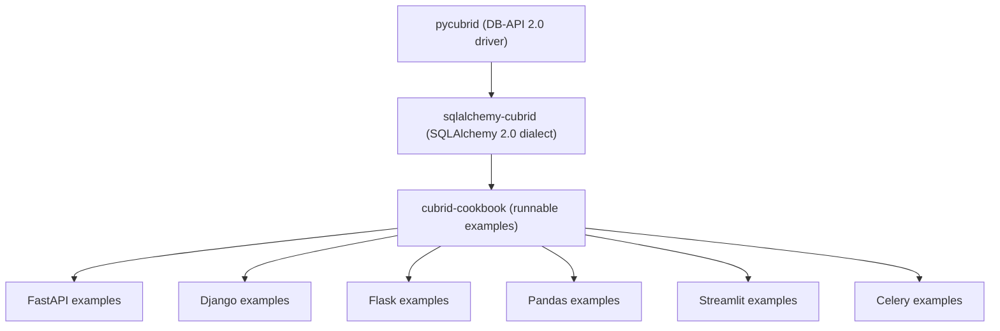

# PRD: pycubrid — CUBRID용 순수 Python DB-API 2.0 드라이버 (한국어)

> 🌐 [PRD.md](https://github.com/cubrid-lab/pycubrid/blob/main/docs/PRD.md)의 번역입니다. 영어 원문이 표준이며, 페이지 번역은 경고 수준의 동기화 규칙을 따릅니다.

## 1. 개요

**프로젝트**: pycubrid
**현재 버전**: 1.8.0
**상태**: 프로덕션 사용 가능
**저장소**: [github.com/cubrid-lab/pycubrid](https://github.com/cubrid-lab/pycubrid)
**라이선스**: MIT

### 1.1 문제 정의

CUBRID의 기존 Python 드라이버(`CUBRIDdb`)는 C 확장 모듈이며 다음과 같은 중대한
제약이 있습니다:

- 설치하려면 C 컴파일러와 CUBRID C 라이브러리가 필요합니다
- 플랫폼 호환성 문제가 있습니다(많은 Linux 배포판과 macOS ARM에서 실패)
- 공식 wheel이 없어 사용자가 소스에서 직접 컴파일해야 합니다
- PEP 249를 준수하지 않습니다 — 표준 예외 계층과 타입 객체가 없습니다
- 타입 힌트도, PEP 561 마커도 없습니다
- 유지보수가 중단되었습니다 — 마지막 의미 있는 업데이트가 수년 전입니다

현대의 Python 개발자는 다음을 기대합니다:

- 그냥 동작하는 `pip install` — C 빌드 의존성 없음
- 완전한 PEP 249(DB-API 2.0) 준수
- IDE 지원을 위한 타입 어노테이션
- 자원 정리를 위한 컨텍스트 매니저
- 포괄적인 테스트 커버리지

### 1.2 구현된 내용

CUBRID CAS 프로토콜의 완전한 순수 Python 구현입니다:

- **완전한 PEP 249(DB-API 2.0) 준수** — 표준 예외 계층, 타입 객체, 커서 인터페이스
- **순수 Python** — C 확장도 컴파일도 없으며 Python이 실행되는 어디서나 동작합니다
- **직접 CAS 프로토콜** — TCP 위에서 CUBRID의 바이너리 프로토콜을 네이티브로 사용합니다
- **오프라인 테스트 770개 / 전체 811개**, **코드 커버리지 97.29%**
- **PEP 561 타입 지정 패키지** — 현대적 IDE와 정적 분석을 위한 `py.typed` 마커
- **LOB 지원** — `create_lob()`을 통한 CLOB·BLOB 처리
- **Prepared statement** — 서버 측 문장 준비와 실행 *(계획됨; 현재 구현은 드라이버 측 파라미터 바인딩을 사용합니다)*
- **배치 연산** — 대량 삽입을 위한 `executemany()`와 `executemany_batch()`
- **CI/CD** — Python 3.10–3.14 오프라인 매트릭스와 CUBRID 10.2–11.4에 대한 기준점 통합 커버리지

### 1.3 성공 기준 — 현황

| 기준 | 목표 | 달성 |
|---|---|---|
| 순수 Python (C 확장 없음) | ✅ | ✅ `pip install pycubrid` |
| PEP 249 (DB-API 2.0) 준수 | ✅ | ✅ 완전한 API 준수 |
| 오프라인 테스트 (라이브 DB 불필요) | ✅ | ✅ 테스트 770개, 커버리지 97.29% |
| LOB (CLOB/BLOB) 지원 | ✅ | ✅ `create_lob()`, 읽기/쓰기 |
| Prepared statement | ✅ | ✅ `cursor.execute(sql, params)` — `?` 플레이스홀더를 통한 드라이버 측 파라미터 바인딩 ([PARAMETER_BINDING.md](PARAMETER_BINDING.md) 참고) |
| 버전 매트릭스를 갖춘 CI/CD | ✅ | ✅ Py 3.10–3.14 오프라인 + CUBRID 10.2–11.4에 대한 기준점 통합 커버리지 |
| PyPI에 게시 가능 | ✅ | ✅ 태그 시 릴리스 워크플로 실행 |
| 코드 커버리지 ≥ 95% | ✅ | ✅ 97.29% (CI로 강제) |
| 포괄적인 문서 | ✅ | ✅ 가이드 파일 6개 + README |
| PEP 561 타입 지정 패키지 | ✅ | ✅ `py.typed` 마커 |

---

## 2. 기술 아키텍처

### 2.1 모듈 구조

```mermaid
graph TD
    root[pycubrid/ - 10 modules]
    init["__init__.py - Public API connect(), types, exceptions, __version__"]
    connection[connection.py - Connection class connect/commit/rollback/cursor/LOB]
    cursor[cursor.py - Cursor class execute/fetch/executemany/callproc/iterator]
    types[types.py - DB-API 2.0 type objects and constructors]
    exceptions[exceptions.py - PEP 249 exception hierarchy]
    constants[constants.py - CAS function codes, data types, protocol constants]
    protocol["protocol.py - CAS wire protocol packet classes (20 packet types)"]
    packet[packet.py - Low-level packet reader/writer]
    lob[lob.py - LOB support]
    typed[py.typed - PEP 561 marker]

    root --> init
    root --> connection
    root --> cursor
    root --> types
    root --> exceptions
    root --> constants
    root --> protocol
    root --> packet
    root --> lob
    root --> typed
```



### 2.2 의존성 매트릭스

| 패키지 | 버전 | 용도 |
|---|---|---|
| Python | ≥ 3.10 | 런타임 |
| pytest | ≥ 7.0 | 테스트 (개발용) |
| ruff | ≥ 0.4 | 린트 + 포맷 (개발용) |

**표준 라이브러리만 사용** — pycubrid는 런타임 의존성이 필요 없습니다. 단,
Windows에서는 `zoneinfo`가 TZ 타입에 필요로 하는 IANA 타임존 데이터베이스를
제공하는 [`tzdata`](https://pypi.org/project/tzdata/)가 예외입니다(#413).

### 2.3 PEP 249 준수

| 속성 | 값 |
|---|---|
| `apilevel` | `"2.0"` |
| `threadsafety` | `1` (연결은 스레드 간에 공유할 수 없습니다) |
| `paramstyle` | `"qmark"` (위치 파라미터 `?`) |

완전한 표준 예외 계층: `Warning`, `Error`, `InterfaceError`, `DatabaseError`,
`OperationalError`, `IntegrityError`, `InternalError`, `ProgrammingError`, `NotSupportedError`

표준 타입 객체: `STRING`, `BINARY`, `NUMBER`, `DATETIME`, `ROWID`

표준 생성자: `Date()`, `Time()`, `Timestamp()`, `Binary()`,
`DateFromTicks()`, `TimeFromTicks()`, `TimestampFromTicks()`

---

## 3. 구현된 기능

### 3.1 연결 관리

- 키워드 인자를 받는 `connect()` 팩토리 함수
- `connection.autocommit` 프로퍼티를 통한 오토커밋 제어
- 컨텍스트 매니저 지원(`with` 문)
- `connection.get_server_version()`을 통한 서버 버전 감지
- 명시적 정리를 위한 `connection.close()`
- 네이티브 CAS 상태 검사를 위한 `connection.ping()`
- `pycubrid.aio.connect()`를 통한 비동기 연결 API

### 3.2 커서 연산

- `execute(sql, params?)` — 선택적 파라미터와 함께 실행
- `executemany(sql, seq_of_params)` — 배치 실행
- `executemany_batch(sql, seq_of_params)` — 최적화된 배치 삽입
- `fetchone()` / `fetchmany(size)` / `fetchall()` — 결과 조회
- `execute(sql, params)` — 클라이언트 측에서 바인딩되는 qmark 방식의 파라미터화된 쿼리; SQL은 CAS로 전송되기 전에 완전히 렌더링됩니다([PARAMETER_BINDING.md](PARAMETER_BINDING.md) 참고)
- `callproc(procname, params)` — 저장 프로시저 호출
- `nextset()` — DB-API 호환 메서드(`None` 반환)
- 이터레이터 프로토콜 — `for row in cursor`
- 컨텍스트 매니저 — `with conn.cursor() as cur`
- `description` 속성 — 실행 후의 컬럼 메타데이터

### 3.3 LOB 지원

- `connection.create_lob(lob_type)` — CLOB(type=24) 또는 BLOB(type=23) 생성
- 대용량 텍스트와 바이너리 데이터의 읽기/쓰기
- 문자열/바이트를 CLOB/BLOB 컬럼에 직접 삽입

### 3.4 스키마 인트로스펙션

- `connection.get_schema_info()` — 테이블, 컬럼, 인덱스, 제약 조건

### 3.5 비동기 API (1.1.0에서 출시)

- `pycubrid.aio.connect()` — 비동기 모듈 수준 생성자
- `AsyncConnection` — `connect`, `commit`, `rollback`, `close`, `cursor`, `set_autocommit`
- `AsyncCursor` — 비동기 `execute`, `executemany`, `fetchone`, `fetchmany`, `fetchall`, `nextset`

### 3.6 CAS 프로토콜

CUBRID의 Client Application Server(CAS) 바이너리 프로토콜을 직접 구현합니다:

- 모든 데이터베이스 연산을 다루는 20개 패킷 타입
- 2단계 연결: 브로커 핸드셰이크 → CAS 세션
- 모든 데이터 타입을 위한 빅엔디언 바이너리 코덱
- 대용량 결과 집합을 위한 지연 fetch 방식의 서버 측 커서

---

## 4. 테스트 커버리지

### 4.1 테스트 매트릭스

| 테스트 파일 | 테스트 수 | 커버리지 영역 |
|---|---|---|
| `test_connection.py` | ~80 | 연결, 인증, 오토커밋, 컨텍스트 매니저 |
| `test_cursor.py` | ~100 | execute, fetch, executemany, callproc, 이터레이터, description |
| `test_types.py` | ~50 | 타입 객체, 생성자, 날짜/시간 변환 |
| `test_exceptions.py` | ~30 | 예외 계층, 오류 코드 |
| `test_protocol.py` | ~80 | 패킷 생성, 파싱, CAS 함수 코드 |
| `test_packet.py` | ~50 | 바이너리 리더/라이터, 데이터 타입 인코딩 |
| `test_lob.py` | ~30 | LOB 생성, 읽기, 쓰기 |
| `test_constants.py` | ~20 | 프로토콜 상수, 데이터 타입 코드 |
| `test_integration.py` | 41 | 라이브 DB 테스트 (Docker) |
| **합계** | **오프라인 770개 + 통합 41개** | **커버리지 97.29%** |

### 4.2 CI 매트릭스

| | Python 3.10 | Python 3.11 | Python 3.12 | Python 3.13 | Python 3.14 |
|---|:---:|:---:|:---:|:---:|:---:|
| **오프라인 테스트** | ✅ | ✅ | ✅ | ✅ | ✅ |
| **CUBRID 11.4** | ✅ | — | — | — | ✅ |
| **CUBRID 11.2** | ✅ | — | — | — | ✅ |
| **CUBRID 11.0** | ✅ | — | — | — | ✅ |
| **CUBRID 10.2** | ✅ | — | — | — | ✅ |

---

## 5. 알려진 제약 사항

CUBRID 자체 또는 설계 선택에서 비롯된 제약입니다:

| 기능 | 상태 | 이유 |
|---|---|---|
| 비동기 TLS | ✅ | v1.4.0에서 구현되었습니다. CUBRID의 STARTTLS 방식 업그레이드를 사용합니다 — 평문 `CUBRS` 핸드셰이크 후 `OPEN_DATABASE` 전에 `loop.start_tls()`(`ssl_handshake_timeout` 적용)를 수행합니다(#154). 기본 컨텍스트는 최소 TLS 1.2를 요구합니다. Python 3.10에는 인증서 검증 실패 시 `start_tls()`가 멈추는 알려진 문제가 있습니다(#156). |
| 커넥션 풀링 | ❌ | 범위 밖입니다. SQLAlchemy의 풀이나 외부 풀러를 사용하세요 |
| 스레드 안전성 레벨 2+ | ❌ | CUBRID CAS 세션은 연결에 묶여 있습니다 |
| LOB 스트리밍 | ⚠️ | LOB 데이터를 메모리에 전부 적재합니다 |
| 타임존 인식 파싱 | ⚠️ | TZ 타입에 대해 지원됩니다. 동작은 서버가 제공하는 존 토큰에 따라 달라집니다 |
| 비동기 LOB 헬퍼 | ⚠️ | 전용 비동기 `Lob` 헬퍼가 아직 없습니다 |

---

## 6. 문서

| 문서 | 내용 |
|---|---|
| [`README.md`](../../README.md) | 퀵스타트가 포함된 랜딩 페이지 |
| [`docs/CONNECTION.md`](CONNECTION.md) | 연결 문자열, 설정 |
| [`docs/TYPES.md`](TYPES.md) | 타입 매핑, CUBRID 전용 타입 |
| [`docs/API_REFERENCE.md`](API_REFERENCE.md) | 전체 API 문서 |
| [`docs/PROTOCOL.md`](PROTOCOL.md) | CAS 와이어 프로토콜 참조 |
| [`docs/DEVELOPMENT.md`](DEVELOPMENT.md) | 개발 환경 설정, 테스트, Docker, CI/CD |
| [`docs/EXAMPLES.md`](EXAMPLES.md) | 실용적인 사용 예제 |
| [`CHANGELOG.md`](../../CHANGELOG.md) | 릴리스 이력 |
| [`CONTRIBUTING.md`](../../CONTRIBUTING.md) | 기여 가이드라인 |

---

## 7. 로드맵

### 완료된 마일스톤

| 릴리스 | 주요 내용 |
|---|---|
| 1.0.0 | 안정적인 동기 DB-API 표면, LOB 지원, 스키마 API, 테스트/CI 기준선 |
| 1.1.0 | 네이티브 `pycubrid.aio` 비동기 API 출시 |
| 1.2.0 | `ping()`, JSON 디코딩, 컬렉션 디코딩, `nextset()`, 더 풍부한 오류 정보 |
| 1.3.0 | 동기 TLS 지원, CI/문서 기준선 갱신 |

### 향후 우선순위

| 항목 | 설명 | 우선순위 |
|---|---|---|
| LOB 사용 편의성 | 가져온 LOB 핸들을 읽기 위한 고수준 헬퍼 | 중간 |
| 문장 캐싱 | 반복 워크로드를 위한 prepared statement 재사용 | 중간 |
| CUBRID 12.x 검증 | 더 새로운 서버 버전에 맞춘 CI와 문서 확장 | 중간 |

---

## 8. 아키텍처 결정

### 8.1 왜 순수 Python인가 (C 확장 없음)

C 확장 드라이버(`CUBRIDdb`)는 사용자가 CUBRID C 라이브러리를 설치해 두어야 했고,
이는 큰 장벽이었습니다 — 특히 macOS, ARM Linux, 컨테이너 환경에서 그랬습니다.
순수 Python 구현은 모든 빌드 의존성을 없애고 `pip install pycubrid`가 어디서나
동작하게 합니다.

### 8.2 왜 직접 CAS 프로토콜인가

pycubrid는 C 라이브러리를 감싸거나 ODBC를 사용하는 대신 CUBRID의 CAS
(Client Application Server) 바이너리 프로토콜을 TCP 위에서 직접 구현합니다. 이로써 다음을 얻습니다:

- 네이티브 의존성 0
- 연결 수명 주기에 대한 완전한 제어
- C 드라이버에 없는 기능을 구현할 수 있는 능력(예: 올바른 LOB 처리)

### 8.3 왜 PEP 249를 엄격히 준수하는가

DB-API 2.0은 표준 Python 데이터베이스 인터페이스입니다. 엄격한 준수는 다음을 의미합니다:

- `sqlite3`, `psycopg2`, `mysql-connector`용으로 작성된 코드가 최소한의 변경만으로
  동작합니다
- SQLAlchemy와 다른 ORM이 pycubrid를 그대로 끼워 쓸 수 있는 드라이버로 사용할 수 있습니다
- 표준 예외 처리 패턴이 별도 설정 없이 바로 동작합니다

---

## 9. 생태계 통합

pycubrid는 cubrid-lab Python 생태계의 기반이 되는 드라이버입니다:



---

## 10. 예제 우선 설계 철학

### 왜 예제 우선인가

CUBRID의 생태계는 PostgreSQL이나 MySQL에 비해 작습니다. 생태계가 작은 프로젝트에서는
진입 장벽을 최소화해야 합니다 — 사용자가 문서를 읽은 지 30초 안에 동작하는 코드를
복사해 붙여 넣을 수 있어야 합니다.

> 생태계가 아직 작기 때문에, 이 프로젝트는 도입 장벽을 낮추기 위해 풍부한 예제와
> 쿡북 형식의 문서를 제공합니다.

### Hello World

```bash
pip install pycubrid
```

```python
import pycubrid

conn = pycubrid.connect(
    host="localhost",
    port=33000,
    database="demodb",
    user="dba",
    password="",
)

cur = conn.cursor()
cur.execute("SELECT 1 + 1")
print(cur.fetchone())  # (2,)

cur.close()
conn.close()
```

이 코드는 CUBRID 데이터베이스에 연결하고, 쿼리를 실행하고, 결과를 출력합니다.
ORM 설정도, 설정 파일도, 보일러플레이트도 없습니다.

### AI 에이전트 발견 가능성

현대의 개발자는 Claude Code, OpenCode, Cursor, GitHub Copilot, Devin 등 AI 코딩
어시스턴트에 점점 더 의존합니다. 이러한 에이전트는 README 파일, PRD, 문서, 예제
코드를 읽고 어떤 라이브러리를 추천할지 결정합니다.

**문서에 예제가 많을수록 = AI가 추천할 확률이 높아집니다.**

동작하는 코드를 PRD, README, 문서에 직접 담음으로써, AI 에이전트가 pycubrid를
정확하게 발견하고 학습하고 추천할 수 있게 합니다.

### 쿡북 통합

[cubrid-cookbook](https://github.com/cubrid-lab/cubrid-cookbook-python) 저장소는
pycubrid를 위한 프로덕션 수준의 실행 가능한 예제를 제공합니다:

| 예제 | 설명 |
|---|---|
| `01_connect.py` | 기본 연결과 쿼리 |
| `02_crud.py` | 생성, 조회, 수정, 삭제 연산 |
| `03_transactions.py` | commit/rollback을 사용한 트랜잭션 관리 |
| `04_prepared.py` | 반복 실행을 위한 파라미터화된 쿼리(드라이버 측 바인딩) |
| `05_error_handling.py` | PEP 249 예외 계층을 사용한 오류 처리 |
| `06_lob.py` | LOB (CLOB/BLOB) 연산 |

### 성공한 프로젝트에서 얻은 영감

예제 중심 문서가 성공의 한 요인이 된 프로젝트들입니다:

| 프로젝트 | 그들이 한 일 |
|---|---|
| **FastAPI** | 모든 엔드포인트를 실행 가능한 예제와 함께 문서화했고, 가장 빠르게 성장하는 Python 웹 프레임워크가 되었습니다 |
| **LangChain** | 쿡북 우선 접근 방식이 AI 분야에서 폭발적인 도입을 이끌었습니다 |
| **SQLAlchemy** | 방대한 ORM 쿡북과 튜토리얼을 갖추었고, 15년 넘게 사실상의 표준 Python ORM입니다 |
| **Pandas** | "10 Minutes to pandas"와 쿡북이 데이터 과학의 진입 장벽을 낮추었습니다 |

pycubrid는 같은 철학을 따릅니다: **예제는 보조 자료가 아니라 — 주된 문서입니다.**

---

*최종 업데이트: 2026년 9월 · pycubrid v1.8.0 (비동기 API는 v1.1.0부터 제공)*
