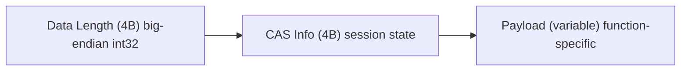
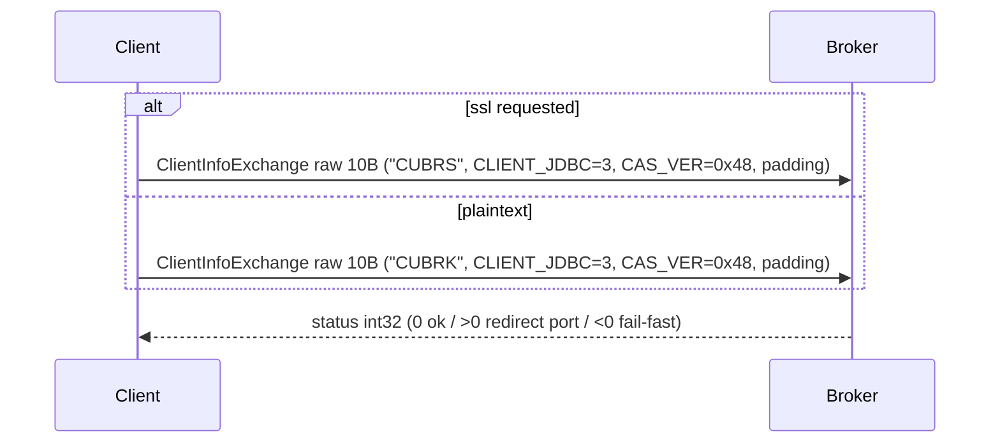
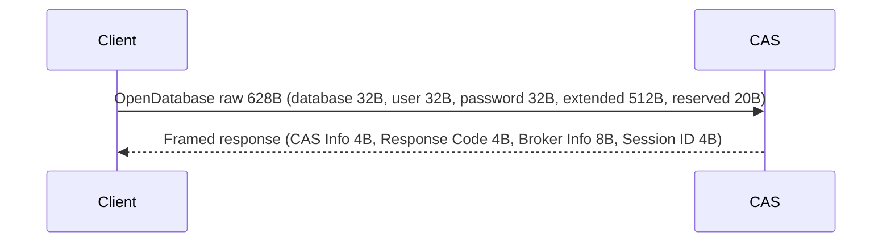
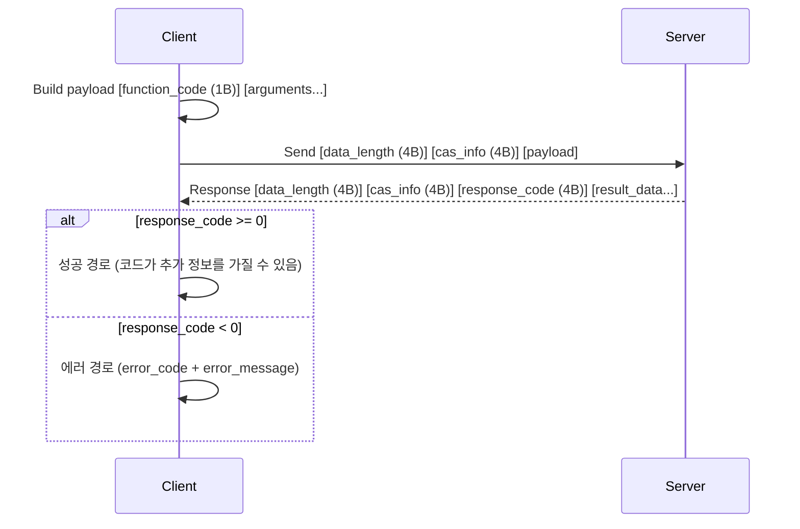

# CAS 프로토콜 참조 (한국어)

> 🌐 [PROTOCOL.md](https://github.com/cubrid-lab/pycubrid/blob/main/docs/PROTOCOL.md)의 번역입니다. 영어 원문이 표준이며, 페이지 번역은 경고 수준의 동기화 규칙을 따릅니다.

pycubrid가 구현하는 CUBRID CAS(Common Application Server) 와이어 프로토콜의 기술 문서.

---

## 목차

- [개요](#개요)
- [아키텍처](#아키텍처)
- [패킷 프레이밍](#패킷-프레이밍)
- [연결 핸드셰이크](#연결-핸드셰이크)
- [요청/응답 수명 주기](#요청응답-수명-주기)
- [함수 코드](#함수-코드)
- [패킷 클래스](#패킷-클래스)
  - [ClientInfoExchangePacket](#clientinfoexchangepacket)
  - [OpenDatabasePacket](#opendatabasepacket)
  - [PrepareAndExecutePacket](#prepareandexecutepacket)
  - [PreparePacket](#preparepacket)
  - [ExecutePacket](#executepacket)
  - [FetchPacket](#fetchpacket)
  - [CommitPacket](#commitpacket)
  - [RollbackPacket](#rollbackpacket)
  - [CloseDatabasePacket](#closedatabasepacket)
  - [CloseQueryPacket](#closequerypacket)
  - [GetEngineVersionPacket](#getengineversionpacket)
  - [GetSchemaPacket](#getschemapacket)
  - [BatchExecutePacket](#batchexecutepacket)
  - [LOBNewPacket](#lobnewpacket)
  - [LOBWritePacket](#lobwritepacket)
  - [LOBReadPacket](#lobreadpacket)
  - [GetLastInsertIdPacket](#getlastinsertidpacket)
  - [GetDbParameterPacket / SetDbParameterPacket](#getdbparameterpacket--setdbparameterpacket)
- [PacketWriter](#packetwriter)
- [PacketReader](#packetreader)
- [와이어 데이터 타입](#와이어-데이터-타입)
- [에러 처리](#에러-처리)
- [상수 참조](#상수-참조)

---

## 개요

CUBRID는 클라이언트-서버 통신에 **CAS**(Common Application Server)라는 독자 바이너리 프로토콜을 사용합니다. 프로토콜은 TCP 소켓 위에서 big-endian 바이트 순서로 동작합니다.

주요 특성:

- **전송**: TCP (브로커 기본 포트 33000)
- **바이트 순서**: Big-endian (네트워크 바이트 순서)
- **프레이밍**: 4바이트 데이터 길이 + 4바이트 CAS 정보 + 페이로드
- **핸드셰이크**: 매직 문자열 `CUBRK`(평문) 또는 `CUBRS`(STARTTLS) + 클라이언트 타입 + 프로토콜 버전
- **TLS (선택)**: 핸드셰이크 후 `OPEN_DATABASE` 이전에 `start_tls()` / `wrap_socket()`으로 STARTTLS 방식 업그레이드
- **세션**: 상태 저장 — `OpenDatabase` 이후 세션 ID 유지

---

## 아키텍처


1. **클라이언트**가 33000 포트의 **브로커**에 연결
2. **브로커**가 핸드셰이크를 수행하고 다른 포트의 CAS 프로세스로 리다이렉트할 수 있음
3. **클라이언트**가 CAS 프로세스에서 데이터베이스 세션을 엶
4. 이후 모든 요청은 CAS 세션을 통해 진행

---

## 패킷 프레이밍

초기 핸드셰이크 이후의 모든 패킷은 다음 프레임 형식을 사용합니다:



| 필드         | 크기     | 설명 |
|--------------|----------|------|
| Data Length  | 4바이트  | CAS Info + Payload 길이 (부호 있는 int32, big-endian) |
| CAS Info     | 4바이트  | 서버가 유지하는 세션 상태 바이트 |
| Payload      | 가변     | 함수 코드 + 인자(요청) 또는 응답 데이터 |

**헤더 생성:**

```python
from pycubrid.packet import build_protocol_header

header = build_protocol_header(data_length=42, cas_info=b"\x00\x00\x00\x00")
# 8바이트 반환: 4바이트 길이 + 4바이트 cas_info
```

### 예외

**핸드셰이크 패킷**(`ClientInfoExchangePacket`)은 이 프레이밍을 사용하지 **않습니다** — 길이/cas_info 헤더 없이 raw 바이트를 보냅니다.

**데이터베이스 열기 패킷**(`OpenDatabasePacket`)은 헤더 없이 raw 바이트(628바이트)를 보내지만, *응답*은 표준 프레이밍을 사용합니다.

---

## 연결 핸드셰이크

연결 흐름은 최대 4단계입니다 (TLS 단계는 선택):

### 1단계: 클라이언트 정보 교환



- **매직 문자열**: `"CUBRK"`(평문) 또는 `"CUBRS"`(STARTTLS 요청) — ASCII 5바이트
- **클라이언트 타입**: `CLIENT_JDBC = 3` (pycubrid는 JDBC 호환 클라이언트로 식별됨)
- **CAS 버전**: `PROTO_INDICATOR(0x40) | VERSION(8) = 0x48`
- **상태 int32**: 부호 있는 big-endian
    - `> 0` — 리다이렉트 포트: 소켓을 닫고 `(host, status)`로 재연결, 핸드셰이크는 **반복하지 않음** (JDBC `BrokerHandler.connectBroker` 동작 미러링)
    - `< 0` — 즉시 실패: `OperationalError(status)` 발생
    - `== 0` — 현재 소켓 재사용 (다이렉트 모드)

### 1.5단계: TLS 업그레이드 (선택)

connect 호출에서 `ssl`이 참이었으면, 어떤 `OPEN_DATABASE` 바이트가 쓰이기 **전에** 라이브 전송을 업그레이드합니다:

- 동기 드라이버: `ssl.SSLContext.wrap_socket(sock, server_hostname=host)`
- 비동기 드라이버: `loop.start_tls(transport, protocol, context, server_hostname=host, ssl_handshake_timeout=...)`

실패한 핸드셰이크는 전송을 누수하지 않고 중단시킵니다.

### 2단계: 데이터베이스 열기



- 데이터베이스, 사용자, 비밀번호는 고정 길이 null 패딩 문자열
- **Broker Info**(8바이트) 포함 내용:
  - 바이트 0: `db_type`
  - 바이트 2: `statement_pooling`
  - 바이트 4: `protocol_version` (하위 6비트)
- **세션 ID**: 이후 CAS 정보 추적에 사용

### 3단계: 준비 완료

`OpenDatabase` 성공 후 연결이 SQL 연산에 사용할 수 있게 됩니다.

---

## 요청/응답 수명 주기

연결 이후의 모든 연산은 이 패턴을 따릅니다:



---

## 함수 코드

`CASFunctionCode`에 정의된 41개 CAS 함수 코드 전체:

| 코드 | 이름                  | 설명 |
|------|-----------------------|------|
| 1    | `END_TRAN`            | 트랜잭션 커밋 또는 롤백 |
| 2    | `PREPARE`             | SQL 문 준비 |
| 3    | `EXECUTE`             | 준비된 문장 실행 |
| 4    | `GET_DB_PARAMETER`    | 데이터베이스 파라미터 값 조회 |
| 5    | `SET_DB_PARAMETER`    | 데이터베이스 파라미터 값 설정 |
| 6    | `CLOSE_REQ_HANDLE`    | 쿼리/요청 핸들 닫기 |
| 7    | `CURSOR`              | 커서 위치 이동 |
| 8    | `FETCH`               | 결과 행 가져오기 |
| 9    | `SCHEMA_INFO`         | 스키마 정보 조회 |
| 10   | `OID_GET`             | OID로 객체 조회 |
| 11   | `OID_PUT`             | OID로 객체 갱신 |
| 15   | `GET_DB_VERSION`      | 데이터베이스 엔진 버전 조회 |
| 16   | `GET_CLASS_NUM_OBJS`  | 클래스 객체 수 조회 |
| 17   | `OID_CMD`             | OID 연산 (drop, lock 등) |
| 18   | `COLLECTION`          | 컬렉션 연산 |
| 19   | `NEXT_RESULT`         | 다음 결과 집합 조회 |
| 20   | `EXECUTE_BATCH`       | 여러 SQL 문 배치 실행 |
| 21   | `EXECUTE_ARRAY`       | 배열 바인딩으로 실행 |
| 22   | `CURSOR_UPDATE`       | 커서를 통한 갱신 |
| 23   | `GET_ATTR_TYPE_STR`   | 속성 타입 문자열 조회 |
| 24   | `GET_QUERY_INFO`      | 쿼리 플랜 정보 조회 |
| 26   | `SAVEPOINT`           | 세이브포인트 설정 또는 롤백 |
| 27   | `PARAMETER_INFO`      | 파라미터 메타데이터 조회 |
| 28–30 | `XA_*`               | XA 분산 트랜잭션 연산 |
| 31   | `CON_CLOSE`           | CAS 연결 종료 |
| 32   | `CHECK_CAS`           | CAS 프로세스 핑 |
| 33   | `MAKE_OUT_RS`         | 출력 결과 집합 생성 |
| 34   | `GET_GENERATED_KEYS`  | 자동 생성 키 조회 |
| 35   | `LOB_NEW`             | 새 LOB 핸들 생성 |
| 36   | `LOB_WRITE`           | LOB에 데이터 쓰기 |
| 37   | `LOB_READ`            | LOB에서 데이터 읽기 |
| 38   | `END_SESSION`         | CAS 세션 종료 |
| 39   | `GET_ROW_COUNT`       | 영향받은 행 수 조회 |
| 40   | `GET_LAST_INSERT_ID`  | 마지막 auto-increment ID 조회 |
| 41   | `PREPARE_AND_EXECUTE` | 준비 + 실행 결합 |

---

## 패킷 클래스

pycubrid는 `pycubrid.protocol`에 18개 패킷 클래스를 구현합니다. 각 클래스는 다음을 제공합니다:

- `write()` — 요청 직렬화 (일부는 `cas_info` 파라미터를 받음)
- `parse(data)` — 응답 역직렬화

### ClientInfoExchangePacket

**핸드셰이크 패킷** — 표준 프레이밍 없음.

```python
packet = ClientInfoExchangePacket()
raw = packet.write()          # 10바이트, cas_info 불필요
packet.parse(response_4bytes) # new_connection_port 파싱
```

| 속성                  | 타입  | 설명 |
|------------------------|-------|------|
| `new_connection_port`  | `int` | CAS 프로세스 포트 (0 = 현재 재사용) |

---

### OpenDatabasePacket

**데이터베이스 세션 열기** — 628 raw 바이트 전송, 프레임된 응답 수신.

```python
packet = OpenDatabasePacket(database="testdb", user="dba", password="")
raw = packet.write()        # 628바이트, cas_info 없음
packet.parse(response_data) # CAS 정보 접두사가 있는 프레임된 응답
```

| 속성        | 타입   | 설명 |
|------------------|--------|------|
| `cas_info`       | `bytes` | CAS 세션 정보 (4바이트) |
| `response_code`  | `int`   | 성공 시 0, 오류 시 음수 |
| `broker_info`    | `dict`  | `{db_type, protocol_version, statement_pooling}` |
| `session_id`     | `int`   | 서버 세션 식별자 |

---

### PrepareAndExecutePacket

**준비 + 실행 결합** (FC=41) — SQL 연산의 주 패킷.

| 속성            | 타입   | 설명 |
|----------------------|--------|------|
| `query_handle`       | `int`  | 서버 할당 쿼리 핸들 |
| `statement_type`     | `int`  | `CUBRIDStatementType` 코드 |
| `bind_count`         | `int`  | 바인드 파라미터 수 |
| `column_count`       | `int`  | 결과 컬럼 수 |
| `columns`            | `list[ColumnMetaData]` | 컬럼 메타데이터 |
| `total_tuple_count`  | `int`  | 결과 집합의 총 행 수 |
| `result_count`       | `int`  | 결과 정보 항목 수 |
| `result_infos`       | `list[ResultInfo]` | 문장별 결과 정보 |
| `tuple_count`        | `int`  | 초기 fetch의 행 수 |
| `rows`               | `list[list[Any]]` | 가져온 행 데이터 |

---

### PreparePacket

**문장 준비** (FC=2) — 별도 준비 단계.

| 속성        | 타입   | 설명 |
|------------------|--------|------|
| `query_handle`   | `int`  | 서버 할당 쿼리 핸들 |
| `statement_type` | `int`  | 문장 타입 코드 |
| `bind_count`     | `int`  | 바인드 파라미터 수 |
| `column_count`   | `int`  | 결과 컬럼 수 |
| `columns`        | `list[ColumnMetaData]` | 컬럼 메타데이터 |

---

### ExecutePacket

**준비된 문장 실행** (FC=3).

| 속성            | 타입   | 설명 |
|----------------------|--------|------|
| `total_tuple_count`  | `int`  | 총 결과 행 수 |
| `result_count`       | `int`  | 결과 정보 수 |
| `result_infos`       | `list[ResultInfo]` | 문장별 결과 |
| `tuple_count`        | `int`  | 인라인 fetch 행 수 |
| `rows`               | `list[list[Any]]` | 인라인으로 가져온 행 |

---

### FetchPacket

**결과 행 가져오기** (FC=8) — 페이지 단위 행 조회에 사용.

| 속성      | 타입   | 설명 |
|----------------|--------|------|
| `tuple_count`  | `int`  | 가져온 행 수 |
| `rows`         | `list[list[Any]]` | 행 데이터 |

---

### CommitPacket

**트랜잭션 커밋** (`CCITransactionType.COMMIT`과 함께 FC=1).

결과 속성 없음 — 오류 시 예외 발생.

---

### RollbackPacket

**트랜잭션 롤백** (`CCITransactionType.ROLLBACK`과 함께 FC=1).

결과 속성 없음 — 오류 시 예외 발생.

---

### CloseDatabasePacket

**CAS 세션 종료** (FC=31).

---

### CloseQueryPacket

**쿼리 핸들 해제** (FC=6).

---

### GetEngineVersionPacket

**서버 버전 조회** (FC=15).

| 속성        | 타입  | 설명 |
|------------------|-------|------|
| `engine_version` | `str` | 버전 문자열 (예: `"11.2.0.0378"`) |

---

### GetSchemaPacket

**스키마 내성** (FC=9).

| 속성      | 타입  | 설명 |
|----------------|-------|------|
| `query_handle` | `int` | 스키마 행을 가져올 핸들 |
| `tuple_count`  | `int` | 스키마 항목 수 |

---

### BatchExecutePacket

**배치 실행** (FC=20) — 하나의 요청에 여러 SQL 문.

| 속성 | 타입  | 설명 |
|-----------|-------|------|
| `results` | `list[tuple[int, int]]` | 문장별 `(stmt_type, result_count)` |
| `errors`  | `list[dict]` | 실패한 문장의 `{code, message}` |

---

### LOBNewPacket

**LOB 핸들 생성** (FC=35).

| 속성    | 타입    | 설명 |
|--------------|---------|------|
| `lob_handle` | `bytes` | 서버 생성 LOB 핸들 |

---

### LOBWritePacket

**LOB 데이터 쓰기** (FC=36).

---

### LOBReadPacket

**LOB 데이터 읽기** (FC=37).

| 속성    | 타입    | 설명 |
|--------------|---------|------|
| `bytes_read` | `int`   | 실제 읽은 바이트 수 |
| `lob_data`   | `bytes` | 읽은 데이터 |

---

### GetLastInsertIdPacket

**마지막 insert ID 조회** (FC=40).

| 속성        | 타입  | 설명 |
|------------------|-------|------|
| `last_insert_id` | `str` | 문자열로 표현된 마지막 auto-increment 값 |

---

### GetDbParameterPacket / SetDbParameterPacket

**데이터베이스 파라미터 조회/설정** (FC=4 / FC=5).

| 속성 | 타입  | 설명 |
|-----------|-------|------|
| `value`   | `int` | 파라미터 값 (조회 결과 / 설정 입력) |

사용 가능한 파라미터(`CCIDbParam`):

| 코드 | 이름               | 설명 |
|------|--------------------|------|
| 1    | `ISOLATION_LEVEL`  | 트랜잭션 격리 수준 |
| 2    | `LOCK_TIMEOUT`     | 잠금 대기 타임아웃 |
| 3    | `MAX_STRING_LENGTH`| 최대 문자열 길이 |
| 4    | `AUTO_COMMIT`      | 자동 커밋 모드 (0/1) |

---

## PacketWriter

`pycubrid.packet.PacketWriter` — CAS 와이어 형식으로 데이터 직렬화.

### 공개 메서드

| 메서드 | 설명 |
|--------|------|
| `add_byte(value)` | 길이 접두 바이트 쓰기 (1B 길이 + 1B 값) |
| `add_short(value)` | 길이 접두 short 쓰기 (4B 길이 + 2B 값) |
| `add_int(value)` | 길이 접두 int 쓰기 (4B 길이 + 4B 값) |
| `add_long(value)` | 길이 접두 long 쓰기 (4B 길이 + 8B 값) |
| `add_float(value)` | 길이 접두 float 쓰기 (4B 길이 + 4B 값) |
| `add_double(value)` | 길이 접두 double 쓰기 (4B 길이 + 8B 값) |
| `add_bytes(value)` | 길이 접두 raw 바이트 쓰기 |
| `add_null()` | null 마커 쓰기 (길이 0) |
| `add_date(y, m, d)` | 길이 접두 날짜 쓰기 |
| `add_time(h, m, s)` | 길이 접두 시간 쓰기 |
| `add_timestamp(y,m,d,h,m,s)` | 길이 접두 타임스탬프 쓰기 |
| `add_datetime(y,m,d,h,m,s,ms)` | 길이 접두 datetime 쓰기 |
| `add_cache_time()` | 캐시 시간 쓰기 (int 0 두 개) |
| `to_bytes()` | 쓴 모든 바이트 반환 |

### 내부 메서드

| 메서드 | 설명 |
|--------|------|
| `_write_byte(value)` | raw 바이트, 길이 접두 없음 |
| `_write_short(value)` | raw short (2B) |
| `_write_int(value)` | raw int (4B) |
| `_write_long(value)` | raw long (8B) |
| `_write_float(value)` | raw float (4B) |
| `_write_double(value)` | raw double (8B) |
| `_write_bytes(value)` | raw 바이트, 접두 없음 |
| `_write_filler(count, value)` | N바이트를 값으로 채우기 |
| `_write_null_terminated_string(value)` | 길이 접두 UTF-8 문자열 + null 종단 |
| `_write_fixed_length_string(value, length)` | 고정 폭 null 패딩 문자열 |

---

## PacketReader

`pycubrid.packet.PacketReader` — CAS 와이어 데이터 역직렬화.

### 원시 파서

| 메서드 | 반환 | 소비 바이트 |
|--------|---------|----------------|
| `_parse_byte()` | `int` | 1 |
| `_parse_short()` | `int` | 2 |
| `_parse_int()` | `int` | 4 |
| `_parse_long()` | `int` | 8 |
| `_parse_float()` | `float` | 4 |
| `_parse_double()` | `float` | 8 |
| `_parse_bytes(count)` | `bytes` | `count` |
| `_parse_null_terminated_string(length)` | `str` | `length` |

### 복합 파서

| 메서드 | 반환 | 설명 |
|--------|---------|------|
| `_parse_date()` | `datetime.date` | short 3개 (연, 월, 일) |
| `_parse_time()` | `datetime.time` | short 3개 (시, 분, 초) |
| `_parse_datetime()` | `datetime.datetime` | short 7개 (y,m,d,h,m,s,ms) |
| `_parse_timestamp()` | `datetime.datetime` | short 6개 (y,m,d,h,m,s) |
| `_parse_timestamptz()` | `datetime.datetime` | short 6개 (y,m,d,h,m,s) + 타임존 문자열; 초 정밀도 (`TIMESTAMPTZ`/`TIMESTAMPLTZ`) |
| `_parse_datetimetz()` | `datetime.datetime` | short 7개 (y,m,d,h,m,s,ms) + 타임존 문자열; 밀리초 정밀도 (`DATETIMETZ`/`DATETIMELTZ`) |
| `_parse_numeric(size)` | `Decimal` | null 종단 문자열 → Decimal |
| `_parse_object()` | `str` | OID 문자열 (`"OID:@page\|slot\|volume"`) |
| `read_blob(size)` | `dict` | BLOB 핸들 정보 |
| `read_clob(size)` | `dict` | CLOB 핸들 정보 |
| `read_error(length)` | `(int, str)` | 오류 코드와 메시지 |
| `bytes_remaining()` | `int` | 버퍼의 읽지 않은 바이트 |

---

## 와이어 데이터 타입

컬럼 데이터는 4바이트 크기 접두 + raw 데이터로 전송됩니다. 타입이 데이터 바이트의 해석을 결정합니다:

| 타입 코드 | 이름       | 와이어 형식 |
|-----------|------------|-------------|
| 0         | `NULL`     | size ≤ 0 → `None` |
| 1         | `CHAR`     | null 종단 UTF-8 문자열 |
| 2         | `STRING`   | null 종단 UTF-8 문자열 |
| 3         | `NCHAR`    | null 종단 UTF-8 문자열 |
| 4         | `VARNCHAR` | null 종단 UTF-8 문자열 |
| 5         | `BIT`      | raw 바이트 |
| 6         | `VARBIT`   | raw 바이트 |
| 7         | `NUMERIC`  | null 종단 문자열 → `Decimal` |
| 8         | `INT`      | 4바이트 big-endian 부호 있는 int |
| 9         | `SHORT`    | 2바이트 big-endian 부호 있는 short |
| 10        | `MONETARY` | 8바이트 big-endian double |
| 11        | `FLOAT`    | 4바이트 big-endian float |
| 12        | `DOUBLE`   | 8바이트 big-endian double |
| 13        | `DATE`     | short 3개: 연, 월, 일 |
| 14        | `TIME`     | short 3개: 시, 분, 초 |
| 15        | `TIMESTAMP`| short 6개: y, m, d, h, m, s |
| 16–18     | `SET/MULTISET/SEQUENCE` | raw 바이트 |
| 19        | `OBJECT`   | 4B 페이지 + 2B 슬롯 + 2B 볼륨 |
| 21        | `BIGINT`   | 8바이트 big-endian 부호 있는 long |
| 22        | `DATETIME` | short 7개: y, m, d, h, m, s, ms |
| 23        | `BLOB`     | 패킹된 LOB 핸들 → `dict` |
| 24        | `CLOB`     | 패킹된 LOB 핸들 → `dict` |
| 25        | `ENUM`     | null 종단 UTF-8 문자열 |

### 컬럼 메타데이터

결과 집합의 각 컬럼은 와이어에서 파싱한 메타데이터를 가집니다:

```python
@dataclass
class ColumnMetaData:
    column_type: int         # CUBRIDDataType 코드
    scale: int               # 십진 스케일 (해당 없으면 -1)
    precision: int           # 정밀도 (해당 없으면 -1)
    name: str                # 컬럼 별칭
    real_name: str           # 실제 컬럼 이름
    table_name: str          # 출처 테이블 이름
    is_nullable: bool        # NULL 허용
    default_value: str       # 기본값 표현식
    is_auto_increment: bool  # AUTO_INCREMENT 컬럼
    is_unique_key: bool      # 유니크 인덱스의 일부
    is_primary_key: bool     # 기본 키의 일부
    is_reverse_index: bool   # 리버스 인덱스 보유
    is_reverse_unique: bool  # 리버스 유니크 인덱스 보유
    is_foreign_key: bool     # 외래 키의 일부
    is_shared: bool          # 공유 속성
```

---

## 에러 처리

`response_code < 0`이면 응답에 오류가 담겨 있습니다:


pycubrid는 오류를 자동 분류합니다:

| 오류 패턴 | 예외 |
|---------------|------|
| `unique`, `duplicate`, `foreign key`, `constraint violation` | `IntegrityError` |
| `syntax`, `unknown class`, `does not exist`, `not found` | `ProgrammingError` |
| 그 외 모든 오류 | `DatabaseError` |

---

## 상수 참조

### CAS 프로토콜 상수

```python
class CASProtocol:
    MAGIC_STRING = "CUBRK"      # 핸드셰이크 매직 (평문)
    MAGIC_STRING_SSL = "CUBRS"  # 핸드셰이크 매직 (STARTTLS 요청)
    CLIENT_JDBC = 3             # 클라이언트 타입 식별자
    PROTO_INDICATOR = 0x40      # 프로토콜 인디케이터 비트
    VERSION = 8                 # 프로토콜 버전
    CAS_VERSION = 0x48          # 결합된 버전 바이트
```

### 와이어 데이터 크기

```python
class DataSize:
    BYTE = 1          BOOL = 1
    SHORT = 2         INT = 4
    FLOAT = 4         LONG = 8
    DOUBLE = 8        OBJECT = 8
    OID = 8           BROKER_INFO = 8
    DATE = 14         TIME = 14
    DATETIME = 14     TIMESTAMP = 14
    RESULTSET = 4     DATA_LENGTH = 4
    CAS_INFO = 4
```

### 문장 타입

| 코드 | 이름 | 코드 | 이름 |
|------|------|------|------|
| 0 | `ALTER_CLASS` | 20 | `INSERT` |
| 4 | `CREATE_CLASS` | 21 | `SELECT` |
| 5 | `CREATE_INDEX` | 22 | `UPDATE` |
| 9 | `DROP_CLASS` | 23 | `DELETE` |
| 10 | `DROP_INDEX` | 24 | `CALL` |
| 16 | `ROLLBACK_WORK` | 126 | `CALL_SP` |
| 17 | `GRANT` | 127 | `UNKNOWN` |

### 트랜잭션 타입

| 코드 | 이름 |
|------|------|
| 1 | `COMMIT` |
| 2 | `ROLLBACK` |

### 격리 수준

| 코드 | 이름 |
|------|------|
| 0x01 | `COMMIT_CLASS_UNCOMMIT_INSTANCE` (레거시 pre-MVCC) |
| 0x02 | `COMMIT_CLASS_COMMIT_INSTANCE` |
| 0x03 | `REP_CLASS_UNCOMMIT_INSTANCE` (레거시 pre-MVCC) |
| 0x04 | `REP_CLASS_COMMIT_INSTANCE` (READ COMMITTED, **서버 기본값**) |
| 0x05 | `REP_CLASS_REP_INSTANCE` |
| 0x06 | `SERIALIZABLE` |

> CUBRID의 MVCC 엔진(10.0+)에서는 `0x04`/`0x05`/`0x06`만 받아들여집니다. 하위 코드 `0x01`–`0x03`은 레거시 pre-MVCC 수준입니다. CUBRID 서버의 기본 격리 수준은 **READ COMMITTED**(`0x04`)입니다.
