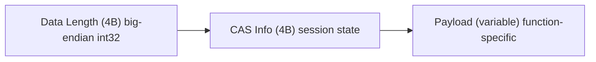
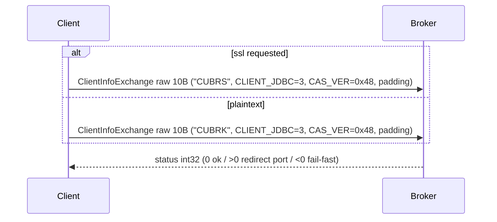
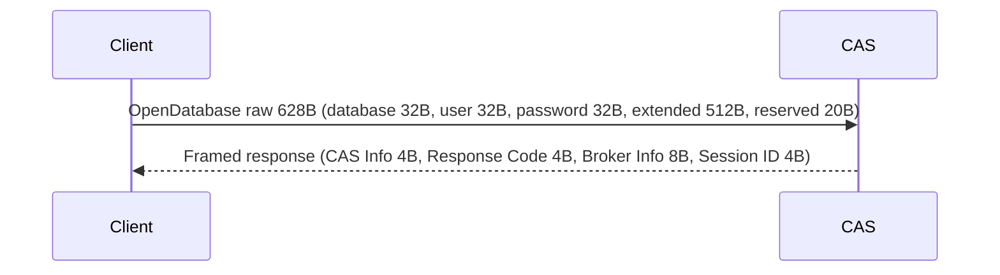
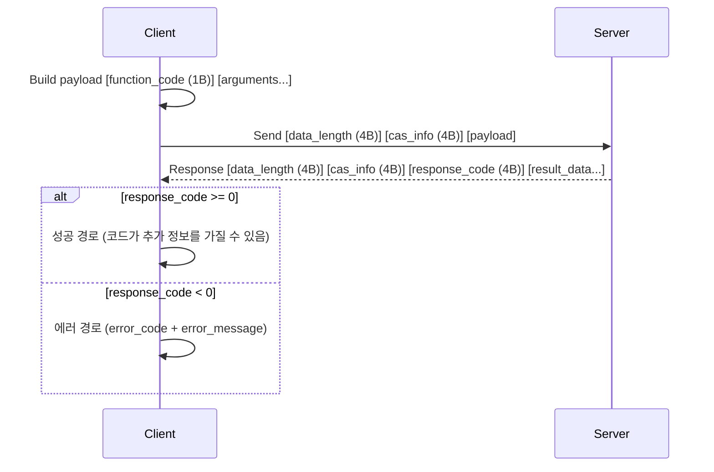

# CAS 프로토콜 참조 (한국어)

> 🌐 [PROTOCOL.md](https://github.com/cubrid-lab/pycubrid/blob/main/docs/PROTOCOL.md)의 번역입니다. 영어 원문이 표준이며, 페이지 번역은 경고 수준의 동기화 규칙을 따릅니다.

pycubrid가 구현하는 CUBRID CAS(Common Application Server) 와이어 프로토콜의 기술 문서.

---

## 목차

- [개요](#개요)
- [아키텍처](#아키텍처)
- [패킷 프레이밍](#패킷-프레이밍)
- [연결 핸드셰이크](#연결-핸드셰이크)
- [요청/응답 수명 주기](#요청응답-수명-주기)
- [함수 코드](#함수-코드)
- [패킷 클래스](#패킷-클래스)
  - [ClientInfoExchangePacket](#clientinfoexchangepacket)
  - [OpenDatabasePacket](#opendatabasepacket)
  - [연결 문자셋](#연결-문자셋)
  - [PrepareAndExecutePacket](#prepareandexecutepacket)
  - [PreparePacket](#preparepacket)
  - [ExecutePacket](#executepacket)
  - [FetchPacket](#fetchpacket)
  - [CommitPacket](#commitpacket)
  - [RollbackPacket](#rollbackpacket)
  - [CloseDatabasePacket](#closedatabasepacket)
  - [CloseQueryPacket](#closequerypacket)
  - [GetEngineVersionPacket](#getengineversionpacket)
  - [GetSchemaPacket](#getschemapacket)
  - [BatchExecutePacket](#batchexecutepacket)
  - [LOBNewPacket](#lobnewpacket)
  - [LOBWritePacket](#lobwritepacket)
  - [LOBReadPacket](#lobreadpacket)
  - [GetLastInsertIdPacket](#getlastinsertidpacket)
  - [GetDbParameterPacket / SetDbParameterPacket](#getdbparameterpacket--setdbparameterpacket)
- [PacketWriter](#packetwriter)
- [PacketReader](#packetreader)
- [와이어 데이터 타입](#와이어-데이터-타입)
- [에러 처리](#에러-처리)
- [상수 참조](#상수-참조)

---

## 개요

CUBRID는 클라이언트-서버 통신에 **CAS**(Common Application Server)라는 독자 바이너리 프로토콜을 사용합니다. 프로토콜은 TCP 소켓 위에서 big-endian 바이트 순서로 동작합니다.

주요 특성:

- **전송**: TCP (브로커 기본 포트 33000)
- **바이트 순서**: Big-endian (네트워크 바이트 순서)
- **프레이밍**: 4바이트 데이터 길이 + 4바이트 CAS 정보 + 페이로드
- **핸드셰이크**: 매직 문자열 `CUBRK`(평문) 또는 `CUBRS`(STARTTLS) + 클라이언트 타입 + 프로토콜 버전
- **TLS (선택)**: 핸드셰이크 후 `OPEN_DATABASE` 이전에 `start_tls()` / `wrap_socket()`으로 STARTTLS 방식 업그레이드
- **세션**: 상태 저장 — `OpenDatabase` 이후 세션 ID 유지

---

## 아키텍처


```mermaid
graph LR
    client["Client (pycubrid)"] -- TCP port 33000 --> broker[Broker]
    broker --> cas[CAS Process]
    cas --> db[CUBRID Database]
```

1. **클라이언트**가 33000 포트의 **브로커**에 연결
2. **브로커**가 핸드셰이크를 수행하고 다른 포트의 CAS 프로세스로 리다이렉트할 수 있음
3. **클라이언트**가 CAS 프로세스에서 데이터베이스 세션을 엶
4. 이후 모든 요청은 CAS 세션을 통해 진행

---

## 패킷 프레이밍

초기 핸드셰이크 이후의 모든 패킷은 다음 프레임 형식을 사용합니다:


```mermaid
graph LR
    data["Data Length (4B) big-endian int32"] --> casinfo["CAS Info (4B) session state"]
    casinfo --> payload["Payload (variable) function-specific"]
```

| 필드         | 크기     | 설명 |
|--------------|----------|------|
| Data Length  | 4바이트  | CAS Info + Payload 길이 (부호 있는 int32, big-endian) |
| CAS Info     | 4바이트  | 서버가 유지하는 세션 상태 바이트 |
| Payload      | 가변     | 함수 코드 + 인자(요청) 또는 응답 데이터 |

CAS Info의 첫 바이트는 트랜잭션 상태입니다. `0`은 OUT_TRAN, `1`은
IN_TRAN입니다. `END_TRAN`이나 자동 커밋 요청 뒤 OUT_TRAN이 되어도
소켓 또는 CAS 세션이 해제된 것은 아니므로 다음 요청은 같은 전송 경로로
보냅니다. 그래도 CAS는 OUT_TRAN 응답 뒤 소켓을 닫을 수 있으므로(메모리
재시작, `cubrid broker reset`, CHANGE CLIENT) 드라이버는 JDBC
`UClientSideConnection.checkReconnect`처럼 다음 요청 전에 `CHECK_CAS`(FC=32)를
보냅니다. 검사가 실패할 때만 요청당 한 번, 그 요청을 처음 보내기 전에 세션을
교체합니다(#485). `CHECK_CAS` 실패 후에는 명시적 `ping(reconnect=True)` 복구도
시도할 수 있지만, 결과가 불확실한 일반 SQL 요청을 자동 재실행하지는 않습니다.
commit과 rollback은 `END_TRAN` 전에 열린 커서의 쿼리 핸들에 `CLOSE_REQ`(FC=6)를
보냅니다.

지연 닫기(#488): 직접 연결된 CUBRID CAS가 `OPEN_DATABASE`에서 statement pooling을 알리면
(`broker_info[0] == 1` 및 `broker_info[2] == 1`) 쿼리 핸들이 `END_TRAN` 뒤에도 남으므로, autocommit 모드에서
`cursor.close()`나 커서 재실행으로 해제되는 핸들과, 모드와 관계없이 `close()` 없이
수거된 커서의 핸들은 별도의 `CLOSE_REQ`로 닫지 않습니다. 그 id는 다음 FC41 요청의
auto-commit 플래그 뒤에 추가 prepare 인자로 붙고(id마다 prepare 인자 수가 하나씩
늘어남), CAS는 문장을 준비하기 전에 그 핸들을 해제합니다. 이는 JDBC 지연 닫기의
와이어 방식이지만 정책은 다릅니다: JDBC는 결과 집합이 없는 문장만 지연하고
SELECT/CALL/EVALUATE 핸들은 바로 닫지만(`CLOSE_USTATEMENT`), pycubrid는 결과 집합
핸들도 지연합니다. 그 문장이 네이티브 오류로 실패해도 핸들은 해제됩니다. 한 문장은
최대 256개 id를 싣습니다. 256개가 대기 중일 때의 명시적 해제는 `CLOSE_REQ`를 바로
보내고, 수거된 커서는 항상 대기열에 들어가 이후 문장들에 실려 갑니다. FC20 배치
요청은 대기 중인 id를 싣지 않으므로 `executemany()`로 해제한 핸들은 다음 FC41이나
트랜잭션 경계까지 기다립니다. 빈 `executemany()`는 배치 SQL을 보내거나 대기열을
비우지 않으며, 이전 핸들을 지연할 수 있으면 `CLOSE_REQ`도 보내지 않습니다.
대기열이 가득 찬 경우처럼 지연할 수 없으면 기존의 즉시 닫기 규칙을 적용합니다. `commit()`과
`rollback()`은 `END_TRAN` 전에 그 세션의 대기 중인 id를 모두 `CLOSE_REQ`로 닫으며,
이는 예전에 참조가 없는 커서를 닫던 것과 같습니다. 대기 중인 id는 하나의 물리 세션에 속하며, 그 세션이
폐기되거나 교체되면 버려지고 다른 세션으로는 절대 보내지 않습니다. statement
pooling이 꺼져 있으면 CAS가 커밋마다 핸들을 해제하므로 예전처럼 `CLOSE_REQ`를 바로
보내고, 수거된 커서의 핸들은 다음 커밋에 맡깁니다. 샤드 프록시(`broker_info[0]`이
CUBRID를 뜻하는 `1`이 아닌 경우)는 추가 인자를 무시하므로 명시적 해제는 `CLOSE_REQ`를 바로
보냅니다. 수거된 프록시 커서의 핸들은 프록시 트랜잭션·세션 정리에 맡깁니다.
세션 설정(교체 세션의 escape 모드 감지와 설정 복원) 중의 명시적 해제는 지연하지 않습니다.
직접 연결된 pooling 활성 세션의 수거된 커서는 아무것도 보낼 수 없으므로 설정 중에도 핸들을 대기열에 넣을 수 있습니다.
각 핸들은 자신을 연 세션의 세대를 기억하므로, 재접속 뒤에 수거된 커서가 새 세션의
핸들 id를 해제하는 일은 없습니다.

pooling 비활성화 시의 소유권(#584): 직접 연결된 CUBRID CAS에서 statement
pooling이 명시적으로 꺼져 있으면 트랜잭션 경계에서 일반 커서·스키마 핸들을
모두 해제하며, 같은 물리 세션에서 그 id를 즉시 재사용할 수 있습니다.
드라이버는 END_TRAN, 자동 커밋 FC41/FC3·버전 요청, 실패 후 자동 rollback하는
자동 커밋 FC2 또는 일반 자동 커밋 결과의 마지막 FETCH의 실제 응답이 OUT_TRAN이면
소유권을 폐기합니다. 성공한 FC2 prepare는 경계를 확정하지 않습니다. 응답 파싱과
INSERT의 identity 조회 전에 처리하므로, 후속 조회가 IN_TRAN을 반환해도 이미
해제된 핸들을 남기지 않습니다. 현재 FC41 응답에서 해제된 핸들은 완전한 응답의
`DataError` 경로에서도 채택하지 않습니다. 버퍼의 행은 계속 읽을 수 있지만,
미완료 결과에서 서버 FETCH가 필요하면 `InterfaceError`가 발생하고 완료된
결과는 정상 EOF를 유지합니다. 물리 세대와 세션 검증은 바뀌지 않습니다.
CHECK_CAS·CLOSE_REQ·파라미터·스키마 요청/FETCH·배치 응답의 OUT_TRAN만으로는
이 경계를 확정하지 않으며, 수동 트랜잭션 FETCH와 pooling 활성·프록시 세션의
기존 동작을 유지합니다.

자동 `no_backslash_escapes` 감지는 물리 세션 단위입니다. 새 세션은
파라미터 바인딩 재개 전에 감지하지만 정상적인 동일 세션 `CHECK_CAS`는
감지하지 않습니다. 명시적 모드는 유지됩니다. 복구 감지 실패 시 대체
세션을 폐기하고 ping은 `False`를 반환하며, 이전 세션 세대에서 바인딩한
비동기 SQL은 전송 전에 거부합니다.

**헤더 생성:**

```python
from pycubrid.packet import build_protocol_header

header = build_protocol_header(data_length=42, cas_info=b"\x00\x00\x00\x00")
# 8바이트 반환: 4바이트 길이 + 4바이트 cas_info
```

### 예외

**핸드셰이크 패킷**(`ClientInfoExchangePacket`)은 이 프레이밍을 사용하지 **않습니다** — 길이/cas_info 헤더 없이 raw 바이트를 보냅니다.

**데이터베이스 열기 패킷**(`OpenDatabasePacket`)은 헤더 없이 raw 바이트(628바이트)를 보내지만, *응답*은 표준 프레이밍을 사용합니다.

---

## 연결 핸드셰이크

연결 흐름은 최대 4단계입니다 (TLS 단계는 선택):

### 1단계: 클라이언트 정보 교환


```mermaid
sequenceDiagram
    participant Client
    participant Broker
    alt ssl requested
        Client->>Broker: ClientInfoExchange raw 10B ("CUBRS", CLIENT_JDBC=3, CAS_VER=0x48, padding)
    else plaintext
        Client->>Broker: ClientInfoExchange raw 10B ("CUBRK", CLIENT_JDBC=3, CAS_VER=0x48, padding)
    end
    Broker-->>Client: status int32 (0 ok / >0 redirect port / <0 fail-fast)
```

- **매직 문자열**: `"CUBRK"`(평문) 또는 `"CUBRS"`(STARTTLS 요청) — ASCII 5바이트
- **클라이언트 타입**: `CLIENT_JDBC = 3` (pycubrid는 JDBC 호환 클라이언트로 식별됨)
- **CAS 버전**: `PROTO_INDICATOR(0x40) | VERSION(8) = 0x48`
- **상태 int32**: 부호 있는 big-endian
    - `> 0` — 리다이렉트 포트: 소켓을 닫고 `(host, status)`로 재연결, 핸드셰이크는 **반복하지 않음** (JDBC `BrokerHandler.connectBroker` 동작 미러링)
    - `< 0` — 즉시 실패: `OperationalError(status)` 발생
    - `== 0` — 현재 소켓 재사용 (다이렉트 모드)

### 1.5단계: TLS 업그레이드 (선택)

connect 호출에서 `ssl`이 참이었으면, 어떤 `OPEN_DATABASE` 바이트가 쓰이기 **전에** 라이브 전송을 업그레이드합니다:

- 동기 드라이버: `ssl.SSLContext.wrap_socket(sock, server_hostname=host)`
- 비동기 드라이버: `loop.start_tls(transport, protocol, context, server_hostname=host, ssl_handshake_timeout=...)`

TLS 핸드셰이크에는 설정된 `read_timeout` 또는 기본 10초 제한을 적용합니다.
이 기본값은 이후 요청을 제한하지 않으며, `connect_timeout`은 TCP 연결만 제한합니다.

Python 3.10의 비동기 인증서 사전 검증은 소유한 원시 소켓에서 메모리 BIO를 사용합니다.
송신·수신·핸드셰이크 완료는 하나의 단조 시계 기반 마감 시간을 공유합니다.
필수 마지막 핸드셰이크 송신 실패는 전파하며, 선택적 close-notify는 같은 시간 예산
안에서만 최선을 다해 처리합니다. 검증 소켓은 항상 닫습니다.

실패한 핸드셰이크는 전송을 중단시킵니다. Python 3.10 동기 드라이버의 기본
`wrap_socket()` 업그레이드에는 CPython의 리셋·리소스 경고 제한이 있습니다.
[연결 설정](CONNECTION.md)을 참고하세요.

### 2단계: 데이터베이스 열기


```mermaid
sequenceDiagram
    participant Client
    participant CAS
    Client->>CAS: OpenDatabase raw 628B (database 32B, user 32B, password 32B, extended 512B, reserved 20B)
    CAS-->>Client: Framed response (CAS Info 4B, Response Code 4B, Broker Info 8B, Session ID 4B)
```

- 데이터베이스, 사용자, 비밀번호는 고정 길이 null 패딩 문자열
- **Broker Info**(8바이트) 포함 내용:
  - 바이트 0: `db_type`
  - 바이트 2: `statement_pooling`
  - 바이트 4: `protocol_version` (하위 6비트)
- **세션 ID**: 이후 CAS 정보 추적에 사용

### 3단계: 준비 완료

`OpenDatabase` 성공 후 연결이 SQL 연산에 사용할 수 있게 됩니다.

---

## 요청/응답 수명 주기

연결 이후의 모든 연산은 이 패턴을 따릅니다:


```mermaid
sequenceDiagram
    participant Client
    participant Server
    Client->>Client: Build payload [function_code (1B)] [arguments...]
    Client->>Server: Send [data_length (4B)] [cas_info (4B)] [payload]
    Server-->>Client: Response [data_length (4B)] [cas_info (4B)] [response_code (4B)] [result_data...]
    alt response_code >= 0
        Client->>Client: 성공 경로 (코드가 추가 정보를 가질 수 있음)
    else response_code < 0
        Client->>Client: 에러 경로 (error_code + error_message)
    end
```

향후 prepared 커서 소유자를 위해 동기 전송 계층은 내부 물리 세션 세대 기대값을 받습니다(#478).
이는 **기대값을 전달한 내부 요청에만** 적용됩니다. #439의 소유자는 모든 prepared
FC2/FC3/FC6 요청에 이 값을 전달해야 합니다. connect·ping 복구·close·요청/응답을
보호하는 재진입 잠금 안에서 직렬화 전·송신 직전·응답 처리 중 세대와 소켓 정체성을
확인합니다. 한 요청은 포착한 소켓으로만 송수신하므로 재진입으로 연결이 바뀌어도
이전 FC3/FC6을 새 세션에 보내거나 새 응답을 이전 요청의 성공으로 오인하지 않습니다.
명확한 송신 전 검증 실패는
세션을 유지하고, 부분 송신·중단·불확실한 응답은 재실행이나 새 세션 FC6 없이
세션을 폐기합니다. 완전히 받은 브로커 SQL 오류는 기존 오류코드 기반 DB-API
예외를 유지합니다.

이 내부 보호는 공개 prepared 커서를 만들거나 `threadsafety=1`을 높이지 않습니다.
긴 동기 요청은 같은 연결의 ping을 지연시킬 수 있고, 일반 커서·스키마의 여러 단계
수명주기가 이 잠금만으로 전면적인 스레드 안전성을 얻는 것도 아닙니다. 임의의 Python
신호 처리기 안에서 DB-API 메서드를 재진입 호출하는 동작도 지원 계약이 아닙니다.

---

## 함수 코드

`CASFunctionCode`에 정의된 41개 CAS 함수 코드 전체:

| 코드 | 이름                  | 설명 |
|------|-----------------------|------|
| 1    | `END_TRAN`            | 트랜잭션 커밋 또는 롤백 |
| 2    | `PREPARE`             | SQL 문 준비 |
| 3    | `EXECUTE`             | 준비된 문장 실행 |
| 4    | `GET_DB_PARAMETER`    | 데이터베이스 파라미터 값 조회 |
| 5    | `SET_DB_PARAMETER`    | 데이터베이스 파라미터 값 설정 |
| 6    | `CLOSE_REQ_HANDLE`    | 쿼리/요청 핸들 닫기 |
| 7    | `CURSOR`              | 커서 위치 이동 |
| 8    | `FETCH`               | 결과 행 가져오기 |
| 9    | `SCHEMA_INFO`         | 스키마 정보 조회 |
| 10   | `OID_GET`             | OID로 객체 조회 |
| 11   | `OID_PUT`             | OID로 객체 갱신 |
| 15   | `GET_DB_VERSION`      | 데이터베이스 엔진 버전 조회 |
| 16   | `GET_CLASS_NUM_OBJS`  | 클래스 객체 수 조회 |
| 17   | `OID_CMD`             | OID 연산 (drop, lock 등) |
| 18   | `COLLECTION`          | 컬렉션 연산 |
| 19   | `NEXT_RESULT`         | 다음 결과 집합 조회 |
| 20   | `EXECUTE_BATCH`       | 여러 SQL 문 배치 실행 |
| 21   | `EXECUTE_ARRAY`       | 배열 바인딩으로 실행 |
| 22   | `CURSOR_UPDATE`       | 커서를 통한 갱신 |
| 23   | `GET_ATTR_TYPE_STR`   | 속성 타입 문자열 조회 |
| 24   | `GET_QUERY_INFO`      | 쿼리 플랜 정보 조회 |
| 26   | `SAVEPOINT`           | 세이브포인트 설정 또는 롤백 |
| 27   | `PARAMETER_INFO`      | 파라미터 메타데이터 조회 |
| 28–30 | `XA_*`               | XA 분산 트랜잭션 연산 |
| 31   | `CON_CLOSE`           | CAS 연결 종료 |
| 32   | `CHECK_CAS`           | CAS 프로세스 핑 |
| 33   | `MAKE_OUT_RS`         | 출력 결과 집합 생성 |
| 34   | `GET_GENERATED_KEYS`  | 자동 생성 키 조회 |
| 35   | `LOB_NEW`             | 새 LOB 핸들 생성 |
| 36   | `LOB_WRITE`           | LOB에 데이터 쓰기 |
| 37   | `LOB_READ`            | LOB에서 데이터 읽기 |
| 38   | `END_SESSION`         | CAS 세션 종료 |
| 39   | `GET_ROW_COUNT`       | 영향받은 행 수 조회 |
| 40   | `GET_LAST_INSERT_ID`  | 마지막 auto-increment ID 조회 |
| 41   | `PREPARE_AND_EXECUTE` | 준비 + 실행 결합 |

---

## 패킷 클래스

pycubrid는 `pycubrid.protocol`에 20개 패킷 클래스를 구현합니다. 각 클래스는 다음을 제공합니다:

- `write()` — 요청 직렬화 (일부는 `cas_info` 파라미터를 받음)
- `parse(data)` — 응답 역직렬화

### ClientInfoExchangePacket

**핸드셰이크 패킷** — 표준 프레이밍 없음.

```python
packet = ClientInfoExchangePacket()
raw = packet.write()          # 10바이트, cas_info 불필요
packet.parse(response_4bytes) # new_connection_port 파싱
```

| 속성                  | 타입  | 설명 |
|------------------------|-------|------|
| `new_connection_port`  | `int` | CAS 프로세스 포트 (0 = 현재 재사용) |

---

### OpenDatabasePacket

**데이터베이스 세션 열기** — 628 raw 바이트 전송, 프레임된 응답 수신.

```python
packet = OpenDatabasePacket(database="testdb", user="dba", password="")
raw = packet.write()        # 628바이트, cas_info 없음
packet.parse(response_data) # CAS 정보 접두사가 있는 프레임된 응답
```

| 속성        | 타입   | 설명 |
|------------------|--------|------|
| `cas_info`       | `bytes` | CAS 세션 정보 (4바이트) |
| `response_code`  | `int`   | 성공 시 0, 오류 시 음수 |
| `broker_info`    | `dict`  | `{db_type, protocol_version, statement_pooling}` |
| `session_id`     | `int`   | 서버 세션 식별자 |

database, user, password는 연결 `charset`(기본 UTF-8)으로 인코딩한 뒤 32바이트 필드에
맞게 문자 경계에서 잘라, 멀티바이트 문자가 쪼개지지 않습니다(#86).

### 연결 문자셋

CAS 프로토콜은 클라이언트 문자셋을 전달하지 않고 브로커는 변환하지 않습니다. 서버는
요청 텍스트를 데이터베이스 문자셋으로 해석하고 각 값을 해당 컬럼의 문자셋으로
반환합니다. 따라서 `charset`(기본값 `"utf-8"`, #86)은 클라이언트 측 코덱입니다.
연결이 만드는 모든 패킷이 이를 가지며(`write()` 전에 설정되는 `packet.encoding`),
`PacketWriter` / `PacketReader`는 SQL 텍스트, FC9 인자, 자격 증명, 문자 값, 컬렉션 요소,
컬럼 메타데이터 이름과 기본값, 오류 텍스트와 테이블 이름을 담은 LOB 파일
로케이터(`errors="replace"`)에 이를 사용합니다. 가져온 `JSON` 값은 항상 UTF-8입니다.
`NUMERIC` 텍스트, 타임존 이름, 엔진 버전 문자열은 UTF-8을 유지하고 LOB 내용은 원시
바이트입니다. `euc_kr`에서 KS X 1001 밖의 한글(Python이 `A4 D4`로 시작하는 8바이트 조합
시퀀스로 인코딩)은 인코딩할 수 없는 것으로 취급합니다. 인코딩 실패는 요청을
보내기 전 `write()` 안에서 `DataError`를 발생시키고, 엄격 디코딩 실패는 응답 전체를
읽은 뒤 `DataError`를 발생시키므로 세션은 계속 사용할 수 있습니다.

---

### PrepareAndExecutePacket

**준비 + 실행 결합** (FC=41) — SQL 연산의 주 패킷.

| 속성            | 타입   | 설명 |
|----------------------|--------|------|
| `query_handle`       | `int`  | 서버 할당 쿼리 핸들 |
| `statement_type`     | `int`  | `CUBRIDStatementType` 코드 |
| `bind_count`         | `int`  | 바인드 파라미터 수 |
| `column_count`       | `int`  | 결과 컬럼 수 |
| `columns`            | `list[ColumnMetaData]` | 컬럼 메타데이터 |
| `total_tuple_count`  | `int`  | 결과 집합의 총 행 수 |
| `result_count`       | `int`  | 결과 정보 항목 수 |
| `result_infos`       | `list[ResultInfo]` | 문장별 결과 정보 |
| `tuple_count`        | `int`  | 초기 fetch의 행 수 |
| `rows`               | `list[tuple[Any, ...]]` | 가져온 행 데이터 |

---

### PreparePacket

**문장 준비** (FC=2) — 별도 준비 단계.

내부 패킷은 기존 기본값 `NORMAL` 또는 `HOLDABLE=0x08` 플래그와 실제 autocommit
값을 보냅니다. SQL에 NUL이나 연결 문자셋으로 인코딩할 수 없는 문자가 있으면 FC2를 보내기 전에
거부합니다. 이는 [#439 설계](../PREPARED_BINDING_DESIGN.md)를 위한 내부 와이어
기반이며, 공개 prepared 커서가 아닙니다.

| 속성        | 타입   | 설명 |
|------------------|--------|------|
| `query_handle`   | `int`  | 서버 할당 쿼리 핸들 |
| `statement_type` | `int`  | 문장 타입 코드 |
| `bind_count`     | `int`  | 바인드 파라미터 수 |
| `column_count`   | `int`  | 결과 컬럼 수 |
| `columns`        | `list[ColumnMetaData]` | 컬럼 메타데이터 |

---

### ExecutePacket

**준비된 문장 실행** (FC=3).

고정 인자 10개 뒤에 검증된 스칼라 바인딩마다 타입 바이트와 값 바이트를 길이 접두 인자
2개로 보냅니다. 내부 첫 범위는 부호 있는 INT32(타입 8), 연결 문자셋의 CHAR(타입 1,
끝 NUL 포함), SQL NULL(타입 0, 길이 0)입니다. 빈 문자열은 NUL 1바이트로 NULL과
구별합니다. 선택적 `bind_count`는 전달된 바인딩 수와 일치해야 하며 forward-only
바이트는 autocommit일 때 1, 수동 모드일 때 0입니다. FC41 폴백이나 SQL 리터럴
변환은 하지 않습니다.

타입 컬렉션 바인딩(#482)도 같은 인자 쌍을
씁니다. 타입 인자는 컬렉션 종류인 SET(`16`), MULTISET(`17`), SEQUENCE(`18`)입니다.
값 인자는 원소 타입 바이트 하나(INT `8` 또는 공식 드라이버와 같은 STRING `2`)
뒤에 원소마다 `int32 길이 + 페이로드`가 이어지며, 요청에는 원소 개수가 없습니다.
INT 원소는 빅엔디언 4바이트, 문자열 원소는 연결 문자셋 바이트와 NUL, NULL 원소는
길이 0입니다. 빈 컬렉션은 원소 타입 바이트만 보냅니다. 값 전체 SQL NULL은 컬렉션이
아니라 스칼라 NULL 쌍입니다. 원소 길이가 인자를 넘으면 브로커는 조용히 파싱을 멈추고
일부만 담긴 컬렉션을 저장하므로(`cas_execute.c`), 바이트를 만들기 전에 원소를
검증합니다. 입력은 중첩 없는 tuple이어야 하고, INT 원소는 `int`(`bool` 제외) 또는
정규 10진 문자열이며 한 컬렉션에 둘을 섞을 수 없습니다. 문자열 원소는 NUL 없는
`str`입니다. 혼합, 중첩, `bool`, `float`, `bytes` 원소는 거부합니다.
CUBRID 10.2와 11.4의 브로커는 MULTISET 종류를 오류 -454로 거부하며(멀티셋을
`db_make_set()`으로 감쌈), SET 값을 MULTISET 컬럼에 저장하면 중복이 사라지고
SEQUENCE 값은 중복을 유지합니다.

공개 `pycubrid.compat.native`의 `set.imports()`(#440)는 공식 드라이버와 같은
방식으로 이 쌍을 만듭니다. 요청한 원소 타입과 관계없이 모든 원소는 STRING(`2`)
원소이고(INT 원소는 10진 텍스트), 기본 종류는 SET(`16`)이므로 바이트가 공식 요청과
같습니다. `kind=MULTISET`은 `17`이 아니라 SEQUENCE(`18`)로 보냅니다.

프로토콜 버전이 1보다 크고 응답의 `include_column_info=1`이면 전체 FC2 메타데이터
본문이 shard ID와 인라인 FETCH 앞에 옵니다. 파서는 문장·바인드·컬럼 정보를
갱신하고 잘린 메타데이터를 거부합니다. 결과 레코드가 음수 오류를 나타내면 성공으로
처리하지 않고, 기존 CAS 코드→DB-API 예외 클래스 매핑을 적용합니다. 브로커 오류
문구는 그대로 노출하지 않습니다.
물리 세션 소유권과 공개 커서 수명주기는 아직 #439 작업입니다.

| 속성            | 타입   | 설명 |
|----------------------|--------|------|
| `total_tuple_count`  | `int`  | 총 결과 행 수 |
| `result_count`       | `int`  | 결과 정보 수 |
| `result_infos`       | `list[ResultInfo]` | 문장별 결과 |
| `tuple_count`        | `int`  | 인라인 fetch 행 수 |
| `rows`               | `list[tuple[Any, ...]]` | 인라인으로 가져온 행 |

---

### FetchPacket

**결과 행 가져오기** (FC=8) — 페이지 단위 행 조회에 사용.

| 속성      | 타입   | 설명 |
|----------------|--------|------|
| `tuple_count`  | `int`  | 가져온 행 수 |
| `rows`         | `list[tuple[Any, ...]]` | 행 데이터 |

---

### CommitPacket

**트랜잭션 커밋** (`CCITransactionType.COMMIT`과 함께 FC=1).

결과 속성 없음 — 오류 시 예외 발생.

---

### RollbackPacket

**트랜잭션 롤백** (`CCITransactionType.ROLLBACK`과 함께 FC=1).

결과 속성 없음 — 오류 시 예외 발생.

---

### CloseDatabasePacket

**CAS 세션 종료** (FC=31).

---

### CloseQueryPacket

**쿼리 핸들 해제** (FC=6).

---

### GetEngineVersionPacket

**서버 버전 조회** (FC=15).

| 속성        | 타입  | 설명 |
|------------------|-------|------|
| `engine_version` | `str` | 버전 문자열 (예: `"11.2.0.0378"`) |

---

### GetSchemaPacket

**스키마 내성** (FC=9).

| 속성      | 타입  | 설명 |
|----------------|-------|------|
| `query_handle` | `int` | 스키마 행을 가져올 핸들 |
| `tuple_count`  | `int` | 스키마 항목 수 |
| `columns` | `list` | 네 필드만 있는 축약 컬럼 메타데이터 |

**소유권이 있는 스키마 요청 (#455, #456):** 확인된 FC9 요청은
길이 접두가 있는 인자를 스키마 타입(`int`), 첫 이름/패턴(`string` 또는 NULL),
두 번째 이름/패턴(`string` 또는 NULL), 플래그(`byte`), 샤드 ID(`int`, 프로토콜
V5 이상) 순서로 보냅니다. NULL은 길이 0인 인자이며, 빈 문자열은 NUL 종료자를
포함하므로 서로 다른 인자입니다. 문자열은 연결 문자셋(기본 UTF-8)을 사용합니다.

응답 핸들과 튜플 수 다음에는 컬럼 수와 축약 컬럼 정보가 옵니다. 각 컬럼은
타입(1 또는 2바이트), scale(`int16`), precision(`int32`), 이름 길이(`int32`),
이름만 포함합니다. 일반 SELECT 메타데이터와 달리 별도 속성/테이블 이름,
NULL 허용 여부, 기본값, 제약 플래그는 없습니다. 따라서 비공개 디코더는
타입·scale·precision·이름만 제공하고, 없는 필드를 만들어 내지 않으며 기존
컬렉션 종류 정규화를 유지합니다.

`GetSchemaPacket.write/parse`는 이제 이 레이아웃을 사용합니다. 연결 getter는
원래 패킷의 식별자와 불변 핸들·개수·컬럼을 등록합니다. `fetch_schema_info(packet)`은
FC8로 모든 행을 읽고 0행도 FC6으로 닫으며, `close_schema_info(packet)`은 명시적
폐기입니다. 두 작업은 원래 CAS 세션에서만 실행하고 자동 재접속·재실행하지 않습니다.
기존 핸들 전용 FC6은 서버 기본값이 false인 선택적 auto-commit 인자를 생략합니다.
commit/rollback은 END_TRAN 전에 활성 핸들을 닫고 물리 연결 폐기는 소유권을 종료합니다.
비동기 등록·fetch/close는 연결 락 안에서 원자적으로 처리하며 I/O 취소 시 읽지 않은
응답 위로 FC6을 보내지 않고 세션을 폐기합니다. #457 실서버 행렬은 10.2/11.4의
CLASS/VCLASS/ATTRIBUTE/CONSTRAINT/PRIMARY_KEY/IMPORTED_KEYS/EXPORTED_KEYS를
검증하며 모든 스키마 코드나 네이티브 동등성을 인증하지는 않습니다.
참조 소스: [CAS FC9 인자](https://github.com/CUBRID/cubrid/blob/6b2bc75527c8bad94d9ad8aba961638efdfb3269/src/broker/cas_function.c#L1192),
[CCI 축약 컬럼](https://github.com/CUBRID/cubrid-cci/blob/7d1eb8f40f04089b8218d08e36e2c24a2de11b24/src/cci/cci_query_execute.c#L5285),
[JDBC 스키마 요청](https://github.com/CUBRID/cubrid-jdbc/blob/ba59be0c63ae4b334fde81ce2c523642f1afd37f/src/jdbc/cubrid/jdbc/jci/UConnection.java#L516).

---

### BatchExecutePacket

**배치 실행** (FC=20) — 하나의 요청에 여러 SQL 문.

| 속성 | 타입  | 설명 |
|-----------|-------|------|
| `results` | `list[tuple[int, int]]` | 문장별 `(stmt_type, result_count)` |
| `errors`  | `list[dict]` | 실패한 문장의 `{code, message}` |

---

### LOBNewPacket

**LOB 핸들 생성** (FC=35).

| 속성    | 타입    | 설명 |
|--------------|---------|------|
| `lob_handle` | `bytes` | 서버 생성 LOB 핸들 |

---

### LOBWritePacket

**LOB 데이터 쓰기** (FC=36).

---

### LOBReadPacket

**LOB 데이터 읽기** (FC=37).

| 속성    | 타입    | 설명 |
|--------------|---------|------|
| `bytes_read` | `int`   | 실제 읽은 바이트 수 |
| `lob_data`   | `bytes` | 읽은 데이터 |

---

### GetLastInsertIdPacket

**마지막 insert ID 조회** (FC=40).

| 속성        | 타입  | 설명 |
|------------------|-------|------|
| `last_insert_id` | `str` | 문자열로 표현된 마지막 auto-increment 값 |

---

### GetDbParameterPacket / SetDbParameterPacket

**데이터베이스 파라미터 조회/설정** (FC=4 / FC=5).

| 속성 | 타입  | 설명 |
|-----------|-------|------|
| `value`   | `int` | 파라미터 값 (조회 결과 / 설정 입력) |

사용 가능한 파라미터(`CCIDbParam`):

| 코드 | 이름               | 설명 |
|------|--------------------|------|
| 1    | `ISOLATION_LEVEL`  | 트랜잭션 격리 수준 |
| 2    | `LOCK_TIMEOUT`     | 잠금 대기 타임아웃 |
| 3    | `MAX_STRING_LENGTH`| 최대 문자열 길이 |
| 4    | `AUTO_COMMIT`      | 자동 커밋 모드 (0/1) |

---

## PacketWriter

`pycubrid.packet.PacketWriter` — CAS 와이어 형식으로 데이터 직렬화.

### 공개 메서드

| 메서드 | 설명 |
|--------|------|
| `add_byte(value)` | 길이 접두 바이트 쓰기 (1B 길이 + 1B 값) |
| `add_short(value)` | 길이 접두 short 쓰기 (4B 길이 + 2B 값) |
| `add_int(value)` | 길이 접두 int 쓰기 (4B 길이 + 4B 값) |
| `add_long(value)` | 길이 접두 long 쓰기 (4B 길이 + 8B 값) |
| `add_float(value)` | 길이 접두 float 쓰기 (4B 길이 + 4B 값) |
| `add_double(value)` | 길이 접두 double 쓰기 (4B 길이 + 8B 값) |
| `add_bytes(value)` | 길이 접두 raw 바이트 쓰기 |
| `add_null()` | null 마커 쓰기 (길이 0) |
| `add_date(y, m, d)` | 길이 접두 날짜 쓰기 |
| `add_time(h, m, s)` | 길이 접두 시간 쓰기 |
| `add_timestamp(y,m,d,h,m,s)` | 길이 접두 타임스탬프 쓰기 |
| `add_datetime(y,m,d,h,m,s,ms)` | 길이 접두 datetime 쓰기 |
| `add_cache_time()` | 캐시 시간 쓰기 (int 0 두 개) |
| `to_bytes()` | 쓴 모든 바이트 반환 |

### 내부 메서드

| 메서드 | 설명 |
|--------|------|
| `_write_byte(value)` | raw 바이트, 길이 접두 없음 |
| `_write_short(value)` | raw short (2B) |
| `_write_int(value)` | raw int (4B) |
| `_write_long(value)` | raw long (8B) |
| `_write_float(value)` | raw float (4B) |
| `_write_double(value)` | raw double (8B) |
| `_write_bytes(value)` | raw 바이트, 접두 없음 |
| `_write_filler(count, value)` | N바이트를 값으로 채우기 |
| `_write_null_terminated_string(value)` | 연결 문자셋(기본 UTF-8)의 길이 접두 문자열 + null 종단 |
| `_write_fixed_length_string(value, length)` | 고정 폭 null 패딩 문자열, 문자 경계에서 자름 |

---

## PacketReader

`pycubrid.packet.PacketReader` — CAS 와이어 데이터 역직렬화.

### 원시 파서

| 메서드 | 반환 | 소비 바이트 |
|--------|---------|----------------|
| `_parse_byte()` | `int` | 1 |
| `_parse_short()` | `int` | 2 |
| `_parse_int()` | `int` | 4 |
| `_parse_long()` | `int` | 8 |
| `_parse_float()` | `float` | 4 |
| `_parse_double()` | `float` | 8 |
| `_parse_bytes(count)` | `bytes` | `count` |
| `_parse_null_terminated_string(length)` | `str` | `length` |

모든 읽기는 응답 안에서만 이루어집니다(#383). 길이가 앞에 오는 읽기(바이트,
텍스트, `NUMERIC`, `JSON`, 디코딩하지 않은 컬렉션 또는 LOB 핸들,
`_skip_bytes()`)는 이동하기 전에 `0 <= length <= bytes_remaining()`를 확인하고,
아니면 `ValueError`를 발생시킵니다. 고정 폭 읽기가 끝을 넘으면 `struct.error`
또는 `IndexError`가 발생합니다. 실패한 읽기는 오프셋을 바꾸지 않습니다. 텍스트
리더는 길이가 0 이하이면 이동하지 않고 `""`를 반환합니다. 디코딩한 컬렉션의
원소는 선언된 크기를 정확히 채워야 하며, `LOB_READ` 바이트 수는 응답 안에
들어가야 합니다(요청한 길이보다 작은 값은 정상적인 짧은 읽기). FETCH 또는
실행 응답에 포함된 행의 각 셀 값은 크기 워드가 선언한 바이트를 정확히 사용해야
합니다. 고정 폭 값(`INT`, `DATE`, `OBJECT` 등)은 크기를 직접 읽지 않으므로 행
파서가 값을 읽기 전에 타입의 폭과 비교합니다(#523). `DataError`를 발생시키기 전에
응답을 다시 훑을 때도 같습니다. 0 이하의 크기는 SQL `NULL`입니다. 음수인 FETCH
튜플 수도 잘못된 형식이며, FC2, FC3, FC41 컬럼 메타데이터의 음수 컬럼 수와 음수
컬럼 이름, 실제 이름, 테이블 이름, 기본값 길이도 마찬가지입니다(#555). 길이 0은
빈 문자열입니다. FC41도 FC2처럼 음수인 바인드 수, `total_tuple_count`, 인라인
튜플 수와, 응답의 나머지 바이트에 들어갈 수 없는 컬럼 수(컬럼당 최소 31바이트)를
거부하며, FC3는 음수인 인라인 튜플 수를 거부합니다(#581). 연결 문자셋으로 디코딩할
수 없는 컬럼 메타데이터 텍스트는 남은 메타데이터를 선언된 길이대로 끝까지 훑은
뒤 오류를 보류합니다(#581). FC41과 컬럼을 갱신하는 FC3는 남은 꼬리 필드·카운트·
인라인 행을 검증한 뒤 최초 메타데이터 `DataError`를 다시 발생시킵니다.
뒤쪽 구조 손상이 있으면 해당 오류가 우선합니다(#591). 이 오류 경로에서는 사용자
JSON 변환기를 호출하지 않으며, 앞선 행 값을 표현할 수 없어도 이후 셀을 검증합니다.
정상 결과에서 컬렉션을 원시 바이트로 반환하는 경우에도 알려진 컬렉션 구조를 검증하고,
음수 원소 수는 거부합니다. 인라인 페치 헤더가 일부만 있으면 잘못된 형식이며,
선택적 헤더가 전혀 없는 경우는 계속 지원합니다. 연결은 이
예외들을 `OperationalError("malformed response from broker")`로 바꾸고 연결을
닫습니다. `DataError`는 응답은 완전하지만 Python이 값을 표현할 수 없는 경우에만
사용합니다(#492, #512). 응답이 선언한 마지막 값 뒤에 남은 바이트는 검사하지
않습니다.

알려진 타입으로 디코딩하는 컬렉션은 각 길이 워드와 페이로드가 컬렉션 안에
들어가야 하며, 디코더가 선언된 바이트 수를 정확히 소비해야 합니다.
완전한 원소에서 `DataError`가 발생해도 후속 원소의 실제 디코더를 계속 실행하여,
뒤쪽의 잘못된 타입 표현이 보류한 오류보다 우선하도록 합니다(#595).
완전한 컬렉션은 최초 변환 오류와 원인을 유지합니다. NULL 전용 컬렉션, 원시
바이트 반환·디코딩 비활성화, 지원하지 않는 중첩 원소 형식의 기존 계약은 유지하며
새로운 재귀 디코딩 기능을 추가하지 않습니다.

내부 경계 재검증은 `PacketReader.mark()`와 `seek(position)`을 사용합니다.
응답 밖의 위치나 정수가 아닌 위치는 리더를 이동하지 않고 `ValueError`를
발생시킵니다. 0과 응답 끝은 유효한 위치입니다.

### 복합 파서

| 메서드 | 반환 | 설명 |
|--------|---------|------|
| `_parse_date()` | `datetime.date` | short 3개 (연, 월, 일) |
| `_parse_time()` | `datetime.time` | short 3개 (시, 분, 초) |
| `_parse_datetime()` | `datetime.datetime` | short 7개 (y,m,d,h,m,s,ms) |
| `_parse_timestamp()` | `datetime.datetime` | short 6개 (y,m,d,h,m,s) |
| `_parse_timestamptz()` | `datetime.datetime` | short 6개 (y,m,d,h,m,s) + 타임존 문자열; 초 정밀도 (`TIMESTAMPTZ`/`TIMESTAMPLTZ`) |
| `_parse_datetimetz()` | `datetime.datetime` | short 7개 (y,m,d,h,m,s,ms) + 타임존 문자열; 밀리초 정밀도 (`DATETIMETZ`/`DATETIMELTZ`) |
| `_parse_numeric(size)` | `Decimal` | null 종단 문자열 → Decimal |
| `_parse_object()` | `str` | OID 문자열 (`"OID:@page\|slot\|volume"`) |
| `read_blob(size)` | `dict` | BLOB 핸들 정보 |
| `read_clob(size)` | `dict` | CLOB 핸들 정보 |
| `read_error(length)` | `(int, str)` | 오류 코드와 메시지 |
| `bytes_remaining()` | `int` | 버퍼의 읽지 않은 바이트 |

---

## 와이어 데이터 타입

컬럼 메타데이터는 첫 타입 바이트의 `0x60` 컬렉션 종류 비트를 보존합니다.
`0x20`은 SET, `0x40`은 MULTISET, `0x60`은 SEQUENCE입니다. `0x80`이 설정되면
두 번째 바이트 전체가 스칼라/요소 타입(31을 넘는 코드 포함)을 나타내며,
그렇지 않으면 하위 5비트가 타입입니다. 컬렉션 행은 요소 타입이 아닌 컬렉션 종류로 디코딩합니다.

`CALL` / `EVALUATE` 결과의 셀과 메타데이터 타입이 `NULL`인 컬럼(`SELECT NULL` 등)의
셀은 값 앞에 자신의 타입 헤더를 가지며, 셀 크기는 이 헤더를 포함합니다. 프로토콜 7 이상
브로커(CUBRID 10.2+)는 컬럼 메타데이터와 같이 `0x80 | 컬렉션 비트 | charset`, 그다음
타입 바이트를 씁니다. 예를 들어 `INT` 42를 반환하는 함수의 `CALL`은
`00000006 83 08 0000002a`, `CALL find_user('dba') ON CLASS db_user`는
`0000000a 83 13 <8바이트 OID>`입니다. 이전 브로커는 타입 바이트 하나를 씁니다.
드라이버는 두 형식을 모두 읽으며(#542), 셀보다 긴 헤더는 잘못된 응답입니다.

컬렉션 값은 요소 타입 1바이트, 4바이트 요소 개수, 그리고 요소마다 4바이트 길이와 페이로드로
구성됩니다. NULL 요소는 길이 `-1`이며 페이로드가 없습니다. 모든 요소가 NULL이면 CUBRID
10.2/11.4는 요소 타입 `0`(NULL)을 보냅니다. `{}`는 `00 00000000`, `{NULL, NULL}`은
`00 00000002 ffffffff ffffffff`입니다.

컬럼 데이터는 4바이트 크기 접두 + raw 데이터로 전송됩니다. 타입이 데이터 바이트의 해석을 결정합니다:

| 타입 코드 | 이름       | 와이어 형식 |
|-----------|------------|-------------|
| 0         | `NULL`     | size ≤ 0 → `None` |
| 1         | `CHAR`     | 연결 문자셋(기본 UTF-8)의 null 종단 문자열 |
| 2         | `STRING`   | 연결 문자셋(기본 UTF-8)의 null 종단 문자열 |
| 3         | `NCHAR`    | 연결 문자셋(기본 UTF-8)의 null 종단 문자열 |
| 4         | `VARNCHAR` | 연결 문자셋(기본 UTF-8)의 null 종단 문자열 |
| 5         | `BIT`      | raw 바이트 |
| 6         | `VARBIT`   | raw 바이트 |
| 7         | `NUMERIC`  | null 종단 문자열 → `Decimal` |
| 8         | `INT`      | 4바이트 big-endian 부호 있는 int |
| 9         | `SHORT`    | 2바이트 big-endian 부호 있는 short |
| 10        | `MONETARY` | 8바이트 big-endian double |
| 11        | `FLOAT`    | 4바이트 big-endian float |
| 12        | `DOUBLE`   | 8바이트 big-endian double |
| 13        | `DATE`     | short 3개: 연, 월, 일 |
| 14        | `TIME`     | short 3개: 시, 분, 초 |
| 15        | `TIMESTAMP`| short 6개: y, m, d, h, m, s |
| 16–18     | `SET/MULTISET/SEQUENCE` | raw 바이트 |
| 19        | `OBJECT`   | 4B 페이지 + 2B 슬롯 + 2B 볼륨 |
| 21        | `BIGINT`   | 8바이트 big-endian 부호 있는 long |
| 22        | `DATETIME` | short 7개: y, m, d, h, m, s, ms |
| 23        | `BLOB`     | 패킹된 LOB 핸들 → `dict` |
| 24        | `CLOB`     | 패킹된 LOB 핸들 → `dict` |
| 25        | `ENUM`     | 연결 문자셋(기본 UTF-8)의 null 종단 문자열 |

### 컬럼 메타데이터

결과 집합의 각 컬럼은 와이어에서 파싱한 메타데이터를 가집니다:

```python
@dataclass
class ColumnMetaData:
    column_type: int         # CUBRIDDataType 코드
    scale: int               # 십진 스케일 (해당 없으면 -1)
    precision: int           # 정밀도 (해당 없으면 -1)
    name: str                # 컬럼 별칭
    real_name: str           # 실제 컬럼 이름
    table_name: str          # 출처 테이블 이름
    is_nullable: bool        # 반대 의미의 wire 플래그에서 변환한 NULL 허용 여부
    default_value: str       # 기본값 표현식
    is_auto_increment: bool  # AUTO_INCREMENT 컬럼
    is_unique_key: bool      # 유니크 인덱스의 일부
    is_primary_key: bool     # 기본 키의 일부
    is_reverse_index: bool   # 리버스 인덱스 보유
    is_reverse_unique: bool  # 리버스 유니크 인덱스 보유
    is_foreign_key: bool     # 외래 키의 일부
    is_shared: bool          # 공유 속성
```

컬럼 메타데이터의 raw 바이트는 `is_non_null`입니다. 0은 NULL 허용, 0이 아닌 값은
NOT NULL이며 브로커는 이를 0/1로 정규화합니다. 메타데이터 파서는 `PacketReader`가
읽은 이 바이트에 `raw == 0`을 적용해 `is_nullable`과 공개
`cursor.description`의 `null_ok` 값을 만듭니다.

---

## 에러 처리

`response_code < 0`이면 응답에 오류가 담겨 있습니다:


```mermaid
graph LR
    code["Error Code (4B int)"] --> message["Error Message (null-terminated string)"]
```

pycubrid는 오류를 자동 분류합니다:

| 오류 패턴 | 예외 |
|---------------|------|
| `unique`, `duplicate`, `foreign key`, `constraint violation` | `IntegrityError` |
| `syntax`, `unknown class`, `does not exist`, `not found` | `ProgrammingError` |
| 그 외 모든 오류 | `DatabaseError` |

---

## 상수 참조

### CAS 프로토콜 상수

```python
class CASProtocol:
    MAGIC_STRING = "CUBRK"      # 핸드셰이크 매직 (평문)
    MAGIC_STRING_SSL = "CUBRS"  # 핸드셰이크 매직 (STARTTLS 요청)
    CLIENT_JDBC = 3             # 클라이언트 타입 식별자
    PROTO_INDICATOR = 0x40      # 프로토콜 인디케이터 비트
    VERSION = 8                 # 프로토콜 버전
    CAS_VERSION = 0x48          # 결합된 버전 바이트
```

### 와이어 데이터 크기

```python
class DataSize:
    BYTE = 1          BOOL = 1
    SHORT = 2         INT = 4
    FLOAT = 4         LONG = 8
    DOUBLE = 8        OBJECT = 8
    OID = 8           BROKER_INFO = 8
    DATE = 14         TIME = 14
    DATETIME = 14     TIMESTAMP = 14
    RESULTSET = 4     DATA_LENGTH = 4
    CAS_INFO = 4
```

### 문장 타입

| 코드 | 이름 | 코드 | 이름 |
|------|------|------|------|
| 0 | `ALTER_CLASS` | 20 | `INSERT` |
| 4 | `CREATE_CLASS` | 21 | `SELECT` |
| 5 | `CREATE_INDEX` | 22 | `UPDATE` |
| 9 | `DROP_CLASS` | 23 | `DELETE` |
| 10 | `DROP_INDEX` | 24 | `CALL` |
| 16 | `ROLLBACK_WORK` | 126 | `CALL_SP` |
| 17 | `GRANT` | 127 | `UNKNOWN` |

### 트랜잭션 타입

| 코드 | 이름 |
|------|------|
| 1 | `COMMIT` |
| 2 | `ROLLBACK` |

### 격리 수준

| 코드 | 이름 |
|------|------|
| 0x01 | `COMMIT_CLASS_UNCOMMIT_INSTANCE` (레거시 pre-MVCC) |
| 0x02 | `COMMIT_CLASS_COMMIT_INSTANCE` |
| 0x03 | `REP_CLASS_UNCOMMIT_INSTANCE` (레거시 pre-MVCC) |
| 0x04 | `REP_CLASS_COMMIT_INSTANCE` (READ COMMITTED, **서버 기본값**) |
| 0x05 | `REP_CLASS_REP_INSTANCE` |
| 0x06 | `SERIALIZABLE` |

> CUBRID의 MVCC 엔진(10.0+)에서는 `0x04`/`0x05`/`0x06`만 받아들여집니다. 하위 코드 `0x01`–`0x03`은 레거시 pre-MVCC 수준입니다. CUBRID 서버의 기본 격리 수준은 **READ COMMITTED**(`0x04`)입니다.
