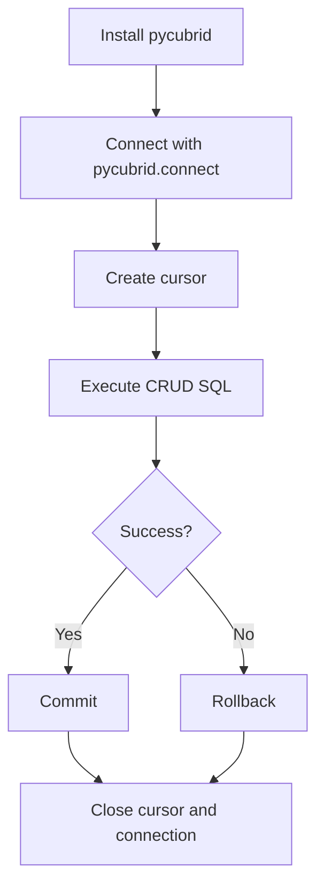

# 5분 만에 CUBRID 연결하기 (한국어)

> 🌐 [quickstart.md](https://github.com/cubrid-lab/pycubrid/blob/main/docs/quickstart.md)의 번역입니다. 영어 원문이 표준이며, 페이지 번역은 경고 수준의 동기화 규칙을 따릅니다.

`pip install`에서 명시적 트랜잭션 처리가 있는 동작하는 CRUD 스크립트까지 안내합니다.

---

## 사전 준비

- CUBRID 서버와 브로커가 실행 중일 것
- Python 3.10+
- 대상 데이터베이스(예: `testdb`) 접근 권한

!!! note
    pycubrid 예제의 기본 로컬 연결 값:
    `host="localhost"`, `port=33000`, `user="dba"`, `password=""`.

---

## 1) pycubrid 설치

```bash
pip install pycubrid
```

!!! tip
    가상 환경으로 의존성을 격리하세요:
    `python -m venv .venv && source .venv/bin/activate`.

---

## 2) 연결 열고 쿼리 실행하기

```python
from __future__ import annotations

import pycubrid

conn = pycubrid.connect(
    host="localhost",
    port=33000,
    database="testdb",
    user="dba",
    password="",
)

cur = conn.cursor()
cur.execute("SELECT 1 + 1")
print(cur.fetchone())  # (2,)

cur.close()
conn.close()
```

---

## 3) 간단한 CRUD 실행하기

```python
from __future__ import annotations

import pycubrid

conn = pycubrid.connect(database="testdb")
cur = conn.cursor()

cur.execute(
    """
    CREATE TABLE IF NOT EXISTS qs_users (
        id INT AUTO_INCREMENT PRIMARY KEY,
        name VARCHAR(100) NOT NULL,
        age INT NOT NULL
    )
    """
)

# INSERT
cur.execute("INSERT INTO qs_users (name, age) VALUES (?, ?)", ["Alice", 30])

# SELECT
cur.execute("SELECT id, name, age FROM qs_users ORDER BY id")
print(cur.fetchall())

# UPDATE
cur.execute("UPDATE qs_users SET age = ? WHERE name = ?", [31, "Alice"])

# DELETE
cur.execute("DELETE FROM qs_users WHERE name = ?", ["Alice"])

conn.commit()
cur.close()
conn.close()
```

!!! warning
    pycubrid는 `%s`가 아니라 `?` 플레이스홀더(qmark 방식)를 사용합니다.

---

## 4) 명시적 트랜잭션 처리 사용하기

```python
from __future__ import annotations

import pycubrid

conn = pycubrid.connect(database="testdb")
cur = conn.cursor()

try:
    cur.execute("INSERT INTO qs_users (name, age) VALUES (?, ?)", ["Bob", 25])
    cur.execute("INSERT INTO qs_users (name, age) VALUES (?, ?)", ["Carol", 28])
    conn.commit()
except pycubrid.Error:
    conn.rollback()
    raise
finally:
    cur.close()
    conn.close()
```

!!! tip
    자동 커밋/롤백과 종료를 원하면 `with pycubrid.connect(...) as conn:`을 사용하세요.

---

## 퀵스타트 흐름



---

## 다음 단계

- 핸드셰이크와 연결 옵션의 전체 내용은 [연결 가이드](CONNECTION.md)를 읽어 보세요
- 더 많은 실행 가능한 패턴은 [예제](EXAMPLES.md)에서 탐색해 보세요
