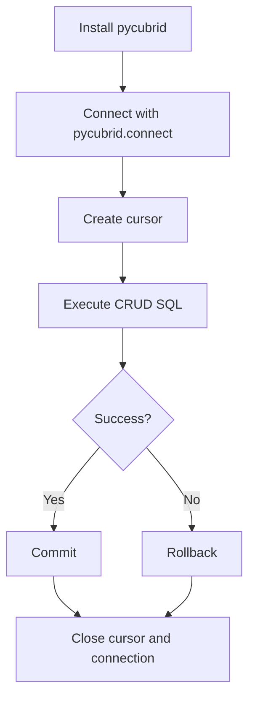

# Connect to CUBRID in 5 Minutes

Get from `pip install` to a working CRUD script with explicit transaction handling.

---

## Prerequisites

- CUBRID server and broker are running
- Python 3.9+
- Access to a target database (for example, `testdb`)

!!! note
    Default local connection values in pycubrid examples are:
    `host="localhost"`, `port=33000`, `user="dba"`, `password=""`.

---

## 1) Install pycubrid

```bash
pip install pycubrid
```

!!! tip
    Use a virtual environment to isolate dependencies:
    `python -m venv .venv && source .venv/bin/activate`.

---

## 2) Open a connection and run a query

```python
from __future__ import annotations

import pycubrid

conn = pycubrid.connect(
    host="localhost",
    port=33000,
    database="testdb",
    user="dba",
    password="",
)

cur = conn.cursor()
cur.execute("SELECT 1 + 1")
print(cur.fetchone())  # (2,)

cur.close()
conn.close()
```

---

## 3) Run simple CRUD operations

```python
from __future__ import annotations

import pycubrid

conn = pycubrid.connect(database="testdb")
cur = conn.cursor()

cur.execute(
    """
    CREATE TABLE IF NOT EXISTS qs_users (
        id INT AUTO_INCREMENT PRIMARY KEY,
        name VARCHAR(100) NOT NULL,
        age INT NOT NULL
    )
    """
)

# INSERT
cur.execute("INSERT INTO qs_users (name, age) VALUES (?, ?)", ["Alice", 30])

# SELECT
cur.execute("SELECT id, name, age FROM qs_users ORDER BY id")
print(cur.fetchall())

# UPDATE
cur.execute("UPDATE qs_users SET age = ? WHERE name = ?", [31, "Alice"])

# DELETE
cur.execute("DELETE FROM qs_users WHERE name = ?", ["Alice"])

conn.commit()
cur.close()
conn.close()
```

!!! warning
    pycubrid uses `?` placeholders (qmark style), not `%s`.

---

## 4) Use explicit transaction handling

```python
from __future__ import annotations

import pycubrid

conn = pycubrid.connect(database="testdb")
cur = conn.cursor()

try:
    cur.execute("INSERT INTO qs_users (name, age) VALUES (?, ?)", ["Bob", 25])
    cur.execute("INSERT INTO qs_users (name, age) VALUES (?, ?)", ["Carol", 28])
    conn.commit()
except pycubrid.Error:
    conn.rollback()
    raise
finally:
    cur.close()
    conn.close()
```

!!! tip
    For automatic commit/rollback and close, use `with pycubrid.connect(...) as conn:`.

---

## Quickstart workflow



---

## Next steps

- Read the full [Connection Guide](CONNECTION.md) for handshake and connection options
- Explore more runnable patterns in [Examples](EXAMPLES.md)
